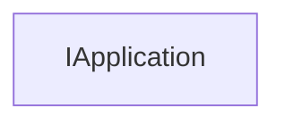

<!-- # **Документация интерфейса КОМПАС API: IApplication** -->

# **Интерфейс IApplication**

## Иерархия наследования



## Общее описание

Интерфейс `IApplication` является главным интерфейсом приложения КОМПАС-3D. Он предоставляет доступ к основным функциям приложения, включая управление документами, диалогами, менеджерами, системными настройками и событиями. Через этот интерфейс библиотеки получают доступ к функциональности КОМПАС.

`IApplication` является корневым интерфейсом в иерархии KsAPI и не имеет явного родителя. Он передаётся в библиотеку при её загрузке в КОМПАС через функцию точки входа.

## Важные примечания

1. **Инициализация в LoadKompasLibrary** - Интерфейс передаётся автоматически при загрузке библиотеки, не нужно получать его отдельно
2. **Проверка указателя** - Всегда проверяйте указатель на `nullptr` перед использованием методов
3. **Глобальная переменная** - В библиотеках КОМПАС принято хранить указатель на `IApplication` в глобальной переменной
4. **Основная точка доступа** - Через `IApplication` получаются все остальные интерфейсы API

## Получение интерфейса

### Основные способы получения:

1. **Через функцию точки входа библиотеки:**
   - `LoadKompasLibrary(ksapi::IApplication & app, ...)` - основной способ для библиотек
   - `UnloadKompasLibrary()` - вызывается при выгрузке библиотеки

2. **Через глобальную функцию:**
   - `ksapi::GetKompasApplication()` - получение приложения напрямую

### Примеры получения:

```cpp
// Пример 1: Получение через точку входа библиотеки (основной способ)
static ksapi::IApplication * kompasApp = nullptr;

APP_EXP_FUNC(bool) LoadKompasLibrary(ksapi::IApplication & app, ksapi::IKompasLibraryActions & libaryActions)
{
    kompasApp = &app;  // Сохранение указателя на приложение
    return true;
}

// Пример 2: Использование
void RunCommand(unsigned int commandId, ksapi::ksRunCommandModeEnum mode)
{
    if (kompasApp)
        kompasApp->ShowMessageBox(L"Привет!", L"", ksMessageWarning, ksButtonSetOk, true);
}
```

## Дополнительные интерфейсы

Для данного интерфейса отсутствуют дополнительные интерфейсы, получаемые через QueryInterface. Все необходимые интерфейсы получаются через методы самого `IApplication`:

- [`IDocumentsPtr`](documents/IDocuments.md) - коллекция документов
- [`ILibraryManagerPtr`](files/ILibraryManager.md) - менеджер библиотек
- [`IApplicationDialogsPtr`](files/IApplicationDialogs.md) - диалоги приложения
- [`IApplicationEventsPtr`](files/IApplicationEvents.md) - события приложения
- И другие

## Методы интерфейса

### Группа 1: Управление приложением

- [`Quit()`](#quit) - Закрыть приложение
- [`SetVisible(bool visible)`](#setvisible) - Установить видимость приложения
- [`IsVisible()`](#isvisible) - Получить видимость приложения
- [`PumpWaitingMessages()`](#pumpwaitingmessages) - Обработать все сообщения в стеке
- [`SetLockPumpMessages(bool lock)`](#setlockpumpmessages) - Заблокировать обработку сообщений
- [`IsLockPumpMessages()`](#islockpumpmessages) - Проверить блокировку сообщений

### Группа 2: Работа с документами

- [`GetDocuments()`](#getdocuments) - Получить коллекцию документов
- [`GetActiveDocument()`](#getactivedocument) - Получить активный документ
- [`SetActiveDocument()`](#setactivedocument) - Установить активный документ

### Группа 3: Менеджеры и сервисы

- [`GetLibraryManager()`](#getlibrarymanager) - Получить менеджер библиотек
- [`GetStylesManager()`](#getstylesmanager) - Получить менеджер стилей
- [`GetPropertyMng()`](#getpropertymng) - Получить менеджер свойств
- [`GetQualityManager()`](#getqualitymanager) - Получить менеджер классов допуска
- [`GetApplicationLicenseManager()`](#getapplicationlicensemanager) - Получить менеджер лицензий
- [`GetApplicationServices()`](#getapplicationservices) - Получить интерфейс сервисных функций
- [`GetApplicationDialogsUtils()`](#getapplicationdialogsutils) - Получить вспомогательные функции для диалогов
- [`Events()`](#events) - Получить интерфейс событий приложения
- [`GetAttrTypeMng()`](#getattrtypemng) - Получить менеджер для работы с типами атрибутов
- [`GetConverter()`](#getconverter) - Получить интерфейс конвертера документов
- [`GetConverterByPath()`](#getconverterbypath) - Получить интерфейс конвертера по пути
- [`GetProgressBar()`](#getprogressbar) - Получить интерфейс индикатора процесса
- [`GetCancelableProgressBar()`](#getcancelableprogressbar) - Получить интерфейс индикатора с отменой
- [`CreatePropertyManager()`](#createpropertymanager) - Создать панель свойств
- [`CreateProcessParam()`](#createprocessparam) - Создать параметры процесса
- [`CreateResourcesModule()`](#createresourcesmodule) - Получить описание ресурсов библиотеки
- [`CreateMenu()`](#createmenu) - Создать меню

### Группа 4: Диалоги и сообщения

- [`ShowMessageBox()`](#showmessagebox) - Показать сообщение
- [`ShowMessageDialog()`](#showmessagedialog) - Показать диалог
- [`GetApplicationDialogs()`](#getapplicationdialogs) - Получить интерфейс диалогов
- [`SetHideMessage()`](#sethidemessage) - Установить правило вывода сообщений
- [`GetHideMessage()`](#gethidemessage) - Получить правило вывода сообщений
- [`GetApplicationDialogsUtils()`](#getapplicationdialogsutils) - Получить вспомогательные функции для диалогов
- [`GetDictionary()`](#getdictionary) - Получить интерфейс словаря КОМПАС
- [`CreateResourcesModule()`](#createresourcesmodule) - Создать модуль ресурсов

### Группа 5: Система и настройки

- [`GetSystemSettings()`](#getsystemsettings) - Получить параметры системы
- [`GetSystemVersion()`](#getsystemversion) - Получить версию КОМПАС
- [`GetBuildNumber()`](#getbuildnumber) - Получить номер сборки
- [`GetKompasError()`](#getkompasserror) - Получить интерфейс ошибок
- [`GetApplicationName()`](#getapplicationname) - Получить имя приложения
- [`GetMainWindowHandle()`](#getmainwindowhandle) - Получить дескриптор главного окна
- [`SetEnableTaskAccess()`](#setenabletaskaccess) - Установить разрешение доступа к задаче
- [`IsEnableTaskAccess()`](#isenabletaskaccess) - Получить признак разрешения доступа
- [`GetCurrentDirectory()`](#getcurrentdirectory) - Получить текущий каталог
- [`SetCurrentDirectory()`](#setcurrentdirectory) - Установить текущий каталог
- [`GetLibraryStyles()`](#getlibrarystyles) - Получить стили из библиотеки

---

### Quit

[Группа 1: Управление приложением](#группа-1-управление-приложением) | [К оглавлению](#методы-интерфейса)

**Кратко:** Закрывает приложение КОМПАС.

**Полное описание:** Метод закрывает приложение КОМПАС. После вызова этого метода приложение будет закрыто и все несохранённые данные могут быть потеряны. Рекомендуется использовать с осторожностью.

**Синтаксис:**

```cpp
virtual void Quit() = 0;
```

**Параметры:**

**Возвращаемое значение:** нет

**Примечания:**

- Метод закрывает всё приложение целиком
- Рекомендуется использовать только при необходимости полного закрытия КОМПАС из библиотеки

---

### SetVisible

[Группа 1: Управление приложением](#группа-1-управление-приложением) | [К оглавлению](#методы-интерфейса)

**Кратко:** Устанавливает видимость окна приложения КОМПАС.

**Полное описание:** Метод позволяет показать или скрыть главное окно приложения КОМПАС.

**Синтаксис:**

```cpp
virtual void SetVisible(bool visible) = 0;
```

**Параметры:**

- `visible` (in) - `true` - показать окно, `false` - скрыть окно

**Пример использования:**

```cpp
// Обработка сообщений во время длительной операции
for (int i = 0; i < 1000; i++)
{
    // Выполнение операции
    kompasApp->PumpWaitingMessages();  // Обновление интерфейса
}
```

---

### SetLockPumpMessages

[Группа 1: Управление приложением](#группа-1-управление-приложением) | [К оглавлению](#методы-интерфейса)

**Кратко:** Блокирует или разблокирует обработку сообщений.

**Синтаксис:**

```cpp
virtual void SetLockPumpMessages(bool lock) = 0;
```

**Параметры:**

- `lock` (in) - `true` - заблокировать, `false` - разблокировать

---

### IsLockPumpMessages

[Группа 1: Управление приложением](#группа-1-управление-приложением) | [К оглавлению](#методы-интерфейса)

**Кратко:** Возвращает признак блокировки обработки сообщений.

**Синтаксис:**

```cpp
virtual bool IsLockPumpMessages() = 0;
```

---

### GetDocuments

[Группа 2: Работа с документами](#группа-2-работа-с-документами) | [К оглавлению](#методы-интерфейса)

**Кратко:** Возвращает коллекцию всех открытых документов в приложении.

**Полное описание:** Метод предоставляет доступ к коллекции `IDocuments`, которая содержит все открытые документы КОМПАС. Через эту коллекцию можно создавать новые документы, получать существующие и управлять ими.

**Синтаксис:**

```cpp
virtual IDocumentsPtr GetDocuments() = 0;
```

**Параметры:** нет

**Возвращаемое значение:** Указатель на интерфейс [`IDocumentsPtr`](documents/IDocuments.md) коллекции документов

#### **Пример использования**

**Минимальный пример:**

```cpp
ksapi::IDocumentsPtr documents = kompasApp->GetDocuments();
```

**Расширенный пример:**

```cpp
// Получение коллекции всех открытых документов
ksapi::IDocumentsPtr documents = kompasApp->GetDocuments();
if (!documents)
{
    kompasApp->ShowMessageBox(L"Не удалось получить коллекцию документов", L"Ошибка", ksMessageError, ksButtonSetOk, true);
    return;
}

// Создание нового документа (параметр - тип документа)
ksapi::IKompasDocumentPtr newDoc = documents->Add(ksDocumentDrawing, true);
if (!newDoc)
{
    kompasApp->ShowMessageBox(L"Не удалось создать документ", L"Ошибка", ksMessageError, ksButtonSetOk, true);
}
```

**Примечания:**

- ВозвращаетSmartPtr, который может быть nullptr
- Всегда проверяйте возвращаемое значение перед использованием

---

### GetActiveDocument

[Группа 2: Работа с документами](#группа-2-работа-с-документами) | [К оглавлению](#методы-интерфейса)

**Кратко:** Возвращает активный (текущий) документ в приложении.

**Полное описание:** Метод возвращает документ, который в данный момент активен в окне КОМПАС. Это может быть документ любого типа (2D чертёж, 3D модель, спецификация и т.д.). Перед использованием необходимо проверить тип документа и привести его к соответствующему интерфейсу.

**Синтаксис:**

```cpp
virtual IKompasDocumentPtr GetActiveDocument() = 0;
```

**Параметры:** нет

**Возвращаемое значение:** Указатель на интерфейс `IKompasDocumentPtr` активного документа

#### **Пример использования**

**Минимальный пример:**

```cpp
ksapi::IKompasDocumentPtr doc = kompasApp->GetActiveDocument();
```

**Расширенный пример:**

```cpp
// Получение активного документа
ksapi::IKompasDocumentPtr doc = kompasApp->GetActiveDocument();
if (!doc)
{
    kompasApp->ShowMessageBox(L"Документ не активизирован", L"", ksMessageWarning, ksButtonSetOk, true);
    return;
}

// Определение типа документа
DocumentTypeEnum docType = doc->GetDocumentType();

// Типы документов:
// ksDocumentUnknown = 0      - неизвестный тип
// ksDocumentDrawing = 1       - чертёж
// ksDocumentFragment = 2      - фрагмент
// ksDocumentSpecification = 3 - спецификация
// ksDocumentPart = 4          - деталь
// ksDocumentAssembly = 5      - сборка
// ksDocumentTextual = 6       - текстовый документ
// ksDocumentTechnologyAssembly = 7 - технологическая сборка

if (docType == ksDocumentDrawing || docType == ksDocumentFragment)
{
    // Работа с 2D документом
    ksapi::IKompasDocument2DPtr doc2D = doc;
    // ...
}
else if (docType == ksDocumentPart || docType == ksDocumentAssembly)
{
    // Работа с 3D документом
    ksapi::IKompasDocument3DPtr doc3D = doc;
    // ...
}
```

**Примечания:**

- Возвращает nullptr, если нет активного документа
- Всегда проверяйте возвращаемое значение перед использованием
- Тип документа нужно определять через `GetDocumentType()`

---

### SetActiveDocument

[Группа 2: Работа с документами](#группа-2-работа-с-документами) | [К оглавлению](#методы-интерфейса)

**Кратко:** Устанавливает активный документ в приложении.

**Синтаксис:**

```cpp
virtual void SetActiveDocument(const IKompasDocumentPtr & document) = 0;
```

**Параметры:**

- `document` (in) - указатель на документ, который нужно сделать активным

**Возвращаемое значение:** нет

**Тип документа:**

- `ksDocumentUnknown` - неизвестный тип
- `ksDocumentDrawing` - чертёж
- `ksDocumentFragment` - фрагмент
- `ksDocumentSpecification` - спецификация
- `ksDocumentPart` - деталь
- `ksDocumentAssembly` - сборка
- `ksDocumentTextual` - текстовый документ
- `ksDocumentTechnologyAssembly` - технологическая сборка

---

### GetLibraryManager

[Группа 3: Менеджеры и сервисы](#группа-3-менеджеры-и-сервисы) | [К оглавлению](#методы-интерфейса)

**Кратко:** Возвращает менеджер библиотек КОМПАС.

**Полное описание:** Метод предоставляет доступ к интерфейсу `ILibraryManager`, который управляет библиотеками КОМПАС. Через него можно получать доступ к процедурным библиотекам, библиотекам конвертеров и другим типам библиотек.

**Синтаксис:**

```cpp
virtual ILibraryManagerPtr GetLibraryManager() = 0;
```

**Параметры:** нет

**Возвращаемое значение:** Указатель на интерфейс [`ILibraryManagerPtr`](files/ILibraryManager.md)

#### **Пример использования**

```cpp
// Получение менеджера библиотек
if (ksapi::ILibraryManagerPtr libMng = kompasApp->GetLibraryManager())
{
    // Получение коллекции процедурных библиотек
    if (ksapi::IProceduresLibrariesPtr procLibs = libMng->GetProceduresLibraries())
    {
        // Работа с библиотеками...
    }
}
```

---

### GetStylesManager

[Группа 3: Менеджеры и сервисы](#группа-3-менеджеры-и-сервисы) | [К оглавлению](#методы-интерфейса)

**Кратко:** Возвращает менеджер стилей.

**Синтаксис:**

```cpp
virtual IStylesManagerPtr GetStylesManager() = 0;
```

**Параметры:** нет

**Возвращаемое значение:** Указатель на интерфейс [`IStylesManagerPtr`](files/IStylesManager.md)

---

### GetPropertyMng

[Группа 3: Менеджеры и сервисы](#группа-3-менеджеры-и-сервисы) | [К оглавлению](#методы-интерфейса)

**Кратко:** Возвращает менеджер свойств для указанной библиотеки.

**Синтаксис:**

```cpp
virtual IPropertyMngPtr GetPropertyMng(const std::wstring & libName) = 0;
```

**Параметры:**

- `libName` (in) - имя библиотеки

**Возвращаемое значение:** Указатель на интерфейс [`IPropertyMngPtr`](files/IPropertyMng.md)

---

### GetQualityManager

[Группа 3: Менеджеры и сервисы](#группа-3-менеджеры-и-сервисы) | [К оглавлению](#методы-интерфейса)

**Кратко:** Возвращает менеджер классов допуска.

**Синтаксис:**

```cpp
virtual IQualityManagerPtr GetQualityManager() = 0;
```

**Параметры:** нет

**Возвращаемое значение:** Указатель на интерфейс [`IQualityManagerPtr`](files/IQualityManager.md)

---

### GetApplicationLicenseManager

[Группа 3: Менеджеры и сервисы](#группа-3-менеджеры-и-сервисы) | [К оглавлению](#методы-интерфейса)

**Кратко:** Возвращает менеджер лицензий приложения.

**Синтаксис:**

```cpp
virtual IApplicationLicenseManagerPtr GetApplicationLicenseManager() = 0;
```

**Параметры:** нет

**Возвращаемое значение:** Указатель на интерфейс [`IApplicationLicenseManagerPtr`](files/IApplicationLicenseManager.md)

---

### ShowMessageBox

[Группа 4: Диалоги и сообщения](#группа-4-диалоги-и-сообщения) | [К оглавлению](#методы-интерфейса)

**Кратко:** Отображает окно сообщения пользователю.

**Полное описание:** Метод показывает стандартное окно сообщения КОМПАС с настраиваемым текстом, заголовком, типом и кнопками. Возвращает информацию о нажатой кнопке.

**Синтаксис:**

```cpp
virtual ksMessageButtonEnum ShowMessageBox(const std::wstring & text, const std::wstring & caption,
                                           ksMessageTypeEnum dialogType, ksMessageButtonSetEnum dialogButtons,
                                           bool showModal) = 0;
```

**Параметры:**

- `text` (in) - текст сообщения
- `caption` (in) - заголовок окна
- `dialogType` (in) - тип сообщения:
  - `ksMessageError` - сообщение об ошибке
  - `ksMessageQuestion` - вопросительное сообщение
  - `ksMessageWarning` - предупреждающее сообщение
  - `ksMessageInformation` - информационное сообщение
- `dialogButtons` (in) - набор кнопок:
  - `ksButtonSetOk` - только ОК
  - `ksButtonSetOkCancel` - ОК и Отмена
  - `ksButtonSetYesNoCancel` - Да, Нет и Отмена
  - `ksButtonSetYesNo` - Да и Нет
- `showModal` (in) - признак модального окна

**Возвращаемое значение:** Кнопка, нажатая пользователем:

- `ksButtonOk` - ОК
- `ksButtonCancel` - Отмена
- `ksButtonYes` - Да
- `ksButtonNo` - Нет

#### **Пример использования**

```cpp
// Простое информационное сообщение
kompasApp->ShowMessageBox(L"Операция завершена", L"Информация", ksMessageInformation, ksButtonSetOk, true);

// Вопрос с подтверждением
ksMessageButtonEnum result = kompasApp->ShowMessageBox(
    L"Сохранить изменения?",
    L"Подтверждение",
    ksMessageQuestion,
    ksButtonSetYesNo,
    true
);

if (result == ksButtonYes)
{
    // Сохранить изменения
}
else
{
    // Не сохранять
}
```

**Примечания:**

- Наиболее часто используемый метод для взаимодействия с пользователем
- Поддерживает различные типы сообщений и наборы кнопок

---

### ShowMessageDialog

[Группа 4: Диалоги и сообщения](#группа-4-диалоги-и-сообщения) | [К оглавлению](#методы-интерфейса)

**Кратко:** Отображает расширенный диалог с пользователем.

**Полное описание:** Метод отображает диалоговое окно с расширенными возможностями настройки, включая пояснение, собственные надписи на кнопках и справку.

**Синтаксис:**

```cpp
virtual ksMessageButtonEnum ShowMessageDialog(WindowHandle parentWindow, const std::wstring & text,
                                             const std::wstring & caption, const std::wstring & explanation,
                                             ksMessageTypeEnum dialogType, ksMessageButtonSetEnum dialogButtons,
                                             bool showModal, const std::wstring & positiveButton,
                                             const std::wstring & negativeButton, const std::wstring & cancelButton,
                                             int32_t helpId, const std::wstring & helpFileName) = 0;
```

**Параметры:**

- `parentWindow` (in) - дескриптор родительского окна
- `text` (in) - текст сообщения
- `caption` (in) - заголовок окна
- `explanation` (in) - пояснение
- `dialogType` (in) - тип сообщения
- `dialogButtons` (in) - набор кнопок
- `showModal` (in) - признак модального окна
- `positiveButton` (in) - надпись на кнопке "Да"
- `negativeButton` (in) - надпись на кнопке "Нет"
- `cancelButton` (in) - надпись на кнопке "Отмена"
- `helpId` (in) - идентификатор справки
- `helpFileName` (in) - имя файла справки

**Возвращаемое значение:** Кнопка, нажатая пользователем

---

### GetApplicationDialogs

[Группа 4: Диалоги и сообщения](#группа-4-диалоги-и-сообщения) | [К оглавлению](#методы-интерфейса)

**Кратко:** Возвращает интерфейс для работы с диалогами КОМПАС.

**Синтаксис:**

```cpp
virtual IApplicationDialogsPtr GetApplicationDialogs() = 0;
```

**Параметры:** нет

**Возвращаемое значение:** Указатель на интерфейс [`IApplicationDialogsPtr`](files/IApplicationDialogs.md)

---

### SetHideMessage

[Группа 4: Диалоги и сообщения](#группа-4-диалоги-и-сообщения) | [К оглавлению](#методы-интерфейса)

**Кратко:** Устанавливает правило вывода сообщений.

**Синтаксис:**

```cpp
virtual void SetHideMessage(ksHideMessageEnum hideMessage) = 0;
```

**Параметры:**

- `hideMessage` (in) - правило вывода сообщений:
  - `ksShowMessage` - показывать все сообщения
  - `ksHideMessageYes` - скрывать все сообщения с указанием ответа 'Да' на все запросы
  - `ksHideMessageNo` - скрывать все сообщения без указания ответов на запросы

**Возвращаемое значение:** нет

---

### GetSystemSettings

[Группа 5: Система и настройки](#система-и-настройки) | [К оглавлению](#методы-интерфейса)

**Кратко:** Возвращает интерфейс системных настроек КОМПАС.

**Синтаксис:**

```cpp
virtual ISystemSettingsPtr GetSystemSettings() = 0;
```

**Параметры:** нет

**Возвращаемое значение:** Указатель на интерфейс [`ISystemSettingsPtr`](files/ISystemSettings.md)

---

### GetSystemVersion

[Группа 5: Система и настройки](#система-и-настройки) | [К оглавлению](#методы-интерфейса)

**Кратко:** Возвращает версию приложения КОМПАС.

**Синтаксис:**

```cpp
virtual bool GetSystemVersion(int32_t & major, int32_t & minor, int32_t & release, int32_t & build) = 0;
```

**Параметры:**

- `major` (out) - старший номер версии
- `minor` (out) - младший номер версии
- `release` (out) - номер релиза
- `build` (out) - номер сборки

**Возвращаемое значение:** `true` - в случае успеха

---

### GetBuildNumber

[Группа 5: Система и настройки](#система-и-настройки) | [К оглавлению](#методы-интерфейса)

**Кратко:** Возвращает номер сборки приложения.

**Синтаксис:**

```cpp
virtual int32_t GetBuildNumber() = 0;
```

**Параметры:** нет

**Возвращаемое значение:** номер сборки

---

### GetKompasError

[Группа 5: Система и настройки](#система-и-настройки) | [К оглавлению](#методы-интерфейса)

**Кратко:** Возвращает интерфейс для работы с ошибками КОМПАС.

**Синтаксис:**

```cpp
virtual IKompasErrorPtr GetKompasError() = 0;
```

**Параметры:** нет

**Возвращаемое значение:** Указатель на интерфейс [`IKompasErrorPtr`](files/IKompasError.md)

#### **Пример использования**

```cpp
// После неудачной операции
if (arc->Update())
    kompasApp->ShowMessageBox(L"Изменили объект", L"", ksMessageWarning, ksButtonSetOk, true);
else if (ksapi::IKompasErrorPtr error = kompasApp->GetKompasError())
{
    // Вывод сообщения об ошибке на экран
    error->Report();
}
```

---

### GetApplicationName

[Группа 5: Система и настройки](#система-и-настройки) | [К оглавлению](#методы-интерфейса)

**Кратко:** Возвращает имя приложения КОМПАС.

**Синтаксис:**

```cpp
virtual std::wstring GetApplicationName(bool fullName) = 0;
```

**Параметры:**

- `fullName` (in) - `true` - полное имя, `false` - краткое имя

**Возвращаемое значение:** Имя приложения

---

### GetMainWindowHandle

[Группа 5: Система и настройки](#система-и-настройки) | [К оглавлению](#методы-интерфейса)

**Кратко:** Возвращает дескриптор главного окна КОМПАС.

**Синтаксис:**

```cpp
virtual WindowHandle GetMainWindowHandle() = 0;
```

**Параметры:** нет

**Возвращаемое значение:** Дескриптор окна (HWND в Windows)

---

### GetCurrentDirectory / SetCurrentDirectory

[Группа 5: Система и настройки](#система-и-настройки) | [К оглавлению](#методы-интерфейса)

**Кратко:** Получить/установить текущий каталог приложения.

**Синтаксис:**

```cpp
virtual std::wstring GetCurrentDirectory() = 0;
virtual void SetCurrentDirectory(const std::wstring & path) = 0;
```

**Параметры:**

- `path` (in) - путь к каталогу (для SetCurrentDirectory)

**Возвращаемое значение:** Текущий каталог (для GetCurrentDirectory)

---

### Events

[Группа 3: Менеджеры и сервисы](#группа-3-менеджеры-и-сервисы) | [К оглавлению](#методы-интерфейса)

**Кратко:** Возвращает интерфейс для работы с событиями приложения.

**Синтаксис:**

```cpp
virtual IApplicationEventsPtr Events() = 0;
```

**Параметры:** нет

**Возвращаемое значение:** Указатель на интерфейс [`IApplicationEventsPtr`](files/IApplicationEvents.md)

---

### GetMath2D

[Группа 5: Система и настройки](#система-и-настройки) | [К оглавлению](#методы-интерфейса)

**Кратко:** Возвращает интерфейс 2D математики.

**Синтаксис:**

```cpp
virtual IMath2DPtr GetMath2D() = 0;
```

**Параметры:** нет

**Возвращаемое значение:** Указатель на интерфейс [`IMath2DPtr`](files/IMath2D.md)

---

### CreateProcessParam

[Группа 3: Менеджеры и сервисы](#группа-3-менеджеры-и-сервисы) | [К оглавлению](#методы-интерфейса)

**Кратко:** Создаёт параметры процесса для запуска процесса в документе.

**Синтаксис:**

```cpp
virtual IProcessParamPtr CreateProcessParam() = 0;
```

**Параметры:** нет

**Возвращаемое значение:** Указатель на интерфейс [`IProcessParamPtr`](files/IProcessParam.md)

---

### StopCurrentProcess

[Группа 1: Управление приложением](#группа-1-управление-приложением) | [К оглавлению](#методы-интерфейса)

**Кратко:** Останавливает запущенный процесс в документе.

**Синтаксис:**

```cpp
virtual void StopCurrentProcess(bool postMessage, const IKompasDocumentPtr & document = nullptr) = 0;
```

**Параметры:**

- `postMessage` (in) - `true` - сначала обрабатываются события в стеке, затем останавливается процесс
- `document` (in) - документ, в котором нужно остановить процесс. Если не указан - останавливается в текущем документе

**Возвращаемое значение:** нет

---

### CreatePropertyManager

[Группа 3: Менеджеры и сервисы](#группа-3-менеджеры-и-сервисы) | [К оглавлению](#методы-интерфейса)

**Кратко:** Создаёт панель свойств.

**Синтаксис:**

```cpp
virtual IPropertyManagerPtr CreatePropertyManager(bool global) = 0;
```

**Параметры:**

- `global` (in) - `true` - глобальная панель, `false` - панель принадлежит текущему контексту

**Возвращаемое значение:** Указатель на интерфейс [`IPropertyManagerPtr`](files/IPropertyManager.md)

---

## Частые ошибки

### 1. Не проверяют указатель на nullptr

```cpp
// НЕПРАВИЛЬНО
kompasApp->ShowMessageBox(L"Сообщение", L"Заголовок", ksMessageWarning, ksButtonSetOk, true);

// ПРАВИЛЬНО
if (kompasApp)
    kompasApp->ShowMessageBox(L"Сообщение", L"Заголовок", ksMessageWarning, ksButtonSetOk, true);
```

### 2. Не проверяют возвращаемые указатели SmartPtr

```cpp
// НЕПРАВИЛЬНО - не проверяем результат
ksapi::IKompasDocumentPtr doc = kompasApp->GetActiveDocument();
doc->GetDocumentType();  // może быть nullptr!

// ПРАВИЛЬНО - проверяем указатель
ksapi::IKompasDocumentPtr doc = kompasApp->GetActiveDocument();
if (!doc)
{
    kompasApp->ShowMessageBox(L"Нет активного документа", L"Ошибка", ksMessageError, ksButtonSetOk, true);
    return;
}
DocumentTypeEnum type = doc->GetDocumentType();
```

### 3. Не проверяют активный документ перед использованием

```cpp
// НЕПРАВИЛЬНО
ksapi::IKompasDocument2DPtr doc2D = kompasApp->GetActiveDocument();
doc2D->GetViewsAndLayersManager();  // Если документ 3D - будет ошибка!

// ПРАВИЛЬНО
ksapi::IKompasDocumentPtr doc = kompasApp->GetActiveDocument();
if (!doc)
{
    kompasApp->ShowMessageBox(L"Документ не активизирован", L"Ошибка", ksMessageWarning, ksButtonSetOk, true);
    return;
}

// Проверяем тип документа
DocumentTypeEnum docType = doc->GetDocumentType();
if (docType != ksDocument2D)
{
    kompasApp->ShowMessageBox(L"Требуется 2D документ", L"Ошибка", ksMessageWarning, ksButtonSetOk, true);
    return;
}

ksapi::IKompasDocument2DPtr doc2D = doc;
```

---

## Практические примеры из исходников

### Пример 1: Базовая инициализация библиотеки

```cpp
// Source/Steps/Step1/Step1.cpp
static ksapi::IApplication * kompasApp = nullptr;

// Точка входа при загрузке библиотеки
APP_EXP_FUNC(bool) LoadKompasLibrary(ksapi::IApplication & app, ksapi::IKompasLibraryActions & libaryActions)
{
    libaryActions.AddGetApplicationVersion(GetApplicationVersion);
    libaryActions.AddRunCommandHandler(RunCommand);
    kompasApp = &app;  // Сохраняем указатель на приложение
    return true;
}
```

### Пример 2: Работа с активным документом

```cpp
// Source/Steps/Step3/Step3.cpp
// Получение активного документа и коллекции документов
ksapi::IDocumentsPtr documentsArr = kompasApp->GetDocuments();
if (!documentsArr)
    return;

ksapi::IKompasDocumentPtr doc = kompasApp->GetActiveDocument();
if (!doc)
{
    kompasApp->ShowMessageBox(L"Документ не активизирован", L"", ksMessageWarning, ksButtonSetOk, true);
    return;
}
```

### Пример 3: Работа с менеджером библиотек

```cpp
// Source/Cube/Cube.cpp
// Получение менеджера библиотек и работа с ресурсами
if (ksapi::ILibraryManagerPtr libraryManager = kompasApp->GetLibraryManager())
{
    if (ksapi::IProceduresLibrariesPtr proceduresLibraries = libraryManager->GetProceduresLibraries())
    {
        if (ksapi::IProceduresLibraryPtr lib = proceduresLibraries->GetItemByName(libname))
        {
            if (ksapi::IKompasDictionaryPtr dictionary = lib->GetDictionary())
                return dictionary->LoadAndConvertLangString(GetModule(), strId);
        }
    }
}
```

### Пример 4: Создание нового документа

```cpp
// Source/Events/Events.cpp
ksapi::IDocumentsPtr documents = kompasApp->GetDocuments();
return documents ? documents->Add(type, true) : nullptr;
```

---

## Шаблоны использования

### Шаблон 1: Проверка активного документа с обработкой ошибок

```cpp
// Описание: Используется когда нужно гарантировать наличие активного документа
ksapi::IKompasDocumentPtr doc = kompasApp->GetActiveDocument();
if (!doc)
{
    kompasApp->ShowMessageBox(L"Документ не активизирован", L"Ошибка", ksMessageWarning, ksButtonSetOk, true);
    return;
}

// Продолжение работы с документом...
```

### Шаблон 2: Получение менеджера с проверкой

```cpp
// Описание: Безопасное получение менеджера библиотек
ksapi::ILibraryManagerPtr libMng = kompasApp->GetLibraryManager();
if (!libMng)
{
    kompasApp->ShowMessageBox(L"Не удалось получить менеджер библиотек", L"Ошибка", ksMessageError, ksButtonSetOk, true);
    return;
}

// Работа с менеджером библиотек
```

### Шаблон 3: Информационный вывод пользователю

```cpp
// Описание: Вывод результата операции пользователю
kompasApp->ShowMessageBox(
    std::format(L"Операция выполнена. Создано объектов: {}", count),
    L"Информация",
    ksMessageInformation,
    ksButtonSetOk,
    true
);
```

---

## Связанные интерфейсы

### Работа в паре с:

- **`IKompasDocument`** - активный документ, полученный через `GetActiveDocument()`
- **`IDocuments`** - коллекция документов, полученная через `GetDocuments()`
- **`ILibraryManager`** - менеджер библиотек, полученный через `GetLibraryManager()`

### Часто используется вместе с:

- **`IKompasError`** - для обработки ошибок (получается через `GetKompasError()`)
- **`IApplicationDialogs`** - для отображения диалогов (получается через `GetApplicationDialogs()`)
- **`ISystemSettings`** - для доступа к настройкам (получается через `GetSystemSettings()`)

---

## Дополнительные сведения

- Интерфейс определён в файле `KsAPI/KsAPI.h`
- Является корневым интерфейсом приложения КОМПАС
- Передаётся автоматически при загрузке библиотеки через функцию `LoadKompasLibrary()`
- Не требует освобождения (управляется временем жизни приложения)
