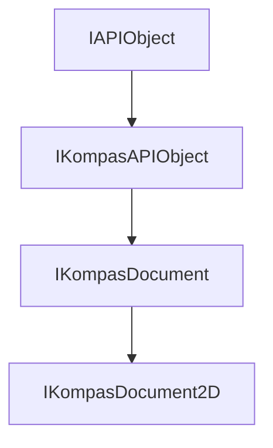

# **Интерфейс IKompasDocument2D**

## Иерархия наследования

<style>
.top-parent{
    color: #ffe3d8;
    background: green;
    border: 3px solid #046709;
    border-radius: 4px;
    padding: 5px;
    text-align: center;
    margin-bottom: 5px;
    font-weight: bold;
    width: 40%;
    max-width: 220px;
}

.other-parents{
    color: #ffe3d8;
    background: #4a6fa5;
    border: 3px solid #3d5b87;
    border-radius: 4px;
    padding: 5px;
    text-align: center;
    margin: 5px 10%;
    font-weight: bold;
    width: 40%;
    max-width: 220px;
}

.interface{
    color: #ffe3d8;
    background: #103874;
    border: 3px solid #002152;
    border-radius: 4px;
    padding: 5px;
    text-align: center;
    margin: 5px 10%;
    font-weight: bold;
    width: 40%;
    max-width: 220px;
}
</style>

<div style="padding: 10px; background: #f5f5f5; border-radius: 5px; max-width: auto; margin-bottom: 20px">
<div class="top-parent">IAPIObject</div>

<div style="text-align: left; color:black; margin: 5px 15%;">▼</div>
<div class="other-parents">IKompasAPIObject</div>

<div style="text-align: left; color:black; margin: 5px 25%;">▼</div>
<div class="other-parents" style="margin: 5px 20%;">IKompasDocument</div>

<div style="text-align: left; color:black; margin: 5px 35%;">▼</div>
<div class="interface" style="margin: 5px 30%;">IKompasDocument2D</div>
</div>



## Общее описание

Интерфейс `IKompasDocument2D` является базовым интерфейсом для работы с 2D документами КОМПАС (чертежи, фрагменты). Он предоставляет методы для управления видами и слоями, работы с графическими объектами, параметрическими переменными, операциями редактирования (копирование, перемещение, поворот, симметрия), поиска объектов, работы с гиперссылками и матрицами трансформации.

Это основной интерфейс, через который осуществляется программное управление графическими документами КОМПАС.

## Важные примечания

1. **Наследование от IKompasDocument** - Интерфейс наследует все методы родительского интерфейса [`IKompasDocument`](docs/База%20Компас%20API/IKompasAPIObject.md), включая сохранение, закрытие, работу с атрибутами и свойствами документа.

2. **Получение активного документа** - Основной способ получения интерфейса - через метод [`IApplication::GetActiveDocument()`](docs/Приложение%20KompasAPI/IApplication.md), который возвращает [`IKompasDocumentPtr`](docs/Приложение%20KompasAPI/IApplication.md), приводимый к `IKompasDocument2D`.

3. **Обязательная проверка указателей** - Все методы возвращающие указатели должны проверяться на null перед использованием.

4. **Работа с параметрическими переменными** - Для работы с параметрическими переменными используются методы `GetVariables()`, `AddVariable()`, `GetVariableByName()`.

## Получение интерфейса

### Основные способы получения:

1. **Из активного документа приложения:**
   - [`IApplication::GetActiveDocument()`](docs/Приложение%20KompasAPI/IApplication.md) - получение активного документа

2. **Из коллекции документов:**
   - [`IDocuments::GetObjects()`](docs/Приложение%20KompasAPI/Документы/IDocuments.md) - получение коллекции всех документов
   - [`IDocuments::Add()`](docs/Приложение%20KompasAPI/Документы/IDocuments.md) - создание нового 2D документа

3. **При редактировании макроэлемента:**
   - [`IMacroObject::BeginEdit()`](docs/Приложение%20KompasAPI/Документы/Документ%202D/Вид/Коллекции%20объектов/Графические%20объекты/IMacroObject.md) - возвращает `IKompasDocument2D` при редактировании 2D макроэлемента

### Примеры получения:

```cpp
// Получение активного документа из приложения
ksapi::IKompasDocument2DPtr doc2D = application->GetActiveDocument();
if (doc2D)
{
    // Работа с документом
}

// Создание нового чертежа
ksapi::IDocumentsPtr docs = application->GetDocuments();
ksapi::IKompasDocument2DPtr newDoc = docs->Add(ksDocumentDrawing, true);
if (newDoc)
{
    newDoc->SaveAs(L"C:\\path\\to\\drawing.cdw");
}

// Получение через коллекцию документов
for (ksapi::IKompasDocumentPtr doc : docs->GetObjects())
{
    ksapi::IKompasDocument2DPtr doc2D = doc;
    if (doc2D)
    {
        // Работа с 2D документом
    }
}
```

### Обязательные функции библиотеки

Для любой библиотеки, работающей с KsAPI, необходимо объявить функции точки входа и выхода:

```cpp
// Точка входа - вызывается при загрузке библиотеки в КОМПАС
APP_EXP_FUNC(bool) LoadKompasLibrary(ksapi::IApplication & app, ksapi::IKompasLibraryActions & libaryActions)
{
    // Здесь сохраняется указатель на приложение КОМПАС
    // Через app доступны все интерфейсы API
    return true;
}

// Точка выхода - вызывается при выгрузке библиотеки
APP_EXP_FUNC(void) UnloadKompasLibrary()
{
    // Освобождение ресурсов
}
```

**Важно:** Функция `LoadKompasLibrary` обязательна и является основным способом получения интерфейса [`IApplication`](docs/Приложение%20KompasAPI/IApplication.md). Через параметр `app` передаётся экземпляр приложения КОМПАС, к которому подключена библиотека.

## Дополнительные интерфейсы

- [`IKompasDocument2DEx`](interface_page_files/IKompasDocument2DEx.md) - расширенный интерфейс 2D документов
- [`IKompasDocument2DEvents`](interface_page_files/IKompasDocument2DEvents.md) - интерфейс событий 2D документа
- [`IDrawingDocument`](interface_page_files/IDrawingDocument.md) - интерфейс чертежа (наследует IKompasDocument2D)
- [`IFragmentDocument`](interface_page_files/IFragmentDocument.md) - интерфейс фрагмента (наследует IKompasDocument2D)
- [`IViewsAndLayersManager`](docs/Приложение%20KompasAPI/Документы/Документ%202D/IViewsAndLayersManager.md) - менеджер видов и слоев
- [`ISelectionManager`](interface_page_files/ISelectionManager.md) - менеджер выделения объектов
- [`IChooseManager`](interface_page_files/IChooseManager.md) - менеджер выбора объектов
- [`IDrawingGroups`](interface_page_files/IDrawingGroups.md) - коллекция групп объектов

## Методы интерфейса

### Группа 1: Управление видами и слоями

- [`GetViewsAndLayersManager()`](#getviewsandlayersmanager) - получить менеджер видов и слоев

### Группа 2: Разбиение объектов

- [`DecomposeObject()`](#decomposeobject) - разбить объект на составляющие
- [`DecomposeSpecificationDocument()`](#decompose-specificationdocument) - разбить документ спецификации

### Группа 3: События

- [`Events2D()`](#events2d) - получить обработчик событий документа
- [`GetObject2DEvents()`](#getobject2devents) - получить обработчик событий 2D объектов
- [`GetDrawingObjectEventsResult()`](#getdrawingobjecteventsresult) - получить результат редактирования 2D объекта

### Группа 4: Группы и макроэлементы

- [`GetEditMacroObject()`](#geteditmacroobject) - получить редактируемый макроэлемент
- [`GetDrawingGroups()`](#getdrawinggroups) - получить коллекцию групп
- [`GetNamedGroups()`](#getnamedgroups) - получить коллекцию именованных групп
- [`GetCurrentGroup()`](#getcurrentgroup) - получить текущую группу
- [`IsEditMacroVisibleRegime()`](#iseditmacrovisibleregime) - проверить режим редактирования макроэлемента

### Группа 5: Выделение и выбор

- [`GetSelectionManager()`](#getselectionmanager) - получить менеджер селектированных объектов
- [`GetChooseManager()`](#getchoosemanager) - получить менеджер выбранных объектов
- [`FindObject()`](#findobject) - найти ближайший объект
- [`FindObjects()`](#findobjects) - найти ближайшие объекты
- [`SelectObjects()`](#selectobjects) - выбрать объекты прямоугольником

### Группа 6: Параметрические переменные

- [`GetVariables()`](#getvariables) - получить массив переменных
- [`GetVariable()`](#getvariable) - получить переменную по индексу
- [`GetVariableByName()`](#getvariablebyname) - получить переменную по имени
- [`GetDimensionVariable()`](#getdimensionvariable) - получить переменную размера
- [`GetVariablesCount()`](#getvariablescount) - получить количество переменных
- [`AddVariable()`](#addvariable) - создать переменную
- [`UpdateVariables()`](#updatevariables) - обновить внешние переменные
- [`GetVariableTable()`](#getvariabletable) - получить таблицу переменных
- [`IsVariableNameValid()`](#isvariablenamevalid) - проверить допустимость имени переменной
- [`GetIntervalVariables()`](#getintervalvariables) - получить интервальные переменные
- [`AddIntervalVariable()`](#addintervalvariable) - создать интервальную переменную
- [`GetUserFuncVariables()`](#getuserfuncvariables) - получить функциональные переменные
- [`AddUserFuncVariable()`](#adduserfuncvariable) - создать функциональную переменную

### Группа 7: Копирование объектов

- [`CopyObjects()`](#copyobjects) - скопировать объекты

### Группа 8: Перестроение документа

- [`RebuildDocument()`](#rebuilddocument) - перестроить документ
- [`CompleteRebuildDocument()`](#completerebuilddocument) - перестроить документ полностью

### Группа 9: Гиперссылки

- [`CreateHyperLink()`](#createhyperlink) - создать гиперссылку
- [`GetHyperLinkObjects()`](#gethyperlinkobjects) - получить объекты с гиперссылками
- [`DeleteHyperLinks()`](#deletehyperlinks) - удалить гиперссылки

### Группа 10: Поиск объектов

- [`GetObjectById()`](#getobjectbyid) - получить объект по идентификатору
- [`GetLibProcess()`](#getlibprocess) - получить объект процесса

### Группа 11: Undo/Redo

- [`ClearUndo()`](#clearundo) - очистить Undo контейнер
- [`SetEnableUndo()`](#setenableundo) - управлять добавлением команд в Undo
- [`IsEnableUndo()`](#isenableundo) - проверить статус Undo
- [`SetUndoContainer()`](#setundocontainer) - объединить команды в Undo-контейнере
- [`IsUndoContainer()`](#isundocontainer) - проверить объединение команд

### Группа 12: Удаление и порядок объектов

- [`DestroyObjects()`](#destroyobjects) - разрушить объекты
- [`ChangeObjectsOrder()`](#changeobjectsorder) - изменить порядок объектов

### Группа 13: Режимы редактирования

- [`IsLibraryEditMode()`](#islibraryeditmode) - проверить режим редактирования библиотеки
- [`SetParametricMode()`](#setparametricmode) - установить параметрический режим
- [`IsParametricMode()`](#isparametricmode) - проверить параметрический режим
- [`SetOrthogonalMode()`](#setorthogonalmode) - установить ортогональный режим
- [`IsOrthogonalMode()`](#isorthogonalmode) - проверить ортогональный режим
- [`ParametrizeObjects()`](#parametrizeobjects) - установить параметрические ограничения
- [`KeepTemporaryObjects()`](#keeptemporaryobjects) - сохранить временные объекты

### Группа 14: Визуальные процессы

- [`VisualCreateObject()`](#visualcreateobject) - визуально создать объект
- [`RunCreateObjectProcess()`](#runcreateobjectprocess) - запустить процесс создания
- [`VisualEditObject()`](#visualeditobject) - визуально редактировать объект
- [`ExecuteProcessOfDocumentFromFile()`](#executeprocessofdocumentfromfile) - выполнить процесс вставки из файла
- [`GetCursorLimit()`](#getcursorlimit) - получить радиус курсора

### Группа 15: Матрицы трансформации

- [`CreateMatrix()`](#creatematrix) - создать матрицу трансформации
- [`DeleteMatrix()`](#deletematrix) - удалить матрицу
- [`TransformPointIntoMatrix()`](#transformpointintometric) - преобразовать точку в локальную СК
- [`TransformPointFromMatrix()`](#transformpointfrommatrix) - преобразовать точку из локальной СК
- [`TransformLengthIntoMatrix()`](#transformlengthintometric) - преобразовать длину в локальную СК
- [`TransformLengthFromMatrix()`](#transformlengthfrommatrix) - преобразовать длину из локальной СК
- [`TransformAngleIntoMatrix()`](#transformangleintometric) - преобразовать угол в локальную СК
- [`TransformAngleFromMatrix()`](#transformanglefrommatrix) - преобразовать угол из локальной СК
- [`TransformObjects()`](#transformobjects) - трансформировать объекты

### Группа 16: Операции с объектами

- [`ClearRegion()`](#clearregion) - удалить объекты в области
- [`MoveObjects()`](#moveobjects) - сместить объекты
- [`RotateObjects()`](#rotateobjects) - повернуть объекты
- [`SymmetryObjects()`](#symmetryobjects) - отразить объекты

### Группа 17: Габариты

- [`GetObjectsGabarit()`](#getobjectsgabarit) - получить габариты объектов

### Группа 18: Дерево документа

- [`SetTreeNeedRebuild()`](#settreeneedrebuild) - управлять перестроением дерева
- [`IsTreeNeedRebuild()`](#istreeneedrebuild) - проверить необходимость перестроения
- [`SetTreeNeedUpdateItems()`](#settreeupdateitems) - управлять обновлением узлов дерева
- [`IsTreeNeedUpdateItems()`](#istreeupdateitems) - проверить необходимость обновления

### Группа 19: Ассоциативность

- [`CheckAssociation()`](#checkassociation) - проверить ассоциативность объектов

### Группа 20: Прочее

- [`ViewGetObjectsArea()`](#viewgetobjectsarea) - получить группу объектов для расчета площади
- [`CreateApproximationCurve()`](#createapproximationcurve) - аппроксимировать кривую
- [`TrimCurve()`](#trimcurve) - усечь кривую по координатам
- [`TrimCurveByParam()`](#trimcurvebyparam) - усечь кривую по параметрам

---

### GetViewsAndLayersManager

[Группа 1: Управление видами и слоями](#группа-1-управление-видами-и-слоями) | [К оглавлению](#методы-интерфейса)

**Кратко:** Получить менеджер видов и слоев документа 2D.

**Полное описание:**
Метод возвращает интерфейс [`IViewsAndLayersManager`](docs/Приложение%20KompasAPI/Документы/Документ%202D/IViewsAndLayersManager.md), который используется для управления видами и слоями документа. Это один из основных интерфейсов для работы с графическим содержанием документа.

**Синтаксис:**

```cpp
virtual IViewsAndLayersManagerPtr GetViewsAndLayersManager() = 0;
```

**Возвращаемое значение:** Интерфейс менеджера видов и слоев. Возвращает nullptr, если менеджер недоступен.

**Пример использования**

```cpp
// Получить менеджер видов и слоев
ksapi::IKompasDocument2DPtr doc2D = application->GetActiveDocument();
if (doc2D)
{
    ksapi::IViewsAndLayersManagerPtr viewsLayersMgr = doc2D->GetViewsAndLayersManager();
    if (viewsLayersMgr)
    {
        ksapi::IViewsPtr views = viewsLayersMgr->GetViews();
        ksapi::IViewPtr activeView = views->GetActiveView();
        // Работа с видами
    }
}
```

---

### DecomposeObject

[Группа 2: Разбиение объектов](#группа-2-разбиение-объектов) | [К оглавлению](#методы-интерфейса)

**Кратко:** Разбить графический объект на составляющие части (отрезки, дуги, тексты).

**Полное описание:**
Метод разбивает сложный объект (например, фаску, скругление, размер) на простые геометрические примитивы. Возвращается указатель на временную группу - компонент сложного объекта.

**Синтаксис:**

```cpp
virtual IDrawingGroupPtr DecomposeObject(const IKompasAPIObjectPtr & object,
                                          ksDecomposeObjectLevelEnum level,
                                          double arrow,
                                          ksDrawingObjectParamTypeEnum decomposeType) = 0;
```

**Параметры:**

- `object` (in) - разбиваемый объект
- `level` (in) - уровень разбиения (из перечисления `ksDecomposeObjectLevelEnum`)
- `arrow` (in) - стрелка прогиба
- `decomposeType` (in) - параметры СК (используются ksAllParam, ksViewAllParam или ksSheetAllParam)

**Возвращаемое значение:** Группа объектов после разбиения. Возвращает nullptr при ошибке.

**Пример использования**

```cpp
// Разбить объект на составляющие
ksapi::IDrawingGroupPtr decomposeGroup = doc2D->DecomposeObject(
    object,
    ksDecomposeObjectLevelEnum::ksDecompObject,
    0.0,
    ksDrawingObjectParamTypeEnum::ksViewAllParam
);
```

**Примечания:**

- Используется для получения геометрии сложных объектов
- Уровень разбиения определяет глубину分解

---

### Events2D

[Группа 3: События](#группа-3-события) | [К оглавлению](#методы-интерфейса)

**Кратко:** Получить обработчик событий документа 2D.

**Полное описание:**
Метод возвращает интерфейс [`IKompasDocument2DEvents`](interface_page_files/IKompasDocument2DEvents.md), который позволяет подписаться на события документа 2D (начало перестроения, вставка фрагмента, выбор свойства и др.).

**Синтаксис:**

```cpp
virtual IKompasDocument2DEventsPtr Events2D() = 0;
```

**Возвращаемое значение:** Интерфейс событий 2D документа.

---

### GetSelectionManager

[Группа 5: Выделение и выбор](#группа-5-выделение-и-выбор) | [К оглавлению](#методы-интерфейса)

**Кратко:** Получить менеджер селектированных объектов.

**Полное описание:**
Возвращает интерфейс [`ISelectionManager`](interface_page_files/ISelectionManager.md), который используется для управления выделением объектов в документе.

**Синтаксис:**

```cpp
virtual ISelectionManagerPtr GetSelectionManager() = 0;
```

**Возвращаемое значение:** Интерфейс менеджера селектирования.

**Пример использования**

```cpp
// Получить менеджер выделения и выделить объекты
ksapi::ISelectionManagerPtr selMgr = doc2D->GetSelectionManager();
if (selMgr)
{
    // Работа с выделенными объектами
}
```

---

### GetVariables

[Группа 6: Параметрические переменные](#группа-6-параметрические-переменные) | [К оглавлению](#методы-интерфейса)

**Кратко:** Получить массив параметрических переменных документа.

**Полное описание:**
Метод возвращает вектор интерфейсов [`IVariable`](interface_page_files/IVariable.md), представляющих параметрические переменные документа. Параметр `externalOnly` позволяет выбрать между внешними переменными и всеми переменными.

**Синтаксис:**

```cpp
virtual std::vector<IVariablePtr> GetVariables(bool externalOnly) = 0;
```

**Параметры:**

- `externalOnly` (in) - true: получить только внешние переменные; false: получить все переменные

**Возвращаемое значение:** Массив переменных.

**Пример использования**

```cpp
// Получить внешние параметрические переменные
std::vector<ksapi::IVariablePtr> extVars = doc2D->GetVariables(true);
for (const auto& var : extVars)
{
    std::wstring name = var->GetName();
    double value = var->GetValue();
    // Обработка переменной
}
```

---

### GetVariableByName

[Группа 6: Параметрические переменные](#группа-6-параметрические-переменные) | [К оглавлению](#методы-интерфейса)

**Кратко:** Получить параметрическую переменную по имени.

**Полное описание:**
Возвращает интерфейс [`IVariable`](interface_page_files/IVariable.md) по имени переменной. Если переменная с указанным именем не найдена, возвращает nullptr.

**Синтаксис:**

```cpp
virtual IVariablePtr GetVariableByName(bool external, const std::wstring & name) = 0;
```

**Параметры:**

- `external` (in) - признак коллекции (true - внешние переменные, false - все)
- `name` (in) - имя запрашиваемой переменной

**Возвращаемое значение:** Интерфейс переменной или nullptr.

---

### AddVariable

[Группа 6: Параметрические переменные](#группа-6-параметрические-переменные) | [К оглавлению](#методы-интерфейса)

**Кратко:** Создать новую параметрическую переменную.

**Полное описание:**
Создает новую параметрическую переменную с указанным именем, значением и комментарием, и добавляет её в документ.

**Синтаксис:**

```cpp
virtual IVariablePtr AddVariable(const std::wstring & name, double value, const std::wstring & note) = 0;
```

**Параметры:**

- `name` (in) - имя переменной
- `value` (in) - значение переменной
- `note` (in) - комментарий к переменной

**Возвращаемое значение:** Созданная переменная.

**Пример использования**

```cpp
// Создать новую переменную
ksapi::IVariablePtr newVar = doc2D->AddVariable(L"length", 100.0, L"Длина детали");
if (newVar)
{
    newVar->SetValue(150.0);
    doc2D->UpdateVariables();
}
```

---

### FindObject

[Группа 5: Выделение и выбор](#группа-5-выделение-и-выбор) | [К оглавлению](#методы-интерфейса)

**Кратко:** Найти ближайший объект к заданной точке.

**Полное описание:**
Выполняет поиск ближайшего графического объекта к указанной точке в пределах заданного расстояния. Параметры поиска позволяют фильтровать объекты по типам и другим критериям.

**Синтаксис:**

```cpp
virtual IDrawingObjectPtr FindObject(double x, double y, double limit,
                                      const IFindObjectParametersPtr & param) = 0;
```

**Параметры:**

- `x`, `y` (in) - координаты точки для поиска
- `limit` (in) - максимальное расстояние от точки до объекта
- `param` (in) - параметры поиска объектов

**Возвращаемое значение:** Найденный объект или nullptr.

**Пример использования**

```cpp
// Найти объект в точке (100, 50)
ksapi::IDrawingObjectPtr foundObj = doc2D->FindObject(100.0, 50.0, 5.0, nullptr);
if (foundObj)
{
    // Объект найден
}
```

---

### CreateMatrix

[Группа 15: Матрицы трансформации](#группа-15-матрицы-трансформации) | [К оглавлению](#методы-интерфейса)

**Кратко:** Задать матрицу трансформации для системы координат документа.

**Полное описание:**
Создает матрицу трансформации (сдвиг, поворот, масштабирование) для локальной системы координат документа. Позволяет выполнять черчение в повернутой или масштабированной системе координат.

**Синтаксис:**

```cpp
virtual bool CreateMatrix(double x, double y, double angle, double scaleX, double scaleY) = 0;
```

**Параметры:**

- `x`, `y` (in) - координаты начальной точки
- `angle` (in) - угол поворота в градусах
- `scaleX` (in) - коэффициент масштабирования по оси X
- `scaleY` (in) - коэффициент масштабирования по оси Y

**Возвращаемое значение:** true - успешно, false - ошибка.

**Пример использования**

```cpp
// Создать повернутую систему координат
doc2D->CreateMatrix(0, 0, 45.0, 1.0, 1.0);
// Рисование будет выполняться в повернутой системе координат
doc2D->DeleteMatrix(); // Удалить матрицу после использования
```

---

### MoveObjects

[Группа 16: Операции с объектами](#группа-16-операции-с-объектами) | [К оглавлению](#методы-интерфейса)

**Кратко:** Сместить заданные объекты на указанное расстояние.

**Полное описание:**
Выполняет параллельный перенос выбранных объектов на заданное расстояние по осям X и Y.

**Синтаксис:**

```cpp
virtual bool MoveObjects(const std::vector<IKompasAPIObjectPtr> & objects, double dx, double dy) = 0;
```

**Параметры:**

- `objects` (in) - массив смещаемых объектов
- `dx` (in) - смещение по оси X
- `dy` (in) - смещение по оси Y

**Возвращаемое значение:** true - успешно, false - ошибка.

---

### RotateObjects

[Группа 16: Операции с объектами](#группа-16-операции-с-объектами) | [К оглавлению](#методы-интерфейса)

**Кратко:** Повернуть заданные объекты вокруг указанной точки.

**Полное описание:**
Выполняет поворот выбранных объектов на заданный угол вокруг указанной точки центра поворота.

**Синтаксис:**

```cpp
virtual bool RotateObjects(const std::vector<IKompasAPIObjectPtr> & objects,
                           double x, double y, double angle) = 0;
```

**Параметры:**

- `objects` (in) - массив поворачиваемых объектов
- `x`, `y` (in) - координаты центра поворота
- `angle` (in) - угол поворота в градусах

**Возвращаемое значение:** true - успешно, false - ошибка.

---

### SymmetryObjects

[Группа 16: Операции с объектами](#группа-16-операции-с-объектами) | [К оглавлению](#методы-интерфейса)

**Кратко:** Отразить объекты относительно заданной оси симметрии.

**Полное описание:**
Выполняет зеркальное отражение выбранных объектов относительно оси, заданной двумя точками. Поддерживает как простое отражение, так и отражение с копированием.

**Синтаксис:**

```cpp
virtual IKompasAPIObjectPtr SymmetryObjects(const std::vector<IKompasAPIObjectPtr> & objects,
                                             double x1, double y1, double x2, double y2,
                                             bool copy, bool textSymmetry, bool copyAttributes) = 0;
```

**Параметры:**

- `objects` (in) - массив отражаемых объектов
- `x1`, `y1` (in) - координаты первой точки оси симметрии
- `x2`, `y2` (in) - координаты второй точки оси симметрии
- `copy` (in) - признак копирования (true - с копированием, false - без)
- `textSymmetry` (in) - признак отражения текста
- `copyAttributes` (in) - признак копирования атрибутов

**Возвращаемое значение:** Группа отражённых объектов.

---

### RebuildDocument

[Группа 8: Перестроение документа](#группа-8-перестроение-документа) | [К оглавлению](#методы-интерфейса)

**Кратко:** Перестроить документ.

**Полное описание:**
Выполняет перестроение документа - обновление всех ассоциативных связей, зависимостей и отображения.

**Синтаксис:**

```cpp
virtual bool RebuildDocument() = 0;
```

**Возвращаемое значение:** true - успешно, false - ошибка.

---

### VisualCreateObject

[Группа 14: Визуальные процессы](#группа-14-визуальные-процессы) | [К оглавлению](#методы-интерфейса)

**Кратко:** Запустить визуальный процесс создания объекта.

**Полное описание:**
Запускает интерактивный процесс создания графического объекта указанного типа. Пользователь задает параметры объекта визуально в интерфейсе КОМПАС.

**Синтаксис:**

```cpp
virtual IDrawingObjectPtr VisualCreateObject(DrawingObjectTypeEnum objectType) = 0;
```

**Параметры:**

- `objectType` (in) - тип создаваемого объекта (из перечисления DrawingObjectTypeEnum)

**Возвращаемое значение:** Созданный объект.

---

### VisualEditObject

[Группа 14: Визуальные процессы](#группа-14-визуальные-процессы) | [К оглавлению](#методы-интерфейса)

**Кратко:** Запустить визуальный процесс редактирования объекта.

**Полное описание:**
Запускает интерактивный процесс редактирования существующего графического объекта. Пользователь задает параметры редактирования визуально.

**Синтаксис:**

```cpp
virtual bool VisualEditObject(const IDrawingObjectPtr & object) = 0;
```

**Параметры:**

- `object` (in) - редактируемый объект

**Возвращаемое значение:** true - редактирование завершено успешно, false - отменено или ошибка.

---

### GetHyperLinkObjects

[Группа 9: Гиперссылки](#группа-9-гиперссылки) | [К оглавлению](#методы-интерфейса)

**Кратко:** Получить объекты с гиперссылками по заданным критериям.

**Полное описание:**
Выполняет поиск объектов документа, имеющих гиперссылки, с возможностью фильтрации по типу ссылки, целевому объекту, уровню и тексту ссылки.

**Синтаксис:**

```cpp
virtual std::vector<IDrawingObjectPtr> GetHyperLinkObjects(ksHyperLinkTypeEnum linkType,
                                                            const IDrawingObjectPtr & linkObject,
                                                            int32_t level,
                                                            const std::wstring & text) = 0;
```

**Параметры:**

- `linkType` (in) - тип ссылки (ksHyperLinkTypeEnum::ksHLUnknown - не учитывать)
- `linkObject` (in) - объект, на который указывает гиперссылка
- `level` (in) - уровень гиперссылки (-1 - не учитывать)
- `text` (in) - текст гиперссылки (пустая строка - не учитывать)

**Возвращаемое значение:** Массив объектов с гиперссылками.

---

### TransformObjects

[Группа 15: Матрицы трансформации](#группа-15-матрицы-трансформации) | [К оглавлению](#методы-интерфейса)

**Кратко:** Трансформировать объекты в локальную систему координат документа.

**Полное описание:**
Преобразует объекты из системы координат вида в локальную систему координат документа с использованием установленной матрицы трансформации.

**Синтаксис:**

```cpp
virtual bool TransformObjects(const std::vector<IKompasAPIObjectPtr> & objects) = 0;
```

**Параметры:**

- `objects` (in/out) - трансформируемые объекты

**Возвращаемое значение:** true - успешно, false - ошибка.

---

### SetParametricMode

[Группа 13: Режимы редактирования](#группа-13-режимы-редактирования) | [К оглавлению](#методы-интерфейса)

**Кратко:** Включить или выключить параметрический режим черчения.

**Полное описание:**
Управляет режимом параметрического черчения в документе. При включенном режиме создаваемые объекты могут автоматически получать параметрические связи.

**Синтаксис:**

```cpp
virtual void SetParametricMode(bool enable) = 0;
```

**Параметры:**

- `enable` (in) - true: включить параметрический режим, false: выключить

---

### SetOrthogonalMode

[Группа 13: Режимы редактирования](#группа-13-режимы-редактирования) | [К оглавлению](#методы-интерфейса)

**Кратко:** Включить или выключить ортогональный режим черчения.

**Полное описание:**
Управляет режимом ортогонального черчения. При включенном режиме линии чертяться только горизонтально или вертикально.

**Синтаксис:**

```cpp
virtual void SetOrthogonalMode(bool enable) = 0;
```

**Параметры:**

- `enable` (in) - true: включить ортогональный режим, false: выключить

---

### DeleteMatrix

[Группа 15: Матрицы трансформации](#группа-15-матрицы-трансформации) | [К оглавлению](#методы-интерфейса)

**Кратко:** Удалить последнюю добавленную матрицу трансформации.

**Полное описание:**
Удаляет матрицу трансформации из стека матриц документа. Возвращает систему координат к предыдущему состоянию.

**Синтаксис:**

```cpp
virtual bool DeleteMatrix() = 0;
```

**Возвращаемое значение:** true - матрица удалена, false - ошибка или нет добавленных матриц.

---

### ClearRegion

[Группа 16: Операции с объектами](#группа-16-операции-с-объектами) | [К оглавлению](#методы-интерфейса)

**Кратко:** Удалить объекты в заданной области.

**Полное описание:**
Удаляет объекты, находящиеся внутри или снаружи заданной области. Область может быть определена группой кривых.

**Синтаксис:**

```cpp
virtual bool ClearRegion(const IDrawingGroupPtr & clearGroup,
                         const IDrawingGroupPtr & regionGroup,
                         bool inside) = 0;
```

**Параметры:**

- `clearGroup` (in) - группа объектов для очистки (nullptr - все объекты вида)
- `regionGroup` (in) - группа кривых, определяющих границы области
- `inside` (in) - true: удалить внутри, false: удалить снаружи

**Возвращаемое значение:** true - успешно, false - ошибка.

---

### ParametrizeObjects

[Группа 13: Режимы редактирования](#группа-13-режимы-редактирования) | [К оглавлению](#методы-интерфейса)

**Кратко:** Установить параметрические ограничения на объекты.

**Полное описание:**
Применяет параметрические ограничения к выбранным объектам согласно заданным параметрам.

**Синтаксис:**

```cpp
virtual bool ParametrizeObjects(const std::vector<IKompasAPIObjectPtr> & objects,
                                 const IParametrizationParamPtr & param) = 0;
```

**Параметры:**

- `objects` (in) - массив объектов
- `param` (in) - параметры параметризации

**Возвращаемое значение:** true - успешно, false - ошибка.

---

### TrimCurve

[Группа 20: Прочее](#группа-20-прочее) | [К оглавлению](#методы-интерфейса)

**Кратко:** Усечь кривую по координатам.

**Полное описание:**
Обрезает кривую (отрезок, дугу, сплайн) по заданным точкам. Позволяет оставить часть кривой между точками усечения или снаружи.

**Синтаксис:**

```cpp
virtual IDrawingObjectPtr TrimCurve(const IDrawingObjectPtr & curve,
                                     double x1, double y1, double x2, double y2,
                                     double x3, double y3,
                                     ksCurveTrimTypeEnum trimType) = 0;
```

**Параметры:**

- `curve` (in) - исходная кривая
- `x1`, `y1` (in) - первая точка усечения
- `x2`, `y2` (in) - вторая точка усечения
- `x3`, `y3` (in) - точка для определения направления замкнутой кривой
- `trimType` (in) - тип усечения (из ksCurveTrimTypeEnum)

**Возвращаемое значение:** Результирующая кривая или nullptr при ошибке.

---

## Частые ошибки

### 1. Не проверять указатель после получения документа

```cpp
// НЕПРАВИЛЬНО
ksapi::IKompasDocument2DPtr doc2D = application->GetActiveDocument();
doc2D->RebuildDocument(); // Возможен nullptr -> краш

// ПРАВИЛЬНО
ksapi::IKompasDocument2DPtr doc2D = application->GetActiveDocument();
if (doc2D)
{
    doc2D->RebuildDocument();
}
```

### 2. Не удалять матрицу трансформации после использования

```cpp
// НЕПРАВИЛЬНО
doc2D->CreateMatrix(0, 0, 45.0, 1.0, 1.0);
// Работа с документами...
// Матрица остается активной для всех последующих операций

// ПРАВИЛЬНО
doc2D->CreateMatrix(0, 0, 45.0, 1.0, 1.0);
// Работа в трансформированной системе координат
doc2D->DeleteMatrix(); // Обязательно удалить после использования
```

### 3. Использовать неправильный тип переменной

```cpp
// НЕПРАВИЛЬНО - искать внешнюю переменную во всех переменных
ksapi::IVariablePtr var = doc2D->GetVariable(false, index); // Ищет во всех
if (var && var->IsExternal()) // Но она может быть не внешней
{
    // Логическая ошибка
}

// ПРАВИЛЬНО - использовать правильный метод
ksapi::IVariablePtr var = doc2D->GetVariable(true, index); // Ищет во внешних
if (var)
{
    // Переменная точно внешняя
}
```

---

## Практические примеры из исходников

### Пример 1: Получение активного документа и менеджера видов

```cpp
// Из data/Source/Steps/Step1_KsAPI_2D/Step1_KsAPI_2D.cpp
// Получить 2D документ
if (ksapi::IKompasDocument2DPtr doc2D = kompasApp->GetActiveDocument())
{
    // Получить менеджер видов и слоев
    if (ksapi::IViewsAndLayersManagerPtr pViewsAndLayersManager = doc2D->GetViewsAndLayersManager())
    {
        // Работа с видами и слоями
    }
}
```

### Пример 2: Создание нового документа

```cpp
// Из data/Source/Steps/Step7/Step7.cpp
ksapi::IKompasDocument2DPtr CreateDocument(ksapi::IDocuments & documents, const std::wstring & name)
{
    ksapi::IKompasDocument2DPtr document = documents.Add(ksDocumentDrawing, /*visible*/ true);
    if (!document)
        return nullptr;

    // Сохранить с указанным именем
    if (!name.empty())
        document->SaveAs(name);

    return document;
}
```

### Пример 3: Поиск объекта по координатам

```cpp
// Из data/Source/Steps/Step3_KsAPI_2D/Step3_KsAPI_2D.cpp
// Найти объект по указанным координатам
if (ksapi::IKompasDocument2DPtr doc2D = GetCurrentDocument())
{
    double x = 100.0, y = 50.0;
    baseObj = doc2D->FindObject(x, y, /*TODO: ksGetCursorLimit()*/ 2.5, nullptr);
    if (baseObj)
    {
        // Объект найден
    }
}
```

### Пример 4: Получение контейнера чертежа (вида)

```cpp
// Из data/Source/Steps/Step3/Step3.cpp
ksapi::IDrawingContainerPtr GetActiveView(ksapi::IKompasDocument2D & document)
{
    ksapi::IViewsAndLayersManagerPtr viewsLayersMgr = document.GetViewsAndLayersManager();
    if (!viewsLayersMgr)
        return nullptr;

    ksapi::IViewsPtr views = viewsLayersMgr->GetViews();
    if (!views)
        return nullptr;

    return views->GetActiveView();
}
```

### Пример 5: Получение SelectionManager и работа с выделением

```cpp
// Из data/Source/Events/BaseEvent.cpp
ksapi::IKompasDocument2DPtr doc2D = m_doc;
ksapi::ISelectionManagerPtr selectionMngr = doc2D ? doc2D->GetSelectionManager() : nullptr;
if (selectionMngr)
{
    // Получить выделенные объекты
    std::vector<ksapi::IKompasAPIObjectPtr> selectedObjs = selectionMngr->GetSelectedObjects();
}
```

### Пример 6: Использование GetLibProcess

```cpp
// Из data/Source/Steps/Step3_KsAPI_2D/Step3_KsAPI_2D.cpp
ksapi::IKompasDocument2DPtr doc2D = ksAppl->GetActiveDocument();
if (doc2D)
{
    // Получить процесс курсора
    ksapi::IProcessPtr process = doc2D->GetLibProcess(ksProcess2DCursor);
}
```

---

## Шаблоны использования

### Шаблон 1: Основная работа с активным документом

```cpp
// Описание: Типичный сценарий получения и использования 2D документа
void WorkWithDocument(ksapi::IApplication& app)
{
    // Получить активный документ
    ksapi::IKompasDocument2DPtr doc2D = app.GetActiveDocument();
    if (!doc2D)
        return;

    // Получить менеджер видов и слоев
    ksapi::IViewsAndLayersManagerPtr vlm = doc2D->GetViewsAndLayersManager();
    if (!vlm)
        return;

    // Получить активный вид
    ksapi::IViewsPtr views = vlm->GetViews();
    ksapi::IViewPtr activeView = views->GetActiveView();
    if (!activeView)
        return;

    // Получить контейнер чертежа
    ksapi::IDrawingContainerPtr drawCont = activeView;

    // Работа с объектами...
}
```

### Шаблон 2: Работа с параметрическими переменными

```cpp
// Описание: Создание и использование параметрических переменных
void WorkWithVariables(ksapi::IKompasDocument2DPtr doc2D)
{
    // Создать новую переменную
    ksapi::IVariablePtr lengthVar = doc2D->AddVariable(L"length", 100.0, L"Длина");
    if (lengthVar)
    {
        // Изменить значение
        lengthVar->SetValue(150.0);

        // Обновить документ
        doc2D->UpdateVariables();
    }

    // Получить переменную по имени
    ksapi::IVariablePtr foundVar = doc2D->GetVariableByName(true, L"length");
    if (foundVar)
    {
        double value = foundVar->GetValue();
    }
}
```

### Шаблон 3: Трансформация системы координат

```cpp
// Описание: Рисование в повернутой системе координат
void DrawInTransformedSC(ksapi::IKompasDocument2DPtr doc2D)
{
    // Создать повернутую систему координат
    doc2D->CreateMatrix(0, 0, 30.0, 1.0, 1.0);

    // Рисование будет выполняться в повернутой системе координат
    // Создание объектов...

    // Удалить матрицу и вернуться к исходной СК
    doc2D->DeleteMatrix();
}
```

### Шаблон 4: Поиск и выбор объектов

```cpp
// Описание: Найти объекты и добавить в выделение
void SelectObjectsNearPoint(ksapi::IKompasDocument2DPtr doc2D, double x, double y)
{
    // Найти ближайший объект
    ksapi::IDrawingObjectPtr foundObj = doc2D->FindObject(x, y, 5.0, nullptr);
    if (foundObj)
    {
        // Получить менеджер выделения
        ksapi::ISelectionManagerPtr selMgr = doc2D->GetSelectionManager();
        if (selMgr)
        {
            // Добавить объект в выделение
            selMgr->Add(foundObj);
        }
    }
}
```

---

## Связанные интерфейсы

### Работа в паре с:

- **`IKompasDocument`** - родительский интерфейс с базовыми методами документа
- **`IViewsAndLayersManager`** - управление видами и слоями
- **`ISelectionManager`** - управление выделением объектов

### Часто используется вместе с:

- **`IDrawingContainer`** - контейнер графических объектов (вид, слой, группа)
- **`IDrawingObject`** - базовый интерфейс графического объекта
- **`IVariable`** - параметрическая переменная
- **`IKompasDocument2DEvents`** - события 2D документа

---

## Дополнительные сведения

### Идентификатор интерфейса (IID)

```
IID_IKompasDocument2D = "ccec40f6-ef13-42a7-80c8-a91fd7b07228"
```

### Дочерние интерфейсы

- `IDrawingDocument` - интерфейс чертежа (наследует IKompasDocument2D)
- `IFragmentDocument` - интерфейс фрагмента (наследует IKompasDocument2D)

### Типы документов

Интерфейс `IKompasDocument2D` используется для следующих типов документов:

- Чертеж (`ksDocumentDrawing`)
- Фрагмент (`ksDocumentFragment`)
- Спецификация (`ksDocumentSpecification`) - частично
