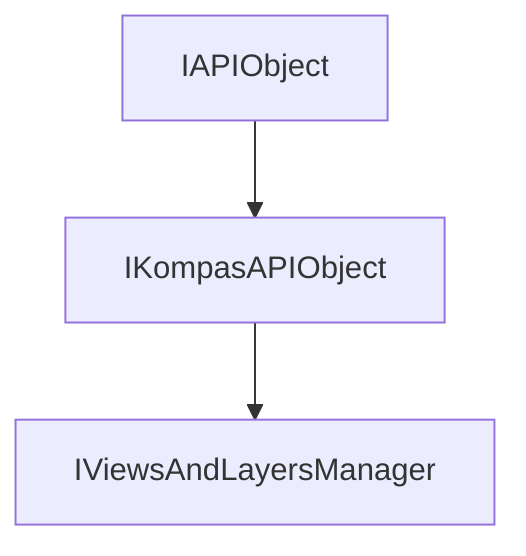

<!-- # **Документация интерфейса IViewsAndLayersManager** -->

# **Интерфейс IViewsAndLayersManager**

## Иерархия наследования

<style>
.top-parent{
    color: #ffe3d8;
    background: green;
    border: 3px solid #046709;
    border-radius: 4px;
    padding: 5px;
    text-align: center;
    margin-bottom: 5px;
    font-weight: bold;
    width: 40%;
    max-width: 220px;
}

.other-parents{
    color: #ffe3d8;
    background: #4a6fa5;
    border: 3px solid #3d5b87;
    border-radius: 4px;
    padding: 5px;
    text-align: center;
    margin: 5px 10%;
    font-weight: bold;
    width: 40%;
    max-width: 220px;
}

.interface{
    color: #ffe3d8;
    background: #103874;
    border: 3px solid #002152;
    border-radius: 4px;
    padding: 5px;
    text-align: center;
    margin: 5px 10%;
    font-weight: bold;
    width: 40%;
    max-width: 220px;
}
</style>

<div style="padding: 10px; background: #f5f5f5; border-radius: 5px; max-width: auto; margin-bottom: 20px">
<div class="top-parent">IAPIObject</div>

<div style="text-align: left; color:black; margin: 5px 15%;">▼</div>
<div class="other-parents">IKompasAPIObject</div>

<div style="text-align: left; color:black; margin: 5px 25%;">▼</div>
<div class="interface" style="margin: 5px 30%;">IViewsAndLayersManager</div>
</div>



## Общее описание

Менеджер видов и слоев 2D документа КОМПАС. Предоставляет доступ к коллекциям видов и групп слоев документа, позволяя управлять структурой организации графических объектов.

**Основные характеристики:**

- Наследуется от [`IKompasAPIObject`](../kompas-api-base/IKompasAPIObject.md)
- Предоставляет доступ к коллекции видов [`IViews`](view/IViews.md)
- Предоставляет доступ к коллекции групп слоев `ILayerGroups`
- Доступен только для 2D документов (чертеж, фрагмент)
- Является основной точкой доступа для работы с видами и слоями

## Важные примечания

1. **Только для 2D документов:** Интерфейс доступен для `IKompasDocument2D`.
2. **Всегда проверяйте указатели:** Методы [`GetViews()`](#getviews) и [`GetLayerGroups()`](#getlayergroups) могут вернуть `nullptr`.
3. **Объекты принадлежат видам:** Графические объекты принадлежат конкретным видам, а не документам напрямую.
4. После изменения структуры видов или слоев может потребоваться обновление документа.

## Получение интерфейса

### Основные способы получения:

1. **Из документа 2D:**
   - [`IKompasDocument2D::GetViewsAndLayersManager()`](interface_page_files/IKompasDocument2D.md) - единственный способ получения

### Примеры получения:

```cpp
// Пример 1: Получение менеджера из активного документа
ksapi::IKompasDocument2DPtr doc2D = kompasApp->GetActiveDocument();
ksapi::IViewsAndLayersManagerPtr viewsManager = doc2D->GetViewsAndLayersManager();
if (!viewsManager)
    return;

// Пример 2: Получение коллекции видов через менеджер
ksapi::IViewsPtr views = viewsManager->GetViews();
if (!views)
    return;

```

## Дополнительные интерфейсы

Интерфейс `IViewsAndLayersManager` предоставляет доступ к следующим коллекциям:

### Коллекции, получаемые через IViewsAndLayersManager:

- **`IViews`** - коллекция видов документа
  - [`GetViews()`](#getviews) - получение коллекции

- **`ILayerGroups`** - коллекция групп слоев
  - [`GetLayerGroups()`](#getlayergroups) - получение коллекции

### Связанные интерфейсы:

- **[`IView`](view/IView.md)** - отдельный вид документа
- **`ILayerGroup`** - группа слоев
- **`ILayer`** - слой
- **[`IDrawingContainer`](view/object-collections/IDrawingContainer.md)** - контейнер для графических примитивов

## Методы интерфейса

- [`GetViews()`](#getviews) - получить коллекцию видов документа
- [`GetLayerGroups()`](#getlayergroups) - получить коллекцию групп слоев документа

---

### GetViews()

[К оглавлению](#методы-интерфейса)

**Кратко:** Возвращает коллекцию видов документа.

**Полное описание:**
Метод возвращает указатель на интерфейс `IViews`, который представляет коллекцию всех видов текущего 2D документа. Через эту коллекцию можно получить доступ к конкретным видам, создавать новые виды и управлять их свойствами.

**Синтаксис:**

```cpp
virtual IViewsPtr GetViews() = 0;
```

**Возвращаемое значение:** Указатель `IViewsPtr` на коллекцию видов или `nullptr` в случае ошибки.

#### **Пример использования**

**Минимальный пример:**

```cpp
// Получение коллекции видов
ksapi::IViewsPtr views = viewsManager->GetViews();
```

**Расширенный пример:**

```cpp
// Source/Steps/Step1_KsAPI_2D/Step1_KsAPI_2D.cpp (строки 206-208)
// Получение менеджера и коллекции видов
if (ksapi::IViewsAndLayersManagerPtr viewMngr = doc2D->GetViewsAndLayersManager())
{
    ksapi::IViewsPtr views = viewMngr->GetViews();
    // Работа с видами
}
```

**Примечания:**

- Всегда проверяйте указатель на `nullptr`
- Коллекция видов включает системные и пользовательские виды
- Активный вид можно получить через `views->GetActiveView()`

---

### GetLayerGroups()

[К оглавлению](#методы-интерфейса)

**Кратко:** Возвращает коллекцию групп слоев документа.

**Полное описание:**
Метод возвращает указатель на интерфейс `ILayerGroups`, который представляет коллекцию групп слоев текущего 2D документа. Группы слоев позволяют организовать слои в логические группы и управлять их видимостью и состоянием.

**Синтаксис:**

```cpp
virtual ILayerGroupsPtr GetLayerGroups() = 0;
```

**Возвращаемое значение:** Указатель `ILayerGroupsPtr` на коллекцию групп слоев или `nullptr` в случае ошибки.

#### **Пример использования**

**Минимальный пример:**

```cpp
// Получение коллекции групп слоев
ksapi::ILayerGroupsPtr layerGroups = viewsManager->GetLayerGroups();
```

**Расширенный пример:**

```cpp
// Source/Steps/Step9/Step9.cpp (строки 897-899)
// Получение менеджера и коллекции групп слоев
ksapi::IViewsAndLayersManagerPtr viewsAndLayerManager = document.GetViewsAndLayersManager();
if (!viewsAndLayerManager)
    return;

ksapi::ILayerGroupsPtr layerGroups = viewsAndLayerManager->GetLayerGroups();
if (!layerGroups)
    return;
```

**Примечания:**

- Всегда проверяйте указатель на `nullptr`
- Слои внутри групп можно получить через `ILayerGroup::GetLayers()`

---

## Частые ошибки

### 1. **Использование менеджера для 3D документа**

```cpp
// НЕПРАВИЛЬНО
ksapi::IKompasDocument3DPtr doc3D = ...;
ksapi::IViewsAndLayersManagerPtr mng = doc3D->GetViewsAndLayersManager();  // Нет такого метода!

// ПРАВИЛЬНО
ksapi::IKompasDocument2DPtr doc2D = ...;
ksapi::IViewsAndLayersManagerPtr mng = doc2D->GetViewsAndLayersManager();
```

### 2. **Отсутствие проверки на nullptr после получения коллекций**

```cpp
// НЕПРАВИЛЬНО
ksapi::IViewsPtr views = viewsManager->GetViews();
views->GetActiveView();  // Краш если views == nullptr!

// ПРАВИЛЬНО
ksapi::IViewsPtr views = viewsManager->GetViews();
if (!views)
    return;
ksapi::IViewPtr view = views->GetActiveView();
```

---

## Практические примеры из исходников

### Пример 1: Получение активного вида

```cpp
// Source/Steps/Step8_KsAPI/Step8_KsAPI.cpp (строки 585-587)
IViewPtr currentView = doc2D.GetViewsAndLayersManager()->GetViews()->GetActiveView();
if (!currentView)
    return;
```

### Пример 2: Итерация по видам документа

```cpp
// Source/Steps/Step2_KsAPI_2D/Step2_KsAPI_2D.cpp (строки 193-195)
if (ksapi::IViewsAndLayersManagerPtr viewsMng = doc->GetViewsAndLayersManager())
{
    ksapi::IViewsPtr views = viewsMng->GetViews();
    // Работа с видами
}
```

### Пример 3: Получение контейнера чертежа для создания объектов

```cpp
// Source/Steps/Step3D1/Step3D1.cpp (строки 206-208)
IKompasDocument2DPtr doc2D = kompasApp->GetActiveDocument();
IDrawingContainerPtr drawCont = doc2D->GetViewsAndLayersManager()->GetViews()->GetActiveView();
std::vector<IDrawingObjectPtr> objects = drawCont->GetObjects({ksAllObj});
```

---

## Шаблоны использования

### Шаблон 1: Безопасное получение менеджера

```cpp
// Описание: Безопасное получение IViewsAndLayersManager
ksapi::IKompasDocument2DPtr doc = kompasApp->GetActiveDocument();
if (!doc)
    return;

ksapi::IViewsAndLayersManagerPtr viewsManager = doc->GetViewsAndLayersManager();
if (!viewsManager)
    return;

// Работа с менеджером
```

### Шаблон 2: Получение активного вида и контейнера

```cpp
// Описание: Получение активного вида для создания графических объектов
ksapi::IViewsPtr views = viewsManager->GetViews();
if (!views)
    return;

ksapi::IViewPtr activeView = views->GetActiveView();
if (!activeView)
    return;

ksapi::IDrawingContainerPtr container = activeView;
if (!container)
    return;

// Создание объектов в активном виде
```

### Шаблон 3: Работа со слоями

```cpp
// Описание: Получение и настройка слоев документа
ksapi::ILayerGroupsPtr layerGroups = viewsManager->GetLayerGroups();
if (!layerGroups)
    return;

for (int32_t i = 0; i < layerGroups->GetCount(); i++)
{
    ksapi::ILayerGroupPtr group = layerGroups->GetItem(i);
    if (!group)
        continue;

    // Настройка группы слоев
    group->SetCurrent(true);
}
```

---

## Связанные интерфейсы

### Работа в паре с:

- **`IKompasDocument2D`** - 2D документ, содержащий менеджер
- **`IViews`** - коллекция видов
- **`ILayerGroups`** - коллекция групп слоев
- **`IView`** - отдельный вид
