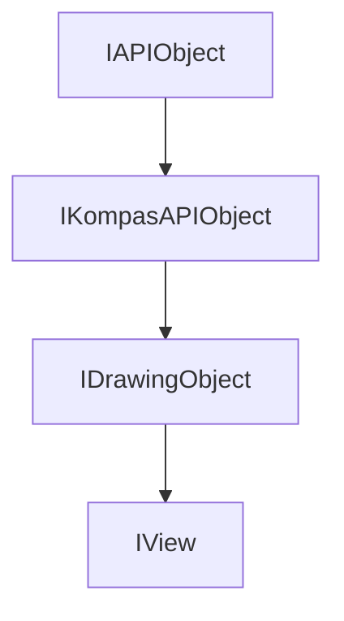

<!-- # **Документация интерфейса IView** -->

# **Интерфейс IView**

## Иерархия наследования



## Общее описание

Интерфейс `IView` предоставляет методы для работы с видами в 2D документах КОМПАС. Вид — это именованная область чертежа, содержащая графические объекты и имеющая собственные параметры масштаба, угла поворота, координат привязки и состояния.

**Основные характеристики:**

- Наследуется от [`IDrawingObject`](./object-collections/graphic-objects/IDrawingObject.md)
- Предоставляет доступ к параметрам вида (имя, номер, масштаб, угол, координаты)
- Позволяет управлять видимостью, состоянием (текущий/фоновый) и цветом вида
- Поддерживает поиск объектов в виде и преобразование координат между системами координат вида и листа
- Является контейнером для графических объектов чертежа (через `IDrawingContainer`)

## Важные примечания

1. **После изменения параметров вида** обязательно вызовите метод `Update()`, унаследованный от `IDrawingObject`, иначе изменения не применятся.
2. **Преобразование координат:** Методы `TransformPointToSheet()` и `TransformPointFromSheet()` преобразуют координаты между СК вида и СК листа с учётом масштаба, угла и положения вида.
3. **Вид как контейнер:** `IView` поддерживает приведение к `IDrawingContainer` для доступа к графическим объектам.
4. **Системы координат:** Все методы поиска объектов (`FindObject`, `FindObjects`) работают в системе координат вида, а не листа.

## Получение интерфейса

### Основные способы получения:

1. **Из коллекции видов:**
   - [`IViews::Add()`](IViews.md#add) — создание нового вида
   - [`IViews::GetView()`](IViews.md#getview) — получение по индексу
   - [`IViews::GetViewByName()`](IViews.md#getviewbyname) — получение по имени
   - [`IViews::GetViewByNumber()`](IViews.md#getviewbynumber) — получение по номеру
   - [`IViews::GetActiveView()`](IViews.md#getactiveview) — получение активного вида

2. **Как родитильский объект:**
   - [`IKompasAPIObject::GetParent()`](../../../../kompas-api-base/IKompasAPIObject.md) - получение родительского объекта.

## Дополнительные интерфейсы

Через QueryInterface можно получить дополнительные интерфейсы:

- **`ICutViewParam`** - параметры разреза
- **`IBreakViewParam`** - параметры разрыва
- **`IViewDesignation`** - обозначение вида

## Методы интерфейса {#методы-интерфейса}

### Группа 1: Основные параметры вида {#основные-параметры-вида}

- [`SetNumber() / GetNumber()`](#setnumber-/-getnumber) — номер вида
- [`SetName() / GetName()`](#setname-/-getname) — имя вида
- [`SetScale() / GetScale()`](#setscale-/-getscale) — масштаб вида
- [`SetX() / GetX()`](#setx-/-getx) — координата привязки по X
- [`SetY() / GetY()`](#sety-/-gety) — координата привязки по Y
- [`SetAngle() / GetAngle()`](#setangle-/-getangle) — угол поворота
- [`GetViewType()`](#getviewtype) — тип вида
- [`SetNumerator() / GetNumerator()`](#setnumerator-/-getnumerator) — числитель масштаба

### Группа 2: Состояние и видимость {#состояние-и-видимость}

- [`SetCurrent() / IsCurrent()`](#setcurrent-/-iscurrent) — текущий вид
- [`SetBackground() / IsBackground()`](#setbackground-/-isbackground) — фоновый вид
- [`SetVisible() / IsVisible()`](#setvisible-/-isvisible) — видимость вида
- [`SetColor() / GetColor()`](#setcolor--getcolor) — цвет вида
- [`SetComment() / GetComment()`](#setcomment-/-getcomment) — комментарий
- [`SetPrintable() / IsPrintable()`](#setprintable-/-isprintable) — разрешение печати

### Группа 3: Параметры и содержимое {#параметры-и-содержимое}

- [`GetObjectCount()`](#getobjectcount) — количество объектов в виде
- [`GetLayers()`](#getlayers) — коллекция слоёв
- [`GetLocalCoordinateSystems2D()`](#getlocalcoordinatesystems2d) — ЛСК вида
- [`GetVariables() / GetVariable() / GetVariableByName() / GetDimensionVariable()`](#getvariables--getvariable--getvariablebyname--getdimensionvariable) — параметрические переменные
- [`GetVariablesCount()`](#getvariablescount) — количество переменных
- [`GetBaseObject() / SetBaseObject()`](#setbaseobject--getbaseobject) — опорный объект

### Группа 4: Поиск объектов {#поиск-объектов}

- [`FindObject()`](#findobject) — поиск ближайшего объекта
- [`FindObjects()`](#findobjects) — поиск объектов в точке
- [`SelectObjects()`](#selectobjects) — выбор объектов в области

### Группа 5: Преобразование координат {#преобразование-координат}

- [`TransformPointToSheet() / TransformPointFromSheet()`](#transformpointtosheet--transformpointfromsheet) — преобразование точки
- [`TransformAngleToSheet() / TransformAngleFromSheet()`](#transformangletosheet--transformanglefromsheet) — преобразование угла

### Группа 6: Разрывы видов (специальные возможности) {#разрывы-видов-специальные-возможности}

- [`TransformBreakViewPointToView()`](#transformbreakviewpointtoview) — преобразование точки разрыва в СК вида
- [`TransformViewPointToBreakView()`](#transformviewpointtobreakview) — преобразование точки вида в СК разрыва
- [`IsViewPointInBreakView()`](#isviewpointinbreakview) — проверка точки на попадание в разрыв

### Группа 7: Служебные методы {#служебные-методы}

- [`IsEditMacroVisibleRegime()`](#iseditmacrovisibleregime) — режим редактирования макроэлемента
- [`IsCrossed()`](#iscrossed) — необходимость перестроения
- [`IsCrossedTitle()`](#iscrossedtitle) — необходимость перестроения заголовка

---

### SetNumber / GetNumber

[Основные параметры вида](#основные-параметры-вида) | [К оглавлению](#методы-интерфейса)

**Кратко:** Получение и установка номера вида.

**Полное описание:**
Методы работают с пользовательским номером вида, отображаемым в документе. Номер вида показывается в скобках рядом с именем (например, "Вид 1 (3)"). Системный номер вида в документации начинается с 0.

**Синтаксис:**

```cpp
virtual void SetNumber(int32_t number) = 0;
virtual int32_t GetNumber() = 0;
```

**Параметры:**

- `number` (in) — новый номер вида

**Возвращаемое значение GetNumber:** текущий номер вида.

**Пример использования:**

```cpp
// Минимальный пример
view->SetNumber(5);
int32_t num = view->GetNumber();

// Расширенный пример: создание вида с последовательной нумерацией
IViewsPtr views = mgr->GetViews();
int32_t maxNum = 0;
for (int32_t i = 0; i < views->GetCount(); i++)
{
    IViewPtr v = views->GetView(i);
    if (v)
        maxNum = std::max(maxNum, v->GetNumber());
}
IViewPtr newView = views->Add(ltvStandart);
newView->SetNumber(maxNum + 1);
newView->Update();
```

---

### SetName / GetName

[Основные параметры вида](#основные-параметры-вида) | [К оглавлению](#методы-интерфейса)

**Кратко:** Получение и установка имени вида.

**Полное описание:**
Работа с именем вида, отображаемым в дереве документа и в заголовке вида на чертеже. Имя может содержать произвольный текст, включая пробелы и специальные символы.

**Синтаксис:**

```cpp
virtual void SetName(const std::wstring & name) = 0;
virtual std::wstring GetName() = 0;
```

**Параметры:**

- `name` (in) — новое имя вида

**Возвращаемое значение GetName:** текущее имя вида.

---

### SetScale / GetScale

[Основные параметры вида](#основные-параметры-вида) | [К оглавлению](#методы-интерфейса)

**Кратко:** Получение и установка масштаба вида.

**Полное описание:**
Масштаб определяет соотношение размеров объектов в виде к их реальным размерам. Значение 1.0 — натуральный масштаб, 0.5 — масштаб 1:2, 2.0 — масштаб 2:1.

**Синтаксис:**

```cpp
virtual void SetScale(double scale) = 0;
virtual double GetScale() = 0;
```

**Параметры:**

- `scale` (in) — масштаб вида (например, 0.5, 1.0, 2.0)

**Возвращаемое значение GetScale:** текущий масштаб вида.

---

### SetX / GetX

[Основные параметры вида](#основные-параметры-вида) | [К оглавлению](#методы-интерфейса)

**Кратко:** Получение и установка координаты привязки вида по оси X.

**Полное описание:**
Координата X точки привязки вида в системе координат листа. Определяет положение начала координат вида относительно листа чертежа.

**Синтаксис:**

```cpp
virtual void SetX(double x) = 0;
virtual double GetX() = 0;
```

**Параметры:**

- `x` (in) — координата X в миллиметрах

**Возвращаемое значение GetX:** Координата X точки привязки вида в системе координат листа.

---

### SetY / GetY

[Основные параметры вида](#основные-параметры-вида) | [К оглавлению](#методы-интерфейса)

**Кратко:** Получение и установка координаты привязки вида по оси Y.

**Полное описание:**
Координата Y точки привязки вида в системе координат листа.

**Синтаксис:**

```cpp
virtual void SetY(double y) = 0;
virtual double GetY() = 0;
```

**Параметры:**

- `y` (in) — координата Y в миллиметрах

**Возвращаемое значение GetY:** Координата Y точки привязки вида в системе координат листа.

---

### SetAngle / GetAngle

[Основные параметры вида](#основные-параметры-вида) | [К оглавлению](#методы-интерфейса)

**Кратко:** Получение и установка угла поворота вида.

**Полное описание:**
Угол поворота вида относительно листа чертежа в градусах. Положительное значение — поворот против часовой стрелки.

**Синтаксис:**

```cpp
virtual void SetAngle(double angle) = 0;
virtual double GetAngle() = 0;
```

**Параметры:**

- `angle` (in) — угол поворота в градусах (от -360 до 360)

**Возвращаемое значение GetAngle:** Угол поворота вида относительно листа чертежа в градусах.

---

### GetViewType

[Основные параметры вида](#основные-параметры-вида) | [К оглавлению](#методы-интерфейса)

**Кратко:** Получение типа вида.

**Полное описание:**
Возвращает перечисление `LtViewType`, определяющее тип вида.

**Синтаксис:**

```cpp
virtual LtViewType GetViewType() = 0;
```

**Возвращаемое значение:** Тип вида `LtViewType`

---

### SetNumerator / GetNumerator

[Основные параметры вида](#основные-параметры-вида) | [К оглавлению](#методы-интерфейса)

**Кратко:** Получение и установка числителя масштаба вида.

**Полное описание:**
Числитель используется для отображения масштаба в формате "числитель:знаменатель" (например, 1:2 для масштаба 0.5).

**Синтаксис:**

```cpp
virtual void SetNumerator(double numerator) = 0;
virtual double GetNumerator() = 0;
```

**Параметры:**

- `numerator` (in) — числитель масштаба

**Возвращаемое значение GeNumerator():** числителя масштаба вида (double).

---

### SetCurrent / IsCurrent

[Состояние и видимость](#состояние-и-видимость) | [К оглавлению](#методы-интерфейса)

**Кратко:** Получение и установка состояния текущего вида.

**Полное описание:**
Только один вид может быть текущим в документе. Текущий вид принимает пользовательский ввод и отображается активным.

**Синтаксис:**

```cpp
virtual void SetCurrent(bool current) = 0;
virtual bool IsCurrent() = 0;
```

**Параметры:**

- `current` (in) — true = сделать текущим, false = снять признак

**Возвращаемое значение IsCurrent():** true — вид текущий, false — не текущий.

---

### SetBackground / IsBackground

[Состояние и видимость](#состояние-и-видимость) | [К оглавлению](#методы-интерфейса)

**Кратко:** Получение и установка состояния фонового вида.

**Полное описание:**
Фоновые виды не принимают пользовательский ввод и используются для отображения дополнительной информации (например, видов разрезов).

**Синтаксис:**

```cpp
virtual void SetBackground(bool background) = 0;
virtual bool IsBackground() = 0;
```

**Параметры:**

- `background` (in) — true = сделать фоновым, false = сделать активным

**Возвращаемое значение IsBackground():** true — вид фоновый, false — не фоновый.

---

### SetVisible / IsVisible

[Состояние и видимость](#состояние-и-видимость) | [К оглавлению](#методы-интерфейса)

**Кратко:** Получение и установка видимости вида.

**Полное описание:**
Невидимые виды не отображаются на чертеже, но их объекты доступны программно.

**Синтаксис:**

```cpp
virtual void SetVisible(bool visible) = 0;
virtual bool IsVisible() = 0;
```

**Параметры:**

- `visible` (in) — true = сделать видимым, false = погасить

**Возвращаемое значение IsVisible():** true — вид видимый, false — не видимый.

---

### SetColor / GetColor

[Состояние и видимость](#состояние-и-видимость) | [К оглавлению](#методы-интерфейса)

**Кратко:** Получение и установка цвета вида.

**Полное описание:**
Цвет применяется к объектам вида, не имеющим собственного цвета. Используется для группового управления цветом объектов.

**Синтаксис:**

```cpp
virtual void SetColor(Color color) = 0;
virtual Color GetColor() = 0;
```

**Параметры:**

- `color` (in) — цвет в формате RGB (Color{255, 0, 0} — красный)

**Возвращаемое значение GetColor():** цвет в формате RGB.

---

### SetComment / GetComment

[Состояние и видимость](#состояние-и-видимость) | [К оглавлению](#методы-интерфейса)

**Кратко:** Получение и установка комментария к виду.

**Полное описание:**
Комментарий может содержать произвольный текст с описанием вида. Не влияет на отображение вида.

**Синтаксис:**

```cpp
virtual void SetComment(const std::wstring & comment) = 0;
virtual std::wstring GetComment() = 0;
```

**Параметры:**

- `comment` (in) — текст комментария

**Возвращаемое значение GetComment():** текст комментария.

---

### SetPrintable / IsPrintable

[Состояние и видимость](#состояние-и-видимость) | [К оглавлению](#методы-интерфейса)

**Кратко:** Получение и установка разрешения печати вида.

**Полное описание:**
Вид может быть исключён из печати при установке этого флага в false.

**Синтаксис:**

```cpp
virtual void SetPrintable(bool printable) = 0;
virtual bool IsPrintable() = 0;
```

**Параметры:**

- `printable` (in) — true = печать разрешена, false = печать запрещена

**Возвращаемое значение IsPrintable():** true — печать разрешена, false — запрещена.

---

### GetObjectCount

[Параметры и содержимое](#параметры-и-содержимое) | [К оглавлению](#методы-интерфейса)

**Кратко:** Получение количества объектов в виде.

**Полное описание:**
Возвращает количество графических объектов, содержащихся в виде. Включает все объекты на всех слоях.

**Синтаксис:**

```cpp
virtual int32_t GetObjectCount() = 0;
```

**Возвращаемое значение:** Количество объектов в виде (0, если вид пуст)

---

### GetLayers

[Параметры и содержимое](#параметры-и-содержимое) | [К оглавлению](#методы-интерфейса)

**Кратко:** Получение коллекции слоёв вида.

**Полное описание:**
Возвращает интерфейс коллекции слоёв вида. Слои позволяют организовать объекты вида в логические группы с независимым управлением видимостью и параметрами.

**Синтаксис:**

```cpp
virtual ILayersPtr GetLayers() = 0;
```

**Возвращаемое значение:** Указатель `ILayersPtr` на коллекцию слоёв

**Пример использования:**

```cpp
ILayersPtr layers = view->GetLayers();
if (layers && layers->GetCount() > 0)
{
    ILayerPtr layer0 = layers->GetLayer(0);
    if (layer0)
    {
        layer0->SetCurrent();
        layer0->SetVisible(true);
    }
}
```

---

### GetLocalCoordinateSystems2D

[Параметры и содержимое](#параметры-и-содержимое) | [К оглавлению](#методы-интерфейса)

**Кратко:** Получение коллекции локальных систем координат вида.

**Полное описание:**
Возвращает интерфейс коллекции ЛСК, определённых в данном виде. ЛСК используются для привязки объектов к произвольным системам координат внутри вида.

**Синтаксис:**

```cpp
virtual ILocalCoordinateSystems2DPtr GetLocalCoordinateSystems2D() = 0;
```

**Возвращаемое значение:** Указатель `ILocalCoordinateSystems2DPtr`

---

### GetVariables / GetVariable / GetVariableByName / GetDimensionVariable

[Параметры и содержимое](#параметры-и-содержимое) | [К оглавлению](#методы-интерфейса)

**Кратко:** Получение параметрических переменных вида.

**Полное описание:**
Методы для работы с параметрическими переменными вида. Переменные используются для параметрического управления размерами объектов чертежа.

**Синтаксис:**

```cpp
virtual std::vector<IVariablePtr> GetVariables() = 0;
virtual IVariablePtr GetVariable(int32_t index) = 0;
virtual IVariablePtr GetVariableByName(const std::wstring & name) = 0;
virtual IVariablePtr GetDimensionVariable(const IDimension2DPtr & dimension) = 0;
```

**Параметры:**

- `index` (in) — индекс переменной в массиве (от 0)
- `name` (in) — имя переменной
- `dimension` (in) — размер, для которого нужно получить переменную

**Возвращаемое значение:**

- `GetVariables()`: массив всех переменных
- `GetVariable()`: переменная по индексу или nullptr
- `GetVariableByName()`: переменная по имени или nullptr
- `GetDimensionVariable()`: переменная размера или nullptr

---

### GetVariablesCount

[Параметры и содержимое](#параметры-и-содержимое) | [К оглавлению](#методы-интерфейса)

**Кратко:** Получение количества параметрических переменных.

**Полное описание:**
Возвращает количество параметрических переменных, определённых в виде.

**Синтаксис:**

```cpp
virtual int32_t GetVariablesCount() = 0;
```

**Возвращаемое значение:** Количество переменных

---

### SetBaseObject / GetBaseObject

[Параметры и содержимое](#параметры-и-содержимое) | [К оглавлению](#методы-интерфейса)

**Кратко:** Получение и установка опорного объекта вида.

**Полное описание:**
Опорный объект используется для привязки вида к конкретному объекту чертежа. Применяется для ассоциативных видов.

**Синтаксис:**

```cpp
virtual void SetBaseObject(const IDrawingObjectPtr & baseObject) = 0;
virtual IDrawingObjectPtr GetBaseObject() = 0;
```

**Параметры:**

- `baseObject` (in) — опорный объект или nullptr для отмены привязки

**Возвращаемое значение GetBaseObject():** указатель [`IDrawingObject`](interface_page_files/IDrawingObject.md).

---

### FindObject

[Поиск объектов](#поиск-объектов) | [К оглавлению](#методы-интерфейса)

**Кратко:** Поиск объекта, ближайшего к заданной точке.

**Полное описание:**
Ищет объект, ближайший к указанной точке в системе координат вида. Параметр `limit` ограничивает максимальное расстояние от точки до объекта. Координаты задаются в системе координат вида, а не листа!

**Синтаксис:**

```cpp
virtual IDrawingObjectPtr FindObject(double x, double y, double limit, const IFindObjectParametersPtr & params) = 0;
```

**Параметры:**

- `x, y` (in) — координаты точки поиска в СК вида
- `limit` (in) — максимальное расстояние от точки до объекта
- `params` (in) — параметры поиска (фильтры типов объектов)

**Возвращаемое значение:** Ближайший объект или nullptr

**Пример использования:**

```cpp
// Поиск объекта в точке (100, 50) в СК вида
double sheetX = 100.0, sheetY = 50.0;
view->TransformPointFromSheet(sheetX, sheetY);  // Сначала преобразуем координаты

IFindObjectParametersPtr params = doc;
IDrawingObjectPtr obj = view->FindObject(sheetX, sheetY, 5.0, params);
if (obj)
{
    // Объект найден
}
```

---

### FindObjects

[Поиск объектов](#поиск-объектов) | [К оглавлению](#методы-интерфейса)

**Кратко:** Поиск всех объектов в заданной точке.

**Полное описание:**
Находит все объекты, находящиеся в указанной точке в системе координат вида, с учётом допустимого расстояния.

**Синтаксис:**

```cpp
virtual std::vector<IDrawingObjectPtr> FindObjects(double x, double y, double limit,
                                                   const IFindObjectParametersPtr & params) = 0;
```

**Параметры:**

- `x, y` (in) — координаты точки поиска в СК вида
- `limit` (in) — максимальное расстояние от точки
- `params` (in) — параметры поиска

**Возвращаемое значение:** Массив найденных объектов

---

### SelectObjects

[Поиск объектов](#поиск-объектов) | [К оглавлению](#методы-интерфейса)

**Кратко:** Выбор объектов в прямоугольной области.

**Полное описание:**
Находит все объекты, находящиеся в указанной прямоугольной области. Параметр `regionType` определяет тип расположения объектов относительно области.

**Синтаксис:**

```cpp
virtual std::vector<IDrawingObjectPtr> SelectObjects(ksRegionTypeEnum regionType, double minX, double minY, double maxX,
                                                    double maxY) = 0;
```

**Параметры:**

- `regionType` (in) — тип расположения (ksRegionTypeIntersect, ksRegionTypeInside, ksRegionTypeOutside)
- `minX, minY` (in) — координаты левого нижнего угла
- `maxX, maxY` (in) — координаты правого верхнего угла

**Возвращаемое значение:** Массив найденных объектов

**Пример использования:**

```cpp
// Выбор всех объектов, пересекающихся с областью [50,50]-[200,200]
std::vector<IDrawingObjectPtr> objects = view->SelectObjects(
    ksRegionTypeEnum::ksRegionTypeIntersect,
    50.0, 50.0, 200.0, 200.0
);

for (const auto& obj : objects)
{
    // Обработка найденных объектов
}
```

---

### TransformPointToSheet / TransformPointFromSheet

[Преобразование координат](#преобразование-координат) | [К оглавлению](#методы-интерфейса)

**Кратко:** Преобразование координат точки между системами координат вида и листа.

**Полное описание:**
Преобразует координаты точки с учётом положения, масштаба и угла поворота вида. Преобразование выполняется "на месте" — координаты модифицируются в параметрах.

**Синтаксис:**

```cpp
virtual bool TransformPointToSheet(double & x, double & y) = 0;
virtual bool TransformPointFromSheet(double & x, double & y) = 0;
```

**Параметры:**

- `x, y` (in/out) — координаты точки для преобразования и результат

**Возвращаемое значение:** true — успешно, false — ошибка

**Пример использования:**

```cpp
// Преобразование координат листа в координаты вида
double x = 200.0, y = 150.0;  // Координаты в СК листа
if (view->TransformPointFromSheet(x, y))
{
    // Теперь x, y — координаты в СК вида
    // Можно использовать для поиска объектов
    IFindObjectParametersPtr params = doc;
    IDrawingObjectPtr obj = view->FindObject(x, y, 5.0, params);
}

// Обратное преобразование — из СК вида в СК листа
double viewX = 50.0, viewY = 75.0;
view->TransformPointToSheet(viewX, viewY);
```

---

### TransformAngleToSheet / TransformAngleFromSheet

[Преобразование координат](#преобразование-координат) | [К оглавлению](#методы-интерфейса)

**Кратко:** Преобразование углов между системами координат вида и листа.

**Полное описание:**
Преобразует угол с учётом угла поворота вида. Угол в градусах модифицируется "на месте".

**Синтаксис:**

```cpp
virtual bool TransformAngleToSheet(double & angle) = 0;
virtual bool TransformAngleFromSheet(double & angle) = 0;
```

**Параметры:**

- `angle` (in/out) — угол в градусах

**Возвращаемое значение:** true — успешно, false — ошибка

---

### TransformBreakViewPointToView

[Разрывы видов](#разрывы-видов-специальные-возможности) | [К оглавлению](#методы-интерфейса)

**Кратко:** Преобразование точки разрыва в систему координат вида.

**Полное описание:**
Преобразует координаты точки из системы координат вида с разрывами в обычную систему координат вида.

**Синтаксис:**

```cpp
virtual bool TransformBreakViewPointToView(double & x, double & y) = 0;
```

**Параметры:**

- `x, y` (in/out) — координаты точки

**Возвращаемое значение:** true — успешно, false — ошибка

---

### TransformViewPointToBreakView

[Разрывы видов](#разрывы-видов-специальные-возможности) | [К оглавлению](#методы-интерфейса)

**Кратко:** Преобразование точки вида в систему координат разрыва.

**Полное описание:**
Преобразует координаты точки из обычной системы координат вида в систему координат вида с разрывами.

**Синтаксис:**

```cpp
virtual bool TransformViewPointToBreakView(double & x, double & y) = 0;
```

**Параметры:**

- `x, y` (in/out) — координаты точки

**Возвращаемое значение:** true — успешно, false — ошибка

---

### IsViewPointInBreakView

[Разрывы видов](#разрывы-видов-специальные-возможности) | [К оглавлению](#методы-интерфейса)

**Кратко:** Проверка точки на попадание в разрыв вида.

**Полное описание:**
Проверяет, попадает ли указанная точка в область разрыва вида. Возвращает false, если точка видна (не попадает в разрыв).

**Синтаксис:**

```cpp
virtual bool IsViewPointInBreakView(double x, double y) = 0;
```

**Параметры:**

- `x, y` (in) — координаты точки в СК вида

**Возвращаемое значение:** true — точка в разрыве (не видна), false — точка видна

---

### IsEditMacroVisibleRegime

[Служебные методы](#служебные-методы) | [К оглавлению](#методы-интерфейса)

**Кратко:** Проверка режима редактирования макроэлемента.

**Полное описание:**
Возвращает признак активности режима редактирования видимости макроэлемента.

**Синтаксис:**

```cpp
virtual bool IsEditMacroVisibleRegime() = 0;
```

**Возвращаемое значение:** true — режим редактирования активен, false — не активен

---

### IsCrossed

[Служебные методы](#служебные-методы) | [К оглавлению](#методы-интерфейса)

**Кратко:** Проверка необходимости перестроения вида.

**Полное описание:**
Возвращает признак того, что вид требует перестроения (например, после изменения связанных объектов).

**Синтаксис:**

```cpp
virtual bool IsCrossed() = 0;
```

**Возвращаемое значение:** true — вид требует перестроения, false — вид актуален

---

### IsCrossedTitle

[Служебные методы](#служебные-методы) | [К оглавлению](#методы-интерфейса)

**Кратко:** Проверка необходимости перестроения заголовка вида.

**Полное описание:**
Возвращает признак того, что заголовок вида требует перестроения.

**Синтаксис:**

```cpp
virtual bool IsCrossedTitle() = 0;
```

**Возвращаемое значение:** true — заголовок требует перестроения, false — заголовок актуален

---

## Частые ошибки

### 1. Изменение параметров без вызова Update()

```cpp
// НЕПРАВИЛЬНО
view->SetScale(2.0);
view->SetName(L"Новый вид");
// Изменения не применены!

// ПРАВИЛЬНО
view->SetScale(2.0);
view->SetName(L"Новый вид");
view->Update();  // Обязательно!
```

### 2. Путаница в системах координат

```cpp
// НЕПРАВИЛЬНО
// Использование координат листа для FindObject
IDrawingObjectPtr obj = view->FindObject(150.0, 200.0, 10.0, params);
// Координаты в СК листа, а метод ожидает СК вида!

// ПРАВИЛЬНО
double sheetX = 150.0, sheetY = 200.0;
view->TransformPointFromSheet(sheetX, sheetY);  // Преобразуем в СК вида
IDrawingObjectPtr obj = view->FindObject(sheetX, sheetY, 10.0, params);
```

### 3. Забытая проверка на nullptr

```cpp
// НЕПРАВИЛЬНО
ILayersPtr layers = view->GetLayers();
layers->GetLayer(0);  // Краш если view == nullptr или нет слоёв

// ПРАВИЛЬНО
if (view)
{
    ILayersPtr layers = view->GetLayers();
    if (layers && layers->GetCount() > 0)
    {
        ksapi::ILayerPtr layer = layers->GetLayer(0);
    }
}
```

### 4. Путаница между SetBackground и SetCurrent

```cpp
// НЕПРАВИЛЬНО
view->SetCurrent(true);  // Делает вид текущим (принимает ввод)
view->SetBackground(true);  // Делает вид фоновым (не принимает ввод)
// Эти флаги взаимозависимы!

// ПРАВИЛЬНО
view->SetCurrent(true);   // Активный вид для ввода
// view->SetBackground(false) автоматически при SetCurrent(true)
```

---

## Практические примеры из исходников

### Пример 1: Получение активного вида и создание объекта

```cpp
// Source/Steps/Step3D1/Step3D1.cpp (строки 269-271)
IKompasDocument2DPtr doc2D = kompasApp->GetActiveDocument();
IDrawingContainerPtr drawCont = doc2D->GetViewsAndLayersManager()->GetViews()->GetActiveView();
ILineSegmentPtr lineSegment = drawCont->GetLineSegments()->Add();
```

### Пример 2: Установка текущего слоя

```cpp
// Source/Steps/Step3/Step3.cpp (строки 366-368)
ksapi::ILayerPtr zeroLayer = layers->GetLayer(0);
zeroLayer->SetCurrent();
zeroLayer->Update();
```

### Пример 3: Получение контейнера чертежа из вида

```cpp
// Source/MacroObj/SketchDispatcher.cpp (строки 174-177)
IViewsPtr views = valMng->GetViews();
IViewPtr view = views->GetActiveView();
IDrawingContainerPtr drawCont = view;  // Приведение IView к IDrawingContainer
```

### Пример 4: Создание нового вида

```cpp
// Source/Cube/Cube.cpp (частично)
// Получение менеджера видов из 2D документа
IKompasDocument2DPtr doc2D = CreateNewDocument(DocumentTypeEnum::ksDocumentDrawing);
IViewsAndLayersManagerPtr viewsMgr = doc2D->GetViewsAndLayersManager();
IViewsPtr views = viewsMgr->GetViews();

// Создание нового стандартного вида
IViewPtr newView = views->Add(ltvStandart);
if (newView)
{
    newView->SetName(L"Основной вид");
    newView->SetNumber(1);
    newView->SetScale(1.0);
    newView->SetX(100.0);
    newView->SetY(100.0);
    newView->SetAngle(0.0);
    newView->SetCurrent(true);
    newView->Update();
}
```

---

## Шаблоны использования

### Шаблон 1: Создание и настройка нового вида

```cpp
// Описание: Создание нового вида с параметрами
ksapi::IViewsPtr views = viewsManager->GetViews();
ksapi::IViewPtr newView = views->Add(ltvStandart);
if (!newView)
    return nullptr;

// Настройка параметров вида
newView->SetName(L"Новый вид");
newView->SetNumber(5);
newView->SetScale(0.5);  // Масштаб 1:2
newView->SetX(100.0);
newView->SetY(150.0);
newView->SetAngle(0.0);
newView->SetCurrent(true);
newView->Update();

return newView;
```

### Шаблон 2: Преобразование координат и поиск объекта

```cpp
// Описание: Преобразование точки из СК листа в СК вида и поиск объекта
double x = 200.0, y = 300.0;  // Координаты в СК листа
if (view->TransformPointFromSheet(x, y))
{
    // Теперь x, y - координаты в СК вида
    IFindObjectParametersPtr params = doc;
    IDrawingObjectPtr obj = view->FindObject(x, y, 5.0, params);
    if (obj)
    {
        // Объект найден
    }
}
```

### Шаблон 3: Поиск объектов в области

```cpp
// Описание: Выбор всех объектов в прямоугольной области
double minX = 50.0, minY = 50.0;
double maxX = 200.0, maxY = 200.0;

std::vector<IDrawingObjectPtr> objects = view->SelectObjects(
    ksRegionTypeEnum::ksRegionTypeIntersect,  // Пересекающиеся с областью
    minX, minY, maxX, maxY
);

for (const auto& obj : objects)
{
    // Обработка найденных объектов
    IDrawingObjectPtr drawingObj = obj;
    // ...
}
```

### Шаблон 4: Перебор всех видов документа

```cpp
// Описание: Перебор всех видов и вывод информации
IViewsPtr views = viewsManager->GetViews();
for (int32_t i = 0; i < views->GetCount(); i++)
{
    IViewPtr view = views->GetView(i);
    if (view)
    {
        std::wcout << L"Вид: " << view->GetName()
                   << L" №" << view->GetNumber()
                   << L" Масштаб:" << view->GetScale() << std::endl;
    }
}
```

---

## Связанные интерфейсы

### Работа в паре с:

- **`IViews`** — коллекция видов документа
- **`IDrawingContainer`** — контейнер объектов вида (IView наследует этот интерфейс)
- **`ILayers`** — слои вида
