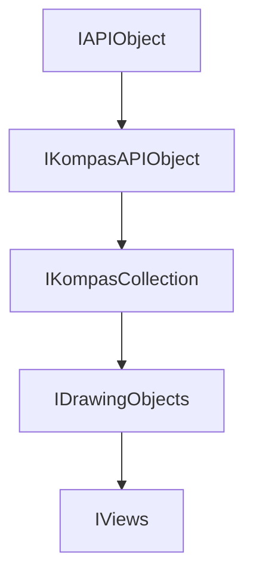

<!-- # **Документация интерфейса IViews** -->

# **Интерфейс IViews**

## Иерархия наследования



## Общее описание

Коллекция видов 2D документа КОМПАС. Наследует от `IDrawingObjects` и предоставляет специализированные методы для работы с видами 2D документа.

**Основные характеристики:**

- Наследуется от [`IDrawingObjects`](./object-collections/graphic-objects/IDrawingObjects.md)
- Предоставляет методы для получения видов по индексу, имени и номеру
- Позволяет создавать новые виды различных типов
- Поддерживает создание стандартных ассоциативных видов из 3D моделей
- Позволяет получить активный вид документа

## Важные примечания

1. **Наследование от IKompasCollection:** Интерфейс наследует методы [`GetObjects()`](../IKompasCollection.md) и [`GetCount()`](../IKompasCollection.md) от базового интерфейса.
2. **Всегда проверяйте указатели:** Методы получения видов могут вернуть `nullptr`.
3. **Активный вид:** [`GetActiveView()`](#getactiveview) возвращает текущий активный вид документа.

## Получение интерфейса

### Основные способы получения:

1. **Из IViewsAndLayersManager:**
   - [`IViewsAndLayersManager::GetViews()`](docs/Приложение KompasAPI/Документы/Документ 2D/IViewsAndLayersManager.md#getviews) - единственный способ получения

### Примеры получения:

```cpp
// Пример 1: Получение коллекции видов через менеджер
ksapi::IViewsAndLayersManagerPtr viewsManager = doc2D->GetViewsAndLayersManager();
ksapi::IViewsPtr views = viewsManager->GetViews();
if (!views)
    return;

// Пример 2: Итерация по коллекции видов
for (int32_t i = 0; i < views->GetCount(); i++)
{
    ksapi::IViewPtr view = views->GetView(i);
    if (view)
    {
        // Работа с видом
    }
}

// Пример 3: Получение активного вида
ksapi::IViewPtr activeView = views->GetActiveView();
```

## Дополнительные интерфейсы

Интерфейс `IViews` не имеет дополнительных интерфейсов, но наследуется от `IDrawingObjects` и предоставляет доступ к следующим интерфейсам:

### Интерфейсы, получаемые из IViews:

- **`IView`** - отдельный вид документа

### Связанные интерфейсы:

- **`IDrawingContainer`** - контейнер для графических примитивов вида
- **`IViewsAndLayersManager`** - менеджер видов и слоев

## Методы интерфейса {#методы-интерфейса}

### Группа 1: Получение видов {#группа-1-получение-видов}

- [`GetView()`](#getview) - получить вид по индексу
- [`GetViewByName()`](#getviewbyname) - получить вид по имени
- [`GetViewByNumber()`](#getviewbynumber) - получить вид по номеру
- [`GetActiveView()`](#getactiveview) - получить активный вид

### Группа 2: Создание видов {#группа-2-создание-видов}

- [`Add()`](#add) - создать вид и добавить в коллекцию
- [`AddStandartViews()`](#addstandartviews) - создать группу стандартных ассоциативных видов

---

### GetView()

[Группа методов](#группа-1-получение-видов) | [К оглавлению](#методы-интерфейса)

**Кратко:** Возвращает вид по индексу в коллекции.

**Полное описание:**
Метод возвращает указатель на интерфейс `IView`, представляющий вид с указанным индексом в коллекции. Индекс должен быть в диапазоне от 0 до GetCount() - 1.

**Синтаксис:**

```cpp
virtual IViewPtr GetView(int32_t index) = 0;
```

**Параметры:**

- `index` (in) - индекс вида в коллекции (от 0)

**Возвращаемое значение:** Указатель `IViewPtr` на вид или `nullptr` в случае ошибки или неверного индекса.

#### **Пример использования**

**Минимальный пример:**

```cpp
// Получение первого вида
ksapi::IViewPtr view = views->GetView(0);
```

**Расширенный пример:**

```cpp
// Итерация по всем видам
for (int32_t i = 0; i < views->GetCount(); i++)
{
    ksapi::IViewPtr view = views->GetView(i);
    if (!view)
        continue;

    auto name = view->GetName();
    // Работа с видом
}
```

**Примечания:**

- Индекс должен быть меньше `GetCount()`
- Порядок видов в коллекции может отличаться от порядка по номерам
- Всегда проверяйте указатель на `nullptr`

---

### GetViewByName()

[Группа методов](#группа-1-получение-видов) | [К оглавлению](#методы-интерфейса)

**Кратко:** Возвращает вид по имени.

**Полное описание:**
Метод ищет вид с указанным именем в коллекции и возвращает указатель на него. Если вид с таким именем не найден, возвращает `nullptr`.

**Синтаксис:**

```cpp
virtual IViewPtr GetViewByName(const std::wstring & name) = 0;
```

**Параметры:**

- `name` (in) - имя вида для поиска

**Возвращаемое значение:** Указатель `IViewPtr` на вид или `nullptr`, если вид не найден.

#### **Пример использования**

**Минимальный пример:**

```cpp
// Получение вида по имени
ksapi::IViewPtr view = views->GetViewByName(L"Вид 1");
```

**Расширенный пример:**

```cpp
// Поиск конкретного вида
std::wstring targetName = L"Вид Спереди";
ksapi::IViewPtr view = views->GetViewByName(targetName);

if (view)
{
    // Работа с найденным видом
    view->SetCurrent();
}
```

**Примечания:**

- Имя вида можно получить через `IView::GetName()`

---

### GetViewByNumber()

[Группа методов](#группа-1-получение-видов) | [К оглавлению](#методы-интерфейса)

**Кратко:** Возвращает вид по номеру.

**Полное описание:**
Метод ищет вид с указанным номером в коллекции и возвращает указатель на него. Номер вида - это пользовательский номер, отображаемый в документе (например, "1", "2").

**Синтаксис:**

```cpp
virtual IViewPtr GetViewByNumber(int32_t number) = 0;
```

**Параметры:**

- `number` (in) - номер вида для поиска

**Возвращаемое значение:** Указатель `IViewPtr` на вид или `nullptr`, если вид с таким номером не найден.

#### **Пример использования**

**Минимальный пример:**

```cpp
// Получение вида по номеру 1
ksapi::IViewPtr view = views->GetViewByNumber(1);
```

**Расширенный пример:**

```cpp
// Source/Events/Events.cpp (строки 286-288)
ksapi::IViewsPtr views = viewsMngr->GetViews();
view = views ? views->GetViewByNumber(viewNumber) : nullptr;

if (view)
{
    // Работа с видом
}
```

**Примечания:**

- Номера видов могут быть непоследовательными
- Номер 0 обычно соответствует системному виду

---

### GetActiveView()

[Группа методов](#группа-1-получение-видов) | [К оглавлению](#методы-интерфейса)

**Кратко:** Возвращает активный вид документа.

**Полное описание:**
Метод возвращает указатель на интерфейс активного (текущего) вида документа. Активный вид - это вид, который в данный момент отображается и принимает пользовательский ввод.

**Синтаксис:**

```cpp
virtual IViewPtr GetActiveView() = 0;
```

**Возвращаемое значение:** Указатель `IViewPtr` на активный вид или `nullptr`, если активный вид не существует.

#### **Пример использования**

**Минимальный пример:**

```cpp
// Получение активного вида
ksapi::IViewPtr activeView = views->GetActiveView();
```

**Расширенный пример:**

```cpp
// Source/Steps/Step8_KsAPI/Step8_KsAPI.cpp (строки 585-587)
IViewPtr currentView = doc2D.GetViewsAndLayersManager()->GetViews()->GetActiveView();
if (!currentView)
    return;

// Получение контейнера чертежа для создания объектов
ksapi::IDrawingContainerPtr drawCont = currentView;
if (!drawCont)
    return;

// Создание объекта в активном виде
```

**Примечания:**

- Всегда проверяйте указатель на `nullptr`
- Активный вид можно использовать как `IDrawingContainer` для создания графических объектов
- Смена активного вида происходит при щелчке пользователя на другом виде

---

### Add()

[Группа методов](#группа-2-создание-видов) | [К оглавлению](#методы-интерфейса)

**Кратко:** Создает новый вид и добавляет его в коллекцию.

**Полное описание:**
Метод создает новый вид указанного типа и добавляет его в коллекцию видов документа. Возвращает указатель на созданный вид.

**Синтаксис:**

```cpp
virtual IViewPtr Add(LtViewType viewType) = 0;
```

**Параметры:**

- `viewType` (in) - тип создаваемого вида (перечисление `LtViewType`)

**Возвращаемое значение:** Указатель `IViewPtr` на созданный вид или `nullptr` в случае ошибки.

#### **Пример использования**

**Минимальный пример:**

```cpp
// Создание нового вида
ksapi::IViewPtr newView = views->Add(vt_Standart);
```

**Расширенный пример:**

```cpp
// Создание стандартного вида
ksapi::IViewPtr view = views->Add(vt_Standart);
if (!view)
    return;

// Настройка параметров вида
view->SetName(L"Новый вид");
view->SetScale(1.0);
view->Update();
```

**Примечания:**

- Созданный вид автоматически добавляется в коллекцию
- После создания вид необходимо позиционировать и настроить
- Тип вида влияет на свойства, доступные для настройки

---

### AddStandartViews()

[Группа методов](#группа-2-создание-видов) | [К оглавлению](#методы-интерфейса)

**Кратко:** Создает группу стандартных ассоциативных видов из 3D модели.

**Полное описание:**
Метод создает группу стандартных ассоциативных видов (спереди, сзади, сверху, снизу, слева, справа, изометрия) из указанной 3D модели и добавляет их в коллекцию видов.

**Синтаксис:**

```cpp
virtual bool AddStandartViews(const std::wstring & fileName, const std::wstring & projectionName,
                              const std::vector<int32_t> & projectionsTypes, double x, double y, double scale, double dx,
                              double dy) = 0;
```

**Параметры:**

- `fileName` (in) - путь к файлу 3D модели
- `projectionName` (in) - имя проекции из документа-источника
- `projectionsTypes` (in) - битовая маска типов стандартных видов:
  - `0x1` - Спереди
  - `0x2` - Сзади
  - `0x4` - Сверху
  - `0x8` - Снизу
  - `0x10` - Слева
  - `0x20` - Справа
  - `0x40` - Изометрия
- `x, y` (in) - координаты создаваемого главного вида (спереди)
- `scale` (in) - масштаб видов
- `dx, dy` (in) - расстояние между видами по горизонтали и вертикали

**Возвращаемое значение:** `true` - виды успешно созданы, `false` - ошибка создания.

#### **Пример использования**

**Минимальный пример:**

```cpp
// Создание стандартных видов
std::vector<int32_t> viewTypes = {0x1, 0x4, 0x40}; // Спереди, Сверху, Изометрия
bool success = views->AddStandartViews(
    L"C:\\model.m3d",    // Путь к модели
    L"Изометрия",         // Имя проекции
    viewTypes,            // Типы видов
    100.0, 100.0,        // Координаты
    1.0,                 // Масштаб
    50.0, 50.0           // Расстояние между видами
);
```

**Расширенный пример:**

```cpp
// Создание всех стандартных видов
std::vector<int32_t> allViews = {
    0x1,   // Спереди
    0x2,   // Сзади
    0x4,   // Сверху
    0x8,   // Снизу
    0x10,  // Слева
    0x20,  // Справа
    0x40   // Изометрия
};

bool result = views->AddStandartViews(
    L"d:\\models\\part.m3d",
    L"Изометрия XYZ",
    allViews,
    200.0, 150.0,  // Позиция главного вида
    0.5,           // Масштаб 1:2
    80.0, 60.0     // Расстояние между видами
);

if (!result)
{
    kompasApp->ShowMessageBox(L"Не удалось создать виды", L"Ошибка",
                             ksMessageError, ksButtonSetOk, true);
}
```

**Примечания:**

- Метод создает сразу несколько видов за один вызов
- Виды размещаются автоматически на основе указанных координат и расстояний
- Поддерживаются только 3D документы (деталь, сборка)

---

## Частые ошибки

### 1. **Использование неверного индекса**

```cpp
// НЕПРАВИЛЬНО
ksapi::IViewPtr view = views->GetView(100);  // Индекс может быть больше количества видов

// ПРАВИЛЬНО
int32_t count = views->GetCount();
for (int32_t i = 0; i < count; i++)
{
    ksapi::IViewPtr view = views->GetView(i);
    if (view)
    {
        // Работа с видом
    }
}
```

### 2. **Отсутствие проверки на nullptr**

```cpp
// НЕПРАВИЛЬНО
ksapi::IViewPtr view = views->GetActiveView();
view->SetName(L"New Name");  // Краш если активный вид не существует

// ПРАВИЛЬНО
ksapi::IViewPtr view = views->GetActiveView();
if (view)
    view->SetName(L"New Name");
```

### 3. **Путаница между GetView(), GetViewByName() и GetViewByNumber()**

```cpp
// НЕПРАВИЛЬНО
// Ищем вид с именем "1", используя GetViewByNumber
ksapi::IViewPtr view = views->GetViewByNumber(1);
// Это ищет вид с номером 1, а не первый вид в коллекции!

// ПРАВИЛЬНО
// Для получения первого вида используйте GetView(0)
ksapi::IViewPtr view = views->GetView(0);
// Для поиска по номеру используйте GetViewByNumber()
ksapi::IViewPtr viewByNum = views->GetViewByNumber(1);
// Для поиска по имени используйте GetViewByName()
ksapi::IViewPtr viewByName = views->GetViewByName(L"Вид 1");
```

---

## Практические примеры из исходников

### Пример 1: Получение контейнера чертежа из активного вида

```cpp
// Source/Steps/Step3D1/Step3D1.cpp (строки 206-208)
IKompasDocument2DPtr doc2D = kompasApp->GetActiveDocument();
IDrawingContainerPtr drawCont = doc2D->GetViewsAndLayersManager()->GetViews()->GetActiveView();
std::vector<IDrawingObjectPtr> objects = drawCont->GetObjects({ksAllObj});
```

### Пример 2: Создание графических объектов в активном виде

```cpp
// Source/Steps/Step3D1/Step3D1.cpp (строки 269-271)
IKompasDocument2DPtr doc2D = kompasApp->GetActiveDocument();
IDrawingContainerPtr drawCont = doc2D->GetViewsAndLayersManager()->GetViews()->GetActiveView();
ILineSegmentPtr lineSegment = drawCont->GetLineSegments()->Add();
```

### Пример 3: Итерация по видам для поиска нужного

```cpp
// Source/Events/Events.cpp (строки 286-288)
ksapi::IViewsPtr views = viewsMngr->GetViews();
view = views ? views->GetViewByNumber(viewNumber) : nullptr;

if (view)
{
    // Работа с найденным видом
}
```

---

## Шаблоны использования

### Шаблон 1: Безопасное получение активного вида

```cpp
// Описание: Получение активного вида с проверкой и приведением к контейнеру
ksapi::IViewsPtr views = viewsManager->GetViews();
if (!views)
    return;

ksapi::IViewPtr activeView = views->GetActiveView();
if (!activeView)
    return;

ksapi::IDrawingContainerPtr container = activeView;
if (!container)
    return;

// Создание объектов в виде
```

### Шаблон 2: Поиск вида по номеру

```cpp
// Описание: Поиск вида по номеру с безопасной проверкой
bool FindViewByNumber(ksapi::IViewsPtr views, int32_t number, ksapi::IViewPtr& result)
{
    result = nullptr;
    if (!views)
        return false;

    result = views->GetViewByNumber(number);
    return result != nullptr;
}
```

### Шаблон 3: Создание стандартных видов из 3D модели

```cpp
// Описание: Создание ассоциативных видов из 3D модели
bool CreateStandardViews(ksapi::IViewsPtr views, const std::wstring& modelPath)
{
    if (!views)
        return false;

    std::vector<int32_t> projections = {
        0x1,   // Спереди
        0x4,   // Сверху
        0x40   // Изометрия
    };

    return views->AddStandartViews(
        modelPath,
        L"Изометрия",
        projections,
        100.0, 100.0,  // Позиция
        1.0,           // Масштаб
        50.0, 50.0     // Расстояние
    );
}
```

---

## Связанные интерфейсы

### Работа в паре с:

- **`IViewsAndLayersManager`** - менеджер, предоставляющий доступ к коллекции
- **`IView`** - отдельный вид документа
- **`IDrawingContainer`** - контейнер для графических объектов
