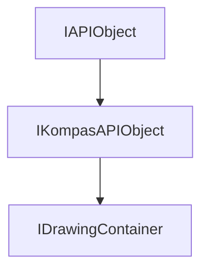

<!-- # **Документация интерфейса КОМПАС API** -->

# **Интерфейс IDrawingContainer**

## Иерархия наследования



## Общее описание

Интерфейс **IDrawingContainer** является базовым интерфейсом для работы с графическими объектами в 2D документах. Он предоставляет единый механизм доступа ко всем типам графических примитивов чертежа: отрезкам, дугам, окружностям, штриховкам, текстам и многим другим элементам.

Интерфейс предоставляет унифицированный доступ к разнородным коллекциям графических объектов. Вместо работы с десятками различных интерфейсов напрямую, разработчик может использовать методы IDrawingContainer для получения указателей на соответствующие коллекции и затем работать с ними через специализированные интерфейсы.

## Важные примечания

1. **Производительность**: При работе с большим количеством объектов используйте методы с фильтрацией по типам объектов (`GetObjects()` с параметром `objTypes`) для оптимизации производительности.

## Получение интерфейса

### Основные способы получения:

1. **Из вида документа:**
   - [`IViews::GetActiveView()`](../IView.md) - получение активного вида
   - [`IViews::GetViewByNumber()`](../IView.md) - получение вида по номеру
   - Вид является контейнером, поэтому приводится к IDrawingContainer

### Примеры получения:

```cpp
// Пример 1: Получение из активного вида 2D документа
ksapi::IViewsAndLayersManagerPtr viewMngr = doc2D->GetViewsAndLayersManager();
ksapi::IViewsPtr views = viewMngr->GetViews();
ksapi::IViewPtr activeView = views->GetActiveView();
ksapi::IDrawingContainerPtr container = activeView;  // IView приводится к IDrawingContainer
```

## Дополнительные интерфейсы

Интерфейс IDrawingContainer является дополнительным интерфейсом для `IView`, `IViewEx`.
Это основной интерфейс для доступа к графическим объектам. Однако через него можно получить доступ к другим коллекциям графических объектов.

## Методы интерфейса

### Группа 1: Базовые геометрические примитивы

- [`GetLineSegments()`](#GetLineSegments) - коллекция отрезков
- [`GetArcs()`](#GetArcs) - коллекция дуг
- [`GetCircles()`](#GetCircles) - коллекция окружностей
- [`GetLines()`](#GetLines) - коллекция линий
- [`GetEllipses()`](#GetEllipses) - коллекция эллипсов
- [`GetEllipseArcs()`](#GetEllipseArcs) - коллекция дуг эллипсов
- [`GetPoints()`](#GetPoints) - коллекция точек

### Группа 2: Сложные кривые и контуры

- [`GetBeziers()`](#GetBeziers) - коллекция Bezier сплайнов
- [`GetNurbses()`](#GetNurbses) - коллекция NURBS-кривых
- [`GetNurbsesByPoints()`](#GetNurbsesByPoints) - коллекция NURBS-кривых по точкам
- [`GetPolyLines2D()`](#GetPolyLines2D) - коллекция 2D ломаных
- [`GetConicCurves()`](#GetConicCurves) - коллекция конических кривых
- [`GetDrawingContours()`](#GetDrawingContours) - коллекция контуров
- [`GetEquidistants()`](#GetEquidistants) - коллекция эквидистант

### Группа 3: Геометрические построения

- [`GetRectangles()`](#GetRectangles) - коллекция прямоугольников
- [`GetRegularPolygons()`](#GetRegularPolygons) - коллекция многоугольников
- [`GetMultilines()`](#GetMultilines) - коллекция мультилиний
- [`GetStraightSlots()`](#GetStraightSlots) - коллекция пазов
- [`GetArcSlots()`](#GetArcSlots) - коллекция дуговых пазов

### Группа 4: Оформление и внешние объекты

- [`GetHatches()`](#GetHatches) - коллекция штриховок
- [`GetColourings()`](#GetColourings) - коллекция заливок
- [`GetRasters()`](#GetRasters) - коллекция растровых объектов
- [`GetInsertionObjects()`](#GetInsertionObjects) - коллекция вставок
- [`GetMacroObjects()`](#GetMacroObjects) - коллекция макрообъектов
- [`GetDrawingTexts()`](#GetDrawingTexts) - коллекция текстов

### Группа 5: Утилитарные методы

- [`GetObjects()`](#GetObjects) - массив объектов по типам

---

### GetLineSegments()

[Группа методов](#группа-1-базовые-геометрические-примитивы) | [К оглавлению](#методы-интерфейса)

**Кратко:** Возвращает коллекцию всех отрезков, содержащихся в контейнере.

**Полное описание:** Метод предоставляет доступ к коллекции отрезков, которые были созданы в данном виде или фрагменте документа. Отрезки являются базовыми геометрическими примитивами, используемыми для построения любой геометрии. Коллекция включает как системные отрезки (осевые линии, линии чертежа), так и пользовательские. Возвращаемый интерфейс [`ILineSegments`](/ILineSegments.md) позволяет добавлять новые отрезки, получать существующие и управлять их свойствами.

**Синтаксис:**

```cpp
virtual ILineSegmentsPtr GetLineSegments() = 0;
```

**Возвращаемое значение:** [`ILineSegmentsPtr`](interface_page_files/ILineSegments.md) - указатель на коллекцию отрезков. Может быть пустым (null), если контейнер не поддерживает работу с отрезками.

#### **Пример использования**

**Минимальный пример:**

```cpp
// Получение коллекции отрезков из активного вида
ksapi::IDrawingContainerPtr container = views->GetActiveView();
ksapi::ILineSegmentsPtr lineSegments = container->GetLineSegments();

// Проверка на пустой указатель
if (lineSegments)
{
    // Работа с коллекцией
}
```

**Расширенный пример:**

```cpp
// Создание отрезка в документе фрагмента
ksapi::IViewsPtr views = doc2D->GetViewsAndLayersManager()->GetViews();
ksapi::IViewPtr view = views->GetActiveView();
ksapi::IDrawingContainerPtr container = view;

if (ksapi::ILineSegmentsPtr lineSegments = container->GetLineSegments())
{
    ksapi::ILineSegmentPtr lineSegment = lineSegments->Add();
    lineSegment->SetX1(50);
    lineSegment->SetY1(50);
    lineSegment->SetX2(-50);
    lineSegment->SetY2(50);
    lineSegment->SetStyle(ksCurveStyleEnum::ksCSNormal);
    lineSegment->Update();  // Обязательный вызов для создания объекта
}
```

**Примечания:**

- Возвращаемая коллекция содержит только отрезки данного контейнера
- Для создания нового отрезка используйте метод `Add()` коллекции

---

### GetArcs()

[Группа методов](#группа-1-базовые-геометрические-примитивы) | [К оглавлению](#методы-интерфейса)

**Кратко:** Возвращает коллекцию дуг, содержащихся в контейнере.

**Полное описание:** Метод предоставляет доступ к коллекции дуг окружностей. Дуги используются для создания криволинейной геометрии - скруглений, фасок, дуговых переходов и других элементов. Коллекция [`IArcs`](/IArcs.md) поддерживает как полные окружности (дуги с углом 360 градусов), так и сегменты дуг. Метод позволяет получить доступ к существующим дугам и создать новые через метод `Add()`.

**Синтаксис:**

```cpp
virtual IArcsPtr GetArcs() = 0;
```

**Возвращаемое значение:** `IArcsPtr` - указатель на коллекцию дуг.

#### **Пример использования**

**Минимальный пример:**

```cpp
ksapi::IDrawingContainerPtr container = view;
ksapi::IArcsPtr arcs = container->GetArcs();
```

**Расширенный пример:**

```cpp
// Создание дуги по трём точкам
ksapi::IArcsPtr arcs = container->GetArcs();
if (ksapi::IArcPtr arc = arcs->Add())
{
    arc->SetX(100);
    arc->SetY(100);
    arc->SetRadius(50);
    arc->SetAngle1(0);
    arc->SetAngle2(90);
    arc->Update();
}
```

**Примечания:**

- Для создания дуги необходимо задать центр, радиус и углы

---

### GetCircles()

[Группа методов](#группа-1-базовые-геометрические-примитивы) | [К оглавлению](#методы-интерфейса)

**Кратко:** Возвращает коллекцию окружностей, содержащихся в контейнере.

**Полное описание:** Метод предоставляет доступ к коллекции полных окружностей. Окружности используются для создания круглых отверстий, обозначений и других элементов с радиальной симметрией. В отличие от дуг, окружности всегда представляют полный круг. Коллекция [`ICircles`](/ICircles.md) позволяет добавлять новые окружности и управлять их параметрами.

**Синтаксис:**

```cpp
virtual ICirclesPtr GetCircles() = 0;
```

**Возвращаемое значение:** [`ICirclesPtr`](interface_page_files/ICircles.md) - указатель на коллекцию окружностей.

#### **Пример использования**

**Минимальный пример:**

```cpp
ksapi::IDrawingContainerPtr container = view;
ksapi::ICirclesPtr circles = container->GetCircles();
```

**Расширенный пример:**

```cpp
// Создание окружности с осями
ksapi::ICirclesPtr circles = container->GetCircles();
if (ksapi::ICirclePtr circle = circles->Add())
{
    circle->SetX(0);
    circle->SetY(0);
    circle->SetRadius(25);
    circle->SetStyle(ksCurveStyleEnum::ksCSNormal);
    circle->Update();
}
```

---

### GetLines()

[Группа методов](#группа-1-базовые-геометрические-примитивы) | [К оглавлению](#методы-интерфейса)

**Кратко:** Возвращает коллекцию линий, содержащихся в контейнере.

**Полное описание:** Метод предоставляет доступ к коллекции бесконечных и полубесконечных линий. Линии отличаются от отрезков тем, что не имеют фиксированной длины и могут продолжаться за пределы видимой области чертежа. Используются для создания осевых линий, направляющих и других вспомогательных построений. Коллекция [`ILines`](interface_page_files/ILines.md) позволяет работать с различными типами линий.

**Синтаксис:**

```cpp
virtual ILinesPtr GetLines() = 0;
```

**Возвращаемое значение:** [`ILinesPtr`](interface_page_files/ILines.md) - указатель на коллекцию линий.

---

### GetEllipses()

[Группа методов](#группа-1-базовые-геометрические-примитивы) | [К оглавлению](#методы-интерфейса)

**Кратко:** Возвращает коллекцию эллипсов, содержащихся в контейнере.

**Полное описание:** Метод предоставляет доступ к коллекции эллипсов. Эллипсы используются для создания эллиптических отверстий, дуг эллипсов и других элементов с эллиптической формой. Коллекция [`IEllipses`](interface_page_files/IEllipses.md) позволяет создавать эллипсы по центру, размерам полуосей и углу наклона.

**Синтаксис:**

```cpp
virtual IEllipsesPtr GetEllipses() = 0;
```

**Возвращаемое значение:** [`IEllipsesPtr`](interface_page_files/IEllipses.md) - указатель на коллекцию эллипсов.

---

### GetEllipseArcs()

[Группа методов](#группа-1-базовые-геометрические-примитивы) | [К оглавлению](#методы-интерфейса)

**Кратко:** Возвращает коллекцию дуг эллипсов, содержащихся в контейнере.

**Полное описание:** Метод предоставляет доступ к коллекции дуг эллипсов - сегментов эллиптических кривых. В отличие от полных эллипсов, дуги эллипсов имеют начальную и конечную точки на кривой. Используются для создания плавных переходов и сложных криволинейных контуров.

**Синтаксис:**

```cpp
virtual IEllipseArcsPtr GetEllipseArcs() = 0;
```

**Возвращаемое значение:** [`IEllipseArcsPtr`](interface_page_files/IEllipseArcs.md) - указатель на коллекцию дуг эллипсов.

---

### GetPoints()

[Группа методов](#группа-1-базовые-геометрические-примитивы) | [К оглавлению](#методы-интерфейса)

**Кратко:** Возвращает коллекцию точек, содержащихся в контейнере.

**Полное описание:** Метод предоставляет доступ к коллекции точек. Точки используются как базовые элементы для построения других геометрических объектов, а также как маркеры и метки на чертеже. Коллекция [`IPoints`](interface_page_files/IPoints.md) позволяет создавать точки различных типов (простые, с окружностью, крестообразные и др.).

**Синтаксис:**

```cpp
virtual IPointsPtr GetPoints() = 0;
```

**Возвращаемое значение:** [`IPointsPtr`](interface_page_files/IPoints.md) - указатель на коллекцию точек.

---

### GetBeziers()

[Группа методов](#группа-2-сложные-кривые-и-контуры) | [К оглавлению](#методы-интерфейса)

**Кратко:** Возвращает коллекцию Bezier сплайнов, содержащихся в контейнере.

**Полное описание:** Метод предоставляет доступ к коллекции кривых Безье - параметрических кривых, определяемых контрольными точками. Сплайны Безье широко используются для создания плавных криволинейных контуров сложной формы. Коллекция [`IBeziers`](interface_page_files/IBeziers.md) поддерживает сплайны различных степеней (кубические, квадратичные и др.).

**Синтаксис:**

```cpp
virtual IBeziersPtr GetBeziers() = 0;
```

**Возвращаемое значение:** [`IBeziersPtr`](interface_page_files/IBeziers.md) - указатель на коллекцию сплайнов Безье.

---

### GetNurbses()

[Группа методов](#группа-2-сложные-кривые-и-контуры) | [К оглавлению](#методы-интерфейса)

**Кратко:** Возвращает коллекцию NURBS-кривых по полюсам, содержащихся в контейнере.

**Полное описание:** Метод предоставляет доступ к коллекции NURBS-кривых (Non-Uniform Rational B-Splines). NURBS-кривые являются обобщением сплайнов Безье и позволяют создавать кривые произвольной сложности с точно контролируемой формой. Это стандарт для CAD-систем при работе с криволинейными поверхностями и контурами.

**Синтаксис:**

```cpp
virtual INurbsesPtr GetNurbses() = 0;
```

**Возвращаемое значение:** [`INurbsesPtr`](interface_page_files/INurbses.md) - указатель на коллекцию NURBS-кривых.

---

### GetNurbsesByPoints()

[Группа методов](#группа-2-сложные-кривые-и-контуры) | [К оглавлению](#методы-интерфейса)

**Кратко:** Возвращает коллекцию NURBS-кривых по точкам, содержащихся в контейнере.

**Полное описание:** Метод предоставляет доступ к коллекции NURBS-кривых, построенных по набору точек. В отличие от `GetNurbses()`, который работает с кривыми, определёнными через полюса и веса, данный метод создаёт кривые, проходящие через заданные точки. Это упрощает построение криволинейных контуров по измеренным или рассчитанным точкам.

**Синтаксис:**

```cpp
virtual INurbsesPtr GetNurbsesByPoints() = 0;
```

**Возвращаемое значение:** [`INurbsesPtr`](interface_page_files/INurbses.md) - указатель на коллекцию NURBS-кривых по точкам.

---

### GetPolyLines2D()

[Группа методов](#группа-2-сложные-кривые-и-контуры) | [К оглавлению](#методы-интерфейса)

**Кратко:** Возвращает коллекцию 2D ломаных, содержащихся в контейнере.

**Полное описание:** Метод предоставляет доступ к коллекции ломаных линий - последовательностей отрезков, соединённых последовательно. Ломаные используются для создания многосегментных контуров, траекторий и других геометрических построений. Коллекция [`IPolyLines2D`](interface_page_files/IPolyLines2D.md) позволяет создавать ломаые с произвольным количеством вершин.

**Синтаксис:**

```cpp
virtual IPolyLines2DPtr GetPolyLines2D() = 0;
```

**Возвращаемое значение:** [`IPolyLines2DPtr`](interface_page_files/IPolyLines2D.md) - указатель на коллекцию 2D ломаных.

---

### GetConicCurves()

[Группа методов](#группа-2-сложные-кривые-и-контуры) | [К оглавлению](#методы-интерфейса)

**Кратко:** Возвращает коллекцию конических кривых, содержащихся в контейнере.

**Полное описание:** Метод предоставляет доступ к коллекции конических сечений - кривых, образующихся при пересечении плоскости с конусом. Включает эллипсы, параболы и гиперболы. Конические кривые широко используются в машиностроении для создания параболических зеркал, гиперболических поверхностей и других элементов.

**Синтаксис:**

```cpp
virtual IConicCurvesPtr GetConicCurves() = 0;
```

**Возвращаемое значение:** [`IConicCurvesPtr`](interface_page_files/IConicCurves.md) - указатель на коллекцию конических кривых.

---

### GetDrawingContours()

[Группа методов](#группа-2-сложные-кривые-и-контуры) | [К оглавлению](#методы-интерфейса)

**Кратко:** Возвращает коллекцию контуров, содержащихся в контейнере.

**Полное описание:** Метод предоставляет доступ к коллекции контуров - замкнутых или разомкнутых последовательностей геометрических объектов. Контуры являются основой для создания штриховок, выдавливания в 3D и других операций. Коллекция [`IDrawingContours`](interface_page_files/IDrawingContours.md) позволяет создавать контуры и добавлять в них геометрические объекты.

**Синтаксис:**

```cpp
virtual IDrawingContoursPtr GetDrawingContours() = 0;
```

**Возвращаемое значение:** [`IDrawingContoursPtr`](interface_page_files/IDrawingContours.md) - указатель на коллекцию контуров.

---

### GetEquidistants()

[Группа методов](#группа-2-сложные-кривые-и-контуры) | [К оглавлению](#методы-интерфейса)

**Кратко:** Возвращает коллекцию эквидистант, содержащихся в контейнере.

**Полное описание:** Метод предоставляет доступ к коллекции эквидистант - линий, смещенных относительно оригинала на величину нормали. Коллекция [`IEquidistants`](interface_page_files/IEquidistants.md) позволяет создавать эквидистанты.

**Синтаксис:**

```cpp
virtual IEquidistantsPtr GetEquidistants() = 0;
```

**Возвращаемое значение:** [`IEquidistants`](interface_page_files/IEquidistants.md) - указатель на коллекцию эквидистант.

---

### GetRectangles()

[Группа методов](#группа-3-геометрические-построения) | [К оглавлению](#методы-интерфейса)

**Кратко:** Возвращает коллекцию прямоугольников, содержащихся в контейнере.

**Полное описание:** Метод предоставляет доступ к коллекции прямоугольников. Прямоугольники создаются как единые геометрические объекты с четырьмя вершинами. Коллекция [`IRectangles`](interface_page_files/IRectangles.md) позволяет создавать прямоугольники по двум противоположным вершинам или по центру и размерам.

**Синтаксис:**

```cpp
virtual IRectanglesPtr GetRectangles() = 0;
```

**Возвращаемое значение:** [`IRectanglesPtr`](interface_page_files/IRectangles.md) - указатель на коллекцию прямоугольников.

---

### GetRegularPolygons()

[Группа методов](#группа-3-геометрические-построения) | [К оглавлению](#методы-интерфейса)

**Кратко:** Возвращает коллекцию правильных многоугольников, содержащихся в контейнере.

**Полное описание:** Метод предоставляет доступ к коллекции правильных многоугольников - геометрических фигур с равными сторонами и углами. Позволяет создавать шестиугольники, восьмиугольники и другие правильные многоугольники с заданным количеством вершин. Коллекция [`IRegularPolygons`](interface_page_files/IRegularPolygons.md) широко используется для создания крепёжных элементов (гаек, болтов) и других деталей.

**Синтаксис:**

```cpp
virtual IRegularPolygonsPtr GetRegularPolygons() = 0;
```

**Возвращаемое значение:** [`IRegularPolygonsPtr`](interface_page_files/IRegularPolygons.md) - указатель на коллекцию правильных многоугольников.

---

### GetMultilines()

[Группа методов](#группа-3-геометрические-построения) | [К оглавлению](#методы-интерфейса)

**Кратко:** Возвращает коллекцию мультилиний, содержащихся в контейнере.

**Полное описание:** Коллекция [`IMultilines`](interface_page_files/IMultilines.md) позволяет создавать мультилинии с настраиваемым количеством и расположением линий.

**Синтаксис:**

```cpp
virtual IMultilinesPtr GetMultilines() = 0;
```

**Возвращаемое значение:** [`IMultilinesPtr`](interface_page_files/IMultilines.md) - указатель на коллекцию мультилиний.

---

### GetStraightSlots()

[Группа методов](#группа-3-геометрические-построения) | [К оглавлению](#методы-интерфейса)

**Кратко:** Возвращает коллекцию пазов, содержащихся в контейнере.

**Полное описание:** Метод предоставляет доступ к коллекции прямых пазов - продолговатых отверстий с параллельными сторонами и полукруглыми или прямыми торцами. Пазовые отверстия широко используются в машиностроении для направляющих, пазов под шпонки и других элементов. Коллекция [`IStraightSlots`](interface_page_files/IStraightSlots.md) позволяет создавать пазы различных размеров и ориентации.

**Синтаксис:**

```cpp
virtual IStraightSlotsPtr GetStraightSlots() = 0;
```

**Возвращаемое значение:** [`IStraightSlotsPtr`](interface_page_files/IStraightSlots.md) - указатель на коллекцию пазов.

---

### GetArcSlots()

[Группа методов](#группа-3-геометрические-построения) | [К оглавлению](#методы-интерфейса)

**Кратко:** Возвращает коллекцию дуговых пазов, содержащихся в контейнере.

**Полное описание:** Метод предоставляет доступ к коллекции дуговых пазов - криволинейных пазовых отверстий. Дуговые пазы используются в кривошипных механизмах, кулачках и других элементах с криволинейным движением. Коллекция [`IArcSlots`](interface_page_files/IArcSlots.md) позволяет создавать пазы с дуговой траекторией.

**Синтаксис:**

```cpp
virtual IArcSlotsPtr GetArcSlots() = 0;
```

**Возвращаемое значение:** [`IArcSlotsPtr`](interface_page_files/IArcSlots.md) - указатель на коллекцию дуговых пазов.

---

### GetHatches()

[Группа методов](#группа-4-оформление-и-внешние-объекты) | [К оглавлению](#методы-интерфейса)

**Кратко:** Возвращает коллекцию штриховок, содержащихся в контейнере.

**Полное описание:** Метод предоставляет доступ к коллекции штриховок. Штриховки используются для заполнения замкнутых контуров различными узорами (линии, точки, сетка и др.). Коллекция [`IHatches`](interface_page_files/IHatches.md) позволяет создавать штриховки с настраиваемым углом, шагом и стилем линий.

**Синтаксис:**

```cpp
virtual IHatchesPtr GetHatches() = 0;
```

**Возвращаемое значение:** [`IHatchesPtr`](interface_page_files/IHatches.md) - указатель на коллекцию штриховок.

---

### GetColourings()

[Группа методов](#группа-4-оформление-и-внешние-объекты) | [К оглавлению](#методы-интерфейса)

**Кратко:** Возвращает коллекцию заливок, содержащихся в контейнере.

**Полное описание:** Метод предоставляет доступ к коллекции заливок. Заливки отличаются от штриховок тем, что заполняют контур сплошным цветом. Используются для создания областей заполнения, обозначения материалов и других элементов оформления. Коллекция [`IColourings`](interface_page_files/IColourings.md) позволяет создавать заливки с различными цветами и прозрачностью.

**Синтаксис:**

```cpp
virtual IColouringsPtr GetColourings() = 0;
```

**Возвращаемое значение:** [`IColouringsPtr`](interface_page_files/IColourings.md) - указатель на коллекцию заливок.

---

### GetRasters()

[Группа методов](#группа-4-оформление-и-внешние-объекты) | [К оглавлению](#методы-интерфейса)

**Кратко:** Возвращает коллекцию растровых объектов, содержащихся в контейнере.

**Полное описание:** Метод предоставляет доступ к коллекции растровых объектов - изображений в формате BMP, JPG, PNG и других. Растровые объекты используются для вставки логотипов, подписей, фотографий и других растровых изображений в чертежи. Коллекция [`IRasters`](interface_page_files/IRasters.md) позволяет добавлять и управлять растровыми объектами.

**Синтаксис:**

```cpp
virtual IRastersPtr GetRasters() = 0;
```

**Возвращаемое значение:** [`IRastersPtr`](interface_page_files/IRasters.md) - указатель на коллекцию растровых объектов.

---

### GetInsertionObjects()

[Группа методов](#группа-4-оформление-и-внешние-объекты) | [К оглавлению](#методы-интерфейса)

**Кратко:** Возвращает коллекцию вставок фрагментов и видов другого чертежа.

**Полное описание:** Метод предоставляет доступ к коллекции вставок - объектов, представляющих собой ссылки на внешние файлы фрагментов или виды из других чертежей. Вставки позволяют использовать ранее созданную геометрию в нескольких документах без дублирования. Коллекция [`IInsertionObjects`](interface_page_files/IInsertionObjects.md) включает интерфейсы [`IInsertionFragment`](interface_page_files/IInsertionFragment.md) и [`IInsertionView`](interface_page_files/IInsertionView.md).

**Синтаксис:**

```cpp
virtual IInsertionObjectsPtr GetInsertionObjects() = 0;
```

**Возвращаемое значение:** [`IInsertionObjectsPtr`](interface_page_files/IInsertionObjects.md) - указатель на коллекцию вставок.

---

### GetMacroObjects()

[Группа методов](#группа-4-оформление-и-внешние-объекты) | [К оглавлению](#методы-интерфейса)

**Кратко:** Возвращает коллекцию макрообъектов, содержащихся в контейнере.

**Полное описание:** Метод предоставляет доступ к коллекции макрообъектов - сложных графических элементов, объединяющих несколько примитивов в единый объект. Макрообъекты используются для создания библиотечных элементов, стандартных изделий и других часто используемых компонентов. Коллекция [`IMacroObjects`](interface_page_files/IMacroObjects.md) позволяет работать с макрообъектами как с единым целым.

**Синтаксис:**

```cpp
virtual IMacroObjectsPtr GetMacroObjects() = 0;
```

**Возвращаемое значение:** [`IMacroObjectsPtr`](interface_page_files/IMacroObjects.md) - указатель на коллекцию макрообъектов.

---

### GetDrawingTexts()

[Группа методов](#группа-4-оформление-и-внешние-объекты) | [К оглавлению](#методы-интерфейса)

**Кратко:** Возвращает коллекцию текстов на чертеже.

**Полное описание:** Метод предоставляет доступ к коллекции текстовых объектов. Тексты используются для размещения надписей, технических требований, обозначений и другой текстовой информации на чертеже. Коллекция [`IDrawingTexts`](interface_page_files/IDrawingTexts.md) позволяет создавать многострочные тексты с различным форматированием, шрифтами и стилями.

**Синтаксис:**

```cpp
virtual IDrawingTextsPtr GetDrawingTexts() = 0;
```

**Возвращаемое значение:** [`IDrawingTextsPtr`](interface_page_files/IDrawingTexts.md) - указатель на коллекцию текстов.

---

### GetObjects()

[Группа методов](#утилитарные-методы) | [К оглавлению](#методы-интерфейса)

**Кратко:** Возвращает массив объектов указанных типов.

**Полное описание:** Метод предоставляет унифицированный способ получения массива объектов различных типов в одном вызове. В отличие от отдельных методов `Get*()`, данный метод позволяет получить сразу несколько типов объектов, отфильтрованных по заданным типам. Это оптимизирует производительность при необходимости работы с несколькими типами объектов. Возвращает массив указателей [`IDrawingObjectPtr`](interface_page_files/IDrawingObject.md), который можно обрабатывать независимо от типа конкретного объекта.

**Синтаксис:**

```cpp
virtual std::vector<IDrawingObjectPtr> GetObjects(const std::vector<int32_t> & objTypes) = 0;
```

**Параметры:**

- `objTypes` (in) - массив идентификаторов типов объектов. Пустой массив вернёт все объекты контейнера. Идентификаторы типов соответствуют enum `ksDrawingObjectTypeEnum`.

**Возвращаемое значение:** `std::vector<IDrawingObjectPtr>` - массив указателей на объекты указанных типов.

**Примеры типов объектов:**

- `ksLineSegmentObj` - отрезки
- `ksArcObj` - дуги
- `ksCircleObj` - окружности
- `ksHatchObj` - штриховки
- `ksTextObj` - тексты

#### **Пример использования**

**Расширенный пример:**

```cpp
// Получение всех отрезков и дуг из вида
std::vector<int32_t> types = { ksLineSegmentObj, ksArcObj };
std::vector<ksapi::IDrawingObjectPtr> objects = container->GetObjects(types);

for (auto& obj : objects)
{
    ksapi::IDrawingObjectPtr drawingObj = obj;
    if (drawingObj)
    {
        // Обработка каждого объекта
    }
}

// Получение всех объектов (пустой массив)
std::vector<ksapi::IDrawingObjectPtr> allObjects = container->GetObjects({});
```

---

---

## Частые ошибки

### 1. Забывают вызвать Update()

```cpp
// НЕПРАВИЛЬНО
ksapi::ILineSegmentPtr lineSegment = lineSegments->Add();
lineSegment->SetX1(50);
lineSegment->SetY1(50);
lineSegment->SetX2(100);
lineSegment->SetY2(100);
// Update() не вызван - объект не создан в документе

// ПРАВИЛЬНО
ksapi::ILineSegmentPtr lineSegment = lineSegments->Add();
lineSegment->SetX1(50);
lineSegment->SetY1(50);
lineSegment->SetX2(100);
lineSegment->SetY2(100);
lineSegment->Update();  // Обязательный вызов
```

### 2. Не проверяют указатели после SmartPtr приведения

```cpp
// НЕПРАВИЛЬНО
ksapi::IDrawingContainerPtr container = doc2D->GetViewsAndLayersManager()->GetViews()->GetActiveView();
ksapi::ILineSegmentsPtr lineSegments = container->GetLineSegments();
// Если activeView == nullptr, lineSegments будет пустым
lineSegments->Add();  // segmentation fault

// ПРАВИЛЬНО
ksapi::IDrawingContainerPtr container = doc2D->GetViewsAndLayersManager()->GetViews()->GetActiveView();
if (!container)
{
    // Обработка ошибки - нет активного вида
    return;
}

ksapi::ILineSegmentsPtr lineSegments = container->GetLineSegments();
if (!lineSegments)
{
    // Обработка ошибки - контейнер не поддерживает отрезки
    return;
}

ksapi::ILineSegmentPtr lineSegment = lineSegments->Add();
if (lineSegment)
{
    lineSegment->Update();
}
```

### 3. Неправильное использование координатных систем

```cpp
// НЕПРАВИЛЬНО
// Координаты задаются в локальной системе вида, но ожидаются в глобальной
ksapi::ILineSegmentPtr line = lineSegments->Add();
line->SetX1(100);  // Локальные координаты вида
line->SetY1(100);
line->SetX2(200);
line->SetY2(200);
line->Update();
// Линия отображается не там, где ожидалось

// ПРАВИЛЬНО
// Если вид имеет смещение, координаты нужно преобразовать
ksapi::ILocalCoordinateSystem2DPtr lcs = view->GetLocalCoordinateSystem();
if (lcs)
{
    double globalX, globalY;
    lcs->ConvertToGlobal(100, 100, globalX, globalY);

    ksapi::ILineSegmentPtr line = lineSegments->Add();
    line->SetX1(globalX);
    line->SetY1(globalY);
    line->Update();
}
```

### 4. Создание штриховки без замкнутого контура

```cpp
// НЕПРАВИЛЬНО
ksapi::IHatchPtr hatch = hatches->Add();
hatch->Update();  // Без контура - штриховка не создастся

// ПРАВИЛЬНО
// Сначала создаём контур
ksapi::IDrawingContoursPtr contours = container->GetDrawingContours();
ksapi::IDrawingContourPtr contour = contours->Add();
contour->AddObject(lineSegment1);  // Все отрезки должны образовывать замкнутый контур
contour->AddObject(lineSegment2);
contour->AddObject(lineSegment3);
contour->AddObject(lineSegment4);
contour->Update();

// Затем создаём штриховку
ksapi::IHatchPtr hatch = hatches->Add();
hatch->SetContour(contour);
hatch->Update();
```

---

## Практические примеры из исходников

### Пример 1: Создание куба (3D выдавливание из 2D контура)

```cpp
// Из Source/Cube/Cube.cpp
// Операция выдавливания, работа с эскизом
bool CreateExtrusion(ksapi::IPartPtr & part)
{
    bool res = false;

    // Создать новый эскиз
    ksapi::IModelContainerPtr modelContainer = part->GetModelContainer();
    if (!modelContainer)
        return false;

    ksapi::ISketchsPtr sketchs = modelContainer->GetSketchs();

    if (ksapi::ISketchPtr sketch = sketchs ? sketchs->Add() : nullptr)
    {
        // Получить базовую плоскость XOY
        ksapi::IModelObjectPtr basePlane = part->GetDefaultObject(ksObj3dTypeEnum::o3d_planeXOY);

        // Установить параметры эскиза
        sketch->SetPlane(basePlane);
        sketch->SetAngle(45);
        sketch->Update();

        // Войти в режим редактирования эскиза
        if (ksapi::IFragmentDocumentPtr fragmentDocument = sketch->BeginEdit(false))
        {
            // Введем новый эскиз - квадрат
            LineSeg(fragmentDocument, 50, 50, -50, 50, 1);
            LineSeg(fragmentDocument, 50, -50, -50, -50, 1);
            LineSeg(fragmentDocument, 50, -50, 50, 50, 1);
            LineSeg(fragmentDocument, -50, -50, -50, 50, 1);
            sketch->EndEdit();
        }

        // Базовая операция выдавливания
        if (ksapi::IExtrusionsPtr extrusions = modelContainer->GetExtrusions())
        {
            if (ksapi::IExtrusionPtr extrusion = extrusions->Add(o3d_bossExtrusion))
            {
                extrusion->SetDirection(dtNormal);
                extrusion->SetSideParameters(true, etBlind, 100, 0, true, nullptr);

                // Эскиз операции выдавливания
                extrusion->SetProfiles({sketch});
                res = extrusion->Update();
            }
        }
    }
    return res;
}
```

### Пример 2: Создание марки СПДС

```cpp
// Из Source/Steps/Step1_KsAPI_2D/Step1_KsAPI_2D.cpp
void NewMark()
{
    ksapi::IViewsPtr pViews = GetViewsPtr();
    if (!pViews)
        return;

    // Получить указатель на интерфейс активного вида
    ksapi::IViewPtr pView(pViews->GetActiveView());

    // Получить указатель на контейнер объектов СПДС
    ksapi::IBuildingContainerPtr pBuildingContainer(pView);

    if (!pBuildingContainer)
        return;

    // Получить указатель на коллекцию марок
    ksapi::IMarksPtr pMarks(pBuildingContainer->GetMarks());

    if (!pMarks)
        return;

    // Получить указатель на марку
    ksapi::IMarkInsideFormPtr pMarkInF(pMarks->Add(ksDrMarkInsideForm));
    if (!pMarkInF)
        return;

    pMarkInF->SetX(250);
    pMarkInF->SetY(250);
    pMarkInF->SetForm(ksMFormRectangle);
    pMarkInF->SetFormGabarit(45);
    pMarkInF->SetFormHeight(50);
    pMarkInF->SetAngle(45);
    pMarkInF->SetFormStyle(ksCSAxial);

    pMarkInF->Update(); // Обязательный вызов для создания объекта
}
```

### Пример 3: Создание линии-выноски

```cpp
// Из Source/Steps/Step1_KsAPI_2D/Step1_KsAPI_2D.cpp
void NewMarkOnLeader()
{
    ksapi::IViewsPtr ppViews = GetViewsPtr();
    if (!ppViews)
        return;

    // Получить указатель на интерфейс активного вида.
    ksapi::IViewPtr ppView = ppViews->GetActiveView();

    // Получить указатель на контейнер объектов СПДС.
    ksapi::IBuildingContainerPtr ppBuildingContainer = ppView;
    if (!ppBuildingContainer)
        return;

    // Получить указатель на коллекцию марок.
    ksapi::IMarksPtr ppMarks = ppBuildingContainer->GetMarks();
    if (!ppMarks)
        return;

    // Получить указатель на марку.
    ksapi::IMarkOnLeaderPtr pMarkOnL = ppMarks->Add(ksDrMarkOnLeader);
    if (!pMarkOnL)
        return;

    pMarkOnL->SetX(150);
    pMarkOnL->SetY(150);
    pMarkOnL->SetArrowType(ksLeaderArrow);
    pMarkOnL->SetShelfDirection(ksLSLeft);
    pMarkOnL->AddBranchByPoint(1 /*branchIndex*/, false /*branchBegin*/, 100 /*x*/, 100 /*y*/);

    // Получить интерфейс текста справа и установить строку для него.
    ksapi::ITextPtr pTextAfter = pMarkOnL->GetTextAfter();
    pTextAfter->SetStr(L"  текст после");

    // Получить интерфейс текста слева и установить строку для него.
    ksapi::ITextPtr pTextBefore = pMarkOnL->GetTextBefore();
    pTextBefore->SetStr(L"текст до  ");

    // Получить интерфейс текста под полкой и установить строку для него.
    ksapi::ITextPtr pTextUnder = pMarkOnL->GetTextUnder();
    pTextUnder->SetStr(L"Текст под полкой  ");

    pMarkOnL->Update(); // Обязательный вызов для создания объекта в Компасе.
}
```

---

## Шаблоны использования

### Шаблон 1: Базовый паттерн работы с контейнером

```cpp
// Универсальный шаблон для работы с любым графическим объектом
template<typename T, typename Collection>
bool CreateDrawingObject(ksapi::IDrawingContainerPtr container,
                         std::function<Collection(ksapi::IDrawingContainerPtr)> getCollection,
                         std::function<void(T)> configure)
{
    if (!container)
        return false;

    Collection collection = getCollection(container);
    if (!collection)
        return false;

    T obj = collection->Add();
    if (!obj)
        return false;

    configure(obj);
    return obj->Update();
}

// Пример использования для отрезка
CreateDrawingObject<ILineSegmentPtr, ILineSegmentsPtr>(
    container,
    [](ksapi::IDrawingContainerPtr c) { return c->GetLineSegments(); },
    [](ksapi::ILineSegmentPtr line) {
        line->SetX1(0);
        line->SetY1(0);
        line->SetX2(100);
        line->SetY2(100);
        line->SetStyle(ksCurveStyleEnum::ksCSNormal);
    });
```

### Шаблон 2: Паттерн для пакетного создания объектов

```cpp
// Создание множества объектов одного типа
void CreateMultipleObjects(ksapi::IDrawingContainerPtr container, int count)
{
    auto lineSegments = container->GetLineSegments();
    if (!lineSegments)
        return;

    for (int i = 0; i < count; ++i)
    {
        if (ksapi::ILineSegmentPtr line = lineSegments->Add())
        {
            line->SetX1(i * 10);
            line->SetY1(0);
            line->SetX2((i + 1) * 10);
            line->SetY2(0);
            line->SetStyle(ksCurveStyleEnum::ksCSNormal);
            line->Update();
        }
    }
}
```

### Шаблон 3: Паттерн для итерации по объектам

```cpp
// Обработка всех объектов определённого типа
template<typename Func>
void ProcessObjectsByType(ksapi::IDrawingContainerPtr container,
                          const std::vector<int32_t>& types,
                          Func processor)
{
    auto objects = container->GetObjects(types);

    for (auto& obj : objects)
    {
        if (ksapi::IDrawingObjectPtr drawingObj = obj)
        {
            processor(drawingObj);
        }
    }
}

// Пример использования - подсчёт отрезков
int countLineSegments(ksapi::IDrawingContainerPtr container)
{
    int count = 0;
    ProcessObjectsByType(container, { ksLineSegmentObj },
        [&count](ksapi::IDrawingObjectPtr) { ++count; });
    return count;
}
```

---

## Связанные интерфейсы

### Работа в паре с:

- **[`IView`](interface_page_files/IView.md)** - вид чертежа, реализует IDrawingContainer
