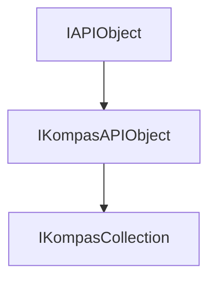

<!-- # **Документация интерфейса IKompasCollection** -->

# **Интерфейс IKompasCollection**

## Иерархия наследования



## Общее описание

Базовый интерфейс для работы с коллекциями объектов в КОМПАС API. Предоставляет унифицированный способ доступа к группам объектов различных типов: документам, слоям, видам, объектам чертежа, моделям и другим коллекциям.

**Основные характеристики:**

- Наследуется от [`IKompasAPIObject`](interface_page_files/IKompasAPIObject.md)
- Является базовым для более чем 30 специализированных интерфейсов коллекций
- Поддерживает итерацию по объектам и получение количества элементов
- Не предоставляет методов для добавления/удаления объектов (это реализуется в потомках)

## Важные примечания

1. **IKompasCollection** - это базовый интерфейс с минимальным набором методов. Конкретные коллекции (например, [`ICircles`](interface_page_files/ICircles.md) добавляют свои методы для создания, удаления и модификации объектов.
2. Метод [`GetObjects()`](#getobjects) возвращает копию массива объектов, что может быть накладно для больших коллекций. Используйте [`GetCount()`](#getcount) + индексный доступ в потомках для оптимизации.

## Получение интерфейса

### Основные способы получения:

1. **Получение наследника интерфейса:**
   - [`IDrawingContainer::GetCircles()`](interface_page_files/ICircles.md) - коллекция окружностей вида

2. **Через QueryInterface:**
   - Приведение от специализированных коллекций к базовому `IKompasCollection`

### Примеры получения:

```cpp
// Пример 1: Получение коллекции документов из приложения
ksapi::IKompasApplicationPtr kompasApp = ...;
ksapi::IDocumentsPtr documents = kompasApp->GetDocuments();
int32_t docCount = documents->GetCount();

// Пример 2: Получение коллекции листов оформления из документа
ksapi::IKompasDocument2DPtr doc2D = ...;
ksapi::ILayoutSheetsPtr layoutSheets = doc2D->GetLayoutSheets();
if (layoutSheets && layoutSheets->GetCount() > 0)
{
    // Работа с листами
}

// Пример 3: Получение коллекции групп чертежа
ksapi::IDrawingGroupsPtr groups = doc2D->GetDrawingGroups();
auto objects = groups->GetObjects();
```

## Дополнительные интерфейсы

Интерфейс `IKompasCollection` является базовым. Ниже перечислены примеры интерфейсов, которые **наследуются** от него:

### Коллекции документов и библиотек:

- **`IDocuments`** - коллекция открытых документов
- **`IInsertsLibraries`** - коллекция библиотек вставок

### Коллекции чертежа (2D):

- **`ILayoutSheets`** - листы оформления
- **`IDrawingObjects`** - объекты чертежа
- **`ILayers`** - слои
- **`ILocalCoordinateSystems2D`** - локальные системы координат

### Коллекции модели (3D):

- **`IModelObjects`** - объекты модели
- **`ILayers3D`** - слои 3D
- **`ILayerGroups3D`** - группы слоев 3D
- **`IManipulators`** - манипуляторы

### Коллекции спецификации:

- **`ISpecificationDescriptions`** - описания спецификации
- **`ISpecificationBaseObjects`** - базовые объекты спецификации

## Методы интерфейса

- [`GetObjects()`](#getobjects) - получить массив объектов коллекции
- [`GetCount()`](#getcount) - получить количество объектов в коллекции

---

### GetObjects()

[К оглавлению](#методы-интерфейса)

**Кратко:** Возвращает массив всех объектов, содержащихся в коллекции.

**Полное описание:**
Метод возвращает копию вектора, содержащего все объекты коллекции. Каждый элемент является указателем типа `IKompasAPIObjectPtr`, который может быть приведен к конкретному типу объекта в зависимости от типа коллекции.

**Синтаксис:**

```cpp
virtual std::vector<IKompasAPIObjectPtr> GetObjects() = 0;
```

**Возвращаемое значение:** Вектор указателей на объекты коллекции. Пустой вектор, если коллекция пуста.

#### **Пример использования**

**Минимальный пример:**

```cpp
// Получение всех документов из приложения
ksapi::IDocumentsPtr documents = kompasApp->GetDocuments();
auto allDocs = documents->GetObjects();
```

**Расширенный пример:**

```cpp
// Итерация по коллекции документов с проверкой типа
ksapi::IDocumentsPtr documents = kompasApp->GetDocuments();
for (const auto& doc : documents->GetObjects())
{
    ksapi::IKompasDocument2DPtr doc2D = doc;
    if (doc2D)
    {
        // Работа с 2D документом
        auto name = doc2D->GetName();
    }
}
```

**Примечания:**

- Метод возвращает **копию** контейнера указателей. Копируются только сами указатели, а не объекты. Поэтому изменение состава или порядка элементов в возвращённом векторе не влияет на коллекцию документа, но изменение свойств объектов по этим указателям отражается в документе после вызова Update(), если этот метод есть.
- Для больших коллекций рекомендуется использовать итераторы или прямой доступ по индексу
- Тип `IKompasAPIObjectPtr` требует приведения к конкретному типу для доступа к специализированным методам

---

### GetCount()

[К оглавлению](#методы-интерфейса)

**Кратко:** Возвращает количество объектов в коллекции.

**Полное описание:**
Метод возвращает целое число, обозначающее количество элементов в коллекции. Позволяет эффективно проверить пустоту коллекции и получить количество элементов для организации циклов.

**Синтаксис:**

```cpp
virtual int32_t GetCount() = 0;
```

**Возвращаемое значение:** Количество объектов в коллекции (>= 0).

#### **Пример использования**

**Минимальный пример:**

```cpp
// Проверка количества документов
ksapi::IDocumentsPtr documents = kompasApp->GetDocuments();
if (documents->GetCount() > 0)
{
    // Есть документы
}
```

**Расширенный пример:**

```cpp
// Итерация по коллекции с использованием GetCount()
ksapi::ILayoutSheetsPtr layoutSheets = document->GetLayoutSheets();
for (int32_t i = 0; i < layoutSheets->GetCount(); i++)
{
    ksapi::ILayoutSheetPtr sheet = layoutSheets->GetLayoutSheet(i);
    if (sheet)
    {
        // Работа с листом
    }
}
```

**Примечания:**

- Более эффективный способ проверки пустоты: `collection->GetCount() == 0`
- Всегда возвращает неотрицательное значение

---

## Частые ошибки

### 1. **Использование GetObjects() в цикле без необходимости**

```cpp
// НЕПРАВИЛЬНО
// Метод GetObjects() создает копию массива на каждой итерации
for (size_t i = 0; i < documents->GetObjects().size(); i++)
{
    // Работа с объектом
}

// ПРАВИЛЬНО
// Используем GetCount() для получения размера
for (int32_t i = 0; i < documents->GetCount(); i++)
{
    auto doc = documents->GetDocument(i);
    // Работа с документом
}
```

### 2. **Отсутствие проверки на nullptr после получения коллекции**

```cpp
// НЕПРАВИЛЬНО
ksapi::ILayoutSheetsPtr layoutSheets = document->GetLayoutSheets();
for (int32_t i = 0; i < layoutSheets->GetCount(); i++)  // Краш если layoutSheets == nullptr
{
    // Работа
}

// ПРАВИЛЬНО
ksapi::ILayoutSheetsPtr layoutSheets = document->GetLayoutSheets();
if (!layoutSheets)
    return;
for (int32_t i = 0; i < layoutSheets->GetCount(); i++)
{
    // Работа
}
```

### 3. **Забытая проверка указателя на объект в цикле**

```cpp
// НЕПРАВИЛЬНО
for (const auto& obj : documents->GetObjects())
{
    obj->SetActive();  // Краш если obj == nullptr
}

// ПРАВИЛЬНО
for (const auto& obj : documents->GetObjects())
{
    if (!obj)
        continue;
    obj->SetActive();
}
```

### 4. **Прямое изменение возвращенного GetObjects() вектора**

```cpp
// НЕПРАВИЛЬНО
auto objects = collection->GetObjects();
objects.clear();  // Не влияет на коллекцию!
objects.push_back(newObj);  // Не добавляет в коллекцию!

// ПРАВИЛЬНО
// Для добавления объектов используйте метод Add() конкретной коллекции
auto newObj = collection->Add();
```

---

## Практические примеры из исходников

### Пример 1: Итерация по коллекции документов

```cpp
// Source/Steps/Step7/Step7.cpp (строки 140-167)
int32_t i = 0;
for (ksapi::IKompasDocument2DPtr document : documents->GetObjects())
{
    if (!document)
        continue;

    document->SetActive();

    ksapi::IDrawingContainerPtr drawingContainer = GetDrawingContainer(*document);

    switch (++i)
    {
        case 1: // В первом документе отрезок
            CreateLineSegment(drawingContainer, 20, 10, 40, 10);
            break;
        case 2: // Во втором документе окружность
            CreateCircle(drawingContainer, 50, 50, 20);
            break;
        case 3: // В третьем документе дуга
            CreateArc(drawingContainer, 50, 50, 20, 45, 135);
            break;
    }
}
```

### Пример 2: Проверка количества элементов

```cpp
// Source/Steps/Step3a/Step3a.cpp (строки 283-285)
ksapi::ILayoutSheetsPtr layoutSheets = document.GetLayoutSheets();
if (!layoutSheets || layoutSheets->GetCount() < 1)
    return;
```

### Пример 3: Получение объектов коллекции для отображения пользователю

```cpp
// Source/Steps/Step7/Step7.cpp (строки 284-288)
ksapi::IDrawingGroupsPtr namedGroups = document.GetNamedGroups();
if (!namedGroups)
    return;
ShowObjectsToUser(document, namedGroups->GetObjects(), L"группы");

kompasApp->ShowMessageBox(std::format(L"count = {}", namedGroups->GetCount()),
                          L"", ksMessageWarning, ksButtonSetOk, true);
```

---

## Шаблоны использования

### Шаблон 1: Безопасная итерация по коллекции

```cpp
// Описание: Итерация по коллекции с проверкой всех указателей
ksapi::IDocumentsPtr documents = kompasApp->GetDocuments();
for (int32_t i = 0; i < documents->GetCount(); i++)
{
    ksapi::IKompasDocumentPtr doc = documents->GetDocument(i);
    if (!doc)
        continue;
    // Работа с документом
}
```

### Шаблон 2: Проверка пустоты коллекции

```cpp
// Описание: Проверка наличия элементов в коллекции перед обработкой
ksapi::ILayoutSheetsPtr sheets = document->GetLayoutSheets();
if (!sheets || sheets->GetCount() == 0)
{
    kompasApp->ShowMessageBox(L"Коллекция пуста", L"", ksMessageWarning, ksButtonSetOk, true);
    return;
}
// Обработка коллекции
```

### Шаблон 3: Поиск объекта по условию

```cpp
// Описание: Поиск конкретного объекта в коллекции
ksapi::ILayoutSheetsPtr sheets = document->GetLayoutSheets();
for (int32_t i = 0; i < sheets->GetCount(); i++)
{
    ksapi::ILayoutSheetPtr sheet = sheets->GetLayoutSheet(i);
    if (!sheet)
        continue;

    if (sheet->GetName() == L"Чертеж1")
    {
        // Найден нужный лист
        break;
    }
}
```
