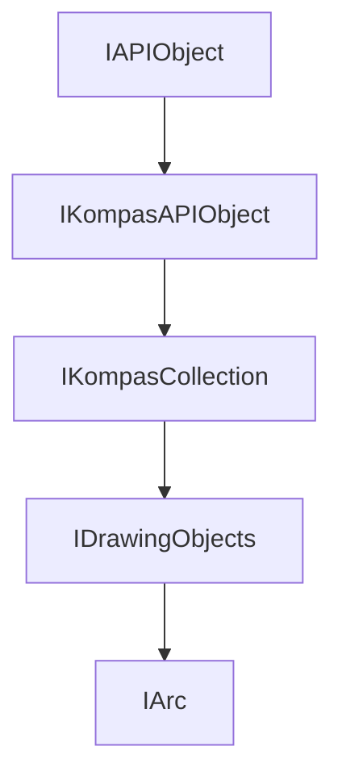

<!-- # **Документация интерфейса КОМПАС API** -->

# **Интерфейс IArc**

## Иерархия наследования



## Общее описание

Интерфейс **`IArc`** представляет дугу в 2D-документе. Дуга является одним из основных графических примитивов, используемых для построения геометрии чертежей, эскизов и контуров. Интерфейс наследует все методы базового интерфейса [`IDrawingObject`](interface_page_files/IDrawingObject.md), включая обязательный вызов [`Update()`](#update) для применения изменений.

Дуги широко используются для создания скруглений, отверстий, элементов механических деталей и архитектурных конструкций.

## Важные примечания

1. **Обязательный вызов Update()** — После установки всех параметров дуги необходимо вызвать метод `Update()`, иначе объект не будет создан в документе.

2. **Проверка указателей** — Всегда проверяйте результат получения интерфейса через SmartPtr. Если указатель пустой (`nullptr`), дальнейшие операции с объектом приведут к ошибке.

3. **Система координат** — Все координаты задаются в текущей системе координат вида.

4. **Направление построения** — Параметр `direction` определяет направление построения дуги между начальной и конечной точками: `true` — по часовой стрелке, `false` — против часовой стрелки.

## Получение интерфейса

### Основные способы получения:

1. **Из коллекции объектов:**
   - [`IArcs::Add()`](IArcs.md) — создание новой дуги в коллекции
   - [`IArcs::GetArc()`](IArcs.md) — получение дуги по индексу

2. **Из контейнера чертежа:**
   - [`IDrawingContainer::GetArcs()`](../IDrawingContainer.md) — получение коллекции дуг из вида/слоя

3. **Приведение типов:**
   - Через `SmartPtr<IArc>` от `IDrawingObjectPtr`

### Примеры получения:

```cpp
// Пример 1: Получение коллекции дуг из активного вида
ksapi::IKompasDocument2DPtr doc2D = kompasApp->GetActiveDocument();
if (ksapi::IViewsAndLayersManagerPtr viewMngr = doc2D->GetViewsAndLayersManager())
{
    if (ksapi::IViewsPtr views = viewMngr->GetViews())
    {
        if (ksapi::IViewPtr activeView = views->GetActiveView())
        {
            ksapi::IDrawingContainer drawingContainer = activeView;
            ksapi::IArcsPtr arcs = drawingContainer->GetArcs();
            ksapi::IArcPtr arc = arcs->Add();
        }
    }
}

// Пример 2: Получение дуги из контейнера по индексу
ksapi::IDrawingContainerPtr drawingContainer = doc2D->GetViewsAndLayersManager()->GetViews()->GetActiveView();
ksapi::IArcsPtr arcs = drawingContainer->GetArcs();
ksapi::IArcPtr arc = arcs->GetArc(0);
```

## Дополнительные интерфейсы

Интерфейс [`IDrawingObject`](IDrawingObject.md) предоставляет следующие методы для работы с дугой:

- `GetLayerNumber()` / `SetLayerNumber()` — работа со слоями
- `GetStyle()` / `SetStyle()` — стиль линии дуги
- `GetCurve2D()` — получение математического представления дуги
- `Delete()` — удаление дуги из документа
- `Update()` — **обязательный вызов** для применения изменений

## Методы интерфейса

### Группа 1: Основные параметры

- [`SetRadius() / GetRadius()`](#setradius--getradius) — радиус дуги
- [`SetDirection() / GetDirection()`](#setdirection--getdirection) — направление построения

### Группа 2: Координаты точек

- [`SetXc() / GetXc()`](#setxc--getxc) — координаты X центра
- [`SetX1() / GetX1()`](#setx1--getx1) — координата X первой точки
- [`SetY1() / GetY1()`](#sety1--gety1) — координата Y первой точки
- [`SetX2() / GetX2()`](#setx2--getx2) — координата X второй точки
- [`SetY2() / GetY2()`](#sety2--gety2) — координата Y второй точки
- [`SetX3() / GetX3()`](#setx3--getx3) — координата X средней точки
- [`SetY3() / GetY3()`](#sety3--gety3) — координата Y средней точки

### Группа 3: Углы

- [`SetAngle1() / GetAngle1()`](#setangle1--getangle1) — угол первой точки
- [`SetAngle2() / GetAngle2()`](#setangle2--getangle2) — угол второй точки

---

### SetRadius / GetRadius

[Группа 1: Основные параметры](#группа-1-основные-параметры) | [К оглавлению](#методы-интерфейса)

**Кратко:** Устанавливает и возвращает радиус дуги в миллиметрах.

**Полное описание:**
Метод `SetRadius()` задаёт радиус дуги. Радиус должен быть положительным значением. При создании дуги через три точки (с использованием `SetX3()`/`SetY3()`) радиус рассчитывается автоматически на основе координат точек.

Метод `GetRadius()` возвращает установленное значение радиуса дуги. Этот метод полезен при редактировании существующей дуги, когда необходимо получить её текущие параметры для отображения пользователю или для дальнейших вычислений.

**Синтаксис:**

```cpp
virtual void SetRadius(double radius) = 0;
virtual double GetRadius() = 0;
```

**Параметры SetRadius:**

- `radius` (in) — радиус дуги в миллиметрах (должен быть > 0)

**Возвращаемое значение GetRadius:**

- `double` — радиус дуги в миллиметрах

#### **Пример использования**

**Минимальный пример:**

```cpp
ksapi::IArcsPtr arcs = drawingContainer->GetArcs();
ksapi::IArcPtr arc = arcs->Add();
arc->SetRadius(50.0);  // Радиус дуги 50 мм
arc->Update();

double radius = arc->GetRadius();
```

**Расширенный пример:**

```cpp
// Создание дуги с заданным радиусом
ksapi::IArcsPtr arcs = drawingContainer->GetArcs();
if (ksapi::IArcPtr arc = arcs->Add())
{
    arc->SetXc(100.0);      // Центр дуги
    arc->SetYc(100.0);
    arc->SetRadius(25.0);    // Радиус 25 мм

    // Углы дуги (в градусах)
    arc->SetAngle1(45.0);   // Начало дуги
    arc->SetAngle2(135.0);  // Конец дуги

    // Направление: false - против часовой стрелки
    arc->SetDirection(false);

    // Применяем изменения
    if (arc->Update())
    {
        // Получение и отображение параметров
        kompasApp->ShowMessageBox(
            std::format(L"xc = {:4.2f}, yc = {:4.2f}, rad = {:4.2f}",
                       arc->GetXc(), arc->GetYc(), arc->GetRadius()),
            L"Параметры дуги", ksMessageWarning, ksButtonSetOk, true);
    }
}
```

**Примечания:**

- Радиус должен быть положительным числом
- Если дуга была создана через три точки, возвращает рассчитанный радиус

---

### SetXc / GetXc / SetYc / GetYc

[Группа 1: Основные параметры](#группа-1-основные-параметры) | [К оглавлению](#методы-интерфейса)

**Кратко:** Устанавливают и возвращают координаты центра дуги.

**Полное описание:**
Методы `SetXc()` и `SetYc()` задают координаты центра дуги в системе координат текущего вида. Центр дуги является ключевым параметром, определяющим положение дуги в пространстве чертежа.

Методы `GetXc()` и `GetYc()` возвращают текущие координаты центра дуги. Используются для получения информации о созданной дуге или при редактировании объекта.

**Синтаксис:**

```cpp
virtual void SetXc(double xc) = 0;
virtual double GetXc() = 0;
virtual void SetYc(double yc) = 0;
virtual double GetYc() = 0;
```

**Параметры SetXc/SetYc:**

- `xc` (in) — координата X центра дуги в миллиметрах
- `yc` (in) — координата Y центра дуги в миллиметрах

**Возвращаемое значение GetXc/GetYc:**

- `double` — координата центра дуги в миллиметрах

#### **Пример использования**

**Расширенный пример:**

```cpp
// Создание дуги с указанием центра
ksapi::IArcsPtr arcs = drawingContainer->GetArcs();
if (ksapi::IArcPtr arc = arcs->Add())
{
    // Задаём центр дуги
    arc->SetXc(50.0);   // Координата X центра
    arc->SetYc(20.0);   // Координата Y центра

    // Задаём остальные параметры
    arc->SetRadius(10.0);
    arc->SetAngle1(0.0);
    arc->SetAngle2(180.0);
    arc->SetDirection(false);

    arc->Update();

    // Получение координат центра
    double xc = arc->GetXc();
    double yc = arc->GetYc();
}
```

**Примечания:**

- Координаты могут быть любыми вещественными числами

---

### SetDirection / GetDirection

[Группа 1: Основные параметры](#группа-1-основные-параметры) | [К оглавлению](#методы-интерфейса)

**Кратко:** Устанавливают и возвращают направление построения дуги.

**Полное описание:**
Метод `SetDirection()` задаёт направление построения дуги между начальной и конечной точками. Параметр `true` означает построение по часовой стрелке, `false` — против часовой стрелки. Это важный параметр, определяющий, какая именно дуга будет построена между двумя точками (их может быть две — малая и большая).

**Синтаксис:**

```cpp
virtual void SetDirection(bool direction) = 0;
virtual bool GetDirection() = 0;
```

**Параметры:**

- `direction` (in) — направление: `true` — по часовой, `false` — против часовой

**Возвращаемое значение:**

- `bool` — текущее направление построения

#### **Пример использования**

```cpp
// Против часовой стрелки (обычное направление)
arc->SetDirection(false);  // false - против часовой стрелки

// По часовой стрелке
arc->SetDirection(true);   // true - по часовой стрелке
```

**Примечания:**

- При одинаковых начальной и конечной точках направление определяет, будет ли создана полная окружность или дуга нулевой длины

---

### SetX1 / GetX1 / SetY1 / GetY1 / SetX2 / GetX2 / SetY2 / GetY2

[Группа 2: Координаты точек](#группа-2-координаты-точек) | [К оглавлению](#методы-интерфейса)

**Кратко:** Устанавливают и возвращают координаты начальной и конечной точек дуги.

**Полное описание:**
Эти методы задают и возвращают координаты первой (начальной) и второй (конечной) точек дуги. Точки определяют границы дуги на окружности. При использовании только Set-методов (без SetX3/SetY3) дуга определяется центром, радиусом и этими двумя точками.

**Синтаксис:**

```cpp
virtual void SetX1(double x1) = 0;
virtual double GetX1() = 0;
virtual void SetY1(double y1) = 0;
virtual double GetY1() = 0;
virtual void SetX2(double x2) = 0;
virtual double GetX2() = 0;
virtual void SetY2(double y2) = 0;
virtual double GetY2() = 0;
```

**Параметры Set-методов:**

- `x1`, `y1` (in) — координаты первой точки в миллиметрах
- `x2`, `y2` (in) — координаты второй точки в миллиметрах

**Возвращаемое значение Get-методов:**

- `double` — координаты точек в миллиметрах

#### **Пример использования**

```cpp
// Создание дуги по координатам точек
ksapi::IArcsPtr arcs = drawingContainer->GetArcs();
if (ksapi::IArcPtr arc = arcs->Add())
{
    arc->SetXc(50.0);     // Центр
    arc->SetYc(40.0);

    // Начальная точка (левая точка дуги)
    arc->SetX1(30.0);
    arc->SetY1(40.0);

    // Конечная точка (правая точка дуги)
    arc->SetX2(70.0);
    arc->SetY2(40.0);

    arc->SetDirection(false);

    arc->Update();

    // Получение координат точек
    double x1 = arc->GetX1();
    double y1 = arc->GetY1();
    double x2 = arc->GetX2();
    double y2 = arc->GetY2();
}
```

---

### SetX3 / GetX3 / SetY3 / GetY3

[Группа 2: Координаты точек](#группа-2-координаты-точек) | [К оглавлению](#методы-интерфейса)

**Кратко:** Устанавливают и возвращают координаты средней точки дуги.

**Полное описание:**
Методы `SetX3()` и `SetY3()` задают координаты промежуточной (средней) точки, через которую должна пройти дуга. Эта точка используется для однозначного определения дуги через три точки. Система автоматически рассчитает радиус дуги на основе всех трёх точек.

**Синтаксис:**

```cpp
virtual void SetX3(double x3) = 0;
virtual double GetX3() = 0;
virtual void SetY3(double y3) = 0;
virtual double GetY3() = 0;
```

**Параметры:**

- `x3`, `y3` (in) — координаты средней точки в миллиметрах

**Возвращаемое значение:**

- `double` — координаты средней точки в миллиметрах

#### **Пример использования**

```cpp
// Создание дуги через три точки (Doc2DDispatcher из Gayka1)
ksapi::IArcsPtr arcs = drawingContainer->GetArcs();
if (ksapi::IArcPtr arc = arcs->Add())
{
    // Задаём три точки дуги
    arc->SetX1(x1);      // Первая точка
    arc->SetY1(y1);
    arc->SetX2(x2);      // Вторая точка
    arc->SetY2(y2);
    arc->SetX3(xMiddle); // Средняя точка
    arc->SetY3(yMiddle);

    arc->Update();
}
```

**Примечания:**

- При задании средней точки радиус рассчитывается автоматически
- Средняя точка должна лежать на дуге между первой и второй точками
- Этот способ удобен для создания дуг с заданной хордой и высотой сегмента

---

### SetAngle1 / GetAngle1 / SetAngle2 / GetAngle2

[Группа 3: Углы](#углы) | [К оглавлению](#методы-интерфейса)

**Кратко:** Устанавливают и возвращают углы начала и конца дуги.

**Полное описание:**
Методы задают углы (в градусах) между осью OX и отрезками, соединяющими центр дуги с начальной (`angle1`) и конечной (`angle2`) точками. Углы отсчитываются против часовой стрелки от положительного направления оси X.

**Синтаксис:**

```cpp
virtual void SetAngle1(double angle1) = 0;
virtual double GetAngle1() = 0;
virtual void SetAngle2(double angle2) = 0;
virtual double GetAngle2() = 0;
```

**Параметры:**

- `angle1` (in) — угол начальной точки в градусах (0-360)
- `angle2` (in) — угол конечной точки в градусах (0-360)

**Возвращаемое значение:**

- `double` — угол в градусах

#### **Пример использования**

```cpp
// Создание дуги от 45° до 135° (верхняя полуокружность)
arc->SetXc(30.0);
arc->SetYc(20.0);
arc->SetRadius(20.0);
arc->SetAngle1(45.0);    // Начало дуги
arc->SetAngle2(135.0);   // Конец дуги
arc->SetDirection(false); // Против часовой стрелки
arc->Update();

double angle1 = arc->GetAngle1();
double angle2 = arc->GetAngle2();

```

**Примечания:**

- Углы задаются в градусах
- При `direction = false` дуга строится против часовой стрелки от angle1 к angle2
- При `direction = true` дуга строится по часовой стрелке

---

## Частые ошибки

### 1. Забывают вызвать Update()

```cpp
// НЕПРАВИЛЬНО
ksapi::IArcPtr arc = arcs->Add();
arc->SetRadius(50.0);
arc->SetXc(100.0);
arc->SetYc(100.0);
// Забыли Update() - дуга не создана!

// ПРАВИЛЬНО
ksapi::IArcPtr arc = arcs->Add();
arc->SetRadius(50.0);
arc->SetXc(100.0);
arc->SetYc(100.0);
arc->Update();  // Обязательный вызов
```

### 2. Не проверяют указатели после получения интерфейса

```cpp
// НЕПРАВИЛЬНО - может привести к краху
ksapi::IArcsPtr arcs = drawingContainer->GetArcs();
ksapi::IArcPtr arc = arcs->GetArc(0);
arc->SetRadius(50.0);  // Если arcs был nullptr - крах!

// ПРАВИЛЬНО - проверяем указатели
ksapi::IArcsPtr arcs = drawingContainer->GetArcs();
if (!arcs)
    return;

ksapi::IArcPtr arc = arcs->GetArc(0);
if (!arc)
    return;

arc->SetRadius(50.0);
arc->Update();
```

### 3. Путаница с направлением дуги

```cpp
// НЕПРАВИЛЬНО - не учитывают направление
// Дуга от (30,40) до (70,40) с центром (50,40) и радиусом 20
arc->SetX1(30.0);  // Первая точка
arc->SetX2(70.0);  // Вторая точка
arc->SetDirection(true);  // По часовой - нижняя дуга!

// ПРАВИЛЬНО - указываем желаемую дугу
arc->SetX1(30.0);   // Первая точка
arc->SetX2(70.0);  // Вторая точка
arc->SetDirection(false);  // Против часовой - верхняя дуга
```

## Практические примеры из исходников

### Пример 1: Создание дуги через три точки (из Gayka1)

```cpp
// Source/Gayka1/Doc2DDispatcher.cpp - Создание дуги по трём точкам
IDrawingContainerPtr drawCont = GetContainer();
ksapi::IArcPtr arc = drawCont->GetArcs()->Add();

// По трём точкам
arc->SetX1(x1);
arc->SetY1(y1);
arc->SetX2(x2);
arc->SetY2(y2);
arc->SetX3(xMiddle);  // Средняя точка определяет дугу
arc->SetY3(yMiddle);
arc->SetStyle(style);
arc->Update();

if (m_filling)
    m_fillingBoundaries.emplace_back(arc);  // Сохраняем для заливки
```

### Пример 2: Создание дуги по центральным углам (из Step3)

```cpp
// Source/Steps/Step3/Step3.cpp - Создание дуги по углам
ksapi::IArcsPtr arcs = drawingContainer->GetArcs();
if (!arcs)
    return;

ksapi::IArcPtr arc = arcs->Add();
if (!arc)
    return;

// Определение параметров дуги
arc->SetXc(30);
arc->SetYc(20);
arc->SetRadius(20);
arc->SetAngle1(45);    // Угол начала
arc->SetAngle2(135);   // Угол конца
arc->SetDirection(false);
arc->SetStyle(ksCSNormal);
arc->Update();
document.DeleteMatrix();

// Вывод параметров созданной дуги
kompasApp->ShowMessageBox(
    std::format(L"xc = {:4.2f}, yc = {:4.2f}, rad = {:4.2f},\nang1 = {:4.2f}, ang2 = {:4.2f}, dir = {}, style = {}",
                arc->GetXc(), arc->GetYc(), arc->GetRadius(),
                arc->GetAngle1(), arc->GetAngle2(),
                arc->GetDirection(), arc->GetStyle()),
    L"", ksMessageWarning, ksButtonSetOk, true);
```

### Пример 3: Создание дуги в контуре (из Step3a)

```cpp
// Source/Steps/Step3a/Step3a.cpp - Дуга в контуре
ksapi::IContourLineSegmentPtr line1 = contour->AddSegment(ksCSLineSeg);
ksapi::IContourArcPtr arc1 = contour->AddSegment(ksCSArc);
if (!line1 || !arc1)
    return;

// Параметры дуги в контуре
arc1->SetXc(50);
arc1->SetYc(20);
arc1->SetRadius(10);
arc1->SetX1(50);
arc1->SetY1(10);
arc1->SetX2(50);
arc1->SetY2(30);
arc1->SetDirection(false);  // Против часовой стрелки

// Создание второй дуги
ksapi::IArcPtr arc2 = CreateArc(document, /*xc*/ 20, /*yc*/ 20, /*r*/ 10,
                                /*x1*/ 20, /*y1*/ 10, /*x2*/ 20, /*y2*/ 30);
if (!arc2 || !line2)
    return;

// Копирование кривых в контур
contour->CopyCurve(line2, /*deleteSource*/ true);
contour->CopyCurve(arc2, /*deleteSource*/ true);
```

---

## Шаблоны использования

### Шаблон 1: Создание дуги по центральным углам

```cpp
// Описание: Создание дуги с заданными центром, радиусом и углами
ksapi::IArcsPtr arcs = drawingContainer->GetArcs();
if (!arcs)
    return nullptr;

ksapi::IArcPtr arc = arcs->Add();
if (!arc)
    return nullptr;

// Обязательные параметры
arc->SetXc(centerX);      // Центр дуги
arc->SetYc(centerY);
arc->SetRadius(radius);   // Радиус

// Углы в градусах (0-360)
arc->SetAngle1(angle1);   // Начало дуги
arc->SetAngle2(angle2);   // Конец дуги
arc->SetDirection(false); // false - против часовой, true - по часовой

// Стиль линии (ksCSNormal, ksCSThin, ksCSUser1, etc.)
arc->SetStyle(ksCSNormal);

// ОБЯЗАТЕЛЬНО: Применяем изменения
if (!arc->Update())
    return nullptr;

return arc;
```

### Шаблон 2: Создание дуги через три точки

```cpp
// Описание: Создание дуги по трём точкам (две конечные и средняя)
ksapi::IArcsPtr arcs = drawingContainer->GetArcs();
if (!arcs)
    return nullptr;

ksapi::IArcPtr arc = arcs->Add();
if (!arc)
    return nullptr;

// Три точки дуги
arc->SetX1(x1);       // Первая точка
arc->SetY1(y1);
arc->SetX2(x2);       // Вторая точка
arc->SetY2(y2);
arc->SetX3(xMiddle);  // Средняя точка (определяет дугу)
arc->SetY3(yMiddle);

arc->SetStyle(style);
arc->Update();

return arc;
```

### Шаблон 3: Редактирование существующей дуги

```cpp
// Описание: Изменение параметров ранее созданной дуги
void EditArc(ksapi::IArcPtr arc, double newRadius)
{
    if (!arc)
        return;

    // Изменяем параметры
    arc->SetRadius(newRadius);
    // Можно изменить и другие параметры:
    // arc->SetXc(newX);
    // arc->SetYc(newY);
    // arc->SetAngle1(newAngle1);
    // arc->SetAngle2(newAngle2);

    // ОБЯЗАТЕЛЬНО: Применяем изменения
    if (arc->Update())
    {
        // Успешно обновлено
    }
}
```

---

## Связанные интерфейсы

### Работа в паре с:

- **`IArcs`** — коллекция дуг, используется для создания новых дуг через метод `Add()`
- **`IDrawingContainer`** — контейнер чертежа, предоставляет доступ к коллекции дуг через `GetArcs()`
- **`ICurve2D`** — математическое представление дуги, получаемое через `GetCurve2D()` для геометрических вычислений
