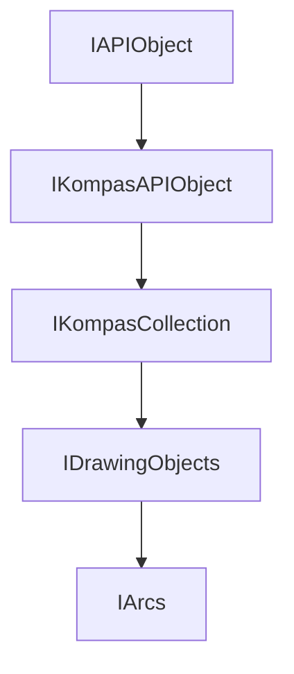

<!-- # **Документация интерфейса КОМПАС API** -->

# **Интерфейс IArcs**

## Иерархия наследования

<style>
.top-parent{
    color: #ffe3d8;
    background: green;
    border: 3px solid #046709;
    border-radius: 4px;
    padding: 5px;
    text-align: center;
    margin-bottom: 5px;
    font-weight: bold;
    width: 40%;
    max-width: 220px;
}

.other-parents{
    color: #ffe3d8;
    background: #4a6fa5;
    border: 3px solid #3d5b87;
    border-radius: 4px;
    padding: 5px;
    text-align: center;
    margin: 5px 10%;
    font-weight: bold;
    width: 40%;
    max-width: 220px;
}

.interface{
    color: #ffe3d8;
    background: #103874;
    border: 3px solid #002152;
    border-radius: 4px;
    padding: 5px;
    text-align: center;
    margin: 5px 10%;
    font-weight: bold;
    width: 40%;
    max-width: 220px;
}
</style>

<div style="padding: 10px; background: #f5f5f5; border-radius: 5px; max-width: auto; margin-bottom: 20px">
<div class="top-parent">IAPIObject</div>

<div style="text-align: left; color:black; margin: 5px 15%;">▼</div>
<div class="other-parents">IKompasAPIObject</div>

<div style="text-align: left; color:black; margin: 5px 25%;">▼</div>
<div class="other-parents">IKompasCollection</div>

<div style="text-align: left; color:black; margin: 5px 35%;">▼</div>
<div class="other-parents">IDrawingObjects</div>

<div style="text-align: left; color:black; margin: 5px 45%;">▼</div>
<div class="interface" style="margin: 5px 30%;">IArcs</div>
</div>



## Общее описание

Интерфейс **IArcs** представляет собой коллекцию дуг окружностей в 2D документах. Этот интерфейс является частью системы управления графическими объектами и предоставляет механизм для создания, хранения и манипуляции дугами в чертежах, фрагментах и других графических контейнерах.

Дуга окружности является фундаментальным геометрическим примитивом, широко используемым в машиностроительном черчении для создания скруглений, фасок, дуговых переходов, круговых элементов и других конструктивных особенностей. Интерфейс IArcs наследуется от [`IDrawingObjects`](IDrawingObjects.md), который в свою очередь наследуется от [`IKompasCollection`](IKompasCollection.md), обеспечивая стандартизированный доступ к коллекциям графических объектов.

Коллекция IArcs работает в тесной связке с интерфейсом [`IArc`](IArc.md), который представляет собой отдельную дугу и предоставляет методы для настройки её параметров: радиуса, центра, углов, направления построения и координат опорных точек.

## Важные примечания

1. **Обязательный вызов Update()**: После создания или модификации дуги необходимо вызывать метод `Update()` интерфейса [`IArc`](IArc.md) для применения изменений и отображения объекта на чертеже. Без вызова `Update()` дуга не будет создана в документе.

2. **Система координат**: Все координаты задаются в локальной системе координат вида. При необходимости работы с системой координат листа используйте соответствующие методы преобразования координат интерфейса `IView`.

3. **Единицы измерения**: Все линейные размеры задаются в миллиметрах (мм), углы — в градусах.

4. **Проверка указателей**: Методы `GetArc()` и `Add()` возвращают `SmartPtr<IArc>`, которые могут быть пустыми. Всегда проверяйте результат перед использованием.

## Получение интерфейса

### Основные способы получения:

1. **Из IDrawingContainer:**
   - [`IDrawingContainer::GetArcs()`](../IDrawingContainer.md#getarcs) - основной способ получения коллекции дуг

### Примеры получения:

```cpp
// Получение из активного вида
ksapi::IViewsPtr views = doc2D->GetViewsAndLayersManager()->GetViews();
ksapi::IViewPtr activeView = views->GetActiveView();
ksapi::IDrawingContainerPtr container = activeView;
ksapi::IArcsPtr arcs = container->GetArcs();
```

## Дополнительные интерфейсы

Интерфейс IArcs связан со следующими интерфейсами:

- **[`IArc`](IArc.md)** - интерфейс отдельной дуги, содержит все методы для настройки параметров дуги
- **[`IDrawingContainer`](IDrawingContainer.md)** - контейнер, предоставляющий доступ к коллекции дуг
- **[`IDrawingObjects`](IDrawingObjects.md)** - базовый интерфейс для коллекций графических объектов
- **[`IKompasCollection`](IKompasCollection.md)** - базовый интерфейс для всех коллекций API

## Методы интерфейса

- [`GetArc()`](#GetArc) - получить дугу по индексу
- [`Add()`](#Add) - создать новую дугу

---

### GetArc()

[К оглавлению](#методы-интерфейса)

**Кратко:** Возвращает дугу по её индексу в коллекции.

**Полное описание:** Метод предоставляет доступ к отдельной дуге по её порядковому номеру в коллекции. Индексы начинаются с 0 и соответствуют порядку создания объектов. Данный метод используется для итерации по существующим дугам, их модификации или получения параметров. Возвращаемый указатель [`IArcPtr`](IArc.md) позволяет работать со всеми свойствами дуги: радиусом, центром, углами и направлением построения.

**Синтаксис:**

```cpp
virtual IArcPtr GetArc(int32_t index) = 0;
```

**Параметры:**

- `index` (in) - индекс дуги в коллекции. Индекс должен быть в диапазоне от 0 до количества дуг минус 1. Используйте метод коллекции [`IKompasCollection`](IKompasCollection.md) для получения количества элементов.

**Возвращаемое значение:** [`IArcPtr`](IArc.md) - указатель на интерфейс дуги. Может быть пустым (null), если индекс выходит за пределы коллекции или дуга была удалена.

#### **Пример использования**

**Минимальный пример:**

```cpp
// Получение дуги по индексу
ksapi::IArcsPtr arcs = container->GetArcs();
ksapi::IArcPtr arc = arcs->GetArc(0);

if (arc)
{
    double radius = arc->GetRadius();
    // Обработка параметров дуги
}
```

**Расширенный пример:**

```cpp
// Итерация по всем дугам и изменение их радиуса
ksapi::IArcsPtr arcs = ...;
int32_t count = arcs->GetCount();

for (int32_t i = 0; i < count; ++i)
{
    ksapi::IArcPtr arc = arcs->GetArc(i);
    if (arc)
    {
        double oldRadius = arc->GetRadius();
        double newRadius = oldRadius * 1.5;
        arc->SetRadius(newRadius);
        arc->Update();
    }
}
```

**Примечания:**

- Индекс дуги остаётся постоянным на протяжении жизни объекта
- Для получения количества элементов используйте `IKompasCollection::GetCount()`

---

### Add()

[К оглавлению](#методы-интерфейса)

**Кратко:** Создаёт новую дугу и добавляет её в коллекцию.

**Полное описание:** Метод создаёт новую дугу окружности с параметрами по умолчанию и добавляет её в коллекцию. После создания дуги необходимо задать её параметры: радиус, центр, углы или координаты точек, а затем вызвать `Update()` для применения изменений. Возвращаемый указатель [`IArcPtr`](IArc.md) предоставляет доступ к методам настройки всех параметров дуги.

**Синтаксис:**

```cpp
virtual IArcPtr Add() = 0;
```

**Возвращаемое значение:** [`IArcPtr`](IArc.md) - указатель на интерфейс созданной дуги. Может быть пустым (null) в случае ошибки создания.

#### **Пример использования**

**Минимальный пример:**

```cpp
// Создание дуги
ksapi::IArcsPtr arcs = container->GetArcs();
ksapi::IArcPtr arc = arcs->Add();

if (arc)
{
    arc->SetXc(100.0);      // Координата X центра
    arc->SetYc(50.0);       // Координата Y центра
    arc->SetRadius(25.0);    // Радиус дуги

    arc->SetAngle1(0.0);    // Начальный угол
    arc->SetAngle2(90.0);   // Конечный угол

    arc->Update();
}
```

**Примечания:**

- После создания дуги необходимо задать хотя бы один из способов определения: через углы или через координаты точек
- Методы `SetAngle1()`/`SetAngle2()` задают углы в градусах относительно оси X
- Методы `SetX1()`/`SetY1()` и `SetX2()`/`SetY2()` задают координаты конечных точек дуги
- Метод `SetX3()`/`SetY3()` задаёт координаты промежуточной точки для определения дуги через три точки
- Метод `SetDirection()` определяет направление построения: `true` - по часовой стрелке, `false` - против часовой стрелки

---

## Частые ошибки

### 1. Забывают вызвать Update()

```cpp
// НЕПРАВИЛЬНО
ksapi::IArcPtr arc = arcs->Add();
arc->SetXc(100);
arc->SetYc(50);
arc->SetAngle1(0.0);    // Начальный угол
arc->SetAngle2(90.0);   // Конечный угол
arc->SetRadius(25);
// Update() не вызван - дуга не создана

// ПРАВИЛЬНО
ksapi::IArcPtr arc = arcs->Add();
if (arc)
{
    arc->SetXc(100);
    arc->SetYc(50);
    arc->SetRadius(25);
    arc->SetAngle1(0.0);    // Начальный угол
    arc->SetAngle2(90.0);   // Конечный угол
    arc->Update();
}
```

### 2. Не проверяют возвращаемый указатель на null

```cpp
// НЕПРАВИЛЬНО
ksapi::IArcPtr arc = arcs->Add();
arc->SetRadius(50);  // segmentation fault, если Add() вернул null

// ПРАВИЛЬНО
ksapi::IArcPtr arc = arcs->Add();
if (arc)
{
    arc->SetRadius(50);
    arc->Update();
}
```

### 3. Неправильное задание углов

```cpp
// НЕПРАВИЛЬНО
// Угол 720 градусов - дуга не будет создана
arc->SetAngle1(0);
arc->SetAngle2(720);  // Ошибка

// ПРАВИЛЬНО
// Углы должны быть в диапазоне [0, 360)
arc->SetAngle1(0);
arc->SetAngle2(90);  // Дуга 90 градусов

// Для создания полной окружности можно:
// 1. Использовать дугу от 0 до 360
arc->SetAngle1(0);
arc->SetAngle2(360);
// 2. Или использовать интерфейс ICircle
```

### 4. Индекс за пределами коллекции

```cpp
// НЕПРАВИЛЬНО
ksapi::IArcsPtr arcs = container->GetArcs();
ksapi::IKompasCollectionPtr collection = arcs;
int32_t count = collection->GetCount();
ksapi::IArcPtr arc = arcs->GetArc(count);  // Индекс == count, за пределами

// ПРАВИЛЬНО
int32_t count = collection->GetCount();
if (count > 0)
{
    ksapi::IArcPtr arc = arcs->GetArc(count - 1);  // Последний элемент
}
```

## Шаблоны использования

### Шаблон 1: Базовый паттерн создания дуги

```cpp
// Универсальный шаблон для создания дуги
bool CreateArc(ksapi::IDrawingContainerPtr container,
               double xc, double yc, double radius,
               double angle1, double angle2,
               bool clockwise)
{
    if (!container)
        return false;

    ksapi::IArcsPtr arcs = container->GetArcs();
    if (!arcs)
        return false;

    ksapi::IArcPtr arc = arcs->Add();
    if (!arc)
        return false;

    arc->SetXc(xc);
    arc->SetYc(yc);
    arc->SetRadius(radius);
    arc->SetAngle1(angle1);
    arc->SetAngle2(angle2);
    arc->SetDirection(clockwise);

    return arc->Update();
}

// Использование
CreateArc(container, 100, 50, 25, 0, 90, false);
```

### Шаблон 2: Паттерн создания дуги по трём точкам

```cpp
// Создание дуги по трём точкам
bool CreateArcBy3Points(ksapi::IDrawingContainerPtr container,
                        double x1, double y1,
                        double x2, double y2,
                        double x3, double y3)
{
    ksapi::IArcsPtr arcs = container->GetArcs();
    if (!arcs)
        return false;

    ksapi::IArcPtr arc = arcs->Add();
    if (!arc)
        return false;

    // Задание координат трёх точек
    arc->SetX1(x1);
    arc->SetY1(y1);
    arc->SetX2(x2);
    arc->SetY2(y2);
    arc->SetX3(x3);  // Средняя точка определяет положение дуги
    arc->SetY3(y3);

    return arc->Update();
}
```

### Шаблон 3: Паттерн итерации по дугам

```cpp
// Обработка всех дуг в контейнере
template<typename Func>
void ForEachArc(ksapi::IDrawingContainerPtr container, Func processor)
{
    ksapi::IArcsPtr arcs = container->GetArcs();
    if (!arcs)
        return;

    ksapi::IKompasCollectionPtr collection = arcs;
    int32_t count = collection->GetCount();

    for (int32_t i = 0; i < count; ++i)
    {
        ksapi::IArcPtr arc = arcs->GetArc(i);
        if (arc)
        {
            processor(arc, i);
        }
    }
}

// Использование - изменение радиуса всех дуг
ForEachArc(container, [](ksapi::IArcPtr arc, int index) {
    double radius = arc->GetRadius();
    arc->SetRadius(radius * 1.1);  // Увеличить на 10%
    arc->Update();
});
```

---

## Связанные интерфейсы

### Работа в паре с:

- **[`IArc`](IArc.md)** - интерфейс отдельной дуги для настройки параметров
- **[`IDrawingContainer`](IDrawingContainer.md)** - контейнер для получения коллекции дуг
