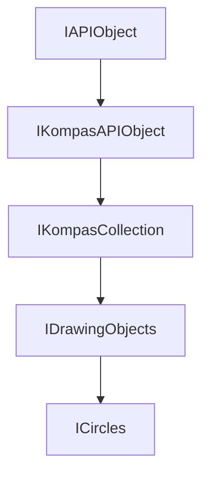

<!-- # **Документация интерфейса КОМПАС API** -->

# **Интерфейс ICircles**

## Иерархия наследования



## Общее описание

Интерфейс `ICircles` представляет собой коллекцию окружностей в 2D документе КОМПАС. Данный интерфейс является частью системы работы с графическими объектами и позволяет создавать новые окружности, получать доступ к существующим окружностям по индексу, а также управлять их свойствами через интерфейс [`ICircle`](ICircle.md).

Окружность является одним из базовых графических примитивов в КОМПАС и широко используется для создания геометрических построений, построения контуров, обозначений (например, для создания штриховок), а также в качестве базовых объектов для различных операций и размеров.

## Важные примечания

1. **Проверка указателей**: Всегда проверяйте результат операций получения коллекции и создания объекта на `nullptr`. SmartPtr автоматически приводится к `false`, если указатель пуст.

2. **Индексация**: Индексы в коллекциях начинаются с 0. При получении окружности по индексу необходимо убедиться, что индекс находится в допустимом диапазоне от 0 до `GetCount() - 1`.

3. **Контекст создания**: Окружности создаются в контексте конкретного вида [`IView`](IView.md). Убедитесь, что работа ведется с нужным видом документа.

## Получение интерфейса

### Основные способы получения:

1. **Из коллекции видов через [`IDrawingContainer`](../IDrawingContainer.md):**
   IDrawingContainer::GetCircles() - получение коллекции окружностей из контейнера чертежа.

### Примеры получения:

```cpp
// Пример 1: Получение из активного вида документа
ksapi::IKompasDocument2DPtr doc2D = kompasApp->GetActiveDocument();
if (ksapi::IViewsAndLayersManagerPtr viewsMngr = doc2D->GetViewsAndLayersManager())
{
    if (ksapi::IViewsPtr views = viewsMngr->GetViews())
    {
        if (ksapi::IViewPtr view = views->GetActiveView())
        {
            ksapi::ICirclesPtr circles = view->GetCircles();
            // Теперь можно работать с коллекцией окружностей
        }
    }
}
```

## Дополнительные интерфейсы

Интерфейс `ICircles` не имеет дополнительных интерфейсов и должен получаться напрямую через соответствующие методы контейнеров.

## Методы интерфейса

### [GetCircle](#getcircle)

**Кратко:** Получить окружность из коллекции по её индексу.

**Полное описание:** Метод возвращает указатель на окружность, находящуюся в коллекции под указанным индексом. Индекс должен быть в диапазоне от 0 до `GetCount() - 1`. Если индекс выходит за пределы допустимого диапазона, метод вернет `nullptr`. Данный метод используется для навигации по существующим окружностям в документе и получения доступа к их свойствам для чтения или модификации.

**Синтаксис:**

```cpp
virtual ICirclePtr GetCircle(int32_t index) = 0;
```

**Параметры:**

- `index` - индекс окружности в коллекции. Нумерация начинается с 0. Используйте `GetCount()` для определения количества элементов.

**Возвращаемое значение:** Указатель на интерфейс `ICircle` или `nullptr`, если индекс некорректен.

#### **Пример использования**

**Минимальный пример:**

```cpp
// Получить первую окружность в коллекции
ksapi::ICirclePtr firstCircle = circles->GetCircle(0);
if (firstCircle)
{
    double radius = firstCircle->GetRadius();
    // Обработка полученного радиуса
}
```

**Расширенный пример:**

```cpp
// Навигация по всем окружностям в документе
void ProcessAllCircles(ksapi::ICirclesPtr circles)
{
    int32_t count = circles->GetCount();
    for (int32_t i = 0; i < count; i++)
    {
        ksapi::ICirclePtr circle = circles->GetCircle(i);
        if (circle)
        {
            double xc = circle->GetXc();
            double yc = circle->GetYc();
            double radius = circle->GetRadius();

            // Вывод информации в лог или отладочное сообщение
            std::cout << "Окружность: центр(" << xc << ", " << yc << "), радиус " << radius << " мм";;
        }
    }
}
```

**Примечания:**

- Всегда проверяйте возвращаемый указатель на `nullptr` перед использованием
- Индекс должен быть меньше значения, возвращаемого `GetCount()`

---

### [Add](#add)

**Кратко:** Создать новую окружность и добавить её в коллекцию.

**Полное описание:** Метод создает новую окружность, добавляет её в коллекцию и возвращает указатель на интерфейс `ICircle` для дальнейшей настройки параметров. После получения указателя необходимо установить параметры окружности (координаты центра, радиус, стиль линии) и вызвать метод `Update()` для применения изменений и создания объекта в документе КОМПАС.

**Синтаксис:**

```cpp
virtual ICirclePtr Add() = 0;
```

**Параметры:** Метод не принимает параметров.

**Возвращаемое значение:** Указатель на интерфейс [`ICircle`](interface_page_files/ICircle.md) созданной окружности или `nullptr` в случае ошибки создания.

#### **Пример использования**

**Минимальный пример:**

```cpp
// Создание простой окружности
ksapi::ICirclePtr circle = circles->Add();
if (circle)
{
    circle->SetXc(100.0);   // Установить координату X центра
    circle->SetYc(100.0);   // Установить координату Y центра
    circle->SetRadius(50.0); // Установить радиус
    circle->Update();        // Обязательный вызов для создания объекта
}
```

**Расширенный пример:**

```cpp
// Функция создания окружности с проверками
ksapi::ICirclePtr CreateCircle(ksapi::ICirclesPtr circles,
                                double xc, double yc, double r)
{
    // Проверка валидности коллекции
    if (!circles)
        return nullptr;

    // Создание окружности
    ksapi::ICirclePtr circle = circles->Add();
    if (!circle)
        return nullptr;

    // Установка параметров
    circle->SetXc(xc);
    circle->SetYc(yc);
    circle->SetRadius(r);

    return circle;
}

// Пример использования функции
void CreateSampleCircles(ksapi::ICirclesPtr circles)
{
    // Создание концентрических окружностей
    CreateCircle(circles, 100.0, 100.0, 30.0);
    CreateCircle(circles, 100.0, 100.0, 50.0);
    CreateCircle(circles, 100.0, 100.0, 70.0);

    // Создание окружностей в разных позициях
    CreateCircle(circles, 200.0, 150.0, 25.0);
    CreateCircle(circles, 250.0, 200.0, 40.0);
}
```

**Практический пример из Source/Steps/Step7/Step7.cpp:**

```cpp
// Полный пример создания окружности с контекстом документа
ksapi::ICirclePtr CreateCircle(ksapi::IDrawingContainerPtr drawingContainer,
                                 double xc, double yc, double r)
{
    // Проверка валидности контейнера
    if (!drawingContainer)
        return nullptr;

    // Получение коллекции окружностей
    ksapi::ICirclesPtr circles = drawingContainer->GetCircles();
    if (!circles)
        return nullptr;

    // Создание новой окружности
    ksapi::ICirclePtr circle = circles->Add();
    if (!circle)
        return nullptr;

    // Установка параметров окружности
    circle->SetXc(xc);
    circle->SetYc(yc);
    circle->SetRadius(r);

    // Применение изменений
    circle->Update();

    return circle;
}

// Использование в контексте документа
void DrawCirclesExample()
{
    ksapi::IKompasDocument2DPtr doc = kompasApp->GetActiveDocument();
    if (doc)
    {
        ksapi::IViewsAndLayersManagerPtr viewsMngr = doc->GetViewsAndLayersManager();
        if (ksapi::IViewsPtr views = viewsMngr->GetViews())
        {
            if (ksapi::IViewPtr view = views->GetActiveView())
            {
                ksapi::ICirclePtr circle = CreateCircle(view, 30, 30, 20);
                // Окружность создана и добавлена в документ
            }
        }
    }
}
```

**Примечания:**

- Всегда вызывайте `Update()` после установки всех параметров
- Проверяйте результат `Add()` на `nullptr`

---

## Частые ошибки

### 1. **Не проверяется SmartPtr на nullptr**

```cpp
// НЕПРАВИЛЬНО - возможен nullptr
ksapi::ICirclesPtr circles = container->GetCircles();
ksapi::ICirclePtr circle = circles->Add();  // circles может быть nullptr
circle->SetXc(100);

// ПРАВИЛЬНО - проверка на каждом этапе
ksapi::ICirclesPtr circles = container->GetCircles();
if (!circles)
    return nullptr;

ksapi::ICirclePtr circle = circles->Add();
if (!circle)
    return nullptr;

circle->SetXc(100);
```

### 2. **Неправильная работа с индексами**

```cpp
// НЕПРАВИЛЬНО - выход за границы массива
ksapi::ICirclePtr circle = circles->GetCircle(circles->GetCount());  // Индекс == count, а должен быть < count

// ПРАВИЛЬНО
int32_t count = circles->GetCount();
for (int32_t i = 0; i < count; i++)  // i < count, а не i <= count
{
    ksapi::ICirclePtr circle = circles->GetCircle(i);
    if (circle)
    {
        // Работа с окружностью
    }
}
```

---

## Шаблоны кода из исходников

### Шаблон 1: Безопасное создание окружности

```cpp
// Универсальная функция создания окружности с проверками
ksapi::ICirclePtr SafeCreateCircle(ksapi::IDrawingContainerPtr container,
                                     double xc, double yc, double r)
{
    auto circles = container->GetCircles();
    if (!circles)
        return nullptr;

    auto circle = circles->Add();
    if (!circle)
        return nullptr;

    circle->SetXc(xc);
    circle->SetYc(yc);
    circle->SetRadius(r);

    if (!circle->Update())
        return nullptr;

    return circle;
}
```

### Шаблон 2: Создание окружности с заданным стилем

```cpp
// Создание окружности с установкой стиля линии
ksapi::ICirclePtr CreateStyledCircle(ksapi::ICirclesPtr circles,
                                     double xc, double yc, double r,
                                     ksCurveStyleEnum style)
{
    ksapi::ICirclePtr circle = circles->Add();
    if (!circle)
        return nullptr;

    circle->SetXc(xc);
    circle->SetYc(yc);
    circle->SetRadius(r);

    // Установка стиля через дополнительный интерфейс
    if (ksapi::ICurveStylePtr curveStyle = circle)
    {
        curveStyle->SetStyle(style);
    }

    circle->Update();
    return circle;
}
```

### Шаблон 3: Поиск окружности по параметрам

```cpp
// Поиск окружности с заданным радиусом
ksapi::ICirclePtr FindCircleByRadius(ksapi::ICirclesPtr circles,
                                     double targetRadius)
{
    int32_t count = circles->GetCount();
    for (int32_t i = 0; i < count; i++)
    {
        ksapi::ICirclePtr circle = circles->GetCircle(i);
        if (circle && fabs(circle->GetRadius() - targetRadius) < 0.001)
        {
            return circle;  // Найдена окружность с нужным радиусом
        }
    }
    return nullptr;  // Не найдена
}
```
