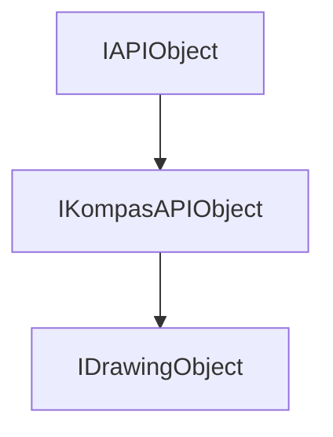

<!-- # **Документация интерфейса КОМПАС API** -->

# **Интерфейс IDrawingObject**

## Иерархия наследования

<style>
.top-parent{
    color: #ffe3d8;
    background: green;
    border: 3px solid #046709;
    border-radius: 4px;
    padding: 5px;
    text-align: center;
    margin-bottom: 5px;
    font-weight: bold;
    width: 40%;
    max-width: 220px;
}

.other-parents{
    color: #ffe3d8;
    background: #4a6fa5;
    border: 3px solid #3d5b87;
    border-radius: 4px;
    padding: 5px;
    text-align: center;
    margin: 5px 10%;
    font-weight: bold;
    width: 40%;
    max-width: 220px;
}

.interface{
    color: #ffe3d8;
    background: #103874;
    border: 3px solid #002152;
    border-radius: 4px;
    padding: 5px;
    text-align: center;
    margin: 5px 10%;
    font-weight: bold;
    width: 40%;
    max-width: 220px;
}
</style>

<div style="padding: 10px; background: #f5f5f5; border-radius: 5px; max-width: auto; margin-bottom: 20px">
<div class="top-parent">IAPIObject</div>

<div style="text-align: left; color:black; margin: 5px 15%;">▼</div>
<div class="other-parents">IKompasAPIObject</div>

<div style="text-align: left; color:black; margin: 5px 25%;">▼</div>
<div class="interface" style="margin: 5px 30%;">IDrawingObject</div>
</div>



## Общее описание

**IDrawingObject** - это базовый интерфейс для всех графических объектов 2D документов КОМПАС. Он предоставляет унифицированный доступ к свойствам и методам любого графического объекта: отрезка, дуги, окружности, штриховки, размера, вида и других.

Интерфейс является фундаментальным для работы с 2D документами, так как все графические объекты (от геометрических примитивов до аннотаций) наследуются от него или реализуют этот интерфейс. Это позволяет выполнять общие операции с любым объектом чертежа: получение типа, слоя, стиля, управление видимостью, параметризацией и другими свойствами.

## Важные примечания

1. **Обязательный вызов Update()** - После изменения любых параметров объекта необходимо вызвать метод `Update()` для применения изменений. Без этого объект останется в неизменном состоянии.

2. **Проверка валидности объекта** - Всегда проверяйте результат `Update()` или используйте `IsValid()` перед дальнейшей работой с объектом.

3. **Управление памятью через SmartPtr** - Интерфейс использует систему умных указателей `SmartPtr<T>`. Не освобождайте память вручную - используйте приведение типов через SmartPtr.

4. **Типы графических объектов** - Метод `GetDrawingObjectType()` возвращает перечисление `DrawingObjectTypeEnum`, которое позволяет определить конкретный тип объекта (отрезок, дуга, окружность и т.д.).

5. **Системы координат** - При работе с координатами учитывайте систему координат вида (СК вида) или листа (СК листа).

## Получение интерфейса

### Основные способы получения:

1. **Из коллекции объектов:**
   - [`IDrawingObjects::GetItem()`](#idrawingobjectsgetitem) - получение по индексу
   - [`IDrawingObjects::GetItemByName()`](#idrawingobjectsgetitembyname) - получение по имени

2. **Из вида (поиск по координатам):**
   - [`IView::FindObject()`](interface_page_files/IView.md#viewfindobject) - поиск объекта в виде по координатам

3. **Из контейнера чертежа:**
   - [`IDrawingContainer::GetObjects()`](interface_page_files/IDrawingContainer.md#getobjects) - получение всех объектов с фильтрацией по типам

### Примеры получения:

```cpp
// Пример 1: Получение объекта из коллекции по индексу
ksapi::IDrawingObjectsPtr objects = drawingContainer->GetObjects();
ksapi::IDrawingObjectPtr obj = objects->GetItem(0);

// Пример 2: Поиск объекта по координатам в виде
ksapi::IViewPtr currentView = views->GetActiveView();
ksapi::IFindObjectParametersPtr params = nullptr;
ksapi::IDrawingObjectPtr obj = currentView->FindObject(x, y, 1e-6, params);

// Пример 3: Получение всех объектов определенного типа
std::vector<int32_t> types = {DrawingObjectTypeEnum::ksAllObj};
std::vector<ksapi::IDrawingObjectPtr> objects = drawingContainer->GetObjects(types);
```

## Дополнительные интерфейсы

Интерфейс `IDrawingObject` является базовым для многих конкретных типов объектов, но не имеет дополнительных интерфейсов, получаемых через QueryInterface.

## Методы интерфейса

### Группа 1: Основные свойства объекта

- [`GetDrawingObjectType()`](#getdrawingobjecttype) - получить тип графического объекта
- [`IsTemp()`](#istemp) - проверить временность объекта
- [`IsValid()`](#isvalid) - проверить валидность объекта
- [`Update()`](#update) - обновить данные объекта
- [`Delete()`](#delete) - удалить объект
- [`GetId()`](#getid) - получить идентификатор объекта
- [`GetView()`](#getview) - получить вид объекта

### Группа 2: Свойства объекта (Get/Set пары)

- [`GetLayerNumber / SetLayerNumber`](#getlayernumber--setlayernumber) - номер слоя
- [`GetStyle / SetStyle`](#getstyle--setstyle) - стиль линии
- [`GetDrawingObjectParamType / SetDrawingObjectParamType`](#getdrawingobjectparamtype--setdrawingobjectparamtype) - тип параметризации
- [`IsTransparentBackground / SetTransparentBackground`](#istransparentbackground--settransparentbackground) - прозрачность фона
- [`IsAutoTransparentBackground / SetAutoTransparentBackground`](#isautotransparentbackground--setautotransparentbackground) - авто-прозрачность
- [`GetLightObjectType / SetLightObjectType`](#getlightobjecttype--setlightobjecttype) - способ подсветки

### Группа 4: Параметризация

- [`GetConstraints()`](#getconstraints) - получить параметрические ограничения
- [`NewConstraint()`](#newconstraint) - создать новое ограничение
- [`DeleteConstraints()`](#deleteconstraints) - удалить все ограничения
- [`Associate()`](#associate) - ассоциировать объект с другими
- [`GetConstraintsState()`](#getconstraintsstate) - получить состояние параметризации

### Группа 5: Типы объектов

- [`IsGeometryObject()`](#isgeometryobject) - принадлежность к геометрическим объектам
- [`IsAnnotativeObject()`](#isannotativeobject) - принадлежность к аннотационным объектам
- [`IsCurve()`](#iscurve) - принадлежность к кривым
- [`IsInAssociationView()`](#isinassociationview) - принадлежность к ассоциативным объектам
- [`IsVisibleInAssociationView()`](#isvisibleinassociationview) - видимость на ассоциативном виде

### Группа 6: Гиперссылки

- [`GetHyperLinkParam()`](#gethyperlinkparam) - получить параметры гиперссылки
- [`DeleteHyperLink()`](#deletehyperlink) - удалить гиперссылку

### Группа 7: Математическое представление

- [`GetCurve2D()`](#getcurve2d) - получить математическую кривую

---

### GetDrawingObjectType

[Основные свойства объекта](#группа-1-основные-свойства-объекта) | [К оглавлению](#методы-интерфейса)

**Кратко:** Возвращает перечисление типа графического объекта для идентификации его конкретного вида.

**Полное описание:** Метод возвращает значение перечисления `DrawingObjectTypeEnum`, которое однозначно определяет тип графического объекта. Это необходимо для приведения указателя к конкретному интерфейсу объекта (ILineSegment, IArc, ICircle и т.д.) и определения его функционального назначения.

**Синтаксис:**

```cpp
virtual DrawingObjectTypeEnum GetDrawingObjectType() = 0;
```

**Параметры:** Метод не имеет параметров.

**Возвращаемое значение:** Значение перечисления `DrawingObjectTypeEnum`, например:

- `ksDrLineSegment` - отрезок
- `ksDrArc` - дуга
- `ksDrCircle` - окружность
- `ksDrHatch` - штриховка
- `ksDrDimension` - размер
- `ksDrView` - вид
- `ksDrMacro` - макрообъект

#### **Пример использования**

**Минимальный пример:**

```cpp
// Определение типа объекта
ksapi::IDrawingObjectPtr obj = ...;
ksapi::DrawingObjectTypeEnum type = obj->GetDrawingObjectType();

if (type == ksapi::DrawingObjectTypeEnum::ksDrLineSegment)
{
    // Приведение к интерфейсу отрезка
    ksapi::ILineSegmentPtr line = obj;
    // Работа с отрезком...
}
```

**Расширенный пример:**

```cpp
// Перебор объектов и определение их типов
std::vector<ksapi::IDrawingObjectPtr> objects = drawingContainer->GetObjects({ksapi::DrawingObjectTypeEnum::ksAllObj});

for (const auto& obj : objects)
{
    ksapi::DrawingObjectTypeEnum type = obj->GetDrawingObjectType();

    switch (type)
    {
        case ksapi::DrawingObjectTypeEnum::ksDrLineSegment:
            // Обработка отрезков
            break;
        case ksapi::DrawingObjectTypeEnum::ksDrArc:
            // Обработка дуг
            break;
        case ksapi::DrawingObjectTypeEnum::ksDrCircle:
            // Обработка окружностей
            break;
        case ksapi::DrawingObjectTypeEnum::ksDrHatch:
            // Обработка штриховок
            break;
        default:
            // Обработка остальных типов
            break;
    }
}
```

**Примечания:**

- Тип объекта нельзя изменить после создания
- Для безопасного приведения используйте проверку через SmartPtr

---

### GetLayerNumber / SetLayerNumber

[Свойства объекта (Get/Set пары)](#группа-2-свойства-объекта-getset-пары) | [К оглавлению](#методы-интерфейса)

**Кратко:** Получить и установить номер слоя, на котором расположен объект.

**Полное описание:**
Методы `GetLayerNumber()` и `SetLayerNumber()` позволяют получить и изменить слой размещения объекта. Слои используются для организации объектов чертежа и управления их видимостью и доступностью для редактирования. Для вида метод возвращает номер активного слоя вида.

**Синтаксис:**

```cpp
virtual int32_t GetLayerNumber() = 0;
virtual void SetLayerNumber(int32_t layerNumber) = 0;
```

**Параметры SetLayerNumber:**

- `layerNumber` (in) - номер целевого слоя

**Возвращаемое значение GetLayerNumber:** Номер слоя (int32_t), на котором расположен объект.

#### **Пример использования**

**Минимальный пример:**

```cpp
// Получение номера слоя объекта
int32_t layerNumber = obj->GetLayerNumber();

// Перемещение объекта на слой 2
obj->SetLayerNumber(2);
obj->Update();
```

**Расширенный пример:**

```cpp
// Группировка объектов по слоям
std::map<int32_t, std::vector<ksapi::IDrawingObjectPtr>> objectsByLayer;

for (const auto& obj : objects)
{
    int32_t layerNum = obj->GetLayerNumber();
    objectsByLayer[layerNum].push_back(obj);
}

// Перемещение выбранных объектов на новый слой
int32_t newLayer = 3;
for (const auto& selectedObj : selectedObjects)
{
    selectedObj->SetLayerNumber(newLayer);
    if (!selectedObj->Update())
    {
        // Обработка ошибки
    }
}
```

**Примечания:**

- Слои нумеруются с 0 или 1 в зависимости от настроек документа
- Обязательно вызывайте `Update()` после изменения слоя

---

### IsTemp

[Основные свойства объекта](#группа-1-основные-свойства-объекта) | [К оглавлению](#методы-интерфейса)

**Кратко:** Проверяет, является ли объект временным.

**Полное описание:** Временные объекты создаются во время интерактивного редактирования чертежа (например, при перетаскивании,-preview операций). Они не сохраняются в документе и автоматически удаляются при завершении операции.

**Синтаксис:**

```cpp
virtual bool IsTemp() = 0;
```

**Параметры:** Метод не имеет параметров.

**Возвращаемое значение:** true - объект временный, false - постоянный объект.

#### **Пример использования**

```cpp
// Фильтрация только постоянных объектов
std::vector<ksapi::IDrawingObjectPtr> permanentObjects;

for (const auto& obj : allObjects)
{
    if (!obj->IsTemp())
    {
        permanentObjects.push_back(obj);
    }
}
```

**Примечания:**

- Временные объекты не имеют идентификатора (GetId() может вернуть 0)
- Не пытайтесь сохранять или кэшировать временные объекты

---

### IsValid

[Основные свойства объекта](#группа-1-основные-свойства-объекта) | [К оглавлению](#методы-интерфейса)

**Кратко:** Проверяет корректность и невырожденность объекта.

**Полное описание:** Метод позволяет определить, является ли объект корректным (не вырожденным, полностью определенным). Объект может стать невалидным после некорректного редактирования или при нарушении параметрических связей.

**Синтаксис:**

```cpp
virtual bool IsValid() = 0;
```

**Параметры:** Метод не имеет параметров.

**Возвращаемое значение:** true - объект корректен, false - объект вырожден или некорректен.

#### **Пример использования**

**Минимальный пример:**

```cpp
// Проверка валидности после редактирования
obj->SetX1(10);
obj->SetY1(20);
if (!obj->Update())
{
    // Объект стал некорректным
}
```

**Расширенный пример:**

```cpp
// Проверка всех объектов перед сохранением
std::vector<ksapi::IDrawingObjectPtr> invalidObjects;

for (const auto& obj : drawingObjects)
{
    if (!obj->IsValid())
    {
        invalidObjects.push_back(obj);
    }
}

if (!invalidObjects.empty())
{
    kompasApp->ShowMessageBox(L"Предупреждение",
                              L"Обнаружено некорректных объектов: " + std::to_wstring(invalidObjects.size()),
                              ksapi::ksMessageWarning, ksapi::ksButtonSetOk, true);
}
```

**Примечания:**

- Всегда проверяйте `IsValid()` или результат `Update()` после изменения объекта
- Невалидные объекты могут быть восстановлены через параметрические связи

---

### Update

[Основные свойства объекта](#группа-1-основные-свойства-объекта) | [К оглавлению](#методы-интерфейса)

**Кратко:** Применяет изменения параметров объекта и проверяет его корректность.

**Полное описание:** Метод является критически важным для работы с объектами. После изменения любых свойств объекта (координат, стиля, слоя и т.д.) необходимо вызвать `Update()`, чтобы:

1. Пересчитать внутренние данные объекта
2. Проверить корректность всех параметров
3. Обновить отображение в документе

**Синтаксис:**

```cpp
virtual bool Update() = 0;
```

**Параметры:** Метод не имеет параметров.

**Возвращаемое значение:** true - объект корректен и обновлен успешно, false - объект невалиден.

#### **Пример использования**

**Минимальный пример:**

```cpp
// Создание отрезка с обязательным Update
ksapi::ILineSegmentPtr line = lineSegments->Add();
line->SetX1(0);
line->SetY1(0);
line->SetX2(100);
line->SetY2(100);
line->SetStyle(1);

if (line->Update())
{
    // Отрезок создан корректно
}
```

**Расширенный пример:**

```cpp
// Пакетное создание объектов с проверкой
std::vector<ksapi::IDrawingObjectPtr> createdObjects;

for (int i = 0; i < 10; i++)
{
    ksapi::ILineSegmentPtr line = lineSegments->Add();
    line->SetX1(i * 10);
    line->SetY1(0);
    line->SetX2(i * 10 + 5);
    line->SetY2(50);
    line->SetStyle(1);

    if (line->Update())
    {
        createdObjects.push_back(line);
    }
    else
    {
        kompasApp->ShowMessageBox(L"Ошибка",
                                  L"Не удалось создать отрезок " + std::to_wstring(i),
                                  ksapi::ksMessageError, ksapi::ksButtonSetOk, true);
    }
}
```

**Примечания:**

- Всегда вызывайте Update() после изменения параметров
- Если Update() вернул false, объект находится в некорректном состоянии

---

### Delete

[Основные свойства объекта](#группа-1-основные-свойства-объекта) | [К оглавлению](#методы-интерфейса)

**Кратко:** Удаляет объект из документа.

**Полное описание:** Метод удаляет объект из чертежа. После удаления указатель на объект становится невалидным, и любая попытка его использования приведет к ошибке. Для сложных объектов (макрообъекты, виды) удаление может включать вложенные объекты.

**Синтаксис:**

```cpp
virtual bool Delete() = 0;
```

**Параметры:** Метод не имеет параметров.

**Возвращаемое значение:** true - объект успешно удален, false - удаление не выполнено.

#### **Пример использования**

**Минимальный пример:**

```cpp
// Удаление объекта
if (obj->Delete())
{
    // Объект удален
}
```

**Расширенный пример:**

```cpp
// Удаление объектов определенного типа
std::vector<ksapi::IDrawingObjectPtr> objectsToDelete;

for (const auto& obj : allObjects)
{
    if (obj->GetDrawingObjectType() == ksapi::DrawingObjectTypeEnum::ksDrHatch)
    {
        objectsToDelete.push_back(obj);
    }
}

// Удаление с проверкой
for (const auto& obj : objectsToDelete)
{
    if (!obj->Delete())
    {
        // Логирование ошибки
        kompasApp->ShowMessageBox(L"Ошибка удаления",
                                  L"Не удалось удалить объект типа " +
                                  std::to_wstring(static_cast<int>(obj->GetDrawingObjectType())),
                                  ksapi::ksMessageError, ksapi::ksButtonSetOk, true);
    }
}
```

**Примечания:**

- Удаленный объект нельзя восстановить без Undo
- При удалении связанных объектов (размеры, штриховки) проверяйте зависимости

---

### GetId

[Основные свойства объекта](#группа-1-основные-свойства-объекта) | [К оглавлению](#методы-интерфейса)

**Кратко:** Возвращает уникальный идентификатор объекта в документе.

**Полное описание:** Метод возвращает 64-битный уникальный идентификатор объекта, который остается постоянным в течение жизни объекта в документе. Этот идентификатор можно использовать для поиска объекта и отслеживания изменений.

**Синтаксис:**

```cpp
virtual int64_t GetId() = 0;
```

**Параметры:** Метод не имеет параметров.

**Возвращаемое значение:** Уникальный идентификатор объекта (int64_t).

#### **Пример использования**

```cpp
// Сохранение идентификаторов объектов для последующего поиска
std::map<int64_t, ksapi::IDrawingObjectPtr> objectMap;

for (const auto& obj : objects)
{
    int64_t id = obj->GetId();
    objectMap[id] = obj;
}

// Поиск объекта по ID
int64_t searchId = ...;
auto it = objectMap.find(searchId);
if (it != objectMap.end())
{
    ksapi::IDrawingObjectPtr found = it->second;
    // Работа с найденным объектом
}

// Вывод информации об объекте
void PrintObjectInfo(ksapi::IDrawingObjectPtr obj)
{
    int64_t id = obj->GetId();
    kompasApp->ShowMessageBox(L"ID",
                            L"Не удалось удалить объект типа " +
                            std::to_wstring(static_cast<int>(id)),
                            ksapi::ksMessageInformation, ksapi::ksButtonSetOk, true);
}
```

**Примечания:**

- ID остается постоянным до удаления объекта
- ID можно использовать для сериализации и хранения ссылок на объекты

---

### GetView

[Основные свойства объекта](#группа-1-основные-свойства-объекта) | [К оглавлению](#методы-интерфейса)

**Кратко:** Возвращает вид, которому принадлежит объект.

**Полное описание:** Метод позволяет получить указатель на вид (IView), содержащий данный объект. Это полезно для определения контекста объекта и выполнения операций на уровне вида.

**Синтаксис:**

```cpp
virtual IViewPtr GetView() = 0;
```

**Параметры:** Метод не имеет параметров.

**Возвращаемое значение:** Указатель на интерфейс `IView` вида.

#### **Пример использования**

```cpp
// Получение вида объекта и его параметров
ksapi::IDrawingObjectPtr obj = ...;
ksapi::IViewPtr view = obj->GetView();

if (view)
{
    std::wstring viewName = view->GetName();
    double scale = view->GetScale();
    // Работа с видом
}
```

**Примечания:**

- Всегда проверяйте возвращаемый указатель на nullptr

---

### GetStyle / SetStyle

[Свойства объекта (Get/Set пары)](#группа-2-свойства-объекта-getset-пары) | [К оглавлению](#методы-интерфейса)

**Кратко:** Получить и установить стиль линии/текста/штриховки объекта.

**Полное описание:**
Методы `GetStyle()` и `SetStyle()` позволяют получить и изменить стиль отображения объекта. Стиль определяет внешний вид объекта: тип линии (основная, тонкая, осевая), параметры штриховки или характеристики текста.

**Синтаксис:**

```cpp
virtual int32_t GetStyle() = 0;
virtual void SetStyle(int32_t style) = 0;
```

**Параметры SetStyle:**

- `style` (in) - идентификатор нового стиля

**Возвращаемое значение GetStyle:** Идентификатор стиля (int32_t).

#### **Пример использования**

**Минимальный пример:**

```cpp
// Получение текущего стиля
int32_t currentStyle = obj->GetStyle();

// Установка стиля линии
obj->SetStyle(2);
obj->Update();
```

**Расширенный пример:**

```cpp
// Изменение стиля объекта
int32_t newStyle = 2;
obj->SetStyle(newStyle);
if (obj->Update())
{
    // Стиль применен успешно
}
```

**Примечания:**

- Стили задаются в системных таблицах КОМПАС
- Обязательно вызывайте `Update()` после изменения стиля

---

### GetDrawingObjectParamType / SetDrawingObjectParamType

[Свойства объекта (Get/Set пары)](#группа-2-свойства-объекта-getset-пары) | [К оглавлению](#методы-интерфейса)

**Кратко:** Получить и установить тип параметризации объекта.

**Полное описание:**
Методы `GetDrawingObjectParamType()` и `SetDrawingObjectParamType()` позволяют установить и получить тип используемой матрицы для пересчета параметров объектов. От матрицы зависят возвращаемые значения координат, углов и скалярных величин размеров, например, радиус, высота, длина..

**Синтаксис:**

```cpp
virtual ksDrawingObjectParamTypeEnum GetDrawingObjectParamType() = 0;
virtual void SetDrawingObjectParamType(ksDrawingObjectParamTypeEnum paramType) = 0;
```

**Параметры SetDrawingObjectParamType:**

- `paramType` (in) - тип параметризации

**Возвращаемое значение GetDrawingObjectParamType:** Значение перечисления `ksDrawingObjectParamTypeEnum`.

#### **Пример использования**

```cpp
// Получение типа параметризации
ksapi::ksDrawingObjectParamTypeEnum paramType = obj->GetDrawingObjectParamType();

switch (paramType)
{
    case ksapi::ksDrawingObjectParamTypeEnum::ksSheetAllParam:
        // Все параметры объекта в СК листа
        break;
    case ksapi::ksDrawingObjectParamTypeEnum::ksViewAllParam:
        // Все параметры объекта в СК вида
        break;
}

// Изменение типа параметризации
obj->SetDrawingObjectParamType(ksDrawingObjectParamTypeEnum::ksViewAllParam);
obj->Update();
```

---

### GetConstraints

[Параметризация](#группа-3-параметризация) | [К оглавлению](#методы-интерфейса)

**Кратко:** Возвращает массив параметрических ограничений объекта.

**Полное описание:** Метод позволяет получить все параметрические ограничения, связанные с объектом. Ограничения определяют связи объекта с другими объектами или фиксацию его положения.

**Синтаксис:**

```cpp
virtual std::vector<IParametricConstraintPtr> GetConstraints() = 0;
```

**Параметры:** Метод не имеет параметров.

**Возвращаемое значение:** Вектор указателей на интерфейсы `IParametricConstraint`.

#### **Пример использования**

```cpp
// Получение ограничений объекта
auto constraints = obj->GetConstraints();

for (const auto& constraint : constraints)
{
    ksapi::ksConstraintTypeEnum type = constraint->GetConstraintType();
    // Обработка ограничения
}
```

---

### NewConstraint

[Параметризация](#группа-3-параметризация) | [К оглавлению](#методы-интерфейса)

**Кратко:** Создает новое параметрическое ограничение для объекта.

**Полное описание:** Метод создает пустое ограничение, которое затем необходимо настроить и привязать к другим объектам.

**Синтаксис:**

```cpp
virtual IParametricConstraintPtr NewConstraint() = 0;
```

**Параметры:** Метод не имеет параметров.

**Возвращаемое значение:** Указатель на новый интерфейс `IParametricConstraint`.

---

### DeleteConstraints

[Параметризация](#группа-3-параметризация) | [К оглавлению](#методы-интерфейса)

**Кратко:** Удаляет все параметрические ограничения объекта.

**Полное описание:** Метод отсоединяет объект от всех параметрических связей, делая его независимым. Полезно при необходимости "освободить" объект от параметрических зависимостей.

**Синтаксис:**

```cpp
virtual bool DeleteConstraints() = 0;
```

**Параметры:** Метод не имеет параметров.

**Возвращаемое значение:** true - ограничения успешно удалены.

#### **Пример использования**

```cpp
// Удаление всех ограничений объекта перед свободным перемещением
if (obj->DeleteConstraints())
{
    // Объект теперь можно свободно перемещать
}
```

---

### Associate

[Параметризация](#группа-3-параметризация) | [К оглавлению](#методы-интерфейса)

**Кратко:** Ассоциирует объект с другими объектами для параметрических связей.

**Полное описание:** Метод устанавливает параметрические связи между объектом и другими графическими объектами для создания ассоциативных зависимостей.

**Синтаксис:**

```cpp
virtual bool Associate() = 0;
```

**Параметры:** Метод не имеет параметров.

**Возвращаемое значение:** true - ассоциация установлена успешно.

```cpp

if (obj->Associate())
{
    // ассоциация установлена успешно
}
```

---

### GetConstraintsState

[Параметризация](#группа-3-параметризация) | [К оглавлению](#методы-интерфейса)

**Кратко:** Возвращает состояние параметрических ограничений объекта.

**Полное описание:** Метод позволяет определить текущее состояние параметризации объекта: полностью определен, недоопределен или переопределен.

**Синтаксис:**

```cpp
virtual ksObjectConstraintsStateEnum GetConstraintsState() = 0;
```

**Параметры:** Метод не имеет параметров.

**Возвращаемое значение:** Значение перечисления `ksObjectConstraintsStateEnum`.

#### **Пример использования**

```cpp
ksapi::ksObjectConstraintsStateEnum state = obj->GetConstraintsState();

switch (state)
{
    case ksapi::ksObjectConstraintsStateEnum::ksObjectStateUnknown:
        // Обычный не параметризованный объект
        break;
    case ksapi::ksObjectConstraintsStateEnum::ksObjectStateFullDefined:
        // Полностью определенный объект
        break;
    case ksapi::ksObjectConstraintsStateEnum::ksObjectStateOverDefined:
        // Переопределённый объект(размер)
        break;
}
```

---

### IsGeometryObject

[Типы объектов](#группа-4-типы-объектов) | [К оглавлению](#методы-интерфейса)

**Кратко:** Проверяет принадлежность объекта к геометрическим примитивам.

**Полное описание:** Метод определяет, является ли объект геометрическим примитивом (отрезок, дуга, окружность, кривая и т.д.), в отличие от аннотационных объектов (размеры, тексты, линии-выноски).

**Синтаксис:**

```cpp
virtual bool IsGeometryObject() = 0;
```

**Параметры:** Метод не имеет параметров.

**Возвращаемое значение:** true - объект геометрический.

#### **Пример использования**

```cpp
// Фильтрация только геометрических объектов
std::vector<ksapi::IDrawingObjectPtr> geometryObjects;

for (const auto& obj : allObjects)
{
    if (obj->IsGeometryObject())
    {
        geometryObjects.push_back(obj);
    }
}
```

---

### IsAnnotativeObject

[Типы объектов](#группа-4-типы-объектов) | [К оглавлению](#методы-интерфейса)

**Кратко:** Проверяет принадлежность объекта к аннотационным объектам.

**Полное описание:** Метод определяет, является ли объект аннотацией (размер, текст, линия-выноска, обозначение и т.д.).

**Синтаксис:**

```cpp
virtual bool IsAnnotativeObject() = 0;
```

**Параметры:** Метод не имеет параметров.

**Возвращаемое значение:** true - объект аннотационный.

---

### IsCurve

[Типы объектов](#группа-4-типы-объектов) | [К оглавлению](#методы-интерфейса)

**Кратко:** Проверяет, является ли объект кривой.

**Полное описание:** Метод позволяет определить, является ли объект кривой линией, для которой можно получить математическое представление (ICurve2D).

**Синтаксис:**

```cpp
virtual bool IsCurve() = 0;
```

**Параметры:** Метод не имеет параметров.

**Возвращаемое значение:** true - объект является кривой.

#### **Пример использования**

```cpp
// Выбор только кривых для построения штриховки
while (ksapi::IDrawingObjectPtr selected = SelectObject(document))
{
    if (!selected->IsCurve())
    {
        kompasApp->ShowMessageBox(L"Ошибка", L"Укажите кривую (отрезок, дугу, окружность)",
                                  ksapi::ksMessageWarning, ksapi::ksButtonSetOk, true);
        continue;
    }

    // Добавление кривой в массив границ штриховки
    boundaries.push_back(selected);
}
```

---

### IsInAssociationView

[Типы объектов](#группа-4-типы-объектов) | [К оглавлению](#методы-интерфейса)

**Кратко:** Проверяет принадлежность объекта к ассоциативному виду.

**Полное описание:** Метод определяет, является ли объект частью ассоциативного вида (проекционного вида, разреза, сечения).

**Синтаксис:**

```cpp
virtual bool IsInAssociationView() = 0;
```

**Параметры:** Метод не имеет параметров.

**Возвращаемое значение:** true - объект в ассоциативном виде.

---

### IsVisibleInAssociationView

[Типы объектов](#группа-4-типы-объектов) | [К оглавлению](#методы-интерфейса)

**Кратко:** Проверяет видимость объекта на ассоциативном виде.

**Полное описание:** Метод возвращает признак видимости объекта в контексте ассоциативного вида. Объект может быть частью вида, но скрыт настройками видимости.

**Синтаксис:**

```cpp
virtual bool IsVisibleInAssociationView() = 0;
```

**Параметры:** Метод не имеет параметров.

**Возвращаемое значение:** true - объект видим на ассоциативном виде.

---

### IsTransparentBackground / SetTransparentBackground

[Свойства объекта (Get/Set пары)](#группа-2-свойства-объекта-getset-пары) | [К оглавлению](#методы-интерфейса)

**Кратко:** Получить и установить режим прозрачности фона для аннотационных объектов.

**Полное описание:**
Методы `IsTransparentBackground()` и `SetTransparentBackground()` позволяют получить и изменить режим отрисовки фона под аннотационными объектами (размеры, тексты). Прозрачный фон не очищает область под объектом.

**Синтаксис:**

```cpp
virtual bool IsTransparentBackground() = 0;
virtual void SetTransparentBackground(bool transparentBackground) = 0;
```

**Параметры SetTransparentBackground:**

- `transparentBackground` (in) - true для прозрачного фона

**Возвращаемое значение IsTransparentBackground:** true - прозрачный фон включен.

#### **Пример использования**

```cpp
// Получение текущего режима
bool isTransparent = obj->IsTransparentBackground();

// Установка прозрачного фона для текста
textObj->SetTransparentBackground(true);
textObj->Update();
```

**Примечания:**

- Применяется к аннотационным объектам (тексты, размеры)
- Обязательно вызывайте `Update()` после изменения

---

### IsAutoTransparentBackground / SetAutoTransparentBackground

[Свойства объекта (Get/Set пары)](#группа-2-свойства-объекта-getset-пары) | [К оглавлению](#методы-интерфейса)

**Кратко:** Получить и установить режим авто-прозрачности фона из настроек документа.

**Полное описание:**
Методы `IsAutoTransparentBackground()` и `SetAutoTransparentBackground()` позволяют получить и изменить режим управления прозрачностью фона. Если авто-режим включен, прозрачность определяется настройками документа.

**Синтаксис:**

```cpp
virtual bool IsAutoTransparentBackground() = 0;
virtual void SetAutoTransparentBackground(bool autoTransparentBackground) = 0;
```

**Параметры SetAutoTransparentBackground:**

- `autoTransparentBackground` (in) - true для авто-режима

**Возвращаемое значение IsAutoTransparentBackground:** true - используется авто-режим.

#### **Пример использования**

```cpp
// Получение режима
bool isAuto = obj->IsAutoTransparentBackground();

// Включение авто-режима
obj->SetAutoTransparentBackground(true);
obj->Update();
```

**Примечания:**

- Авто-режим использует настройки документа
- Отключение авто-режима позволяет задать прозрачность явно

---

### GetLightObjectType / SetLightObjectType

[Свойства объекта (Get/Set пары)](#группа-2-свойства-объекта-getset-пары) | [К оглавлению](#методы-интерфейса)

**Кратко:** Получить и установить способ подсветки объекта (цветом выделения или цветом выбора).

**Полное описание:**
Методы `GetLightObjectType()` и `SetLightObjectType()` позволяют получить и изменить режим визуальной подсветки объекта при его выделении или выборе.

**Синтаксис:**

```cpp
virtual ksLightObjectTypeEnum GetLightObjectType() = 0;
virtual void SetLightObjectType(ksLightObjectTypeEnum lightObjectType) = 0;
```

**Параметры SetLightObjectType:**

- `lightObjectType` (in) - тип подсветки

**Возвращаемое значение GetLightObjectType:** Значение перечисления `ksLightObjectTypeEnum`.

#### **Пример использования**

```cpp
// Получение типа подсветки
ksapi::ksLightObjectTypeEnum lightType = obj->GetLightObjectType();

// Установка типа подсветки
obj->SetLightObjectType(ksapi::ksLightObjectTypeEnum::ksSelectObject);
obj->Update();
```

**Примечания:**

- Определяет визуальное поведение при выделении объекта
- Обязательно вызывайте `Update()` после изменения

---

### GetHyperLinkParam

[Гиперссылки](#группа-6-гиперссылки) | [К оглавлению](#методы-интерфейса)

**Кратко:** Возвращает параметры гиперссылки объекта.

**Полное описание:** Метод позволяет получить информацию о гиперссылке объекта: тип ссылки, связанный объект и уровень вложенности.

**Синтаксис:**

```cpp
virtual std::wstring GetHyperLinkParam(ksHyperLinkTypeEnum & hyperLinkType, IDrawingObjectPtr & linkObject,
                                       int32_t & level) = 0;
```

**Параметры:**

- `hyperLinkType` (out) - тип гиперссылки
- `linkObject` (out) - связанный объект
- `level` (out) - уровень вложенности

**Возвращаемое значение:** Строка с параметрами гиперссылки.

---

### DeleteHyperLink

[Гиперссылки](#группа-6-гиперссылки) | [К оглавлению](#методы-интерфейса)

**Кратко:** Удаляет гиперссылку с объекта.

**Полное описание:** Метод отсоединяет гиперссылку от объекта, не удаляя сам объект.

**Синтаксис:**

```cpp
virtual bool DeleteHyperLink() = 0;
```

**Параметры:** Метод не имеет параметров.

**Возвращаемое значение:** true - гиперссылка удалена успешно.

---

### GetCurve2D

[Математическое представление](#группа-7-математическое-предедставление) | [К оглавлению](#методы-интерфейса)

**Кратко:** Возвращает математическое представление кривой объекта.

**Полное описание:** Метод предоставляет доступ к математическому представлению объекта как геометрической кривой (интерфейс ICurve2D). Это позволяет выполнять геометрические операции: поиск пересечений, построение касательных, проецирование точек и другие.

**Синтаксис:**

```cpp
virtual ICurve2DPtr GetCurve2D() = 0;
```

**Параметры:** Метод не имеет параметров.

**Возвращаемое значение:** Указатель на интерфейс ICurve2D или nullptr, если объект не является кривой.

#### **Пример использования**

**Минимальный пример:**

```cpp
// Получение математической кривой объекта
ksapi::ICurve2DPtr curve = obj->GetCurve2D();
if (curve)
{
    // Работа с математическим представлением
}
```

**Расширенный пример:**

```cpp
// Поиск пересечения двух объектов
ksapi::IDrawingObjectPtr obj1 = ...;
ksapi::IDrawingObjectPtr obj2 = ...;

ksapi::ICurve2DPtr curve1 = obj1->GetCurve2D();
ksapi::ICurve2DPtr curve2 = obj2->GetCurve2D();

if (curve1 && curve2)
{
    // Получение точек пересечения
    std::vector<double> intersectionPoints = curve1->Intersect(curve2);

    // Вывод точек пересечения
    for (size_t i = 0; i < intersectionPoints.size(); i += 2)
    {
        std::wcout << L"Точка пересечения: (" << intersectionPoints[i] << L", "
                    << intersectionPoints[i+1] << L")" << std::endl;
    }
}

// Проекция точки на кривую
double projX, projY, param, angle;
if (curve->PointProjection(100, 50, projX, projY, param, angle))
{
    std::wcout << L"Проекция: (" << projX << L", " << projY << L")" << std::endl;
}
```

**Примечания:**

- Метод возвращает nullptr для объектов, не являющихся кривыми
- ICurve2D предоставляет мощные геометрические операции

---

## Частые ошибки

### 1. Забывают вызывать Update()

```cpp
// НЕПРАВИЛЬНО
line->SetX1(0);
line->SetY1(0);
line->SetX2(100);
line->SetY2(100);
// Забыли Update()!

// ПРАВИЛЬНО
line->SetX1(0);
line->SetY1(0);
line->SetX2(100);
line->SetY2(100);
if (!line->Update())
{
    // Обработка ошибки - объект некорректен
}
```

### 2. Не проверяют указатели после SmartPtr приведения

```cpp
// НЕПРАВИЛЬНО
ksapi::IDrawingObjectPtr obj = ...;
ksapi::ILineSegmentPtr line = obj;  // Без проверки типа
line->SetX1(0);  // Может вызвать ошибку, если obj не отрезок

// ПРАВИЛЬНО
ksapi::IDrawingObjectPtr obj = ...;
if (obj->GetDrawingObjectType() == ksapi::DrawingObjectTypeEnum::ksDrLineSegment)
{
    ksapi::ILineSegmentPtr line = obj;
    line->SetX1(0);
}
```

### 3. Неправильное использование координатных систем

```cpp
// НЕПРАВИЛЬНО
// Координаты заданы в СК вида, но используются в СК листа
double x = 100, y = 200;
view->FindObject(x, y, 1e-6, params);  // Неверный результат

// ПРАВИЛЬНО
// Учитываем систему координат
ksapi::ConvertCoordTypeEnum coordType = ksapi::ConvertCoordTypeEnum::ksViewCS;  // или ksSheetCS
docFrame->ConvertCoordinates(coordType, windowX, windowY, x, y, z);
view->FindObject(x, y, 1e-6, params);
```

### 4. Работа с уже удаленным объектом

```cpp
// НЕПРАВИЛЬНО
obj->Delete();
// Попытка использовать obj после удаления
bool isValid = obj->IsValid();  // Неопределенное поведение!

// ПРАВИЛЬНО
if (obj->Delete())
{
    // Объект удален, больше не используем ptr
    obj = nullptr;
}
```

### 5. Приведение типов без проверки

```cpp
// НЕПРАВИЛЬНО
// Приведение к конкретному типу без проверки
ksapi::ILineSegmentPtr line = static_cast<ksapi::ILineSegment*>(obj);

// ПРАВИЛЬНО
// Использование SmartPtr для безопасного приведения
ksapi::ILineSegmentPtr line = obj;
if (line)
{
    // Безопасно работаем с line
}
```

---

## Практические примеры из исходников

### Пример 1: Выбор объекта пользователем

```cpp
// Функция ожидает выбора объекта пользователем
ksapi::IDrawingObjectPtr SelectObject(ksapi::IKompasDocument2D & document)
{
    ksapi::IProcess2DPtr process2d = document.GetLibProcess(ksProcess2DTypeEnum::ksProcess2DCursor);
    ksapi::IProcessPtr process = process2d;
    if (!process)
        return nullptr;

    ksapi::IViewPtr currentView = document.GetViewsAndLayersManager()->GetViews()->GetActiveView();
    if (!currentView)
        return nullptr;

    process->SetCaption(L"Укажите объект");

    // Колбэк вызывается при каждом клике мыши
    ksapi::IDrawingObjectPtr result;
    auto clickCallback = [currentView, &result](double x, double y, double, bool)
    {
        ksapi::IFindObjectParametersPtr params = nullptr;
        result = currentView->FindObject(x, y, 1e-6, params);

        // Проверяем, что выбрана кривая
        if (!result || !result->IsCurve())
        {
            kompasApp->ShowMessageBox(L"Объект не найден", L"Укажите кривую",
                                      ksapi::ksMessageWarning, ksapi::ksButtonSetOk, true);
            return false;  // Продолжаем выбор
        }

        return true;  // Завершаем выбор
    };

    // Регистрация обработчика
    ksapi::IProcess2DEventsPtr events = process2d->Events();
    if (events)
        events->AddPlacementChangedHandler(L"SelectObject", clickCallback);

    // Запуск модального процесса выбора
    process->Run(true, false);

    return result;
}
```

**Пояснения:**

- Используется процесс выбора курсора для интерактивного указания объекта
- Колбэк вызывается при каждом клике мыши в документе
- `FindObject()` ищет объект в указанных координатах
- Возврат `true` из колбэка завершает процесс выбора

---

### Пример 2: Перебор всех объектов и их анализ

```cpp
// Получение и анализ всех объектов чертежа
void AnalyzeDrawingObjects(ksapi::IDrawingContainerPtr drawingContainer)
{
    // Получаем все объекты
    std::vector<ksapi::IDrawingObjectPtr> objects =
        drawingContainer->GetObjects({ksapi::DrawingObjectTypeEnum::ksAllObj});

    // Статистика по типам объектов
    std::map<ksapi::DrawingObjectTypeEnum, int> objectCount;

    for (const auto& obj : objects)
    {
        // Пропускаем временные объекты
        if (obj->IsTemp())
            continue;

        // Проверяем валидность
        if (!obj->IsValid())
        {
            kompasApp->ShowMessageBox(L"Предупреждение",
                                      L"Обнаружен невалидный объект",
                                      ksapi::ksMessageWarning, ksapi::ksButtonSetOk, true);
            continue;
        }

        // Подсчет по типам
        objectCount[obj->GetDrawingObjectType()]++;
    }

    // Вывод статистики
    for (const auto& [type, count] : objectCount)
    {
        std::wcout << L"Тип " << static_cast<int>(type) << L": " << count << L" объектов" << std::endl;
    }
}
```

**Пояснения:**

- Используем `ksAllObj` для получения всех типов объектов
- Проверяем `IsTemp()` для фильтрации временных объектов
- Всегда проверяем `IsValid()` перед работой с объектами

---

### Пример 3: Получение математической кривой и геометрические операции

```cpp
// Поиск пересечений между объектами
void FindIntersections(ksapi::IDrawingObjectPtr obj1, ksapi::IDrawingObjectPtr obj2)
{
    // Получаем кривые объектов
    ksapi::ICurve2DPtr curve1 = obj1->GetCurve2D();
    ksapi::ICurve2DPtr curve2 = obj2->GetCurve2D();

    if (!curve1 || !curve2)
    {
        kompasApp->ShowMessageBox(L"Ошибка", L"Один из объектов не является кривой",
                                  ksapi::ksMessageError, ksapi::ksButtonSetOk, true);
        return;
    }

    // Ищем пересечения
    std::vector<double> intersections = curve1->Intersect(curve2);

    if (intersections.empty())
    {
        std::wcout << L"Кривые не пересекаются" << std::endl;
        return;
    }

    // Вывод точек пересечения (координаты идут парами: x, y)
    std::wcout << L"Точки пересечения:" << std::endl;
    for (size_t i = 0; i < intersections.size(); i += 2)
    {
        std::wcout << L"  (" << intersections[i] << L", " << intersections[i+1] << L")" << std::endl;
    }
}
```

**Пояснения:**

- Не все объекты являются кривыми - проверяем возвращаемый указатель
- `Intersect()` возвращает массив координат [x1, y1, x2, y2, ...]
- Для работы с геометрией используем интерфейс ICurve2D

---

### Пример 4: Определение типа объекта и безопасное приведение (из Source/Steps/Step2_KsAPI_2D)

```cpp
// Выбор объекта пользователем и определение его типа
ksapi::IDrawingObjectPtr ExecuteFindObjectProcess(int32_t command, ksCursorEnum cursorType)
{
    // ... процесс выбора объекта ...
    ksapi::IDrawingObjectPtr baseObj;

    // Запустить процесс указания объекта
    if (baseObj = ExecuteFindObjectProcess(...))
    {
        // Получить тип объекта
        auto type = baseObj->GetDrawingObjectType();

        // Проверка типа - отрезок
        if (type == DrawingObjectTypeEnum::ksDrLineSeg ||
            type == DrawingObjectTypeEnum::ksDrPolyline)
        {
            // Работа с отрезком или полилинией
        }
        // Проверка типа - окружность
        else if (type == DrawingObjectTypeEnum::ksDrCircle)
        {
            // Работа с окружностью
        }
        // Проверка типа - дуга
        else if (type == DrawingObjectTypeEnum::ksDrArc)
        {
            // Работа с дугой
        }
    }
    return baseObj;
}
```

**Пояснения:**

- Всегда используйте `GetDrawingObjectType()` для определения типа перед приведением
- Перечисление `DrawingObjectTypeEnum` содержит все возможные типы объектов
- После определения типа безопасно приводите к конкретному интерфейсу

---

### Пример 5: Подписка на события объектов (из Source/Events/DrawingObjectEvent)

```cpp
// Подписка на события графических объектов
void SubscribeToDrawingObjectEvents(ksapi::IDrawingObjectEventsPtr events)
{
    // Создание объекта
    events->AddCreateObjectHandler([this](const std::vector<ksapi::IDrawingObjectPtr>& objects)
    {
        for (const auto& obj : objects)
        {
            std::wcout << L"Создан объект типа: "
                        << static_cast<int>(obj->GetDrawingObjectType()) << std::endl;
        }
        return true;
    });

    // Обновление объекта
    events->AddUpdateObjectHandler([this](const std::vector<ksapi::IDrawingObjectPtr>& objects)
    {
        for (const auto& obj : objects)
        {
            // Проверяем валидность после обновления
            if (!obj->IsValid())
            {
                std::wcout << L"Объект стал невалидным!" << std::endl;
            }
        }
        return true;
    });

    // Удаление объекта
    events->AddDeleteHandler([this](const std::vector<ksapi::IDrawingObjectPtr>& objects)
    {
        for (const auto& obj : objects)
        {
            std::wcout << L"Удален объект ID: " << obj->GetId() << std::endl;
        }
        return true;
    });

    // Начало перемещения
    events->AddBeginMoveHandler([this](const std::vector<ksapi::IDrawingObjectPtr>& objects)
    {
        for (const auto& obj : objects)
        {
            // Сохраняем позицию до перемещения
            int64_t id = obj->GetId();
            // ...
        }
        return true;
    });

    // Окончание перемещения
    events->AddMoveHandler([this](const std::vector<ksapi::IDrawingObjectPtr>& objects)
    {
        for (const auto& obj : objects)
        {
            // Проверяем новое состояние
            if (obj->IsValid())
            {
                // Получаем связанный вид
                ksapi::IViewPtr view = obj->GetView();
                // ...
            }
        }
        return true;
    });
}
```

**Пояснения:**

- События позволяют отслеживать все изменения объектов в реальном времени
- `AddCreateObjectHandler` - вызывается после создания объекта
- `AddUpdateObjectHandler` - вызывается после редактирования
- `AddDeleteHandler` - вызывается после удаления
- `AddBeginMoveHandler`/`AddMoveHandler` - вызываются до и после перемещения
- Возвращайте `true` из обработчика для продолжения обработки другими подписчиками

---

### Пример 6: Работа со слоями (из Source/Steps/Step7)

```cpp
// Перемещение объектов на разные слои
void MoveObjectsToLayers(ksapi::IDrawingContainerPtr drawingContainer)
{
    // Получаем все объекты
    std::vector<ksapi::IDrawingObjectPtr> objects =
        drawingContainer->GetObjects({ksapi::DrawingObjectTypeEnum::ksAllObj});

    // Распределяем объекты по слоям (циклически)
    for (size_t i = 0; i < objects.size(); i++)
    {
        ksapi::IDrawingObjectPtr obj = objects[i];

        // Пропускаем временные объекты
        if (obj->IsTemp())
            continue;

        // Устанавливаем номер слоя (0, 1, 2, ...)
        int32_t layerNumber = static_cast<int32_t>(i % 3);  // 3 слоя
        obj->SetLayerNumber(layerNumber);

        // Обязательно вызываем Update() после изменения
        if (!obj->Update())
        {
            std::wcout << L"Ошибка перемещения объекта на слой " << layerNumber << std::endl;
        }
    }
}

// Получение всех объектов определенного слоя
std::vector<ksapi::IDrawingObjectPtr> GetObjectsOnLayer(
    ksapi::IDrawingContainerPtr drawingContainer,
    int32_t layerNumber)
{
    std::vector<ksapi::IDrawingObjectPtr> result;
    std::vector<ksapi::IDrawingObjectPtr> allObjects =
        drawingContainer->GetObjects({ksapi::DrawingObjectTypeEnum::ksAllObj});

    for (const auto& obj : allObjects)
    {
        if (obj->GetLayerNumber() == layerNumber && !obj->IsTemp())
        {
            result.push_back(obj);
        }
    }

    return result;
}
```

**Пояснения:**

- `SetLayerNumber()` перемещает объект на указанный слой
- После изменения любых параметров объекта всегда вызывайте `Update()`
- Проверяйте возвращаемое значение `Update()` для обработки ошибок
- Метод `GetLayerNumber()` позволяет фильтровать объекты по слою

---

## Шаблоны использования

### Шаблон 1: Создание и настройка объекта

```cpp
// Универсальный шаблон создания объекта с проверками
template<typename T>
std::shared_ptr<T> CreateAndSetupObject(std::function<T*()> creator)
{
    T* obj = creator();
    if (!obj)
        return nullptr;

    // Проверка валидности после создания
    if (!obj->Update())
    {
        // Ошибка создания
        return nullptr;
    }

    return std::shared_ptr<T>(obj);
}

// Использование
auto line = CreateAndSetupObject<ksapi::ILineSegment>([&]()
{
    auto l = lineSegments->Add();
    l->SetX1(0);
    l->SetY1(0);
    l->SetX2(100);
    l->SetY2(100);
    return l.get();
});
```

### Шаблон 2: Безопасное приведение типа

```cpp
// Шаблон безопасного приведения к конкретному типу
template<typename T>
std::shared_ptr<T> GetTypedObject(ksapi::IDrawingObjectPtr obj,
                                   ksapi::DrawingObjectTypeEnum expectedType)
{
    if (!obj)
        return nullptr;

    if (obj->GetDrawingObjectType() != expectedType)
        return nullptr;

    T* typed = obj;
    return std::shared_ptr<T>(typed);
}

// Использование
auto line = GetTypedObject<ksapi::ILineSegment>(obj,
                                                ksapi::DrawingObjectTypeEnum::ksDrLineSegment);
if (line)
{
    // Работа с отрезком
}
```

### Шаблон 3: Фильтрация объектов по условию

```cpp
// Универсальная фильтрация объектов
template<typename Func>
std::vector<ksapi::IDrawingObjectPtr> FilterObjects(
    const std::vector<ksapi::IDrawingObjectPtr>& objects,
    Func predicate)
{
    std::vector<ksapi::IDrawingObjectPtr> result;
    for (const auto& obj : objects)
    {
        if (predicate(obj))
            result.push_back(obj);
    }
    return result;
}

// Использование
auto validGeometryObjects = FilterObjects(allObjects, [](auto obj)
{
    return !obj->IsTemp() &&
           obj->IsValid() &&
           obj->IsGeometryObject();
});
```

---

## Связанные интерфейсы

### Работа в паре с:

- **[`IDrawingObjects`](IDrawingObjects.md)** - коллекция графических объектов для批量ной работы
- **[`IDrawingContainer`](../IDrawingContainer.md)** - контейнер для размещения и управления объектами
- **[`IView`](../../IView.md)** - вид, являющийся контейнером для объектов
- **[`ICurve2D`]** - математическое представление кривой объекта

### Часто используется вместе с:

- **[`ILineSegment`](ILineSegment.md)** - конкретный тип объекта (отрезок)
- **[`IArc`](IArc.md)** - конкретный тип объекта (дуга)
- **[`ICircle`](ICircle.md)** - конкретный тип объекта (окружность)
- **`IHatch`** - конкретный тип объекта (штриховка)
