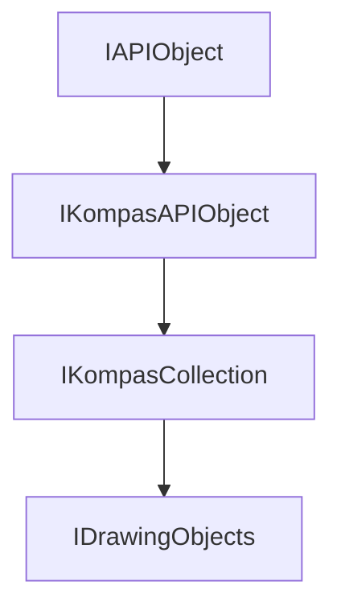

<!-- # **Документация интерфейса КОМПАС API** -->

# **Интерфейс IDrawingObjects**

## Иерархия наследования



## Общее описание

Интерфейс `IDrawingObjects` является базовым интерфейсом для всех коллекций графических объектов в 2D документе. Он предоставляет унифицированный способ доступа к различным типам графических примитивов: линиям, окружностям, дугам, точкам, текстам, размерам и многим другим.

Интерфейс `IDrawingObjects` наследует функциональность от [`IKompasCollection`](../IKompasCollection.md) и добавляет специфичные методы для работы с графическими объектами чертежа. От этого интерфейса наследуются специализированные коллекции, такие как `ILines`, `ICircles`, `IArcs`, `IPoints`, `IHatches`, `IMarks` и другие.

**Основные характеристики:**

- Базовый интерфейс для всех коллекций графических объектов 2D документов.
- Предоставляет доступ к объектам по индексу и по имени.

## Важные примечания

1. **Вызов Update() после создания объекта** - После добавления нового графического объекта в коллекцию необходимо вызвать метод `Update()` на самом объекте. Без этого объект не будет отображен на чертеже.

2. **Проверка указателей после SmartPtr** - Все методы, возвращающие `SmartPtr`, могут вернуть `nullptr`. Всегда проверяйте полученный указатель перед использованием, особенно после вызова `Add()`.

3. **Коллекции являются специализированными** - Интерфейс `IDrawingObjects` является базовым, но на практике вы будете работать с его наследниками (`ILinesPtr`, `ICirclesPtr` и т.д.). Каждая специализированная коллекция имеет свои методы для создания объектов.

4. **Получение коллекций из контейнера** - Коллекции графических объектов получаются из [`IDrawingContainer`](../IDrawingContainer.md) через методы вида `GetLines()`, `GetCircles()`, `GetArcs()` и т.д.

## Получение интерфейса

### Основные способы получения:

1. **Из контейнера чертежа:**
   - [`IDrawingContainer::GetLines()`](interface_page_files/ILines.md) - коллекция линий
   - [`IDrawingContainer::GetCircles()`](interface_page_files/ICircles.md) - коллекция окружностей
   - [`IDrawingContainer::GetArcs()`](interface_page_files/IArcs.md) - коллекция дуг
   - [`IDrawingContainer::GetPoints()`](interface_page_files/IPoints.md) - коллекция точек
   - [`IDrawingContainer::GetHatches()`](interface_page_files/IHatches.md) - коллекция штриховок

### Примеры получения:

```cpp
// Пример 1: Получение коллекции линий из документа
ksapi::IKompasDocument2DPtr doc = application->GetActiveDocument();
if (doc)
{
    ksapi::IDrawingContainerPtr container = doc->GetViewsAndLayersManager()->GetViews()->GetActiveView();
    if (container)
    {
        ksapi::ILinesPtr lines = container->GetLines();
        // Работа с коллекцией линий
    }
}

// Пример 2: Получение коллекции окружностей
ksapi::ICirclesPtr circles = drawingContainer->GetCircles();
if (!circles)
    return nullptr;
```

## Дополнительные интерфейсы

Интерфейс не имеет дополнительных интерфейсов, получаемых через QueryInterface.

## Методы интерфейса

- [`GetItem()`](#getitem) - получить объект по индексу
- [`GetItemByName()`](#getitembyname) - получить объект по имени

---

### GetItem()

[К оглавлению](#методы-интерфейса)

**Кратко:** Получить графический объект по его индексу в коллекции.

**Полное описание:**
Метод `GetItem()` возвращает указатель на графический объект по указанному индексу. Индексы начинаются с 0. Это основной способ последовательного доступа к объектам коллекции. Метод возвращает `SmartPtr` на `IDrawingObject`, который может быть приведен к конкретному типу объекта (например, `ILinePtr`, `ICirclePtr`).

**Синтаксис:**

```cpp
virtual IDrawingObjectPtr GetItem(int32_t index) = 0;
```

**Параметры:**

- `index` (in) - индекс объекта в коллекции. Должен быть в диапазоне от 0 до `GetCount() - 1`.

**Возвращаемое значение:** Умный указатель на объект 2D документа. Может быть `nullptr`, если индекс выходит за пределы коллекции.

#### **Пример использования**

**Минимальный пример:**

```cpp
// Получение первой линии в коллекции
ksapi::ILinesPtr lines = drawingContainer->GetLines();
ksapi::ILinePtr firstLine = lines->GetItem(0);
if (firstLine)
{
    // Работа с линией
}
```

**Расширенный пример:**

```cpp
// Перебор всех линий через GetItem
ksapi::ILinesPtr lines = drawingContainer->GetLines();
int32_t count = lines->GetCount();

for (int32_t i = 0; i < count; ++i)
{
    ksapi::ILinePtr line = lines->GetItem(i);
    if (line)
    {
        double x1 = line->GetX1();
        double y1 = line->GetY1();
        double x2 = line->GetX2();
        double y2 = line->GetY2();
        // Обработка координат линии
    }
}
```

**Примечания:**

- Всегда проверяйте возвращаемый указатель на `nullptr`
- Индекс должен быть меньше количества элементов в коллекции
- Для безопасной итерации используйте `GetCount()` для определения границ

---

### GetItemByName()

[К оглавлению](#методы-интерфейса)

**Кратко:** Получить графический объект по его имени.

**Полное описание:**
Метод `GetItemByName()` осуществляет поиск графического объекта в коллекции по его имени. Имя объекта задается при создании или через соответствующий метод `SetName()`. Метод особенно полезен для работы с именованными объектами, такими как слои или группы объектов.

**Синтаксис:**

```cpp
virtual IDrawingObjectPtr GetItemByName(const std::wstring & name) = 0;
```

**Параметры:**

- `name` (in) - имя объекта для поиска. Регистрозависимо в зависимости от настроек системы.

**Возвращаемое значение:** Умный указатель на найденный объект чертежа. Возвращает `nullptr`, если объект с указанным именем не найден.

#### **Пример использования**

**Минимальный пример:**

```cpp
// Поиск слоя по имени
ksapi::ILayersPtr layers = drawingContainer->GetLayers();
ksapi::ILayerPtr layer = layers->GetItemByName(L"Основной");
if (layer)
{
    layer->SetCurrent();
}
```

**Расширенный пример:**

```cpp
// Поиск именованных объектов в коллекции
ksapi::IDrawingObjectsPtr objects = /* ... */;
std::vector<std::wstring> names = {L"Object1", L"Object2", L"Object3"};

for (const auto& name : names)
{
    ksapi::IDrawingObjectPtr obj = objects->GetItemByName(name);
    if (obj)
    {
        // Объект найден, можно изменять его свойства
        obj->SetStyle(2);
        obj->Update();
    }
    else
    {
        // Объект не найден
    }
}
```

**Примечания:**

- Поиск по имени может быть медленнее, чем по индексу, особенно для больших коллекций
- Если имя не задано, объект не будет найден этим методом
- Убедитесь, что имя объекта было установлено до вызова этого метода

---

## Частые ошибки

### 1. Забывают вызвать Update() после создания объекта

```cpp
// НЕПРАВИЛЬНО
ksapi::ICirclesPtr circles = drawingContainer->GetCircles();
ksapi::ICirclePtr circle = circles->Add();
circle->SetXc(100);
circle->SetYc(100);
circle->SetRadius(50);
// Объект не отобразится на чертеже - забыли Update()!

// ПРАВИЛЬНО
ksapi::ICirclePtr circle = circles->Add();
circle->SetXc(100);
circle->SetYc(100);
circle->SetRadius(50);
circle->Update();  // Обязательный вызов после настройки параметров
```

### 2. Не проверяют указатели после SmartPtr приведения

```cpp
// НЕПРАВИЛЬНО
ksapi::ILinesPtr lines = drawingContainer->GetLines();
ksapi::ILinePtr line = lines->GetItem(0);  // Может вернуть nullptr!
line->SetX1(0);  // Краш при nullptr!

// ПРАВИЛЬНО
ksapi::ILinePtr line = lines->GetItem(0);
if (line)  // Всегда проверяйте указатель
{
    line->SetX1(0);
    line->Update();
}
```

### 3. Неправильное использование индексов

```cpp
// НЕПРАВИЛЬНО
ksapi::ILinesPtr lines = drawingContainer->GetLines();
int32_t count = lines->GetCount();
ksapi::ILinePtr lastLine = lines->GetItem(count);  // Индекс за пределами!

// ПРАВИЛЬНО
int32_t count = lines->GetCount();
if (count > 0)
{
    ksapi::ILinePtr lastLine = lines->GetItem(count - 1);  // Последний элемент
}
```

---

## Практические примеры из исходников

### Пример 1: Создание линии из Step2

```cpp
// Создать линию по двум точкам и вернуть математическую кривую для неё.
ksapi::ICurve2DPtr CreateLine(ksapi::IDrawingContainer & drawingContainer,
                               double x1, double y1, double x2, double y2)
{
  ksapi::ILinesPtr lines = drawingContainer.GetLines();
  if (!lines)
    return nullptr;

  ksapi::ILinePtr line = lines->Add();
  if (!line)
    return nullptr;

  line->SetX1(x1);
  line->SetY1(y1);
  line->SetX2(x2);
  line->SetY2(y2);

  line->Update();  // ВАЖНО: обязательный вызов!

  return line->GetCurve2D();
}
```

### Пример 2: Создание окружности из Step2

```cpp
// Создать окружность по координатам центра и радиусу.
ksapi::ICirclePtr CreateCircle(ksapi::IDrawingContainer & drawingContainer,
                                double xc, double yc, double r,
                                ksCurveStyleEnum style)
{
  ksapi::ICirclesPtr circlesContainer = drawingContainer.GetCircles();
  if (!circlesContainer)
    return nullptr;

  ksapi::ICirclePtr circle = circlesContainer->Add();
  if (!circle)
    return nullptr;

  circle->SetXc(xc);
  circle->SetYc(yc);
  circle->SetRadius(r);
  circle->SetStyle(style);

  circle->Update();  // ВАЖНО!

  return circle;
}
```

### Пример 3: Создание дуги из Step2

```cpp
// Создать дугу по центру, радиусу, точкам начала и конца и направлению.
ksapi::ICurve2DPtr CreateArc(ksapi::IDrawingContainer & drawingContainer,
                              double xc, double yc, double r,
                              double x1, double y1, double x2, double y2, bool dir)
{
  ksapi::IArcsPtr arcsContainer = drawingContainer.GetArcs();
  if (!arcsContainer)
    return nullptr;

  ksapi::IArcPtr arc = arcsContainer->Add();
  if (!arc)
    return nullptr;

  arc->SetXc(xc);
  arc->SetYc(yc);
  arc->SetRadius(r);
  arc->SetX1(x1);
  arc->SetY1(y1);
  arc->SetX2(x2);
  arc->SetY2(y2);
  arc->SetDirection(dir);

  arc->Update();  // ВАЖНО!

  return arc->GetCurve2D();
}
```

---

## Шаблон использования

### Шаблон 1: Безопасное создание графического объекта

```cpp
// Универсальный шаблон для создания любого графического примитива
template<typename CollectionPtr, typename ObjectPtr>
ObjectPtr CreateDrawingObject(CollectionPtr& collection)
{
    // 1. Проверка валидности коллекции
    if (!collection)
        return nullptr;

    // 2. Создание нового объекта
    ObjectPtr obj = collection->Add();
    if (!obj)
        return nullptr;

    // 3. Настройка параметров объекта (устанавливаются в конкретной реализации)
    // obj->SetXXX(...);

    // 4. ВАЖНО: Вызов Update для отображения объекта
    obj->Update();

    return obj;
}
```

### Шаблон 2: Итерация по коллекции объектов

```cpp
// Универсальный шаблон для перебора объектов коллекции
void ProcessDrawingObjects(ksapi::IDrawingObjectsPtr objects)
{
    if (!objects)
        return;

    int32_t count = objects->GetCount();

    for (int32_t i = 0; i < count; ++i)
    {
        ksapi::IDrawingObjectPtr obj = objects->GetItem(i);
        if (!obj)
            continue;

        // Обработка объекта
        // obj->GetXXX();
    }
}
```

### Шаблон 3: Поиск объекта по имени

```cpp
// Шаблон для безопасного поиска объекта по имени
ksapi::IDrawingObjectPtr FindByName(ksapi::IDrawingObjectsPtr objects,
                                     const std::wstring& name)
{
    if (!objects || name.empty())
        return nullptr;

    return objects->GetItemByName(name);
}
```

---

## Связанные интерфейсы

### Работа в паре с:

- **`IDrawingContainer`** - контейнер, содержащий все коллекции графических объектов
- **`IDrawingObject`** - базовый интерфейс для всех графических объектов чертежа

### Часто используется вместе с:

- **`ILines`, `ICircles`, `IArcs`, `IPoints`** - специализированные коллекции для конкретных типов объектов
- **`ICurve2D`** - математическое представление кривой графического объекта
- **`ILayers`, `IViews`** - коллекции слоев и видов чертежа
