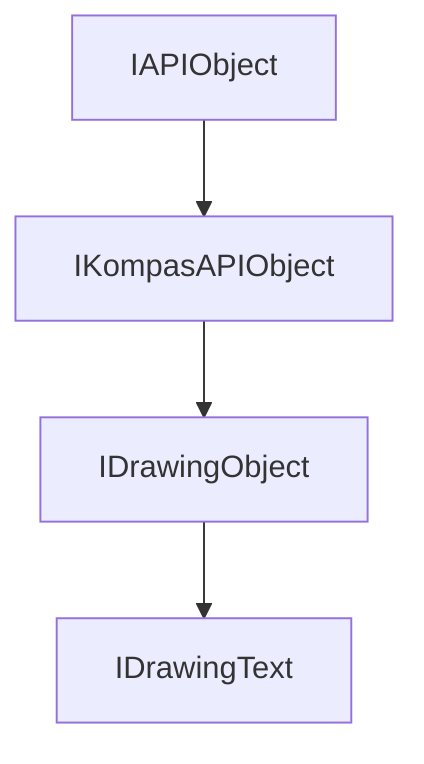

<!-- # **Документация интерфейса КОМПАС API** -->

# **Интерфейс IDrawingText**

## Иерархия наследования

<style>
.top-parent{
    color: #ffe3d8;
    background: green;
    border: 3px solid #046709;
    border-radius: 4px;
    padding: 5px;
    text-align: center;
    margin-bottom: 5px;
    font-weight: bold;
    width: 40%;
    max-width: 220px;
}

.other-parents{
    color: #ffe3d8;
    background: #4a6fa5;
    border: 3px solid #3d5b87;
    border-radius: 4px;
    padding: 5px;
    text-align: center;
    margin: 5px 10%;
    font-weight: bold;
    width: 40%;
    max-width: 220px;
}

.interface{
    color: #ffe3d8;
    background: #103874;
    border: 3px solid #002152;
    border-radius: 4px;
    padding: 5px;
    text-align: center;
    margin: 5px 10%;
    font-weight: bold;
    width: 40%;
    max-width: 220px;
}
</style>

<div style="padding: 10px; background: #f5f5f5; border-radius: 5px; max-width: auto; margin-bottom: 20px">
<div class="top-parent">IAPIObject</div>

<div style="text-align: left; color:black; margin: 5px 15%;">▼</div>
<div class="other-parents">IKompasAPIObject</div>

<div style="text-align: left; color:black; margin: 5px 25%;">▼</div>
<div class="other-parents" style="margin: 5px 20%;">IDrawingObject</div>

<div style="text-align: left; color:black; margin: 5px 35%;">▼</div>
<div class="interface" style="margin: 5px 30%;">IDrawingText</div>
</div>



## Общее описание

Интерфейс `IDrawingText` представляет текстовый объект на чертеже КОМПАС. Является графическим объектом, наследуется от `IDrawingObject`, и предоставляет методы для управления параметрами текста: координатами точки привязки, углом наклона, размерами блока форматирования, способом выравнивания и другими характеристиками.

Текст на чертеже является важным элементом оформления технической документации. Он используется для создания надписей, примечаний, технических требований и других текстовых элементов чертежа. Интерфейс `IDrawingText` также поддерживает преобразование текста в кривые для дальнейшего редактирования.

## Важные примечания

1. **Вызов Update() обязателен** - После установки всех параметров текста необходимо вызвать метод `Update()` для применения изменений и отображения объекта на чертеже.

2. **Интерфейс IText** - Интерфейс `IDrawingText` неявно преобразуется к интерфейсу `IText`, который предоставляет методы для управления содержимым текста (строками, стилем, форматированием).

3. **Координаты в миллиметрах** - Все координаты (X, Y) задаются в миллиметрах (мм) относительно начала системы координат текущего вида или фрагмента.

4. **Угол в градусах** - Угол наклона текста задаётся в градусах.

## Получение интерфейса

### Основные способы получения:

1. **Из коллекции текстов:**
   - [`IDrawingContainer::GetDrawingTexts()`](../IDrawingContainer.md) - получение коллекции текстов из контейнера чертежа
   - [`IDrawingTexts::Add()`](../IDrawingTexts.md) - создание нового текста
   - [`IDrawingTexts::GetDrawingText(index)`](IDrawingTexts.md) - получение текста по индексу

2. **Приведение типов:**
   - При получении объекта типа `IDrawingObject` можно выполнить приведение к `IDrawingText`, если `GetDrawingObjectType() == DrawingObjectTypeEnum::ksDrText`

### Примеры получения:

```cpp
// Пример 1: Создание нового текста через IDrawingContainer
ksapi::IDrawingContainerPtr drawingContainer = /* получение контейнера */;
ksapi::IDrawingTextsPtr texts = drawingContainer->GetDrawingTexts();
ksapi::IDrawingTextPtr drawingText = texts->Add();

// Пример 2: Получение текстового интерфейса для работы с содержимым
ksapi::ITextPtr text = drawingText;  // Неявное преобразование к IText
```

## Дополнительные интерфейсы

От интерфейса `IDrawingText` можно получить следующие дополнительные интерфейсы:

- **`IText`** - интерфейс для управления содержимым текста (строки, стили, форматирование)
- **`ISerializer`** - Интерфейс сериализации/десериализации в XML

## Методы интерфейса

### Группа 1: Координаты точки привязки

- [`SetX() / GetX()`](#setx--getx) - координата X точки привязки текста
- [`SetY() / GetY()`](#sety--gety) - координата Y точки привязки текста

### Группа 2: Размеры блока форматирования

- [`SetHeight() / GetHeight()`](#setheight--getheight) - высота блока форматирования
- [`SetWidth() / GetWidth()`](#setwidth--getwidth) - ширина блока форматирования

### Группа 3: Форматирование текста

- [`SetAngle() / GetAngle()`](#setangle--getangle) - угол наклона текста
- [`SetHFormat() / GetHFormat()`](#sethformat--gethformat) - горизонтальное форматирование
- [`SetVFormat() / GetVFormat()`](#setvformat--getvformat) - вертикальное форматирование
- [`SetAllocation() / GetAllocation()`](#setallocation--getallocation) - способ размещения точки привязки

### Группа 4: Отображение

- [`SetMirrorSymmetry() / IsMirrorSymmetry()`](#setmirrorsymmetry--ismirrorsymmetry) - зеркальное отображение
- [`IsTextMark()`](#istextmark) - признак текстовой метки

### Группа 5: Преобразования

- [`ConvertToCurves()`](#converttocurves) - преобразовать текст в кривые

---

### SetX() / GetX()

[Группа 1: Координаты точки привязки](#группа-1-координаты-точки-привязки) | [К оглавлению](#методы-интерфейса)

**Кратко:** Установка и получение X-координаты точки привязки текста.

**Полное описание:**
Методы `SetX()` и `GetX()` предназначены для управления горизонтальной координатой точки привязки текста. `SetX()` задаёт координату в миллиметрах относительно начала системы координат текущего вида или фрагмента. Ось X направлена слева направо. `GetX()` возвращает текущее значение горизонтальной координаты точки привязки.

**Синтаксис:**

```cpp
virtual void SetX(double x) = 0;
virtual double GetX() = 0;
```

**Параметры SetX:**

- `x` (in) - координата X точки привязки текста в миллиметрах (мм)

**Возвращаемое значение GetX:** Координата X точки привязки текста в миллиметрах (double).

#### **Пример использования**

```cpp
// Установка координаты X точки привязки
drawingText->SetX(100.0);
drawingText->Update();

// Получение координаты X точки привязки
double xCoord = drawingText->GetX();
```

---

### SetY() / GetY()

[Группа 1: Координаты точки привязки](#группа-1-координаты-точки-привязки) | [К оглавлению](#методы-интерфейса)

**Кратко:** Установка и получение Y-координаты точки привязки текста.

**Полное описание:**
Методы `SetY()` и `GetY()` предназначены для управления вертикальной координатой точки привязки текста. `SetY()` задаёт координату в миллиметрах относительно начала системы координат текущего вида или фрагмента. Ось Y направлена снизу вверх. `GetY()` возвращает текущее значение вертикальной координаты точки привязки.

**Синтаксис:**

```cpp
virtual void SetY(double y) = 0;
virtual double GetY() = 0;
```

**Параметры SetY:**

- `y` (in) - координата Y точки привязки текста в миллиметрах (мм)

**Возвращаемое значение GetY:** Координата Y точки привязки текста в миллиметрах (double).

#### **Пример использования**

```cpp
// Установка координаты Y точки привязки
drawingText->SetY(50.0);
drawingText->Update();

// Получение координаты Y точки привязки
double yCoord = drawingText->GetY();
```

---

### SetHeight() / GetHeight()

[Группа 2: Размеры блока форматирования](#группа-2-размеры-блока-форматирования) | [К оглавлению](#методы-интерфейса)

**Кратко:** Установка и получение высоты блока форматирования текста.

**Полное описание:**
Методы `SetHeight()` и `GetHeight()` предназначены для управления высотой блока форматирования текста. `SetHeight()` задаёт высоту в миллиметрах. Высота блока определяет вертикальный размер области, в которой размещается текст. `GetHeight()` возвращает текущее значение высоты блока.

**Синтаксис:**

```cpp
virtual void SetHeight(double height) = 0;
virtual double GetHeight() = 0;
```

**Параметры SetHeight:**

- `height` (in) - высота блока форматирования в миллиметрах (мм)

**Возвращаемое значение GetHeight:** Высота блока форматирования в миллиметрах (double).

#### **Пример использования**

```cpp
// Установка высоты блока форматирования
drawingText->SetHeight(25.0);
drawingText->Update();

// Получение высоты блока форматирования
double height = drawingText->GetHeight();
```

---

### SetWidth() / GetWidth()

[Группа 2: Размеры блока форматирования](#группа-2-размеры-блока-форматирования) | [К оглавлению](#методы-интерфейса)

**Кратко:** Установка и получение ширины блока форматирования текста.

**Полное описание:**
Методы `SetWidth()` и `GetWidth()` предназначены для управления шириной блока форматирования текста. `SetWidth()` задаёт ширину в миллиметрах. Ширина блока определяет горизонтальный размер области, в которой размещается текст. `GetWidth()` возвращает текущее значение ширины блока.

**Синтаксис:**

```cpp
virtual void SetWidth(double width) = 0;
virtual double GetWidth() = 0;
```

**Параметры SetWidth:**

- `width` (in) - ширина блока форматирования в миллиметрах (мм)

**Возвращаемое значение GetWidth:** Ширина блока форматирования в миллиметрах (double).

#### **Пример использования**

```cpp
// Установка ширины блока форматирования
drawingText->SetWidth(20.0);
drawingText->Update();

// Получение ширины блока форматирования
double width = drawingText->GetWidth();
```

---

### SetAngle() / GetAngle()

[Группа 3: Форматирование текста](#группа-3-форматирование-текста) | [К оглавлению](#методы-интерфейса)

**Кратко:** Установка и получение угла наклона текста.

**Полное описание:**
Методы `SetAngle()` и `GetAngle()` предназначены для управления углом наклона текста относительно горизонтали. `SetAngle()` задаёт угол в градусах. Положительное значение угла означает поворот против часовой стрелки. `GetAngle()` возвращает текущее значение угла наклона.

**Синтаксис:**

```cpp
virtual void SetAngle(double angle) = 0;
virtual double GetAngle() = 0;
```

**Параметры SetAngle:**

- `angle` (in) - угол наклона текста в градусах

**Возвращаемое значение GetAngle:** Угол наклона текста в градусах (double).

#### **Пример использования**

```cpp
// Установка угла наклона текста (поворот на 45 градусов)
drawingText->SetAngle(45.0);
drawingText->Update();

// Получение угла наклона текста
double angle = drawingText->GetAngle();
```

---

### SetHFormat() / GetHFormat()

[Группа 3: Форматирование текста](#группа-3-форматирование-текста) | [К оглавлению](#методы-интерфейса)

**Кратко:** Установка и получение типа горизонтального форматирования текста.

**Полное описание:**
Методы `SetHFormat()` и `GetHFormat()` предназначены для управления горизонтальным выравниванием текста. `SetHFormat()` задаёт тип выравнивания из перечисления `ksTextHorizontalFormatEnum`. `GetHFormat()` возвращает текущий тип горизонтального форматирования.

**Синтаксис:**

```cpp
virtual void SetHFormat(ksTextHorizontalFormatEnum horizontalFormat) = 0;
virtual ksTextHorizontalFormatEnum GetHFormat() = 0;
```

**Параметры SetHFormat:**

- `horizontalFormat` (in) - тип горизонтального форматирования (`ksTextHorizontalFormatEnum`)

**Возвращаемое значение GetHFormat:** Тип горизонтального форматирования (`ksTextHorizontalFormatEnum`).

#### **Пример использования**

```cpp
// Установка горизонтального форматирования (без выравнивания)
drawingText->SetHFormat(ksHFormatNot);
drawingText->Update();

// Получение горизонтального форматирования
ksTextHorizontalFormatEnum hFormat = drawingText->GetHFormat();
```

---

### SetVFormat() / GetVFormat()

[Группа 3: Форматирование текста](#группа-3-форматирование-текста) | [К оглавлению](#методы-интерфейса)

**Кратко:** Установка и получение признака вертикального форматирования текста.

**Полное описание:**
Методы `SetVFormat()` и `GetVFormat()` предназначены для управления вертикальным форматированием текста. `SetVFormat()` задаёт признак изменения шага строк. При значении `true` шаг между строками текста будет автоматически подстраиваться под высоту блока форматирования. `GetVFormat()` возвращает текущее значение признака вертикального форматирования.

**Синтаксис:**

```cpp
virtual void SetVFormat(bool vFormat) = 0;
virtual bool GetVFormat() = 0;
```

**Параметры SetVFormat:**

- `vFormat` (in) - признак вертикального форматирования (true - изменять шаг строк, false - нет форматирования)

**Возвращаемое значение GetVFormat:** Признак вертикального форматирования (bool).

#### **Пример использования**

```cpp
// Установка вертикального форматирования (без изменения шага строк)
drawingText->SetVFormat(false);
drawingText->Update();

// Получение вертикального форматирования
bool vFormat = drawingText->GetVFormat();
```

---

### SetAllocation() / GetAllocation()

[Группа 3: Форматирование текста](#группа-3-форматирование-текста) | [К оглавлению](#методы-интерфейса)

**Кратко:** Установка и получение способа размещения точки привязки текста.

**Полное описание:**
Методы `SetAllocation()` и `GetAllocation()` предназначены для управления способом размещения точки привязки текста относительно текстового блока. `SetAllocation()` задаёт способ размещения из перечисления `ksAllocationEnum`. `GetAllocation()` возвращает текущий способ размещения.

**Синтаксис:**

```cpp
virtual void SetAllocation(ksAllocationEnum allocation) = 0;
virtual ksAllocationEnum GetAllocation() = 0;
```

**Параметры SetAllocation:**

- `allocation` (in) - способ размещения точки привязки (`ksAllocationEnum`)

**Возвращаемое значение GetAllocation:** Способ размещения точки привязки (`ksAllocationEnum`).

#### **Пример использования**

```cpp
// Установка способа размещения (по умолчанию)
drawingText->SetAllocation(ksAlCentre);
drawingText->Update();

// Получение способа размещения
ksAllocationEnum allocation = drawingText->GetAllocation();
```

---

### SetMirrorSymmetry() / IsMirrorSymmetry()

[Группа 4: Отображение](#группа-4-отображение) | [К оглавлению](#методы-интерфейса)

**Кратко:** Установка и получение признака зеркального отображения текста.

**Полное описание:**
Методы `SetMirrorSymmetry()` и `IsMirrorSymmetry()` предназначены для управления зеркальным отображением текста относительно вертикальной оси. `SetMirrorSymmetry()` задаёт признак зеркального отображения. При значении `true` текст будет отображаться зеркально. `IsMirrorSymmetry()` возвращает текущее значение признака.

**Синтаксис:**

```cpp
virtual void SetMirrorSymmetry(bool symmetry) = 0;
virtual bool IsMirrorSymmetry() = 0;
```

**Параметры SetMirrorSymmetry:**

- `symmetry` (in) - признак зеркального отображения (true - отображать зеркально, false - обычное отображение)

**Возвращаемое значение IsMirrorSymmetry:** Признак зеркального отображения (bool).

#### **Пример использования**

```cpp
// Включение зеркального отображения текста
drawingText->SetMirrorSymmetry(true);
drawingText->Update();

// Проверка зеркального отображения
bool isMirror = drawingText->IsMirrorSymmetry();
```

---

### IsTextMark()

[Группа 4: Отображение](#группа-4-отображение) | [К оглавлению](#методы-интерфейса)

**Кратко:** Проверка, является ли текст текстовой меткой.

**Полное описание:**
Метод `IsTextMark()` возвращает признак того, что текст является текстовой меткой. Текстовые метки используются для автоматической привязки текста к графическим объектам (например, позиционным обозначениям).

**Синтаксис:**

```cpp
virtual bool IsTextMark() = 0;
```

**Возвращаемое значение:** true - текст является текстовой меткой, false - обычный текст.

---

### ConvertToCurves()

[Группа 5: Преобразования](#группа-5-преобразования) | [К оглавлению](#методы-интерфейса)

**Кратко:** Преобразовать текст в кривые (контуры).

**Полное описание:**
Метод `ConvertToCurves()` преобразует текстовый объект в группу кривых (контурный объект). После преобразования текст становится набором геометрических примитивов (отрезков, дуг, сплайнов), которые можно редактировать как обычные графические объекты. Исходный текстовый объект при этом удаляется.

**Синтаксис:**

```cpp
virtual IDrawingGroupPtr ConvertToCurves() = 0;
```

**Возвращаемое значение:** Умный указатель на группу кривых (`IDrawingGroupPtr`), представляющую преобразованный текст.

---

## Частые ошибки

### 1. Забывают вызвать Update() после изменения параметров текста

```cpp
// НЕПРАВИЛЬНО
ksapi::IDrawingTextsPtr texts = drawingContainer->GetDrawingTexts();
ksapi::IDrawingTextPtr drawingText = texts->Add();
drawingText->SetX(30);
drawingText->SetY(30);
drawingText->SetHeight(25);
// Текст не отображается - забыли Update()

// ПРАВИЛЬНО
drawingText->SetX(30);
drawingText->SetY(30);
drawingText->SetHeight(25);
drawingText->Update();  // Обязательный вызов для применения изменений
```

### 2. Не проверяют указатель после Add()

```cpp
// НЕПРАВИЛЬНО
ksapi::IDrawingTextsPtr texts = drawingContainer->GetDrawingTexts();
ksapi::IDrawingTextPtr drawingText = texts->Add();
drawingText->SetX(30);  // Если texts == nullptr, будет crash

// ПРАВИЛЬНО
ksapi::IDrawingTextsPtr texts = drawingContainer->GetDrawingTexts();
if (!texts)
    return;
ksapi::IDrawingTextPtr drawingText = texts->Add();
if (!drawingText)
    return;
drawingText->SetX(30);
drawingText->Update();
```

### 3. Не используют IText для работы с содержимым

```cpp
// НЕПРАВИЛЬНО
// Текст создан, но не заполнен
drawingText->SetX(30);
drawingText->SetY(30);
drawingText->Update();
// Текст пустой!

// ПРАВИЛЬНО
// Получаем интерфейс IText для работы с содержимым
ksapi::ITextPtr text = drawingText;
if (!text)
    return;

// Создаем строку текста
ksapi::ITextLinePtr textLine = text->Add();
if (!textLine)
    return;

// Добавляем текстовый элемент
ksapi::ITextItemPtr item = textLine->Add();
if (!item)
    return;

item->SetStr(L"Пример текста");
drawingText->Update();
```

---

## Практические примеры из исходников

### Пример 1: Создание текста на чертеже из Step3

```cpp
// Создание текста с форматированием
void CreateText(ksapi::IDrawingContainerPtr drawingContainer)
{
  ksapi::IDrawingTextsPtr texts = drawingContainer->GetDrawingTexts();
  if (!texts)
    return;

  ksapi::IDrawingTextPtr drawingText = texts->Add();
  ksapi::ITextPtr text = drawingText;
  if (!text)
    return;

  // Определение общих параметров текста
  drawingText->SetStyle(ksTSDefault);    // Стиль текста
  drawingText->SetX(30);                  // Координаты привязки текста
  drawingText->SetY(30);                 // Координаты привязки текста
  drawingText->SetAngle(0);              // Угол наклона текста
  drawingText->SetHFormat(ksHFormatNot); // Признак горизонтального форматирования
  drawingText->SetVFormat(false);        // Признак вертикального форматирования
  drawingText->SetHeight(25);           // Высота блока форматирования
  drawingText->SetWidth(20);             // Ширина блока форматирования

  // Создание строки текста
  ksapi::ITextLinePtr textLine = text->Add();
  if (!textLine)
    return;

  // Добавление текстового элемента
  ksapi::ITextItemPtr item = textLine->Add();
  if (!item)
    return;

  item->SetStr(L"Текст на чертеже");

  // Применение изменений
  drawingText->Update();
}
```

### Пример 2: Создание текста с дробью из Step3

```cpp
// Создание текста с дробью
void CreateTextWithFraction(ksapi::IDrawingContainerPtr drawingContainer)
{
  ksapi::IDrawingTextsPtr texts = drawingContainer->GetDrawingTexts();
  if (!texts)
    return;

  ksapi::IDrawingTextPtr drawingText = texts->Add();
  ksapi::ITextPtr text = drawingText;
  if (!text)
    return;

  // Параметры текста
  drawingText->SetX(30);
  drawingText->SetY(30);
  drawingText->SetHeight(25);
  drawingText->SetWidth(20);

  // Создание строки с дробью
  ksapi::ITextLinePtr textLine = text->Add();

  // Числитель дроби
  textLine->Add(ksTItNumerator, L"111");
  // Знаменатель дроби
  textLine->Add(ksTItDenominator, L"222");
  // Конец дроби
  textLine->Add(ksTItFractionEnd, L" 333");

  drawingText->Update();
}
```

---

## Шаблон использования

### Шаблон 1: Безопасное создание текста

```cpp
// Универсальный шаблон для создания текста
ksapi::IDrawingTextPtr CreateText(ksapi::IDrawingTextsPtr& texts, double x, double y,
                                   const std::wstring& content)
{
    if (!texts)
        return nullptr;

    ksapi::IDrawingTextPtr drawingText = texts->Add();
    if (!drawingText)
        return nullptr;

    // Установка параметров
    drawingText->SetX(x);
    drawingText->SetY(y);
    drawingText->SetHeight(10);  // Значение по умолчанию
    drawingText->SetWidth(10);

    // Получение интерфейса IText для содержимого
    ksapi::ITextPtr text = drawingText;
    if (text)
    {
        ksapi::ITextLinePtr line = text->Add();
        if (line)
        {
            ksapi::ITextItemPtr item = line->Add();
            if (item)
                item->SetStr(content);
        }
    }

    drawingText->Update();
    return drawingText;
}
```

### Шаблон 2: Создание многострочного текста

```cpp
// Создание текста с несколькими строками
void CreateMultilineText(ksapi::IDrawingTextPtr& drawingText,
                         const std::vector<std::wstring>& lines)
{
    if (!drawingText)
        return;

    ksapi::ITextPtr text = drawingText;
    if (!text)
        return;

    for (const auto& line : lines)
    {
        ksapi::ITextLinePtr textLine = text->Add();
        if (textLine)
        {
            ksapi::ITextItemPtr item = textLine->Add();
            if (item)
                item->SetStr(line);
        }
    }

    drawingText->Update();
}
```

---

## Связанные интерфейсы

### Работа в паре с:

- **`IDrawingContainer`** - контейнер чертежа для получения коллекции текстов
- **`IDrawingTexts`** - коллекция текстов на чертеже
- **`IText`** - интерфейс для управления содержимым текста
- **`ITextLine`** - строка текста
- **`ITextItem`** - элемент текста (символы, дроби, отклонения)
