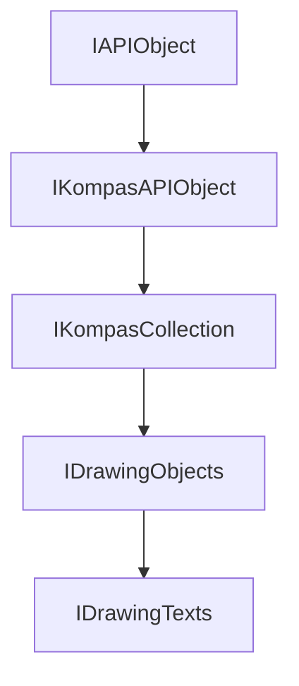

<!-- # **Документация интерфейса КОМПАС API** -->

# **Интерфейс IDrawingTexts**

## Иерархия наследования



## Общее описание

Интерфейс `IDrawingTexts` представляет коллекцию текстовых объектов на чертеже КОМПАС. Он наследует от `IDrawingObjects` и предоставляет специализированные методы для работы с текстами: создание новых текстовых объектов, получение текстов по индексу, управление текстовыми метками.

Коллекция текстов является частью контейнера чертежа (`IDrawingContainer`) и используется для централизованного управления всеми текстовыми объектами на чертеже или в виде.

## Важные примечания

1. **Проверка указателей** - Все методы, возвращающие указатели, могут вернуть `nullptr`. Всегда проверяйте возвращаемый указатель перед использованием.

2. **Вызов Update()** - После создания текста через `Add()` необходимо вызвать `Update()` на созданном текстовом объекте.

## Получение интерфейса

### Основные способы получения:

1. **Из контейнера чертежа:**
   - [`IDrawingContainer::GetDrawingTexts()`](../IDrawingContainer.md) - получение коллекции текстов из контейнера чертежа

2. **Пример получения:**
   ```cpp
   // Получение коллекции текстов
   ksapi::IDrawingContainerPtr drawingContainer = /* получение контейнера */;
   ksapi::IDrawingTextsPtr texts = drawingContainer->GetDrawingTexts();
   if (!texts)
       return error_code;
   ```

## Дополнительные интерфейсы

Интерфейс не имеет дополнительных интерфейсов, получаемых через QueryInterface.

## Методы интерфейса

### Группа 1: Создание текстов

- [`Add()`](#add) - создать новый текст на чертеже

### Группа 2: Получение текстов

- [`GetDrawingText()`](#getdrawingtext) - получить текст по индексу

### Группа 3: Текстовые метки

- [`AddTextMark()`](#addtextmark) - добавить текстовую метку для объекта
- [`FindTextMark()`](#findtextmark) - найти текстовую метку для объекта
- [`FindTextMarkObject()`](#findtextmarkobject) - найти объект по текстовой метке
- [`DeleteTextMark()`](#deletetextmark) - удалить текстовую метку

---

### Add()

[Группа 1: Создание текстов](#группа-1-создание-текстов) | [К оглавлению](#методы-интерфейса)

**Кратко:** Создать новый текстовый объект и добавить его в коллекцию.

**Полное описание:**
Метод `Add()` создаёт новый пустой текстовый объект на чертеже и добавляет его в коллекцию текстов. После создания текста необходимо настроить его параметры (координаты, содержимое, стиль) и вызвать `Update()` для отображения на чертеже.

**Синтаксис:**

```cpp
virtual IDrawingTextPtr Add() = 0;
```

**Возвращаемое значение:** Умный указатель на созданный текстовый объект (`IDrawingTextPtr`). Возвращает `nullptr` в случае ошибки.

#### **Пример использования**

```cpp
// Создание нового текста
ksapi::IDrawingTextsPtr texts = drawingContainer->GetDrawingTexts();
if (!texts)
    return;

ksapi::IDrawingTextPtr drawingText = texts->Add();
if (!drawingText)
    return;

// Настройка параметров текста
drawingText->SetX(100);
drawingText->SetY(50);
drawingText->SetHeight(10);
drawingText->SetWidth(10);

// Установка содержимого через IText
ksapi::ITextPtr text = drawingText;
if (text)
{
    ksapi::ITextLinePtr line = text->Add();
    if (line)
    {
        ksapi::ITextItemPtr item = line->Add();
        if (item)
            item->SetStr(L"Новый текст");
    }
}

// Обязательный вызов Update
drawingText->Update();
```

---

### GetDrawingText()

[Группа 2: Получение текстов](#группа-2-получение-текстов) | [К оглавлению](#методы-интерфейса)

**Кратко:** Получить текстовый объект по индексу в коллекции.

**Полное описание:**
Метод `GetDrawingText()` возвращает указатель на текстовый объект по указанному индексу. Индексы начинаются с 0. Это основной способ последовательного доступа к текстам коллекции.

**Синтаксис:**

```cpp
virtual IDrawingTextPtr GetDrawingText(int32_t index) = 0;
```

**Параметры:**

- `index` (in) - индекс текстового объекта в коллекции. Должен быть в диапазоне от 0 до количества текстов - 1.

**Возвращаемое значение:** Умный указатель на текстовый объект (`IDrawingTextPtr`). Возвращает `nullptr`, если индекс выходит за пределы коллекции.

#### **Пример использования**

```cpp
// Получение всех текстов из коллекции
ksapi::IDrawingTextsPtr texts = drawingContainer->GetDrawingTexts();
if (!texts)
    return;

for (int32_t i = 0; i < texts->GetCount(); ++i)
{
    ksapi::IDrawingTextPtr text = texts->GetDrawingText(i);
    if (text)
    {
        double x = text->GetX();
        double y = text->GetY();
        // Обработка текста
    }
}
```

---

### AddTextMark()

[Группа 3: Текстовые метки](#текстовые-метки) | [К оглавлению](#методы-интерфейса)

**Кратко:** Создать текстовую метку для графического объекта.

**Полное описание:**
Метод `AddTextMark()` создаёт текстовую метку - специальный текст, автоматически привязанный к графическому объекту. Текстовые метки используются для создания позиционных обозначений, обозначений сечений, ссылок и других автоматически привязанных надписей.

**Синтаксис:**

```cpp
virtual IDrawingTextPtr AddTextMark(const IDrawingObjectPtr & object) = 0;
```

**Параметры:**

- `object` (in) - умный указатель на графический объект, к которому привязывается текстовая метка.

**Возвращаемое значение:** Умный указатель на созданную текстовую метку (`IDrawingTextPtr`). Возвращает `nullptr` в случае ошибки.

#### **Пример использования**

```cpp
// Создание текстовой метки для объекта
ksapi::IDrawingTextsPtr texts = drawingContainer->GetDrawingTexts();
if (!texts)
    return;

ksapi::IDrawingObjectPtr someObject = /* получение объекта */;
if (!someObject)
    return;

ksapi::IDrawingTextPtr mark = texts->AddTextMark(someObject);
if (mark)
{
    // Настройка текстовой метки
    mark->SetHeight(5);
    mark->SetWidth(5);
    mark->Update();
}
```

---

### FindTextMark()

[Группа 3: Текстовые метки](#текстовые-метки) | [К оглавлению](#методы-интерфейса)

**Кратко:** Найти текстовую метку, привязанную к указанному объекту.

**Полное описание:**
Метод `FindTextMark()` осуществляет поиск текстовой метки, привязанной к указанному графическому объекту. Возвращает указатель на найденную текстовую метку или `nullptr`, если метка не найдена.

**Синтаксис:**

```cpp
virtual IDrawingTextPtr FindTextMark(const IDrawingObjectPtr & object) = 0;
```

**Параметры:**

- `object` (in) - умный указатель на графический объект.

**Возвращаемое значение:** Умный указатель на текстовую метку (`IDrawingTextPtr`). Возвращает `nullptr`, если метка не найдена.

#### **Пример использования**

```cpp
// Поиск текстовой метки для объекта
ksapi::IDrawingTextsPtr texts = drawingContainer->GetDrawingTexts();
if (!texts)
    return;

ksapi::IDrawingObjectPtr obj = /* получение объекта */;
if (!obj)
    return;

ksapi::IDrawingTextPtr mark = texts->FindTextMark(obj);
if (mark)
{
    // Метка найдена, можно изменить её параметры
    mark->SetHeight(7);
    mark->Update();
}
```

---

### FindTextMarkObject()

[Группа 3: Текстовые метки](#текстовые-метки) | [К оглавлению](#методы-интерфейса)

**Кратко:** Найти графический объект, к которому привязана текстовая метка.

**Полное описание:**
Метод `FindTextMarkObject()` выполняет обратную операцию - по текстовой метке находит графический объект, к которому она привязана. Возвращает указатель на найденный объект или `nullptr`, если объект не найден.

**Синтаксис:**

```cpp
virtual IDrawingObjectPtr FindTextMarkObject(const IDrawingTextPtr & mark) = 0;
```

**Параметры:**

- `mark` (in) - умный указатель на текстовую метку.

**Возвращаемое значение:** Умный указатель на графический объект (`IDrawingObjectPtr`). Возвращает `nullptr`, если объект не найден.

#### **Пример использования**

```cpp
// Найти объект по текстовой метке
ksapi::IDrawingTextsPtr texts = drawingContainer->GetDrawingTexts();
if (!texts)
    return;

ksapi::IDrawingTextPtr mark = /* получение текстовой метки */;
if (!mark)
    return;

ksapi::IDrawingObjectPtr obj = texts->FindTextMarkObject(mark);
if (obj)
{
    // Объект найден, можно получить его тип или параметры
}
```

---

### DeleteTextMark()

[Группа 3: Текстовые метки](#текстовые-метки) | [К оглавлению](#методы-интерфейса)

**Кратко:** Удалить текстовую метку, привязанную к указанному объекту.

**Полное описание:**
Метод `DeleteTextMark()` удаляет текстовую метку, привязанную к указанному графическому объекту. После удаления текстовая метка больше не будет отображаться на чертеже.

**Синтаксис:**

```cpp
virtual bool DeleteTextMark(const IDrawingObjectPtr & object) = 0;
```

**Параметры:**

- `object` (in) - умный указатель на графический объект, текстовую метку которого нужно удалить.

**Возвращаемое значение:** true - текстовая метка успешно удалена, false - произошла ошибка (например, метка не была найдена).

#### **Пример использования**

```cpp
// Удаление текстовой метки объекта
ksapi::IDrawingTextsPtr texts = drawingContainer->GetDrawingTexts();
if (!texts)
    return;

ksapi::IDrawingObjectPtr obj = /* получение объекта */;
if (!obj)
    return;

bool deleted = texts->DeleteTextMark(obj);
if (deleted)
{
    // Текстовая метка удалена
}
```

---

## Частые ошибки

### 1. Забывают вызвать Update() после Add()

```cpp
// НЕПРАВИЛЬНО
ksapi::IDrawingTextsPtr texts = drawingContainer->GetDrawingTexts();
ksapi::IDrawingTextPtr drawingText = texts->Add();
drawingText->SetX(100);
drawingText->SetY(50);
// Текст не отображается - забыли Update()

// ПРАВИЛЬНО
ksapi::IDrawingTextPtr drawingText = texts->Add();
if (drawingText)
{
    drawingText->SetX(100);
    drawingText->SetY(50);
    drawingText->Update();  // Обязательный вызов
}
```

### 2. Не проверяют указатель коллекции

```cpp
// НЕПРАВИЛЬНО
ksapi::IDrawingTextsPtr texts = drawingContainer->GetDrawingTexts();
ksapi::IDrawingTextPtr text = texts->Add();  // texts может быть nullptr!

// ПРАВИЛЬНО
ksapi::IDrawingTextsPtr texts = drawingContainer->GetDrawingTexts();
if (!texts)
    return error_code;
ksapi::IDrawingTextPtr text = texts->Add();
if (!text)
    return error_code;
```

### 3. Используют неправильный индекс

```cpp
// НЕПРАВИЛЬНО
int32_t count = texts->GetCount();
ksapi::IDrawingTextPtr text = texts->GetDrawingText(count);  // Индекс за пределами!

// ПРАВИЛЬНО
int32_t count = texts->GetCount();
if (count > 0)
{
    ksapi::IDrawingTextPtr text = texts->GetDrawingText(count - 1);  // Последний элемент
}
```

---

## Практические примеры из исходников

### Пример 1: Создание текста из UserSymbol

```cpp
// Создание текста с привязкой к аннотациям
void CreateText(ksapi::IDrawingTextsPtr & textsCollection,
                ksapi::IAnnotativeContainerPtr & annContainer,
                double x, double y, const std::wstring & str)
{
  if (!textsCollection)
    return;

  // Добавляем текст в коллекцию
  ksapi::IDrawingTextPtr drawText = textsCollection->Add();
  if (!drawText)
    return;

  // Задаем точку привязки
  drawText->SetX(x);
  drawText->SetY(y);

  // Интерфейс IText для установки текста
  if (ksapi::ITextPtr text = drawText)
    text->SetStr(str);

  // Создание и отрисовка объекта
  drawText->Update();

  // Преобразуем текст в аннотационный и удаляем исходный
  if (annContainer)
  {
    annContainer->CreateByGeomObject(drawText);
    drawText->Update();
  }
}
```

### Пример 2: Создание текста из Step3

```cpp
// Создание текста на чертеже
void CreateText(ksapi::IDrawingContainerPtr drawingContainer)
{
  ksapi::IDrawingTextsPtr texts = drawingContainer->GetDrawingTexts();
  if (!texts)
    return;

  ksapi::IDrawingTextPtr drawingText = texts->Add();
  ksapi::ITextPtr text = drawingText;
  if (!text)
    return;

  // Определение общих параметров текста
  drawingText->SetStyle(ksTSDefault);
  drawingText->SetX(30);
  drawingText->SetY(30);
  drawingText->SetAngle(0);
  drawingText->SetHFormat(ksHFormatNot);
  drawingText->SetVFormat(false);
  drawingText->SetHeight(25);
  drawingText->SetWidth(20);

  // Создание строки текста
  ksapi::ITextLinePtr textLine = text->Add();
  if (!textLine)
    return;

  // Добавление текстового элемента
  ksapi::ITextItemPtr item = textLine->Add();
  if (!item)
    return;

  item->SetStr(L"Текст на чертеже");

  drawingText->Update();
}
```

---

## Шаблон использования

### Шаблон 1: Безопасное создание текста

```cpp
// Универсальный шаблон для создания текста
ksapi::IDrawingTextPtr CreateText(ksapi::IDrawingTextsPtr& texts,
                                  double x, double y,
                                  const std::wstring& content)
{
    if (!texts)
        return nullptr;

    ksapi::IDrawingTextPtr drawingText = texts->Add();
    if (!drawingText)
        return nullptr;

    // Установка параметров
    drawingText->SetX(x);
    drawingText->SetY(y);
    drawingText->SetHeight(10);
    drawingText->SetWidth(10);

    // Установка содержимого
    ksapi::ITextPtr text = drawingText;
    if (text)
    {
        ksapi::ITextLinePtr line = text->Add();
        if (line)
        {
            ksapi::ITextItemPtr item = line->Add();
            if (item)
                item->SetStr(content);
        }
    }

    drawingText->Update();
    return drawingText;
}
```

### Шаблон 2: Поиск текстовой метки объекта

```cpp
// Поиск и обновление текстовой метки
bool UpdateTextMark(ksapi::IDrawingTextsPtr& texts,
                   ksapi::IDrawingObjectPtr obj)
{
    if (!texts || !obj)
        return false;

    // Пытаемся найти существующую метку
    ksapi::IDrawingTextPtr mark = texts->FindTextMark(obj);
    if (mark)
    {
        // Метка найдена, обновляем
        mark->Update();
        return true;
    }

    // Метка не найдена, создаем новую
    mark = texts->AddTextMark(obj);
    if (!mark)
        return false;

    mark->Update();
    return true;
}
```

---

## Связанные интерфейсы

### Работа в паре с:

- **`IDrawingContainer`** - контейнер чертежа для получения коллекции текстов
- **`IDrawingText`** - текстовый объект
- **`IText`** - интерфейс содержимого текста
