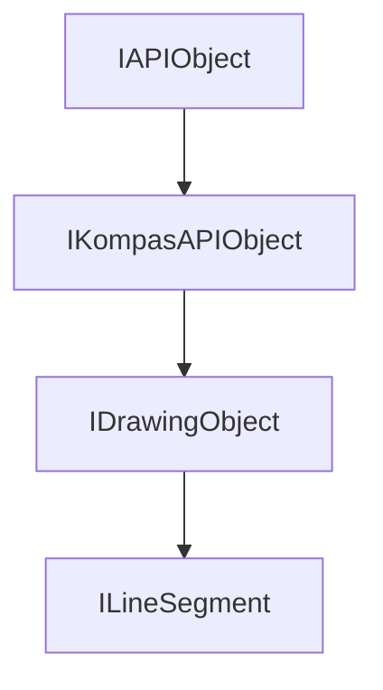

<!-- # **Документация интерфейса ILineSegment КОМПАС API** -->

# **Интерфейс ILineSegment**

## Иерархия наследования

<style>
.top-parent{
    color: #ffe3d8;
    background: green;
    border: 3px solid #046709;
    border-radius: 4px;
    padding: 5px;
    text-align: center;
    margin-bottom: 5px;
    font-weight: bold;
    width: 40%;
    max-width: 220px;
}

.other-parents{
    color: #ffe3d8;
    background: #4a6fa5;
    border: 3px solid #3d5b87;
    border-radius: 4px;
    padding: 5px;
    text-align: center;
    margin: 5px 10%;
    font-weight: bold;
    width: 40%;
    max-width: 220px;
}

.interface{
    color: #ffe3d8;
    background: #103874;
    border: 3px solid #002152;
    border-radius: 4px;
    padding: 5px;
    text-align: center;
    margin: 5px 10%;
    font-weight: bold;
    width: 40%;
    max-width: 220px;
}
</style>

<div style="padding: 10px; background: #f5f5f5; border-radius: 5px; max-width: auto; margin-bottom: 20px">
<div class="top-parent">IAPIObject</div>

<div style="text-align: left; color:black; margin: 5px 15%;">▼</div>
<div class="other-parents">IKompasAPIObject</div>

<div style="text-align: left; color:black; margin: 5px 25%;">▼</div>
<div class="other-parents" style="margin: 5px 20%;">IDrawingObject</div>

<div style="text-align: left; color:black; margin: 5px 35%;">▼</div>
<div class="interface" style="margin: 5px 30%;">ILineSegment</div>
</div>



## Общее описание

Интерфейс `ILineSegment` представляет отрезок в 2D документе. Отрезок является одним из базовых графических примитивов, используемых для создания геометрических построений, контуров, рамок, таблиц и других элементов документа.

Отрезок определяется координатами двух точек (начальной и конечной) в системе координат вида. Интерфейс предоставляет методы для получения и установки координат точек, а также для работы с производными параметрами — длиной и углом наклона отрезка.

Отрезок входит в состав графического контейнера [IDrawingContainer](interface_page_files/IDrawingContainer.md) и управляется через коллекцию [ILineSegments](interface_page_files/ILineSegments.md).

## Важные примечания

1. **Обязательный вызов Update()** — после установки параметров отрезка необходимо вызвать метод `Update()`, иначе изменения не будут применены и объект не отобразится в документе.
2. **Проверка указателей** — после получения отрезка через `Add()` или `GetLineSegment()` всегда проверяйте валидность указателя. Если коллекция пуста или индекс некорректен, методы возвращают nullptr.
3. **Система координат** — все координаты задаются в системе координат вида. Если вид был перемещён или повёрнут, координаты отрезка также трансформируются.
4. **Стиль линии** — отрезок наследует интерфейс IDrawingObject и имеет метод `SetStyle()` для установки стиля линии (толщина, тип).

## Получение интерфейса

1. **Из коллекции отрезков:**
   - `ILineSegments::Add` - создание нового отрезка
   - `ILineSegments::GetLineSegment` - получение по индексу

2. **Приведение типов:**
   - Через `SmartPtr<Interface>` от `IDrawingObjectPtr`

## Методы интерфейса

### Группа 1: Координаты точек

- [`SetX1 / GetX1`](#setx1--getx1) - координата X первой точки
- [`SetY1 / GetY1`](#sety1--gety1) - координата Y первой точки
- [`SetX2 / GetX2`](#setx2--getx2) - координата X второй точки
- [`SetY2 / GetY2`](#sety2--gety2) - координата Y второй точки

### Группа 2: Геометрические параметры

- [`SetLength / GetLength`](#setlength--getlength) - длина отрезка
- [`SetAngle / GetAngle`](#setangle--getangle) - угол наклона к оси X

---

### SetX1 / GetX1

[Координаты точек](#группа-1-координаты-точек) | [К оглавлению](#методы-интерфейса)

**Кратко:** Получение и установка координаты X первой точки отрезка.

**Полное описание:**
Методы `SetX1()` и `GetX1()` работают с координатой по оси X первой точки отрезка. Первая точка является начальной точкой при построении отрезка и используется как точка отсчёта при установке угла наклона через `SetAngle()`.

**Синтаксис:**

```cpp
virtual void SetX1(double x1) = 0;
virtual double GetX1() = 0;
```

**Параметры SetX1:**

- `x1` (in) - координата X первой точки в единицах документа (мм)

**Возвращаемое значение GetX1:**

- `double` - координата X первой точки в единицах документа (мм)

#### **Пример использования**

**Минимальный пример:**

```cpp
// Установка координаты X первой точки
lineSegment->SetX1(50.0);

// Получение координаты X первой точки
double x1 = lineSegment->GetX1();
```

**Расширенный пример:**

```cpp
// Установка координат первой точки
lineSegment->SetX1(100.0);
lineSegment->SetY1(100.0);
lineSegment->SetX2(150.0);
lineSegment->SetY2(110.0);
lineSegment->SetStyle(ksCurveStyleEnum::ksCSNormal);
lineSegment->Update();

// Получение координат для создания размера
ksapi::ILineSegmentPtr lineSeg = /* ... */;
dim->SetX1(lineSeg->GetX1());
dim->SetY1(lineSeg->GetY1());
dim->SetX2(lineSeg->GetX2());
dim->SetY2(lineSeg->GetY2());
```

**Примечания:**

- Координата может быть отрицательной
- Точность координат - до 6 знаков после запятой

---

### SetY1 / GetY1

[Координаты точек](#группа-1-координаты-точек) | [К оглавлению](#методы-интерфейса)

**Кратко:** Получение и установка координаты Y первой точки отрезка.

**Полное описание:**
Методы `SetY1()` и `GetY1()` работают с координатой по оси Y первой точки отрезка. Совместно с `SetX1()` определяют положение начальной точки отрезка в системе координат вида.

**Синтаксис:**

```cpp
virtual void SetY1(double y1) = 0;
virtual double GetY1() = 0;
```

**Параметры SetY1:**

- `y1` (in) - координата Y первой точки в единицах документа (мм)

**Возвращаемое значение GetY1:**

- `double` - координата Y первой точки в единицах документа (мм)

#### **Пример использования**

**Минимальный пример:**

```cpp
// Установка координаты Y первой точки
lineSegment->SetY1(30.0);

// Получение координаты Y первой точки
double y1 = lineSegment->GetY1();
```

**Расширенный пример:**

```cpp
// Создание квадрата из отрезков (Source/Steps/Step3/Step3.cpp)
line1->SetX1(20);
line1->SetY1(30);
line1->SetX2(50);
line1->SetY2(30);

line2->SetX1(50);
line2->SetY1(10);
line2->SetX2(20);
line2->SetY2(10);
```

**Примечания:**

- Система координат КОМПАС - правая, с осью Y, направленной вверх
- Начало координат обычно располагается в левом нижнем углу листа или в начале локальной системы координат вида

---

### SetX2 / GetX2

[Координаты точек](#группа-1-координаты-точек) | [К оглавлению](#методы-интерфейса)

**Кратко:** Получение и установка координаты X второй точки отрезка.

**Полное описание:**
Методы `SetX2()` и `GetX2()` работают с координатой по оси X второй точки отрезка. Вторая точка определяет конечную точку отрезка и направление построения.

**Синтаксис:**

```cpp
virtual void SetX2(double x2) = 0;
virtual double GetX2() = 0;
```

**Параметры SetX2:**

- `x2` (in) - координата X второй точки в единицах документа (мм)

**Возвращаемое значение GetX2:**

- `double` - координата X второй точки в единицах документа (мм)

#### **Пример использования**

**Минимальный пример:**

```cpp
// Установка координаты X второй точки
lineSegment->SetX2(200.0);

// Получение координаты X второй точки
double x2 = lineSegment->GetX2();
```

**Расширенный пример:**

```cpp
// Изменение параметров отрезка (Source/Steps/Step3/Step3.cpp)
lineSeg->SetX2(30);
lineSeg->SetY2(60);
lineSeg->SetStyle(ksCSThin);
lineSeg->Update();
```

---

### SetY2 / GetY2

[Координаты точек](#группа-1-координаты-точек) | [К оглавлению](#методы-интерфейса)

**Кратко:** Получение и установка координаты Y второй точки отрезка.

**Полное описание:**
Методы `SetY2()` и `GetY2()` работают с координатой по оси Y второй точки отрезка. Совместно с `SetX2()` определяют положение конечной точки отрезка.

**Синтаксис:**

```cpp
virtual void SetY2(double y2) = 0;
virtual double GetY2() = 0;
```

**Параметры SetY2:**

- `y2` (in) - координата Y второй точки в единицах документа (мм)

**Возвращаемое значение GetY2:**

- `double` - координата Y второй точки в единицах документа (мм)

---

### SetLength / GetLength

[Геометрические параметры](#группа-2-геометрические-параметры) | [К оглавлению](#методы-интерфейса)

**Кратко:** Получение и установка длины отрезка.

**Полное описание:**
Методы `SetLength()` и `GetLength()` работают с длиной отрезка. `SetLength()` задаёт длину отрезка, перестраивая его от первой точки ([X1, Y1]) в направлении второй точки ([X2, Y2]), сохраняя угол наклона.

**Синтаксис:**

```cpp
virtual void SetLength(double length) = 0;
virtual double GetLength() = 0;
```

**Параметры SetLength:**

- `length` (in) - длина отрезка в единицах документа (мм). Должна быть положительной.

**Возвращаемое значение GetLength:**

- `double` - длина отрезка в единицах документа (мм)

#### **Пример использования**

**Минимальный пример:**

```cpp
// Установка длины отрезка
lineSegment->SetLength(50.0);

// Получение длины отрезка
double length = lineSegment->GetLength();
```

**Расширенный пример:**

```cpp
// Создание отрезка заданной длины
lineSeg->SetX1(100);
lineSeg->SetY1(100);
lineSeg->SetLength(50.0);  // Длина 50 мм
lineSeg->SetAngle(45.0);   // Угол 45 градусов
lineSeg->Update();

// Проверка длины отрезка перед созданием размера
ksapi::ILineSegmentPtr line = /* ... */;
double len = line->GetLength();
if (len > 0)
{
    // Создание линейного размера
}
```

---

### SetAngle / GetAngle

[Геометрические параметры](#группа-2-геометрические-параметры) | [К оглавлению](#методы-интерфейса)

**Кратко:** Получение и установка угла наклона отрезка к оси X текущей системы координат.

**Полное описание:**
Методы `SetAngle()` и `GetAngle()` работают с углом наклона отрезка относительно положительного направления оси X. Угол отсчитывается против часовой стрелки от оси X к отрезку. `SetAngle()` перестраивает отрезок от первой точки с сохранением длины. 

**Синтаксис:**

```cpp
virtual void SetAngle(double angle) = 0;
virtual double GetAngle() = 0;
```

**Параметры SetAngle:**

- `angle` (in) - угол наклона в градусах. Может быть любым вещественным числом (включая отрицательные и значения больше 360°).

**Возвращаемое значение GetAngle:**

- `double` - угол наклона в градусах в диапазоне (-180, 180]

#### **Пример использования**

**Минимальный пример:**

```cpp
// Установка угла наклона
lineSegment->SetAngle(45.0);

// Получение угла наклона
double angle = lineSegment->GetAngle();
```

**Расширенный пример:**

```cpp
// Создание горизонтального отрезка
lineSeg->SetX1(100);
lineSeg->SetY1(100);
lineSeg->SetLength(50);
lineSeg->SetAngle(0);   // Горизонтально вправо

// Создание вертикального отрезка
lineSeg2->SetX1(100);
lineSeg2->SetY1(100);
lineSeg2->SetLength(50);
lineSeg2->SetAngle(90);  // Вертикально вверх

// Создание параллельного отрезка
ksapi::ILineSegmentPtr sourceLine = /* ... */;
double angle = sourceLine->GetAngle();

ksapi::ILineSegmentPtr newLine = lineSegments->Add();
newLine->SetX1(newX1);
newLine->SetY1(newY1);
newLine->SetLength(sourceLine->GetLength());
newLine->SetAngle(angle);
newLine->Update();
```

**Примечания:**

- Угол 0° соответствует направлению вдоль оси X в положительном направлении
- Угол 90° соответствует направлению вдоль оси Y в положительном направлении
- При изменении угла длина отрезка сохраняется, вторая точка пересчитывается
- Угол может быть отрицательным (отсчёт по часовой стрелке)

---


## Частые ошибки

### 1. Забывают вызывать Update()

```cpp
// НЕПРАВИЛЬНО:
lineSegment->SetX1(100);
lineSegment->SetY1(100);
lineSegment->SetX2(200);
lineSegment->SetY2(150);
// Забыли Update() - отрезок не отобразится!

// ПРАВИЛЬНО:
lineSegment->SetX1(100);
lineSegment->SetY1(100);
lineSegment->SetX2(200);
lineSegment->SetY2(150);
lineSegment->Update(); 
```

### 2. Не проверяют указатели после получения

**Ошибка:** Работа с nullptr указателем приводит к крашу.

```cpp
// НЕПРАВИЛЬНО:
ksapi::ILineSegmentPtr line = lineSegments->Add();
line->SetX1(100);  // Краш, если Add() вернул nullptr

// ПРАВИЛЬНО:
ksapi::ILineSegmentPtr line = lineSegments->Add();
if (line)
{
    line->SetX1(100);
    line->SetY1(100);
    line->Update();
}
```

---

## Практические примеры

### Пример 1: Типичный шаблон создания отрезка

```cpp
// Source: Source/Cube/Cube.cpp
ksapi::ILineSegmentsPtr lineSegments = drawingContainer->GetLineSegments();
if (lineSegments)
{
    ksapi::ILineSegmentPtr lineSegment = lineSegments->Add();
    if (lineSegment)
    {
        lineSegment->SetX1(x1);
        lineSegment->SetY1(y1);
        lineSegment->SetX2(x2);
        lineSegment->SetY2(y2);
        lineSegment->SetStyle(style);
        lineSegment->Update();
    }
}
```

### Пример 2: Универсальная функция создания отрезка

```cpp
// Source: Source/Steps/Step3a/Step3a.cpp
ksapi::ILineSegmentPtr CreateLineSegment(ksapi::IKompasDocument2D & document, 
                                         double x1, double y1, double x2, double y2)
{
    ksapi::IDrawingContainerPtr drawingContainer = 
        document.GetViewsAndLayersManager()->GetViews()->GetActiveView();
    if (!drawingContainer)
        return nullptr;
    
    ksapi::ILineSegmentsPtr lineSegs = drawingContainer->GetLineSegments();
    if (!lineSegs)
        return nullptr;
    
    ksapi::ILineSegmentPtr lineSeg = lineSegs->Add();
    if (!lineSeg)
        return nullptr;
    
    lineSeg->SetX1(x1);
    lineSeg->SetY1(y1);
    lineSeg->SetX2(x2);
    lineSeg->SetY2(y2);
    lineSeg->Update();
    
    return lineSeg;
}
```

---


### Связанные интерфейсы

- [IDrawingObject](interface_page_files/IDrawingObject.md) - базовый интерфейс графического объекта
- [IDrawingContainer](interface_page_files/IDrawingContainer.md) - графический контейнер (вид, слой)
- [ILineSegments](interface_page_files/ILineSegments.md) - коллекция отрезков

