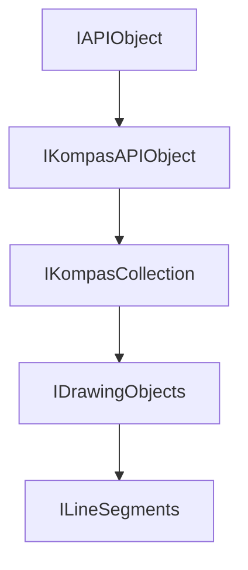

<!-- # **Документация интерфейса ILineSegments КОМПАС API** -->

# **Интерфейс ILineSegments**

## Иерархия наследования



## Общее описание

Интерфейс `ILineSegments` представляет коллекцию отрезков в 2D документе. Коллекция является контейнером для хранения и управления объектами типа [ILineSegment](interface_page_files/ILineSegment.md), обеспечивая доступ к ним по индексу и позволяя добавлять новые отрезки.

Коллекция отрезков входит в состав графического контейнера [IDrawingContainer](interface_page_files/IDrawingContainer.md) и используется для всех операций с отрезками в документе: создания, модификации и получения.

## Важные примечания

1. **Проверка возвращаемых указателей** — методы `Add()` и `GetLineSegment()` могут возвращать nullptr при ошибках. Всегда проверяйте указатель перед использованием.

2. **Индексация** — отрезки в коллекции нумеруются с нуля. При получении по индексу убедитесь, что индекс находится в допустимом диапазоне [0, GetCount()-1].

## Получение интерфейса

1. **Из графического контейнера:**
   - `IDrawingContainer::GetLineSegments` - получение коллекции отрезков

## Дополнительные интерфейсы

Интерфейс не имеет дополнительных интерфейсов, получаемых через QueryInterface.

## Методы интерфейса

- [`GetLineSegment()`](#getlinesegment) - получение отрезка по индексу
- [`Add()`](#add) - создание нового отрезка

---

### GetLineSegment

[К оглавлению](#методы-интерфейса)

**Кратко:** Возвращает отрезок по индексу.

**Полное описание:**
Метод `GetLineSegment()` возвращает указатель на отрезок, расположенный в коллекции по указанному индексу. Индексация начинается с нуля. Если индекс некорректен (отрицательный или больше или равен количеству элементов), метод возвращает nullptr.

**Синтаксис:**

```cpp
virtual ILineSegmentPtr GetLineSegment(int32_t index) = 0;
```

**Параметры:**

- `index` (in) - индекс отрезка в коллекции (начиная с 0)

**Возвращаемое значение:**

- `ILineSegmentPtr` - указатель на отрезок или nullptr, если индекс некорректен

#### **Пример использования**

**Минимальный пример:**

```cpp
// Получение первого отрезка в коллекции
ksapi::ILineSegmentPtr firstLine = lineSegments->GetLineSegment(0);
if (firstLine)
{
    double x1 = firstLine->GetX1();
    double y1 = firstLine->GetY1();
}
```

**Расширенный пример:**

```cpp
// Перебор всех отрезков в коллекции
int32_t count = lineSegments->GetCount();
for (int32_t i = 0; i < count; ++i)
{
    ksapi::ILineSegmentPtr line = lineSegments->GetLineSegment(i);
    if (line)
    {
        // Получение параметров отрезка
        double x1 = line->GetX1();
        double y1 = line->GetY1();
        double x2 = line->GetX2();
        double y2 = line->GetY2();
        double length = line->GetLength();

        // Обработка отрезка
    }
}
```

**Примечания:**

- Всегда проверяйте возвращаемый указатель на nullptr
- Индекс должен быть в диапазоне [0, GetCount()-1]

---

### Add

[К оглавлению](#методы-интерфейса)

**Кратко:** Создаёт новый отрезок и добавляет его в коллекцию.

**Полное описание:**
Метод `Add()` создаёт новый пустой отрезок и добавляет его в коллекцию. Возвращает указатель на созданный отрезок, который затем можно настроить через методы [ILineSegment](interface_page_files/ILineSegment.md). После настройки необходимо вызвать `Update()` для применения изменений.

**Синтаксис:**

```cpp
virtual ILineSegmentPtr Add() = 0;
```

**Параметры:**

Метод не принимает параметров.

**Возвращаемое значение:**

- `ILineSegmentPtr` - указатель на созданный отрезок или nullptr при ошибке создания

#### **Пример использования**

**Минимальный пример:**

```cpp
// Создание нового отрезка
ksapi::ILineSegmentPtr line = lineSegments->Add();
if (line)
{
    line->SetX1(100);
    line->SetY1(100);
    line->SetX2(200);
    line->SetY2(150);
    line->Update();
}
```

**Расширенный пример:**

```cpp
// Типичный шаблон создания отрезка (Source/Cube/Cube.cpp)
ksapi::ILineSegmentsPtr lineSegments = drawingContainer->GetLineSegments();
if (lineSegments)
{
    ksapi::ILineSegmentPtr lineSegment = lineSegments->Add();
    if (lineSegment)
    {
        lineSegment->SetX1(x1);
        lineSegment->SetY1(y1);
        lineSegment->SetX2(x2);
        lineSegment->SetY2(y2);
        lineSegment->SetStyle(style);
        lineSegment->Update();
    }
}
```

**Примечания:**

- После создания отрезка обязательно вызовите `Update()`
- Всегда проверяйте возвращаемый указатель на nullptr
- Созданный отрезок автоматически добавляется в документ

---

## Частые ошибки

### 1. Забывают вызвать Update()

**Ошибка:** Отрезок создаётся, но не отображается в документе.

```cpp
// НЕПРАВИЛЬНО:
ksapi::ILineSegmentPtr line = lineSegments->Add();
line->SetX1(100);
line->SetY1(100);
// Забыли Update()!

// ПРАВИЛЬНО:
ksapi::ILineSegmentPtr line = lineSegments->Add();
if (line)
{
    line->SetX1(100);
    line->SetY1(100);
    line->Update();  // Обязательно!
}
```

### 2. Не проверяют возвращаемый указатель

**Ошибка:** Работа с nullptr указателем приводит к крашу.

```cpp
// НЕПРАВИЛЬНО:
ksapi::ILineSegmentPtr line = lineSegments->Add();
line->SetX1(100);  // Краш, если Add() вернул nullptr

// ПРАВИЛЬНО:
ksapi::ILineSegmentPtr line = lineSegments->Add();
if (line)
{
    line->SetX1(100);
    line->SetY1(100);
    line->Update();
}
```

### 3. Выход за границы массива

**Ошибка:** Использование некорректного индекса.

```cpp
// НЕПРАВИЛЬНО:
int32_t count = lineSegments->GetCount();
ksapi::ILineSegmentPtr line = lineSegments->GetLineSegment(count);  // Выход за границы!

// ПРАВИЛЬНО:
int32_t count = lineSegments->GetCount();
if (count > 0)
{
    ksapi::ILineSegmentPtr line = lineSegments->GetLineSegment(count - 1);
}
```

---

## Практические примеры

### Пример 1: Создание нескольких отрезков

```cpp
// Создание рамки чертежа
void CreateFrame(ksapi::IDrawingContainerPtr drawingContainer, double width, double height)
{
    if (!drawingContainer)
        return;

    ksapi::ILineSegmentsPtr lines = drawingContainer->GetLineSegments();
    if (!lines)
        return;

    // Левая сторона
    ksapi::ILineSegmentPtr left = lines->Add();
    if (left)
    {
        left->SetX1(10);
        left->SetY1(10);
        left->SetX2(10);
        left->SetY2(height - 10);
        left->SetStyle(ksCSNormal);
        left->Update();
    }

    // Правая сторона
    ksapi::ILineSegmentPtr right = lines->Add();
    if (right)
    {
        right->SetX1(width - 10);
        right->SetY1(10);
        right->SetX2(width - 10);
        right->SetY2(height - 10);
        right->SetStyle(ksCSNormal);
        right->Update();
    }

    // Верхняя сторона
    ksapi::ILineSegmentPtr top = lines->Add();
    if (top)
    {
        top->SetX1(10);
        top->SetY1(height - 10);
        top->SetX2(width - 10);
        top->SetY2(height - 10);
        top->SetStyle(ksCSNormal);
        top->Update();
    }

    // Нижняя сторона
    ksapi::ILineSegmentPtr bottom = lines->Add();
    if (bottom)
    {
        bottom->SetX1(10);
        bottom->SetY1(10);
        bottom->SetX2(width - 10);
        bottom->SetY2(10);
        bottom->SetStyle(ksCSNormal);
        bottom->Update();
    }
}
```

### Пример 2: Создание сетки отрезков

```cpp
// Создание сетки из горизонтальных линий
void CreateHorizontalGrid(ksapi::IDrawingContainerPtr drawingContainer,
                         double startY, double endY, double step)
{
    if (!drawingContainer)
        return;

    ksapi::ILineSegmentsPtr lines = drawingContainer->GetLineSegments();
    if (!lines)
        return;

    double x1 = 0;
    double x2 = 200;  // Ширина сетки

    for (double y = startY; y <= endY; y += step)
    {
        ksapi::ILineSegmentPtr line = lines->Add();
        if (line)
        {
            line->SetX1(x1);
            line->SetY1(y);
            line->SetX2(x2);
            line->SetY2(y);
            line->SetStyle(ksCSThin);
            line->Update();
        }
    }
}
```

---

## Связанные интерфейсы

- [ILineSegment](ILineSegment.md) - интерфейс отрезка
- [IDrawingContainer](../IDrawingContainer.md) - графический контейнер
- [IKompasCollection](../IKompasCollection.md) - базовый интерфейс коллекции
