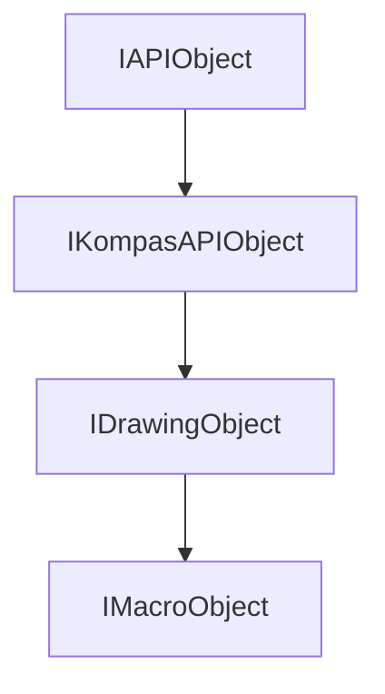

# **Интерфейс IMacroObject**

## Иерархия наследования

<style>
.top-parent{
    color: #ffe3d8;
    background: green;
    border: 3px solid #046709;
    border-radius: 4px;
    padding: 5px;
    text-align: center;
    margin-bottom: 5px;
    font-weight: bold;
    width: 40%;
    max-width: 220px;
}

.other-parents{
    color: #ffe3d8;
    background: #4a6fa5;
    border: 3px solid #3d5b87;
    border-radius: 4px;
    padding: 5px;
    text-align: center;
    margin: 5px 10%;
    font-weight: bold;
    width: 40%;
    max-width: 220px;
}

.interface{
    color: #ffe3d8;
    background: #103874;
    border: 3px solid #002152;
    border-radius: 4px;
    padding: 5px;
    text-align: center;
    margin: 5px 10%;
    font-weight: bold;
    width: 40%;
    max-width: 220px;
}
</style>

<div style="padding: 10px; background: #f5f5f5; border-radius: 5px; max-width: auto; margin-bottom: 20px">
<div class="top-parent">IAPIObject</div>

<div style="text-align: left; color:black; margin: 5px 15%;">▼</div>
<div class="other-parents">IKompasAPIObject</div>

<div style="text-align: left; color:black; margin: 5px 25%;">▼</div>

<!-- Блок 3 -->
<div class="other-parents" style="margin: 5px 20%;">IDrawingObject</div>

<!-- Стрелка -->
<div style="text-align: left; color:black; margin: 5px 35%;">▼</div>

<!-- Блок 4 -->
<div class="interface" style="margin: 5px 30%;">IMacroObject</div>
</div>



## Общее описание

Интерфейс `IMacroObject` предоставляет методы для работы с макроэлементами в системе КОМПАС-3D. Макрообъекты представляют собой составные графические элементы, которые могут содержать другие объекты чертежа (отрезки, окружности, дуги и т.д.) и обладают собственными параметрами размещения, редактирования и управления.

## Важные примечания

1. После изменения параметров макрообъекта **всегда необходимо вызывать метод `Update()`**, унаследованный от `IDrawingObject`.
2. Для любого объекта, унаследованного от `IDrawingObject`, требуется вызов `Update()` после модификации.
3. Получение дополнительных интерфейсов осуществляется через `SmartPtr<Interface>`, который автоматически вызывает `QueryInterface`.
4. Макрообъекты могут содержать различные типы объектов: графические примитивы, слои, виды, группы и другие макрообъекты.

## Получение интерфейса

1. **Из коллекции макроэлементов:**
   - `IMacroObjects::Add` - создание нового макрообъекта
   - `IMacroObjects::GetMacroObject` - получение по индексу
   - `IMacroObjects::GetMacroObjectByName` - получение по имени
2. **Из документа:**
   - `IKompasDocument2D::GetEditMacroObject` - получение редактируемого макрообъекта
   - `IKompasDocument3D::GetLibraryEditObject` - получение редактируемого макрообъекта из библиотеки

3. **Приведение типов:**
   - Через `SmartPtr<Interface>` от дополнительных интерфейсов
   - Автоматическое приведение от базовых интерфейсов

## Дополнительные интерфейсы

- [`IDrawingContainer`](../IDrawingContainer.md) - интерфейс контейнера объектов вида графического документа
- `IBuildingContainer` - интерфейс контейнера объектов СПДС
- `ISymbols2DContainer` - интерфейс контейнера условных обозначений
- `IAnnotativeContainer` - интерфейс контейнера аннотационных объектов
- `IPropertyKeeper` - интерфейс получения/редактирования значения свойств
- `IFeature` - интерфейс объекта-характеристики (для работы с подчиненными объектами)

## Методы интерфейса

### Группа 1: Основные параметры и размещение

- [`GetPlacement()` / `SetPlacement()`](#getplacement--setplacement) - получение и установка параметров размещения
- [`SetName()` / `GetName()`](#setname--getname) - управление именем макрообъекта
- [`GetLabel()`](#getlabel) - получение отображаемого имени в дереве

### Группа 2: Управление содержимым

- [`AddObjects()` / `SetObjects()`](#addobjects--setobjects) - добавление и установка объектов
- [`FindObject()`](#findobject) - поиск объекта в макроэлементе

### Группа 3: Флаги редактирования и специальные флаги

- [`SetDoubleClickEditable()` / `IsDoubleClickEditable()`](#setdoubleclickeditable--isdoubleclickeditable) - редактирование двойным щелчком
- [`SetHotPointsEditable()` / `IsHotPointsEditable()`](#sethotpointseditable--ishotpointseditable) - редактирование характерными точками
- [`SetExternalEditable()` / `IsExternalEditable()`](#setexternaleditable--isexternaleditable) - внешнее управление
- [`SetPropertyObjectEditable()` / `IsPropertyObjectEditable()`](#setpropertyobjecteditable--ispropertyobjecteditable) - внешние свойства
- [`SetCreateSpcObjects()` / `IsCreateSpcObjects()`](#setcreatespcobjects--iscreatespcobjects) - создание объектов спецификации
- [`SetBreakObjectsEnabled()` / `IsBreakObjectsEnabled()`](#setbreakobjectsenabled--isbreakobjectsenabled) - учет разрыва вида

### Группа 4: Характерные точки

- [`AddDefaultHotPoint()` / `DeleteDefaultHotPoint()`](#adddefaulthotpoint--deletedefaulthotpoint) - управление характерными точками

### Группа 5: Присоединенные выноски

- [`GetAttachedLeaders()` / `DeleteAttachedLeaders()`](#getattachedleaders--deleteattachedleaders) - работа с линиями-выносками

### Группа 6: Преобразование координат

- [`TransformPointToView()` / `TransformPointFromView()`](#transformpointtoview--transformpointfromview) - преобразование координат точки
- [`TransformAngleToView()` / `TransformAngleFromView()`](#transformangletoview--transformanglefromview) - преобразование углов

---

### GetPlacement / SetPlacement

[Основные параметры и размещение](#группа-1-основные-параметры-и-размещение) | [К оглавлению](#методы-интерфейса)

**Кратко:** Получение и установка параметров размещения макрообъекта в системе координат вида.

**Полное описание:**
Методы позволяют работать с геометрическим положением макрообъекта. `GetPlacement` возвращает текущие параметры размещения, `SetPlacement` устанавливает новые. Размещение включает координаты точки привязки, угол поворота и признак зеркального отражения.

**Синтаксис:**

```cpp
virtual bool GetPlacement(double & x, double & y, double & angle, bool & mirrorSymmetry) = 0;
virtual bool SetPlacement(double X, double Y, double Angle, bool mirrorSymmetry, bool relative) = 0;
```

**Параметры GetPlacement:**

- `x` (out) - координата X точки привязки
- `y` (out) - координата Y точки привязки
- `angle` (out) - угол поворота в градусах (0-360)
- `mirrorSymmetry` (out) - признак зеркального отражения

**Параметры SetPlacement:**

- `X` (in) - новая координата X точки привязки
- `Y` (in) - новая координата Y точки привязки
- `Angle` (in) - новый угол поворота в градусах
- `mirrorSymmetry` (in) - новый признак зеркального отражения
- `relative` (in) - признак относительного изменения координат

**Возвращаемое значение:** `true` - операция выполнена успешно, `false` - произошла ошибка

#### **Пример использования**

**Минимальный пример:**

```cpp
double x, y, angle;
bool mirror;
macroObj->GetPlacement(x, y, angle, mirror);
macroObj->SetPlacement(x + 10, y + 10, angle + 15, false, false);
macroObj->Update();
```

**Расширенный пример:**

```cpp
// Получение и изменение параметров размещения макрообъекта
ksapi::IKompasDocument3DPtr doc3D(ksAppl ? ksAppl->GetActiveDocument() : nullptr);
if (doc3D)
{
    ksapi::IMacroObject3DPtr macroObject(doc3D->GetLibraryEditObject());
    if (macroObject && macroObject->IsValid())
    {
        // Получаем текущие параметры размещения
        double x = 0, y = 0, angle = 0;
        bool mirror = false;
        macroObject->GetPlacement(x, y, angle, mirror);

        // Изменяем параметры размещения
        macroObject->SetPlacement(x + 10, y + 10, angle + 15, !mirror, false);
        macroObject->Update();
    }
}
```

**Примечания:**

- После вызова `SetPlacement()` всегда необходимо вызывать `Update()` для применения изменений
- При `relative = true` новые координаты прибавляются к текущим, при `false` - заменяют их
- Угол поворота задается в градусах, положительное направление - против часовой стрелки
- Зеркальное отражение применяется относительно вертикальной оси макрообъекта

---

### SetName / GetName

[Основные параметры и размещение](#группа-1-основные-параметры-и-размещение) | [К оглавлению](#методы-интерфейса)

**Кратко:** Установка и получение имени макрообъекта в дереве чертежа.

**Полное описание:**
Имя макрообъекта используется для идентификации в дереве документа КОМПАС-3D. Метод `SetName()` задает имя, `GetName()` возвращает текущее имя. Имя может использоваться для поиска макрообъекта через `GetMacroObjectByName()`.

**Синтаксис:**

```cpp
virtual void SetName(const std::wstring & name) = 0;
virtual std::wstring GetName() = 0;
```

**Параметры SetName:**

- `name` (in) - новое имя макрообъекта (строка Unicode)

**Возвращаемое значение GetName:** Текущее имя макрообъекта в виде строки `std::wstring`

#### **Пример использования**

**Минимальный пример:**

```cpp
// Установка имени
macroObj->SetName(L"Мой макрообъект");

// Получение имени
std::wstring name = macroObj->GetName();
```

**Расширенный пример:**

```cpp
// Работа с именем макрообъекта
ksapi::IKompasDocument3DPtr doc3D(ksAppl ? ksAppl->GetActiveDocument() : nullptr);
if (doc3D)
{
    ksapi::IMacroObject3DPtr macroObject(doc3D->GetLibraryEditObject());
    if (macroObject)
    {
        // Устанавливаем имя
        macroObject->SetName(L"Отверстие_1");

        // Получаем имя
        std::wstring name = macroObject->GetName();
        std::wstring label = macroObject->GetLabel();

        // Поиск макрообъекта по имени в коллекции
        ksapi::IMacroObjectsPtr macroObjects(doc3D->GetMacroObjects());
        if (macroObjects)
        {
            ksapi::IMacroObject3DPtr foundMacro(macroObjects->GetMacroObjectByName(L"Отверстие_1"));
            if (foundMacro)
            {
                // Макрообъект найден
            }
        }
    }
}
```

**Примечания:**

- Имя макрообъекта не обязано быть уникальным в коллекции
- При поиске через `GetMacroObjectByName()` возвращается первый макрообъект с совпадающим именем
- Имя может содержать любые Unicode-символы, включая пробелы и специальные символы

---

### GetLabel

[Основные параметры и размещение](#группа-1-основные-параметры-и-размещение) | [К оглавлению](#методы-интерфейса)

**Кратко:** Получение отображаемого имени объекта в дереве документа.

**Полное описание:**
Возвращает имя, которое отображается для пользователя в дереве документа КОМПАС-3D. В отличие от `GetName()`, которое возвращает внутреннее имя, `GetLabel()` может возвращать локализованное или форматированное имя для отображения в интерфейсе.

**Синтаксис:**

```cpp
virtual std::wstring GetLabel() = 0;
```

**Возвращаемое значение:** Отображаемое имя макрообъекта в виде строки `std::wstring`

#### **Пример использования**

**Минимальный пример:**

```cpp
std::wstring displayName = macroObj->GetLabel();
```

**Расширенный пример:**

```cpp
// Получение отображаемого и внутреннего имени
ksapi::IKompasDocument3DPtr doc3D(ksAppl ? ksAppl->GetActiveDocument() : nullptr);
if (doc3D)
{
    ksapi::IMacroObject3DPtr macroObject(doc3D->GetLibraryEditObject());
    if (macroObject)
    {
        std::wstring label = macroObject->GetLabel();
        std::wstring internalName = macroObject->GetName();

        if (label != internalName)
        {
            // Имена отличаются
        }
    }
}
```

**Примечания:**

- `GetLabel()` обычно возвращает более "дружественное" имя, чем `GetName()`
- Для новых макрообъектов, созданных через API, `GetLabel()` и `GetName()` могут возвращать одинаковые значения
- Метод полезен при создании пользовательских интерфейсов для отображения объектов

---

### AddObjects / SetObjects

[Управление содержимым](#группа-2-управление-содержимым) | [К оглавлению](#методы-интерфейса)

**Кратко:** Добавление объектов в макрообъект или полная замена его содержимого.

**Полное описание:**
`AddObjects()` добавляет переданные объекты к существующему содержимому макрообъекта. `SetObjects()` полностью заменяет содержимое макрообъекта новыми объектами. Оба метода принимают вектор указателей на объекты, реализующие интерфейс `IKompasAPIObject`.

**Синтаксис:**

```cpp
virtual bool AddObjects(const std::vector<IKompasAPIObjectPtr> & objects) = 0;
virtual bool SetObjects(const std::vector<IKompasAPIObjectPtr> & objects) = 0;
```

**Параметры (для обоих методов):**

- `objects` (in) - вектор указателей на объекты для добавления/установки

**Возвращаемое значение:** `true` - операция выполнена успешно, `false` - произошла ошибка

#### **Пример использования**

**Минимальный пример:**

```cpp
std::vector<ksapi::IKompasAPIObjectPtr> objects;
objects.push_back(lineSegment);
macroObj->AddObjects(objects);
macroObj->Update();
```

**Расширенный пример:**

```cpp
// Добавление объектов в макрообъект
ksapi::IKompasDocument2DPtr doc2D(ksAppl ? ksAppl->GetActiveDocument() : nullptr);
if (doc2D)
{
    ksapi::IMacroObjectPtr macroObject(doc2D->GetEditMacroObject());
    if (macroObject)
    {
        std::vector<ksapi::IKompasAPIObjectPtr> objects;

        // Добавляем отрезок из коллекции документа
        ksapi::ILineSegmentsPtr lines(doc2D->GetLineSegments());
        if (lines && lines->GetCount() > 0)
        {
            objects.push_back(lines->GetLineSegment(0));
        }

        // Добавляем окружность
        ksapi::ICirclesPtr circles(doc2D->GetCircles());
        if (circles && circles->GetCount() > 0)
        {
            objects.push_back(circles->GetCircle(0));
        }

        // Добавляем объекты в макрообъект
        if (!objects.empty())
        {
            macroObject->AddObjects(objects);
            macroObject->Update();
        }

        // Полная замена содержимого через группу
        ksapi::IDrawingGroupPtr group(doc2D->GetActiveDrawingGroup());
        if (group)
        {
            std::vector<ksapi::IKompasAPIObjectPtr> newObjects;
            newObjects.push_back(group);
            macroObject->SetObjects(newObjects);
            macroObject->Update();
        }
    }
}
```

**Примечания:**

- После добавления объектов всегда необходимо вызывать `Update()`
- Объекты должны быть созданы в том же документе, что и макрообъект
- При добавлении объектов через `AddObjects()` существующее содержимое макрообъекта сохраняется
- `SetObjects()` полностью заменяет содержимое, удаляя предыдущие объекты

---

### FindObject

[Управление содержимым](#группа-2-управление-содержимым) | [К оглавлению](#методы-интерфейса)

**Кратко:** Поиск объекта в макроэлементе, ближайшего к заданной точке.

**Полное описание:**
Ищет графический объект внутри макрообъекта, который находится ближе всего к указанной точке и удовлетворяет заданным параметрам поиска. Метод использует интерфейс `IFindObjectParameters` для настройки критериев поиска.

**Синтаксис:**

```cpp
virtual IDrawingObjectPtr FindObject(double x, double y, double limit, const IFindObjectParametersPtr & param) = 0;
```

**Параметры:**

- `x` (in) - координата X точки поиска
- `y` (in) - координата Y точки поиска
- `limit` (in) - радиус поиска (максимальное расстояние от точки)
- `param` (in) - параметры поиска объекта

**Возвращаемое значение:** Указатель на найденный объект или `nullptr`, если объект не найден

#### **Пример использования**

**Минимальный пример:**

```cpp
ksapi::IFindObjectParametersPtr params = document->GetInterface(ksObjectFindObjectParameters);
ksapi::IDrawingObjectPtr found = macroObj->FindObject(100, 100, 50, params);
```

**Расширенный пример:**

```cpp
// Поиск объекта в макрообъекте
ksapi::IKompasDocument2DPtr doc2D(ksAppl ? ksAppl->GetActiveDocument() : nullptr);
if (doc2D)
{
    ksapi::IMacroObjectPtr macroObject(doc2D->GetEditMacroObject());
    if (macroObject)
    {
        // Получаем параметры поиска
        ksapi::IFindObjectParametersPtr findParams(doc2D->GetInterface(ksObjectFindObjectParameters));
        if (findParams)
        {
            // Настраиваем параметры поиска
            findParams->SetSearchInVisibleObjectsOnly(true);
            findParams->SetConsiderObjectLayers(true);
            findParams->SetObjectTypes(ksObjectTypeAll);

            // Ищем объект в центре макрообъекта
            double centerX = 0, centerY = 0, angle = 0;
            bool mirror = false;
            macroObject->GetPlacement(centerX, centerY, angle, mirror);

            // Поиск в радиусе 100 единиц от центра
            ksapi::IDrawingObjectPtr foundObject(macroObject->FindObject(centerX, centerY, 100, findParams));
            if (foundObject)
            {
                // Объект найден - выделяем его
                foundObject->SetSelected(true);
            }
        }
    }
}
```

**Примечания:**

- Радиус поиска `limit` задается в единицах измерения документа
- Метод ищет только среди объектов, находящихся внутри макрообъекта
- Для сложных поисков можно настроить `IFindObjectParameters` для фильтрации по типам объектов, слоям и другим критериям
- Возвращаемый объект требует приведения к конкретному типу через соответствующий интерфейс

---

### SetDoubleClickEditable / IsDoubleClickEditable

[Флаги редактирования и специальные флаги](#группа-3-флаги-редактирования-и-специальные-флаги) | [К оглавлению](#методы-интерфейса)

**Кратко:** Управление возможностью редактирования макрообъекта по двойному щелчку мыши.

**Полное описание:**
Устанавливает или проверяет, можно ли редактировать макрообъект двойным щелчком мыши в интерфейсе КОМПАС-3D. Когда этот флаг установлен, пользователь может дважды щелкнуть по макрообъекту для открытия диалога редактирования или запуска макроса.

**Синтаксис:**

```cpp
virtual void SetDoubleClickEditable(bool editable) = 0;
virtual bool IsDoubleClickEditable() = 0;
```

**Параметры SetDoubleClickEditable:**

- `editable` (in) - признак возможности редактирования по двойному щелчку

**Возвращаемое значение IsDoubleClickEditable:** `true` - редактирование разрешено, `false` - запрещено

#### **Пример использования**

**Минимальный пример:**

```cpp
// Разрешаем редактирование по двойному щелчку
macroObj->SetDoubleClickEditable(true);

// Проверяем текущее состояние
bool canEdit = macroObj->IsDoubleClickEditable();
```

**Расширенный пример:**

```cpp
// Настройка редактирования макрообъекта
ksapi::IKompasDocument3DPtr doc3D(ksAppl ? ksAppl->GetActiveDocument() : nullptr);
if (doc3D)
{
    ksapi::IMacroObject3DPtr macroObject(doc3D->GetLibraryEditObject());
    if (macroObject)
    {
        // Включаем редактирование по двойному щелчку
        macroObject->SetDoubleClickEditable(true);

        // Проверяем состояние
        if (macroObject->IsDoubleClickEditable())
        {
            // Редактирование разрешено
        }
    }
}
```

**Примечания:**

- Изменение этого флага требует вызова `Update()` для применения
- При двойном щелчке может вызываться как стандартный диалог КОМПАС, так и пользовательский макрос, в зависимости от настроек `IUserParameters`
- Этот флаг влияет только на поведение в графическом интерфейсе, программное редактирование через API всегда доступно

---

### SetHotPointsEditable / IsHotPointsEditable

[Флаги редактирования и специальные флаги](#группа-3-флаги-редактирования-и-специальные-флаги) | [К оглавлению](#методы-интерфейса)

**Кратко:** Управление возможностью редактирования макрообъекта через характерные точки.

**Полное описание:**
Устанавливает или проверяет, можно ли редактировать макрообъект с помощью характерных точек (hot points) в графическом интерфейсе. Когда флаг установлен, пользователь может перетаскивать характерные точки для изменения геометрии макрообъекта.

**Синтаксис:**

```cpp
virtual void SetHotPointsEditable(bool editable) = 0;
virtual bool IsHotPointsEditable() = 0;
```

**Параметры SetHotPointsEditable:**

- `editable` (in) - признак возможности редактирования через характерные точки

**Возвращаемое значение IsHotPointsEditable:** `true` - редактирование разрешено, `false` - запрещено

#### **Пример использования**

**Минимальный пример:**

```cpp
// Разрешаем редактирование через характерные точки
macroObj->SetHotPointsEditable(true);

// Проверяем состояние
bool hasHotPoints = macroObj->IsHotPointsEditable();
```

**Расширенный пример:**

```cpp
// Настройка характерных точек макрообъекта
ksapi::IKompasDocument3DPtr doc3D(ksAppl ? ksAppl->GetActiveDocument() : nullptr);
if (doc3D)
{
    ksapi::IMacroObject3DPtr macroObject(doc3D->GetLibraryEditObject());
    if (macroObject)
    {
        // Включаем редактирование через характерные точки
        macroObject->SetHotPointsEditable(true);

        // Добавляем характерную точку по умолчанию
        macroObject->AddDefaultHotPoint(150, 100);

        macroObject->Update();
    }
}
```

**Примечания:**

- Характерные точки добавляются через метод `AddDefaultHotPoint()`
- Макрообъект может иметь только одну характерную точку по умолчанию
- При отключении редактирования рекомендуется удалять характерные точки через `DeleteDefaultHotPoint()`
- Этот флаг влияет на отображение и поведение макрообъекта в графическом редакторе

---

### SetExternalEditable / IsExternalEditable

[Флаги редактирования и специальные флаги](#группа-3-флаги-редактирования-и-специальные-флаги) | [К оглавлению](#методы-интерфейса)

**Кратко:** Управление поддержкой интерфейса внешнего управления макрообъектом.

**Полное описание:**
Устанавливает или проверяет, доступен ли макрообъект для управления через внешние приложения или скрипты. Когда флаг установлен, макрообъект может получать команды и данные из внешних источников через механизмы межпроцессного взаимодействия.

**Синтаксис:**

```cpp
virtual void SetExternalEditable(bool editable) = 0;
virtual bool IsExternalEditable() = 0;
```

**Параметры SetExternalEditable:**

- `editable` (in) - признак поддержки внешнего управления

**Возвращаемое значение IsExternalEditable:** `true` - внешнее управление разрешено, `false` - запрещено

#### **Пример использования**

**Минимальный пример:**

```cpp
// Разрешаем внешнее управление
macroObj->SetExternalEditable(true);

// Проверяем состояние
bool externalAccess = macroObj->IsExternalEditable();
```

**Расширенный пример:**

```cpp
// Настройка внешнего управления макрообъектом
ksapi::IKompasDocument3DPtr doc3D(ksAppl ? ksAppl->GetActiveDocument() : nullptr);
if (doc3D)
{
    ksapi::IMacroObject3DPtr macroObject(doc3D->GetLibraryEditObject());
    if (macroObject)
    {
        // Включаем внешнее управление
        macroObject->SetExternalEditable(true);
        macroObject->SetPropertyObjectEditable(true);

        macroObject->Update();
    }
}
```

**Примечания:**

- Внешнее управление обычно используется для интеграции с системами автоматизации
- При включенном внешнем управлении рекомендуется отключать UI-редактирование для предотвращения конфликтов
- Внешние приложения могут использовать `IUserParameters` для передачи данных макрообъекту
- Флаг влияет на безопасность - не включайте его для макрообъектов, которые не должны управляться извне

---

### SetPropertyObjectEditable / IsPropertyObjectEditable

[Флаги редактирования и специальные флаги](#группа-3-флаги-редактирования-и-специальные-флаги) | [К оглавлению](#методы-интерфейса)

**Кратко:** Управление поддержкой интерфейса внешних свойств объекта.

**Полное описание:**
Устанавливает или проверяет, доступен ли макрообъект для редактирования через интерфейс внешних свойств. Когда флаг установлен, макрообъект может отображать и редактировать пользовательские свойства через панель свойств КОМПАС или внешние приложения.

**Синтаксис:**

```cpp
virtual void SetPropertyObjectEditable(bool editable) = 0;
virtual bool IsPropertyObjectEditable() = 0;
```

**Параметры SetPropertyObjectEditable:**

- `editable` (in) - признак поддержки внешних свойств

**Возвращаемое значение IsPropertyObjectEditable:** `true` - редактирование свойств разрешено, `false` - запрещено

#### **Пример использования**

**Минимальный пример:**

```cpp
// Включаем поддержку внешних свойств
macroObj->SetPropertyObjectEditable(true);

// Проверяем состояние
bool hasProperties = macroObj->IsPropertyObjectEditable();
```

**Расширенный пример:**

```cpp
// Настройка свойств макрообъекта
ksapi::IKompasDocument3DPtr doc3D(ksAppl ? ksAppl->GetActiveDocument() : nullptr);
if (doc3D)
{
    ksapi::IMacroObject3DPtr macroObject(doc3D->GetLibraryEditObject());
    if (macroObject)
    {
        // Включаем интерфейс свойств
        macroObject->SetPropertyObjectEditable(true);

        // Получаем интерфейс для работы со свойствами
        ksapi::IPropertyKeeperPtr propKeeper(macroObject);
        if (propKeeper)
        {
            // Добавляем пользовательские свойства
            propKeeper->AddProperty(L"Материал", L"Сталь", ksPropertyTypeString);
            propKeeper->AddProperty(L"Масса", L"10.5", ksPropertyTypeDouble);
        }

        macroObject->Update();
    }
}
```

**Примечания:**

- При включении `SetPropertyObjectEditable(true)` макрообъект получает возможность отображать пользовательские свойства в панели свойств КОМПАС
- Для работы со свойствами необходимо также реализовать интерфейс `IPropertyKeeper`
- Свойства могут быть различных типов: строковые, числовые, логические и т.д.
- Изменения свойств через панель свойств автоматически вызывают обновление макрообъекта

---

### SetCreateSpcObjects / IsCreateSpcObjects

[Флаги редактирования и специальные флаги](#группа-3-флаги-редактирования-и-специальные-флаги) | [К оглавлению](#методы-интерфейса)

**Кратко:** Управление созданием объектов спецификации при вставке макрообъекта.

**Полное описание:**
Устанавливает или проверяет, создаются ли автоматически объекты спецификации при вставке макрообъекта в чертеж. Когда флаг установлен, система КОМПАС автоматически создает соответствующие записи в спецификации для объектов, содержащихся в макрообъекте.

**Синтаксис:**

```cpp
virtual void SetCreateSpcObjects(bool create) = 0;
virtual bool IsCreateSpcObjects() = 0;
```

**Параметры SetCreateSpcObjects:**

- `create` (in) - признак создания объектов спецификации

**Возвращаемое значение IsCreateSpcObjects:** `true` - создание разрешено, `false` - запрещено

#### **Пример использования**

**Минимальный пример:**

```cpp
// Разрешаем создание объектов спецификации
macroObj->SetCreateSpcObjects(true);

// Проверяем состояние
bool createsSpc = macroObj->IsCreateSpcObjects();
```

**Расширенный пример:**

```cpp
// Настройка спецификации для макрообъекта
ksapi::IKompasDocument3DPtr doc3D(ksAppl ? ksAppl->GetActiveDocument() : nullptr);
if (doc3D)
{
    ksapi::IMacroObject3DPtr macroObject(doc3D->GetLibraryEditObject());
    if (macroObject)
    {
        // Включаем создание объектов спецификации
        macroObject->SetCreateSpcObjects(true);

        // Устанавливаем имя для идентификации в спецификации
        macroObject->SetName(L"Деталь_001_Спецификация");

        macroObject->Update();
    }
}
```

**Примечания:**

- Флаг влияет только на автоматическое создание объектов спецификации при вставке
- Для ручного управления спецификацией необходимо использовать интерфейсы работы со спецификацией
- При включенном создании объектов спецификации рекомендуется также включать `SetPropertyObjectEditable(true)`
- Объекты спецификации создаются в соответствии с настройками документа и шаблонами спецификации

---

### SetBreakObjectsEnabled / IsBreakObjectsEnabled

[Флаги редактирования и специальные флаги](#группа-3-флаги-редактирования-и-специальные-флаги) | [К оглавлению](#методы-интерфейса)

**Кратко:** Управление учетом разрыва вида для объектов внутри макрообъекта.

**Полное описание:**
Устанавливает или проверяет, учитывается ли разрыв вида для объектов, содержащихся в макрообъекте. Когда флаг установлен, объекты внутри макрообъекта корректно отображаются и обрабатываются при наличии разрывов на виде.

**Синтаксис:**

```cpp
virtual void SetBreakObjectsEnabled(bool enabled) = 0;
virtual bool IsBreakObjectsEnabled() = 0;
```

**Параметры SetBreakObjectsEnabled:**

- `enabled` (in) - признак учета разрыва вида

**Возвращаемое значение IsBreakObjectsEnabled:** `true` - учет разрешен, `false` - запрещен

#### **Пример использования**

**Минимальный пример:**

```cpp
// Включаем учет разрыва вида
macroObj->SetBreakObjectsEnabled(true);

// Проверяем состояние
bool breakEnabled = macroObj->IsBreakObjectsEnabled();
```

**Расширенный пример:**

```cpp
// Настройка разрывов вида для макрообъекта
ksapi::IKompasDocument3DPtr doc3D(ksAppl ? ksAppl->GetActiveDocument() : nullptr);
if (doc3D)
{
    ksapi::IMacroObject3DPtr macroObject(doc3D->GetLibraryEditObject());
    if (macroObject)
    {
        // Устанавливаем флаг учета разрывов
        macroObject->SetBreakObjectsEnabled(true);

        // Включаем редактирование характерных точек для настройки разрывов
        macroObject->SetHotPointsEditable(true);

        // Добавляем характерные точки для управления разрывами
        macroObject->AddDefaultHotPoint(200, 150);

        macroObject->Update();
    }
}
```

**Примечания:**

- Флаг влияет на отображение объектов внутри макрообъекта при наличии разрывов на виде
- При включенном учете разрывов рекомендуется использовать характерные точки для управления положением объектов
- Для сложных макрообъектов с множеством внутренних элементов учет разрывов может влиять на производительность
- Флаг следует устанавливать в соответствии с требованиями к отображению на конкретном виде

---

### AddDefaultHotPoint / DeleteDefaultHotPoint

[Характерные точки](#группа-4-характерные-точки) | [К оглавлению](#методы-интерфейса)

**Кратко:** Добавление и удаление характерной точки макрообъекта.

**Полное описание:**
`AddDefaultHotPoint()` добавляет характерную точку (hot point) к макрообъекту в указанных координатах. `DeleteDefaultHotPoint()` удаляет существующую характерную точку. Характерные точки используются для интерактивного редактирования макрообъекта в графическом интерфейсе.

**Синтаксис:**

```cpp
virtual bool AddDefaultHotPoint(double x, double y) = 0;
virtual bool DeleteDefaultHotPoint() = 0;
```

**Параметры AddDefaultHotPoint:**

- `x` (in) - координата X характерной точки в СК макрообъекта
- `y` (in) - координата Y характерной точки в СК макрообъекта

**Возвращаемое значение:** `true` - операция выполнена успешно, `false` - произошла ошибка

#### **Пример использования**

**Минимальный пример:**

```cpp
// Добавляем характерную точку
macroObj->AddDefaultHotPoint(100, 100);

// Удаляем характерную точку
macroObj->DeleteDefaultHotPoint();
```

**Расширенный пример:**

```cpp
// Управление характерными точками макрообъекта
ksapi::IKompasDocument3DPtr doc3D(ksAppl ? ksAppl->GetActiveDocument() : nullptr);
if (doc3D)
{
    ksapi::IMacroObject3DPtr macroObject(doc3D->GetLibraryEditObject());
    if (macroObject)
    {
        // Проверяем, поддерживает ли макрообъект характерные точки
        if (macroObject->IsHotPointsEditable())
        {
            // Удаляем старую точку, если есть
            macroObject->DeleteDefaultHotPoint();

            // Получаем текущее положение макрообъекта
            double x, y, angle;
            bool mirror;
            macroObject->GetPlacement(x, y, angle, mirror);

            // Добавляем характерную точку в центре
            macroObject->AddDefaultHotPoint(x, y);

            macroObject->Update();
        }
    }
}
```

**Примечания:**

- Макрообъект может иметь только одну характерную точку по умолчанию
- Координаты точки задаются в системе координат макрообъекта
- Перед добавлением новой точки рекомендуется удалять старую через `DeleteDefaultHotPoint()`
- Характерные точки работают только при включенном флаге `IsHotPointsEditable()`

---

### GetAttachedLeaders / DeleteAttachedLeaders

[Присоединенные выноски](#группа-5-присоединенные-выноски) | [К оглавлению](#методы-интерфейса)

**Кратко:** Получение коллекции присоединенных линий-выносок и их удаление.

**Полное описание:**
`GetAttachedLeaders()` возвращает коллекцию линий-выносок, присоединенных к макрообъекту. `DeleteAttachedLeaders()` удаляет все присоединенные линии-выноски. Выноски используются для создания аннотаций и обозначений, связанных с макрообъектом.

**Синтаксис:**

```cpp
virtual ILeadersPtr GetAttachedLeaders() = 0;
virtual bool DeleteAttachedLeaders() = 0;
```

**Возвращаемое значение GetAttachedLeaders:** Указатель на коллекцию линий-выносок `ILeadersPtr`

**Возвращаемое значение DeleteAttachedLeaders:** `true` - удаление выполнено успешно, `false` - произошла ошибка

#### **Пример использования**

**Минимальный пример:**

```cpp
// Получаем коллекцию присоединенных выносок
ksapi::ILeadersPtr leaders = macroObj->GetAttachedLeaders();

// Удаляем все присоединенные выноски
macroObj->DeleteAttachedLeaders();
```

**Расширенный пример:**

```cpp
// Работа с присоединенными линиями-выносками
ksapi::IKompasDocument2DPtr doc2D(ksAppl ? ksAppl->GetActiveDocument() : nullptr);
if (doc2D)
{
    ksapi::IMacroObjectPtr macroObject(doc2D->GetEditMacroObject());
    if (macroObject)
    {
        // Получаем коллекцию присоединенных выносок
        ksapi::ILeadersPtr leaders(macroObject->GetAttachedLeaders());

        if (leaders && leaders->GetCount() > 0)
        {
            // Выводим информацию о выносках
            int leaderCount = leaders->GetCount();

            // Проходим по всем выноскам
            for (int i = 0; i < leaderCount; i++)
            {
                ksapi::ILeaderPtr leader(leaders->GetLeader(i));
                if (leader)
                {
                    // Получаем свойства выноски
                    std::wstring text = leader->GetText();
                    double x, y;
                    leader->GetPosition(x, y);

                    // Можно модифицировать выноски
                    leader->SetText(L"Обозначение: " + std::to_wstring(i + 1));
                    leader->Update();
                }
            }
        }
    }
}
```

**Примечания:**

- Линии-выноски создаются в контексте документа, а не макрообъекта
- Метод `GetAttachedLeaders()` возвращает только выноски, явно присоединенные к макрообъекту
- Удаление через `DeleteAttachedLeaders()` необратимо - выноски удаляются из документа
- Для создания новых выносок необходимо использовать интерфейс `ILeaders` из контейнера документа

---

### TransformPointToView / TransformPointFromView

[Преобразование координат](#группа-6-преобразование-координат) | [К оглавлению](#методы-интерфейса)

**Кратко:** Преобразование координат точки между системами координат макрообъекта и вида.

**Полное описание:**
`TransformPointToView()` преобразует координаты точки из системы координат макрообъекта в систему координат вида. `TransformPointFromView()` выполняет обратное преобразование из системы координат вида в систему координат макрообъекта. Учитываются положение, поворот и отражение макрообъекта.

**Синтаксис:**

```cpp
virtual bool TransformPointToView(double & x, double & y) = 0;
virtual bool TransformPointFromView(double & x, double & y) = 0;
```

**Параметры (для обоих методов):**

- `x` (in/out) - координата X точки для преобразования
- `y` (in/out) - координата Y точки для преобразования

**Возвращаемое значение:** `true` - преобразование выполнено успешно, `false` - произошла ошибка

#### **Пример использования**

**Минимальный пример:**

```cpp
// Преобразование из СК макрообъекта в СК вида
double pointX = 100, pointY = 50;
macroObj->TransformPointToView(pointX, pointY);

// Обратное преобразование
macroObj->TransformPointFromView(pointX, pointY);
```

**Расширенный пример:**

```cpp
// Преобразование координат для работы с макрообъектом
ksapi::IKompasDocument2DPtr doc2D(ksAppl ? ksAppl->GetActiveDocument() : nullptr);
if (doc2D)
{
    ksapi::IMacroObjectPtr macroObject(doc2D->GetEditMacroObject());
    if (macroObject)
    {
        // Получаем текущее положение макрообъекта
        double macroX, macroY, angle;
        bool mirror;
        macroObject->GetPlacement(macroX, macroY, angle, mirror);

        // Точка в системе координат макрообъекта
        double localPointX = 100.0;
        double localPointY = 50.0;

        // Преобразование в систему координат вида
        double viewPointX = localPointX;
        double viewPointY = localPointY;
        macroObject->TransformPointToView(viewPointX, viewPointY);

        // Обратное преобразование (проверка)
        double checkX = viewPointX;
        double checkY = viewPointY;
        macroObject->TransformPointFromView(checkX, checkY);
    }
}
```

**Примечания:**

- Преобразования учитывают положение (`GetPlacement`), поворот и зеркальное отражение макрообъекта
- Для корректной работы макрообъект должен быть валидным и обновленным (`Update()`)
- Преобразования полезны для:
  - Размещения объектов относительно макрообъекта
  - Проверки попадания точек в область макрообъекта
  - Отображения подсказок и аннотаций в правильных позициях
  - Реализации интерактивного редактирования
- При ошибке преобразования методы возвращают `false`, а координаты не изменяются

---

### TransformAngleToView / TransformAngleFromView

[Преобразование координат](#группа-6-преобразование-координат) | [К оглавлению](#методы-интерфейса)

**Кратко:** Преобразование угла между системами координат макрообъекта и вида.

**Полное описание:**
`TransformAngleToView()` преобразует угол из системы координат макрообъекта в систему координат вида. `TransformAngleFromView()` выполняет обратное преобразование из системы координат вида в систему координат макрообъекта. Учитывается поворот макрообъекта относительно вида.

**Синтаксис:**

```cpp
virtual bool TransformAngleToView(double & angle) = 0;
virtual bool TransformAngleFromView(double & angle) = 0;
```

**Параметры (для обоих методов):**

- `angle` (in/out) - угол в градусах для преобразования

**Возвращаемое значение:** `true` - преобразование выполнено успешно, `false` - произошла ошибка

#### **Пример использования**

**Минимальный пример:**

```cpp
// Преобразование угла из СК макрообъекта в СК вида
double angle = 45.0; // 45 градусов в системе макрообъекта
macroObj->TransformAngleToView(angle);

// Обратное преобразование
macroObj->TransformAngleFromView(angle);
```

**Расширенный пример:**

```cpp
// Преобразование углов для работы с макрообъектом
ksapi::IKompasDocument2DPtr doc2D(ksAppl ? ksAppl->GetActiveDocument() : nullptr);
if (doc2D)
{
    ksapi::IMacroObjectPtr macroObject(doc2D->GetEditMacroObject());
    if (macroObject)
    {
        // Получаем текущий угол поворота макрообъекта
        double macroX, macroY, macroAngle;
        bool mirror;
        macroObject->GetPlacement(macroX, macroY, macroAngle, mirror);

        // Тестируем преобразование углов
        std::vector<double> testAngles = {0.0, 45.0, 90.0, 180.0, 270.0};

        for (double localAngle : testAngles)
        {
            double angleToView = localAngle;
            double angleFromView = localAngle;

            // Преобразование в систему вида
            macroObject->TransformAngleToView(angleToView);

            // Обратное преобразование (для проверки)
            macroObject->TransformAngleFromView(angleFromView);
        }
    }
}
```

**Примечания:**

- Углы задаются в градусах
- Преобразования учитывают только поворот макрообъекта, зеркальное отражение не влияет на углы
- Методы полезны для:
  - Создания объектов, ориентированных относительно макрообъекта
  - Выравнивания текста и аннотаций
  - Проверки геометрических отношений между объектами
  - Реализации интерактивных инструментов редактирования
- При ошибке преобразования методы возвращают `false`, а угол не изменяется

---

## Частые ошибки

### 1. **Забывают вызывать Update()**

```cpp
// НЕПРАВИЛЬНО
macroObj->SetPlacement(100, 100, 45, false, false);
// Изменения не применены!

// ПРАВИЛЬНО
macroObj->SetPlacement(100, 100, 45, false, false);
macroObj->Update(); // Обязательный вызов!
```

### 2. **Использование невалидных указателей**

```cpp
// НЕПРАВИЛЬНО
ksapi::IMacroObjectPtr macroObj; // Не инициализирован
macroObj->SetName(L"Test"); // Ошибка доступа!

// ПРАВИЛЬНО
ksapi::IKompasDocument3DPtr doc3D(ksAppl ? ksAppl->GetActiveDocument() : nullptr);
if (doc3D)
{
    ksapi::IMacroObject3DPtr macroObject(doc3D->GetLibraryEditObject());
    if (macroObject)
    {
        macroObject->SetName(L"Test");
        macroObject->Update();
    }
}
```

### 3. **Несоответствие систем координат**

```cpp
// НЕПРАВИЛЬНО
double x = 100, y = 100;
// Координаты в системе вида, а нужны в системе макрообъекта
macroObj->AddDefaultHotPoint(x, y);

// ПРАВИЛЬНО
double x = 100, y = 100;
// Преобразуем в систему макрообъекта
macroObj->TransformPointFromView(x, y);
macroObj->AddDefaultHotPoint(x, y);
macroObj->Update();
```

### 4. **Множественное добавление характерных точек**

```cpp
// НЕПРАВИЛЬНО
macroObj->AddDefaultHotPoint(100, 100);
macroObj->AddDefaultHotPoint(200, 200); // Заменяет предыдущую
// Остается только последняя точка

// ПРАВИЛЬНО
macroObj->DeleteDefaultHotPoint(); // Удаляем старую
macroObj->AddDefaultHotPoint(200, 200); // Добавляем новую
macroObj->Update();
```

### 5. **Неправильное использование SmartPtr**

```cpp
// НЕПРАВИЛЬНО (избыточно)
ksapi::IMacroObjectPtr macroObj(drawingObj.Get());

// ПРАВИЛЬНО (SmartPtr делает это автоматически)
ksapi::IMacroObjectPtr macroObj = drawingObj;
```

### 6. **Непроверка указателей после приведения SmartPtr**

```cpp
// НЕПРАВИЛЬНО
ksapi::IUserParametersPtr userParams = macroObj;
userParams->SetLibraryFileName(L"Test.dll"); // Опасно!

// ПРАВИЛЬНО
ksapi::IUserParametersPtr userParams = macroObj;
if (userParams) // Всегда проверяйте указатели после приведения
{
    userParams->SetLibraryFileName(L"Test.dll");
}
```

---

## Шаблоны кода из исходников

### Типичная структура обработки макрообъекта (из Orifice.cpp)

```cpp
// Получение активного документа
ksapi::IKompasDocument3DPtr doc3D(ksAppl ? ksAppl->GetActiveDocument() : nullptr);
if (doc3D)
{
    // Получение редактируемого макрообъекта
    ksapi::IMacroObject3DPtr macroObject(doc3D->GetLibraryEditObject());
    if (macroObject && macroObject->IsValid())
    {
        // Получение параметров размещения
        double x, y, angle;
        bool mirror;
        macroObject->GetPlacement(x, y, angle, mirror);

        // Изменение параметров
        macroObject->SetPlacement(x, y, angle, mirror, false);

        // Получение подчиненных объектов (эскиз, операция)
        ksapi::IFeaturePtr macroFeature(macroObject);
        if (macroFeature)
        {
            std::vector<ksapi::IFeaturePtr> objects = macroFeature->GetSubFeatures(ksOperTree, true, true);
            if (objects.size() >= 2)
            {
                ksapi::ISketchPtr sketch(objects[0]);
                ksapi::IExtrusionPtr cutExtrusion(objects[1]);

                if (sketch)
                {
                    // Редактирование эскиза
                    if (ksapi::IKompasDocument2DPtr document = sketch->BeginEdit(false))
                    {
                        // Создание геометрии
                        ksapi::IDrawingObjectPtr circle = /* создание окружности */;
                        sketch->EndEdit();
                    }
                    sketch->Update();
                }
            }
        }

        // Обновление макрообъекта
        macroObject->Update();

        // Перестроение документа
        doc3D->RebuildDocument();
    }
}
```

### Работа с пользовательскими данными (из Orifice.cpp)

```cpp
// Структура параметров макрообъекта
struct MacroPar
{
    double diam;
};

// Сохранение пользовательских данных
void SaveUserData(ksapi::IMacroObject3DPtr macroObject, double diameter)
{
    ksapi::IUserDataStoragePtr userData(macroObject);
    if (userData)
    {
        MacroPar pars{diameter};
        void * params = static_cast<void *>(&pars);
        const uint8_t * data = static_cast<const uint8_t *>(params);
        userData->SetUserParams(std::vector<uint8_t>{data, data + sizeof(pars)});
    }
}

// Загрузка пользовательских данных
void LoadUserData(ksapi::IMacroObject3DPtr macroObject, double & diameter)
{
    ksapi::IUserDataStoragePtr userData(macroObject);
    if (userData)
    {
        std::vector<uint8_t> userParams = userData->GetUserParams();
        if (userParams.size() == sizeof(MacroPar))
        {
            MacroPar * pars = reinterpret_cast<MacroPar *>(userParams.data());
            diameter = pars->diam;
        }
    }
}
```

### Инициализация библиотеки (из MacroObj.cpp)

```cpp
// Глобальные переменные
ksapi::IApplication * ksAppl = nullptr;
ksapi::IProceduresLibraryPtr myLibrary;

// Головная функция библиотеки
void RunCommand(int32_t commandId, ksapi::ksRunCommandModeEnum mode)
{
    switch (commandId)
    {
        case 1:
        {
            // Создание и инициализация макрообъекта
            Orifice * macroObj = new Orifice();
            if (macroObj->InitProcessParam())
                macroObj->ChoiceFaces();
            break;
        }
    }
}

// Загрузка библиотеки
APP_EXP_FUNC(bool) LoadKompasLibrary(ksapi::IApplication & app, ksapi::IKompasLibraryActions & libraryActions)
{
    libraryActions.AddGetApplicationVersion(GetApplicationVersion);
    libraryActions.AddRunCommandHandler(RunCommand);
    libraryActions.AddGetLibraryPropertiesObjectHandler(LibPropObjectEntry);
    libraryActions.AddGetMenuIdHandler(GetMenuId);

    ksAppl = &app;

    if (ksapi::ILibraryManagerPtr libraryManager = app.GetLibraryManager())
    {
        if (ksapi::IProceduresLibrariesPtr proceduresLibraries = libraryManager->GetProceduresLibraries())
            myLibrary = proceduresLibraries->GetItemByName(L"MacroObj");
    }

    return true;
}
```
