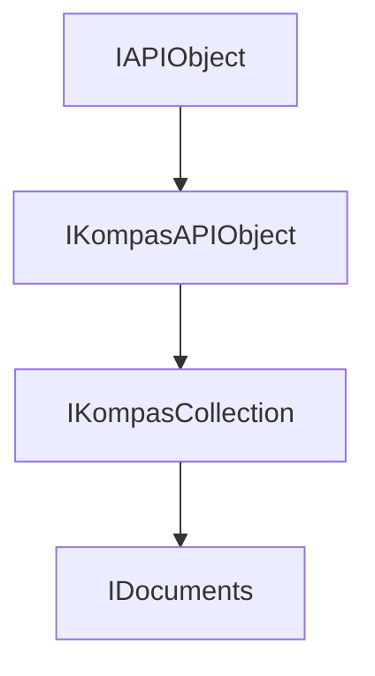

<!-- # **Документация интерфейса КОМПАС API** -->

# **Интерфейс IDocuments**

## Иерархия наследования



## Общее описание

Интерфейс `IDocuments` является центральным интерфейсом для управления коллекцией всех открытых документов в приложении КОМПАС. Он предоставляет полный набор методов для создания новых документов, открытия существующих файлов, получения доступа к документам по индексу или пути к файлу, а также управления параметрами открытия документов.

Интерфейс `IDocuments` наследует методы `IKompasCollection` и расширяет его функциональность специфичными методами для работы с документами. Через этот интерфейс можно работать со всеми типами документов КОМПАС: чертежами (2D), моделями (3D), спецификациями, фрагментами и другими.

**Основные характеристики:**

- Управление коллекцией всех открытых документов в приложении
- Создание новых документов различных типов
- Открытие существующих файлов с различными параметрами
- Поддержка режимов восстановления поврежденных файлов
- Управление синхронизацией с зависимыми документами

## Важные примечания

1. **Проверка указателей после каждого вызова** - Методы `Add()`, `Open()`, `GetItem()` могут вернуть `nullptr`. Всегда проверяйте возвращаемый указатель перед использованием, особенно при работе с вновь созданными или открытыми документами.

2. **Закрытие документов** - После работы с документом необходимо корректно закрыть его с помощью метода `Close()`, указав параметр сохранения изменений.

3. **Режимы открытия документов** - При открытии документов можно указать параметры видимости (`visible`), режима чтения (`readOnly`) и тип загрузки. Для сложных сборок важно правильно выбрать тип загрузки.

## Получение интерфейса

### Основные способы получения:

1. **Из приложения:**
   - [`IApplication::GetDocuments()`](../IApplication.md) - основной способ получения коллекции документов

2. **Пример получения:**
   ```cpp
   // Получение указателя на коллекцию документов
    ksapi::IDocumentsPtr documents = kompasApp->GetDocuments();
    if (documents)
    {
        // Работа с документами
    }
   ```

### Примеры получения:

```cpp
// Пример 1: Получение коллекции документов из приложения
ksapi::IApplicationPtr kompasApp = /* ... */;
ksapi::IDocumentsPtr documents = kompasApp->GetDocuments();
if (documents)
{
    int32_t count = documents->GetCount();
    // Работа с документами
}

// Пример 2: Создание нового документа
ksapi::IKompasDocument3DPtr newDoc = documents->AddWithDefaultSettings(ksDocumentPart, true);
if (newDoc)
{
    newDoc->SaveAs(L"C:\\Example.m3d");
}
```

## Дополнительные интерфейсы

Интерфейс `IDocuments` не имеет дополнительных интерфейсов, получаемых через QueryInterface. Однако из его методов можно получить следующие интерфейсы:

- **`IKompasDocument`** - базовый интерфейс документа (возвращается методами `Add()`, `Open()`)
- **`IKompasDocument2D`** - интерфейс 2D чертежа
- **`IKompasDocument3D`** - интерфейс 3D модели
- **`ISpecificationDocument`** - интерфейс документа спецификации
- **`IFragmentDocument`** - интерфейс фрагмента
- **`ILoadCombinationsParam`** - параметры типа загрузки документа
- **`IOpenDocumentParam`** - параметры открытия документа

## Методы интерфейса

Методы IDocuments разделены на несколько функциональных групп.

### Группа 1: Получение документов

- [`GetItem()`](#getitem) - получить документ по индексу
- [`GetItemByFilePath()`](#getitembyfilepath) - получить документ по пути к файлу

### Группа 2: Создание документов

- [`Add()`](#add) - создать новый документ по типу
- [`AddWithDefaultSettings()`](#addwithdefaultsettings) - создать документ с параметрами по умолчанию
- [`AddCustomDocument()`](#addcustomdocument) - создать документ по имени типа
- [`AddNewDocumentFromTemplate()`](#addnewdocumentfromtemplate) - создать документ из шаблона

### Группа 3: Открытие документов

- [`Open()`](#open) - открыть документ
- [`OpenByLoadCombinationIndex()`](#openbyloadcombinationindex) - открыть документ с указанием индекса типа загрузки
- [`OpenByLoadCombinationName()`](#openbyloadcombinationname) - открыть документ с указанием имени типа загрузки
- [`OpenDocument()`](#opendocument) - открыть документ с заданными параметрами
- [`GetLoadCombinations()`](#getloadcombinations) - получить массив типов загрузки
- [`GetLoadCombinationsParam()`](#getloadcombinationsparam) - получить параметры типа загрузки

### Группа 4: Управление документами

- [`SetDocumentSynchronize()` / `IsDocumentSynchronize()`](#setdocumentsynchronize--isdocumentsynchronize) - управление синхронизацией с зависимыми документами
- [`SetRecoverMode()` / `IsRecoverMode()`](#setrecovermode--isrecovermode) - управление режимом восстановления файлов
- [`GetRecoverError()`](#getrecovererror) - получить код ошибки восстановления
- [`ClearRecoverError()`](#clearrecovererror) - очистить ошибку восстановления
- [`GetRecoverModeErrorList()`](#getrecovermodeerrorlist) - получить список исправленных ошибок
- [`SetLockTemplatesSettings()` / `IsLockTemplatesSettings()`](#settlocktemplatessettings--islocktemplatessettings) - управление блокировкой шаблонов

### Группа 5: Дополнительные методы

- [`GetOpenDocumentParam()`](#getopendocumentparam) - получить параметры открытия документа
- [`GetEmbodimentsTree()`](#getembodimentstree) - получить дерево исполнений

---

### GetItem()

[Группа методов](#группа-1-получение-документов) | [К оглавлению](#методы-интерфейса)

**Кратко:** Получить документ по его индексу в коллекции.

**Полное описание:**
Метод `GetItem()` возвращает указатель на документ по указанному индексу. Индексы начинаются с 0. Это основной способ последовательного доступа к документам коллекции.

**Синтаксис:**

```cpp
virtual IKompasDocumentPtr GetItem(int32_t index) = 0;
```

**Параметры:**

- `index` (in) - индекс документа в коллекции. Должен быть в диапазоне от 0 до `GetCount() - 1`.

**Возвращаемое значение:** Умный указатель на документ КОМПАС. Может быть `nullptr`, если индекс выходит за пределы коллекции.

#### **Пример использования**

```cpp
// Итерация по всем открытым документам
ksapi::IDocumentsPtr documents = kompasApp->GetDocuments();
if (!documents)
    return;

for (int32_t i = 0, count = documents->GetCount(); i < count; ++i)
{
    ksapi::IKompasDocumentPtr doc = documents->GetItem(i);
    if (doc)
    {
        std::wstring name = doc->GetName();
        // Обработка документа
    }
}
```

---

### GetItemByFilePath()

[Группа методов](#группа-1-получение-документов) | [К оглавлению](#методы-интерфейса)

**Кратко:** Получить документ по пути к файлу.

**Полное описание:**
Метод `GetItemByFilePath()` осуществляет поиск документа в коллекции по полному пути к файлу. Если документ с указанным путём уже открыт, метод возвращает на него указатель.

**Синтаксис:**

```cpp
virtual IKompasDocumentPtr GetItemByFilePath(const std::wstring & filePath) = 0;
```

**Параметры:**

- `filePath` (in) - полный путь к файлу документа.

**Возвращаемое значение:** Умный указатель на найденный документ. Возвращает `nullptr`, если документ не найден в коллекции.

#### **Пример использования**

```cpp
// Проверка, открыт ли документ
ksapi::IDocumentsPtr documents = kompasApp->GetDocuments();
ksapi::IKompasDocumentPtr existingDoc = documents->GetItemByFilePath(L"C:\\Projects\\Model.m3d");
if (existingDoc)
{
    // Документ уже открыт, делаем его активным
    existingDoc->SetActive();
}
else
{
    // Документ не открыт, открываем его
    documents->Open(L"C:\\Projects\\Model.m3d", true, false);
}
```

---

### Add()

[Группа методов](#группа-2-создание-документов) | [К оглавлению](#методы-интерфейса)

**Кратко:** Создать новый пустой документ указанного типа.

**Полное описание:**
Метод `Add()` создаёт новый пустой документ указанного типа и добавляет его в коллекцию открытых документов. Документ создаётся с параметрами по умолчанию для данного типа документа.

**Синтаксис:**

```cpp
virtual IKompasDocumentPtr Add(DocumentTypeEnum documentType, bool visible) = 0;
```

**Параметры:**

- `documentType` (in) - тип создаваемого документа (например, `ksDocumentDrawing`, `ksDocumentPart`, `ksDocumentFragment`).
- `visible` (in) - видимость документа (true - создавать в видимом режиме, false - в невидимом).

**Возвращаемое значение:** Умный указатель на созданный документ. Возвращает `nullptr` в случае ошибки.

#### **Пример использования**

```cpp
// Создание фрагмента
ksapi::IDocumentsPtr documents = kompasApp->GetDocuments();
if (documents)
{
    ksapi::IFragmentDocumentPtr docFragment = documents->Add(DocumentTypeEnum::ksDocumentFragment, true);
    if (docFragment)
    {
        docFragment->SaveAs(L"C:\\Fragment.frw");
    }
}
```

---

### AddWithDefaultSettings()

[Группа методов](#группа-2-создание-документов) | [К оглавлению](#методы-интерфейса)

**Кратко:** Создать новый документ с параметрами из настроек для новых документов.

**Полное описание:**
Метод `AddWithDefaultSettings()` создаёт новый документ, используя параметры, заданные пользователем в настройках КОМПАС для новых документов. Это более гибкий способ создания документов, чем `Add()`.

**Синтаксис:**

```cpp
virtual IKompasDocumentPtr AddWithDefaultSettings(DocumentTypeEnum documentType, bool visible) = 0;
```

**Параметры:**

- `documentType` (in) - тип создаваемого документа.
- `visible` (in) - видимость документа.

**Возвращаемое значение:** Умный указатель на созданный документ.

#### **Пример использования**

```cpp
// Создание 3D документа с настройками по умолчанию
ksapi::IDocumentsPtr documents = kompasApp->GetDocuments();
if (documents)
{
    ksapi::IKompasDocument3DPtr pDocument3d = documents->AddWithDefaultSettings(ksDocumentPart, true);
    if (pDocument3d)
    {
        pDocument3d->SaveAs(L"C:\\Example.m3d");
    }
}
```

---

### AddCustomDocument()

[Группа методов](#группа-2-создание-документов) | [К оглавлению](#методы-интерфейса)

**Кратко:** Создать новый документ указанного пользовательского типа.

**Полное описание:**
Метод `AddCustomDocument()` создаёт новый документ пользовательского типа по имени типа. Используется для создания специализированных документов, зарегистрированных в системе.

**Синтаксис:**

```cpp
virtual IKompasDocumentPtr AddCustomDocument(const std::wstring & typeName, bool visible) = 0;
```

**Параметры:**

- `typeName` (in) - имя типа документа.
- `visible` (in) - видимость документа.

**Возвращаемое значение:** Умный указатель на созданный документ.

---

### AddNewDocumentFromTemplate()

[Группа методов](#группа-2-создание-документов) | [К оглавлению](#методы-интерфейса)

**Кратко:** Создать новый документ из файла шаблона.

**Полное описание:**
Метод `AddNewDocumentFromTemplate()` создаёт новый документ на основе файла шаблона. Шаблон может содержать предварительно настроенные параметры листов, стили и другие настройки.

**Синтаксис:**

```cpp
virtual IKompasDocumentPtr AddNewDocumentFromTemplate(const std::wstring & templateFileName, bool visible) = 0;
```

**Параметры:**

- `templateFileName` (in) - полное имя файла шаблона.
- `visible` (in) - видимость документа.

**Возвращаемое значение:** Умный указатель на созданный документ.

---

### Open()

[Группа методов](#группа-3-открытие-документов) | [К оглавлению](#методы-интерфейса)

**Кратко:** Открыть существующий документ из файла.

**Полное описание:**
Метод `Open()` открывает существующий файл документа и добавляет его в коллекцию открытых документов. Это основной способ загрузки ранее сохранённых документов.

**Синтаксис:**

```cpp
virtual IKompasDocumentPtr Open(const std::wstring & fileName, bool visible, bool readOnly) = 0;
```

**Параметры:**

- `fileName` (in) - полное имя файла документа (путь + имя + расширение).
- `visible` (in) - видимость документа (true - создавать в видимом режиме, false - в невидимом).
- `readOnly` (in) - признак открытия только для чтения.

**Возвращаемое значение:** Умный указатель на открытый документ. Возвращает `nullptr` в случае ошибки.

#### **Пример использования**

```cpp
// Открытие нескольких файлов
ksapi::IDocumentsPtr documents = kompasApp->GetDocuments();
if (documents)
{
    std::vector<std::wstring> fileNames = {L"C:\\Model1.m3d", L"C:\\Model2.m3d", L"C:\\Assembly.asm"};

    for (const auto& fileName : fileNames)
    {
        ksapi::IKompasDocumentPtr doc = documents->Open(fileName, true, false);
        if (!doc)
        {
            // Ошибка открытия файла
        }
    }
}
```

---

### OpenByLoadCombinationIndex()

[Группа методов](#группа-3-открытие-документов) | [К оглавлению](#методы-интерфейса)

**Кратко:** Открыть документ с указанием индекса типа загрузки.

**Полное описание:**
Метод `OpenByLoadCombinationIndex()` открывает документ с указанием индекса типа загрузки. Типы загрузки определяют, какие компоненты загружаются из документа (например, для сборок - только детали, детали + подсборки, полная сборка).

**Синтаксис:**

```cpp
virtual IKompasDocumentPtr OpenByLoadCombinationIndex(const std::wstring & fileName, bool visible, bool readOnly,
                                                      int32_t loadCombinationIndex) = 0;
```

**Параметры:**

- `fileName` (in) - полное имя файла документа.
- `visible` (in) - видимость документа.
- `readOnly` (in) - режим чтения.
- `loadCombinationIndex` (in) - индекс типа загрузки.

**Возвращаемое значение:** Умный указатель на открытый документ.

---

### OpenByLoadCombinationName()

[Группа методов](#группа-3-открытие-документов) | [К оглавлению](#методы-интерфейса)

**Кратко:** Открыть документ с указанием имени типа загрузки.

**Полное описание:**
Метод `OpenByLoadCombinationName()` аналогичен `OpenByLoadCombinationIndex()`, но позволяет указать имя типа загрузки вместо индекса. Более читаемый вариант для известных типов загрузки.

**Синтаксис:**

```cpp
virtual IKompasDocumentPtr OpenByLoadCombinationName(const std::wstring & fileName, bool visible, bool readOnly,
                                                     const std::wstring & loadCombinationName) = 0;
```

**Параметры:**

- `fileName` (in) - полное имя файла документа.
- `visible` (in) - видимость документа.
- `readOnly` (in) - режим чтения.
- `loadCombinationName` (in) - имя типа загрузки.

**Возвращаемое значение:** Умный указатель на открытый документ.

---

### OpenDocument()

[Группа методов](#группа-3-открытие-документов) | [К оглавлению](#методы-интерфейса)

**Кратко:** Открыть документ с расширенными параметрами.

**Полное описание:**
Метод `OpenDocument()` открывает документ с использованием детальных параметров открытия, которые задаются через интерфейс `IOpenDocumentParam`. Это наиболее гибкий способ открытия документов.

**Синтаксис:**

```cpp
virtual IKompasDocumentPtr OpenDocument(const std::wstring & fileName, const IOpenDocumentParamPtr & openParam) = 0;
```

**Параметры:**

- `fileName` (in) - полное имя файла документа.
- `openParam` (in) - умный указатель на параметры открытия документа.

**Возвращаемое значение:** Умный указатель на открытый документ.

---

### GetLoadCombinations()

[Группа методов](#группа-3-открытие-документов) | [К оглавлению](#методы-интерфейса)

**Кратко:** Получить список типов загрузки для документа.

**Полное описание:**
Метод `GetLoadCombinations()` возвращает массив доступных типов загрузки для указанного файла. Используется для получения информации о возможных режимах загрузки сборок перед открытием.

**Синтаксис:**

```cpp
virtual std::vector<std::wstring> GetLoadCombinations(const std::wstring & fileName, int32_t & currentIndex) = 0;
```

**Параметры:**

- `fileName` (in) - путь к файлу.
- `currentIndex` (out) - текущий индекс типа загрузки по умолчанию.

**Возвращаемое значение:** Массив имён типов загрузки.

---

### GetLoadCombinationsParam()

[Группа методов](#группа-3-открытие-документов) | [К оглавлению](#методы-интерфейса)

**Кратко:** Получить параметры типов загрузки документа.

**Полное описание:**
Метод `GetLoadCombinationsParam()` возвращает интерфейс для получения детальных параметров типов загрузки документа.

**Синтаксис:**

```cpp
virtual ILoadCombinationsParamPtr GetLoadCombinationsParam(const std::wstring & fileName) = 0;
```

**Параметры:**

- `fileName` (in) - путь к файлу.

**Возвращаемое значение:** Умный указатель на параметры типов загрузки.

---

### SetDocumentSynchronize() / IsDocumentSynchronize()

[Группа методов](#группа-4-управление документами) | [К оглавлению](#методы-интерфейса)

**Кратко:** Управление режимом синхронизации с зависимыми документами.

**Полное описание:**
Методы `SetDocumentSynchronize()` и `IsDocumentSynchronize()` предназначены для управления автоматической синхронизацией с зависимыми документами (например, при изменении вставленной детали в сборке). `SetDocumentSynchronize()` включает или выключает режим синхронизации. `IsDocumentSynchronize()` возвращает текущее состояние режима.

**Синтаксис:**

```cpp
virtual void SetDocumentSynchronize(bool synchronize) = 0;
virtual bool IsDocumentSynchronize() = 0;
```

**Параметры SetDocumentSynchronize:**

- `synchronize` (in) - true для включения синхронизации, false для выключения.

**Возвращаемое значение IsDocumentSynchronize:** true - синхронизация включена, false - выключена.

---

### SetRecoverMode() / IsRecoverMode()

[Группа методов](#группа-4-управление документами) | [К оглавлению](#методы-интерфейса)

**Кратко:** Управление режимом восстановления файлов.

**Полное описание:**
Методы `SetRecoverMode()` и `IsRecoverMode()` предназначены для управления режимом восстановления повреждённых файлов. `SetRecoverMode()` включает или выключает режим восстановления. При включённом режиме КОМПАС будет пытаться восстановить повреждённые файлы при открытии. `IsRecoverMode()` возвращает текущее состояние режима.

**Синтаксис:**

```cpp
virtual void SetRecoverMode(bool recoveryMode) = 0;
virtual bool IsRecoverMode() = 0;
```

**Параметры SetRecoverMode:**

- `recoveryMode` (in) - true для включения режима восстановления, false для выключения.

**Возвращаемое значение IsRecoverMode:** true - режим восстановления включен, false - выключен.

---

### GetRecoverError()

[Группа методов](#группа-4-управление-документами) | [К оглавлению](#методы-интерфейса)

**Кратко:** Получить код ошибки восстановления.

**Полное описание:**
Метод `GetRecoverError()` возвращает код ошибки, возникшей при последнем открытии файла в режиме восстановления.

**Синтаксис:**

```cpp
virtual ksRecoverErrorEnum GetRecoverError() = 0;
```

**Возвращаемое значение:** Код ошибки восстановления.

---

### ClearRecoverError()

[Группа методов](#группа-4-управление-документами) | [К оглавлению](#методы-интерфейса)

**Кратко:** Очистить признак ошибки восстановления.

**Полное описание:**
Метод `ClearRecoverError()` сбрасывает признак ошибки после открытия файла с восстановлением.

**Синтаксис:**

```cpp
virtual void ClearRecoverError() = 0;
```

---

### GetRecoverModeErrorList()

[Группа методов](#группа-4-управление-документами) | [К оглавлению](#методы-интерфейса)

**Кратко:** Получить список исправленных ошибок.

**Полное описание:**
Метод `GetRecoverModeErrorList()` возвращает массив кодов ошибок, которые были автоматически исправлены при открытии файла в режиме восстановления.

**Синтаксис:**

```cpp
virtual std::vector<int32_t> GetRecoverModeErrorList() = 0;
```

**Возвращаемое значение:** Массив кодов исправленных ошибок.

---

### SetLockTemplatesSettings() / IsLockTemplatesSettings()

[Группа методов](#группа-4-управление-документами) | [К оглавлению](#методы-интерфейса)

**Кратко:** Управление блокировкой настроек шаблонов.

**Полное описание:**
Методы `SetLockTemplatesSettings()` и `IsLockTemplatesSettings()` предназначены для управления использованием настроек шаблонов новых документов при создании через API. `SetLockTemplatesSettings()` позволяет заблокировать использование шаблонов. `IsLockTemplatesSettings()` возвращает текущее состояние блокировки.

**Синтаксис:**

```cpp
virtual void SetLockTemplatesSettings(bool lock) = 0;
virtual bool IsLockTemplatesSettings() = 0;
```

**Параметры SetLockTemplatesSettings:**

- `lock` (in) - true для блокировки, false для использования шаблонов.

**Возвращаемое значение IsLockTemplatesSettings:** true - настройки заблокированы, false - используются настройки шаблонов.

---

### GetOpenDocumentParam()

[Группа методов](#дополнительные-методы) | [К оглавлению](#методы-интерфейса)

**Кратко:** Получить параметры открытия документа.

**Полное описание:**
Метод `GetOpenDocumentParam()` возвращает интерфейс для настройки параметров открытия документов.

**Синтаксис:**

```cpp
virtual IOpenDocumentParamPtr GetOpenDocumentParam() = 0;
```

**Возвращаемое значение:** Умный указатель на параметры открытия документа.

---

### GetEmbodimentsTree()

[Группа методов](#дополнительные-методы) | [К оглавлению](#методы-интерфейса)

**Кратко:** Получить дерево исполнений документа.

**Полное описание:**
Метод `GetEmbodimentsTree()` возвращает массив узлов дерева исполнений для документа с учётом указанных параметров форматирования.

**Синтаксис:**

```cpp
virtual std::vector<std::wstring> GetEmbodimentsTree(const std::wstring & fileName, ksVariantMarkingTypeEnum markingType,
                                                     bool addSystemDelimer, bool addSpaces, int32_t & currentEmbodiment) = 0;
```

**Параметры:**

- `fileName` (in) - путь к файлу.
- `markingType` (in) - формат обозначений.
- `addSystemDelimer` (in) - добавить системный разделитель.
- `addSpaces` (in) - добавить пробелы.
- `currentEmbodiment` (out) - индекс текущего исполнения.

**Возвращаемое значение:** Массив строк дерева исполнений.

---

## Частые ошибки

### 1. Не проверяют указатель после Add() или Open()

```cpp
// НЕПРАВИЛЬНО
ksapi::IDocumentsPtr documents = kompasApp->GetDocuments();
ksapi::IKompasDocument3DPtr doc = documents->AddWithDefaultSettings(ksDocumentPart, true);
doc->SaveAs(L"C:\\Model.m3d");  // Краш! doc может быть nullptr

// ПРАВИЛЬНО
ksapi::IKompasDocument3DPtr doc = documents->AddWithDefaultSettings(ksDocumentPart, true);
if (doc)
{
    doc->SaveAs(L"C:\\Model.m3d");
}
```

### 2. Не закрывают документы после использования

```cpp
// НЕПРАВИЛЬНО
// Документы остаются открытыми, занимая память
documents->Add(ksDocumentDrawing, true);

// ПРАВИЛЬНО
ksapi::IKompasDocumentPtr doc = documents->Add(ksDocumentDrawing, true);
if (doc)
{
    // Работа с документом
    doc->Close(DocumentCloseOptions::kdDoNotSaveChanges);  // Закрываем без сохранения
}
```

### 3. Неправильный порядок параметров в Open()

```cpp
// НЕПРАВИЛЬНО
// Перепутаны параметры visible и readOnly
documents->Open(L"file.m3d", false, true);  // Открыл как видимый, но с readOnly

// ПРАВИЛЬНО
documents->Open(L"file.m3d", true, false);  // Открыть видимым, не только для чтения
```

### 4. Использование неполного пути к файлу

```cpp
// НЕПРАВИЛЬНО
documents->Open(L"model.m3d", true, false);  // Файл может не найтись

// ПРАВИЛЬНО
documents->Open(L"C:\\Projects\\model.m3d", true, false);  // Полный путь
```

---

## Практические примеры из исходников

### Пример 1: Создание 3D документа из Step3D2

```cpp
// Создать документ трехмерной модели
void CreateDocument3D()
{
  if (ksapi::IDocumentsPtr documents = kompasApp->GetDocuments())
  {
    // Создать документ трехмерной модели
    if (ksapi::IKompasDocument3DPtr pDocument3d = documents->AddWithDefaultSettings(ksDocumentPart, true))
    {
      // Установить информацию о документе
      pDocument3d->SetAuthor(L"Автор");
      pDocument3d->SetComment(L"Документ 3D модели");

      // Сохранить документ
      pDocument3d->SaveAs(L"C:\\Example.m3d");

      // Закрыть документ без сохранения
      pDocument3d->Close(DocumentCloseOptions::kdDoNotSaveChanges);
    }
  }
}
```

### Пример 2: Открытие файлов и итерация из Step3D2

```cpp
// Открыть указанные документы
void ChoiceAndOpenFiles()
{
  ksapi::IApplicationDialogsPtr applicationDialogs = kompasApp->GetApplicationDialogs();
  if (!applicationDialogs)
    return;

  ksapi::IDocumentsPtr documents = kompasApp->GetDocuments();

  // Выбор файлов пользователем
  std::vector<std::wstring> rArDocFileName = applicationDialogs->ChoiceFiles(
      nullptr, L"*.m3d", L"Файлы КОМПАС 3D", L"C://", ksSystemPathTypeEnum::ksSystemFiles, true);

  if (documents && !rArDocFileName.empty())
  {
    // Откроем все выбранные файлы
    for (const auto & fileName : rArDocFileName)
      documents->Open(fileName, true, false);

    // Итерируемся по открытым 3D документам
    for (auto docCounter = 0, count = documents->GetCount(); docCounter < count; ++docCounter)
    {
      if (ksapi::IKompasDocument3DPtr pDocument3d = documents->GetItem(docCounter))
      {
        // Обработка документа
      }
    }
  }
}
```

### Пример 3: Создание фрагмента из Step10

```cpp
// Создание фрагмента
void CreateFragment()
{
  ksapi::IDocumentsPtr documents = kompasApp->GetDocuments();
  if (!documents)
    return;

  ksapi::IFragmentDocumentPtr docFragment = documents->Add(DocumentTypeEnum::ksDocumentFragment, true);
  if (!docFragment)
    return;

  // Работа с фрагментом...
}
```

---

## Шаблон использования

### Шаблон 1: Безопасное открытие документа

```cpp
// Универсальный шаблон для открытия документа
ksapi::IKompasDocumentPtr OpenDocumentSafely(ksapi::IDocumentsPtr& documents,
                                              const std::wstring& filePath,
                                              bool visible = true,
                                              bool readOnly = false)
{
    if (!documents || filePath.empty())
        return nullptr;

    // Проверяем, не открыт ли уже документ
    ksapi::IKompasDocumentPtr existing = documents->GetItemByFilePath(filePath);
    if (existing)
    {
        existing->GetDocumentFrame()->SetActive();
        return existing;
    }

    // Открываем новый документ
    return documents->Open(filePath, visible, readOnly);
}
```

### Шаблон 2: Создание документа с проверкой

```cpp
// Шаблон для создания документа
template<typename DocType>
DocType CreateDocument(ksapi::IDocumentsPtr& documents, DocumentTypeEnum docType, bool visible = true)
{
    if (!documents)
        return nullptr;

    DocType doc = documents->Add(docType, visible);
    if (!doc)
        return nullptr;

    // Дополнительная инициализация
    return doc;
}
```

### Шаблон 3: Итерация по всем документам

```cpp
// Универсальная итерация по документам
void ProcessAllDocuments(ksapi::IDocumentsPtr documents)
{
    if (!documents)
        return;

    for (int32_t i = 0; i < documents->GetCount(); ++i)
    {
        ksapi::IKompasDocumentPtr doc = documents->GetItem(i);
        if (!doc)
            continue;

        // Обработка в зависимости от типа
        switch (doc->GetDocumentType())
        {
            case DocumentTypeEnum::ksDocumentDrawing:
                // Обработка чертежа
                break;
            case DocumentTypeEnum::ksDocumentPart:
                // Обработка 3D детали
                break;
            case DocumentTypeEnum::ksDocumentAssembly:
                // Обработка сборки
                break;
            default:
                break;
        }
    }
}
```

---

## Связанные интерфейсы

### Работа в паре с:

- **`IApplication`** - приложение КОМПАС, из которого получается IDocuments
- **`IKompasDocument`** - базовый интерфейс документа
- **`IKompasDocument2D`** - 2D документ (чертеж)
- **`IKompasDocument3D`** - 3D документ (модель)
- **`ISpecificationDocument`** - документ спецификации

### Часто используется вместе с:

- **`IOpenDocumentParam`** - параметры открытия документа
- **`ILoadCombinationsParam`** - параметры типов загрузки
