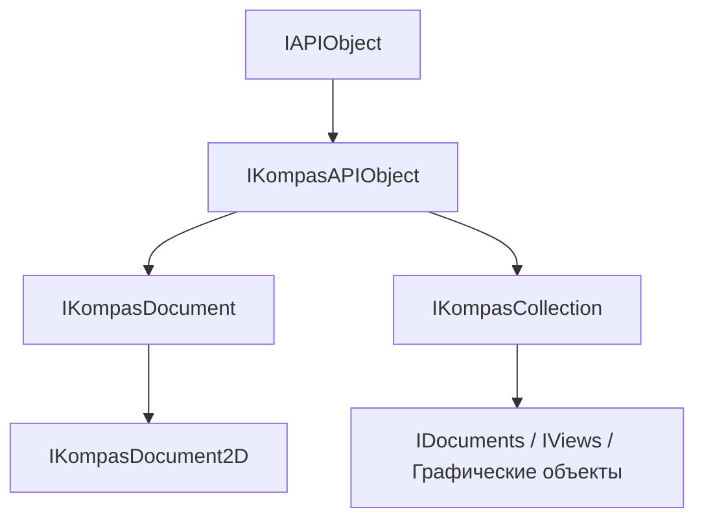

<!-- # **Документация интерфейса IAPIObject** -->

# **Интерфейс IAPIObject**

## Иерархия наследования



## Общее описание

Базовый интерфейс для всей системы управления объектами КОМПАС API. Является корневым интерфейсом иерархии, от которого наследуются все остальные интерфейсы через [`IKompasAPIObject`](IKompasAPIObject.md).

**Основные характеристики:**

- Корневой интерфейс всей иерархии объектов КОМПАС API
- Предоставляет базовые механизмы управления временем жизни объектов через подсчет ссылок
- Реализует паттерн QueryInterface для получения дополнительных интерфейсов

## Важные примечания

1. **Все интерфейсы** КОМПАС API наследуются от `IAPIObject` → [`IKompasAPIObject`](IKompasAPIObject.md).
2. **Управление памятью:** Методы [`AddRef()`](#addref) и [`Release()`](#release) реализуют подсчет ссылок. Всегда используйте `Release()` вместо прямого `delete`, если это требуется.
3. **QueryInterface:** Метод [`QueryInterface()`](#queryinterface) позволяет получить доступ к дополнительным интерфейсам объекта.

## Получение интерфейса

### Основные способы получения:

**Через методы существующих объектов:**

- Через [`QueryInterface()`](#queryinterface) от любого объекта

### Примеры получения:

```cpp
// Пример 1: Получение документа
ksapi::IDocumentsPtr documents = kompasApp->GetDocuments();
ksapi::IKompasDocumentPtr doc = documents->GetDocument(0);

// Пример 2: Использование SmartPtr для безопасного управления
void ProcessDocument(ksapi::IKompasDocumentPtr doc)
{
    // SmartPtr автоматически вызывает AddRef/Release
    ksapi::IDocumentFramePtr frame = doc->GetActiveFrame();
    if (frame)
    {
        frame->RefreshWindow();
    }
}  // frame автоматически освобождается здесь
```

## Дополнительные интерфейсы

Интерфейс `IAPIObject` является базовым для всей системы. Основные интерфейсы, которые наследуются от него:

### Ключевые интерфейсы:

- **`IKompasAPIObject`** - базовый интерфейс объектов КОМПАС (непосредственный потомок)
- **`IKompasApplication`** - приложение КОМПАС
- **`IKompasDocument`** - документ КОМПАС
- **`IKompasCollection`** - коллекции объектов

## Методы интерфейса

- [`AddRef()`](#addref) - увеличить счетчик ссылок
- [`Release()`](#release) - уменьшить счетчик ссылок и освободить объект
- [`QueryInterface()`](#queryinterface) - получить интерфейс по UUID

---

### AddRef()

[К оглавлению](#методы-интерфейса)

**Кратко:** Увеличивает счетчик ссылок объекта на 1.

**Полное описание:**
Метод увеличивает внутренний счетчик ссылок объекта. Вызывается автоматически при копировании `SmartPtr` или при получении нового указателя на объект. Необходим для правильного управления временем жизни объекта в системе.

**Синтаксис:**

```cpp
virtual void AddRef() = 0;
```

**Возвращаемое значение:** void

#### **Пример использования**

**Минимальный пример:**

```cpp
// SmartPtr автоматически вызывает AddRef при копировании
ksapi::IKompasDocumentPtr doc1 = documents->GetDocument(0);
ksapi::IKompasDocumentPtr doc2 = doc1;  // AddRef() вызывается автоматически
```

**Расширенный пример:**

```cpp
// При ручном управлении (не рекомендуется)
ksapi::IAPIObject* rawPtr = obj->QueryInterface(IID_IKompasAPIObject);
rawPtr->AddRef();  // Увеличиваем счетчик
// ... использование объекта ...
rawPtr->Release();  // Освобождаем
```

**Примечания:**

- Обычно не вызывается напрямую - используется `SmartPtr`
- Всегда должен быть парным вызов `Release()`
- Увеличивает счетчик на 1

---

### Release()

[К оглавлению](#методы-интерфейса)

**Кратко:** Уменьшает счетчик ссылок объекта и освобождает его, если счетчик стал равен 0.

**Полное описание:**
Метод уменьшает внутренний счетчик ссылок объекта на 1. Если счетчик становится равным нулю, объект автоматически освобождает память. Является основным механизмом освобождения ресурсов в системе.

**Синтаксис:**

```cpp
virtual void Release() = 0;
```

**Возвращаемое значение:** void

#### **Пример использования**

**Минимальный пример:**

```cpp
// SmartPtr автоматически вызывает Release при уничтожении
{
    ksapi::IKompasDocumentPtr doc = documents->GetDocument(0);
    // Работа с документом
}  // doc выходит из области видимости - Release() вызывается автоматически
```

**Расширенный пример:**

```cpp
// При ручном управлении (не рекомендуется)
ksapi::IAPIObject* rawPtr = obj->QueryInterface(IID_IKompasAPIObject);
// ... использование объекта ...
rawPtr->Release();  // Освобождаем объект
rawPtr = nullptr;   // Обнуляем указатель
```

**Примечания:**

- **Всегда используйте SmartPtr** вместо ручного вызова Release()
- Никогда не вызывайте `delete` для объектов API
- После вызова Release() указатель становится невалидным

---

### QueryInterface()

[Группа методов](#группа-1-управление-временем-жизни) | [К оглавлению](#методы-интерфейса)

**Кратко:** Возвращает указатель на запрошенный интерфейс или nullptr, если интерфейс не поддерживается.

**Полное описание:**
Метод является основным механизмом получения дополнительных интерфейсов от объекта. Принимает UUID интерфейса (`IAPIObjectIID`) и возвращает указатель на базовый класс `IAPIObject`, если объект поддерживает запрошенный интерфейс.

**Синтаксис:**

```cpp
virtual IAPIObject * QueryInterface(IAPIObjectIID id) = 0;
```

**Параметры:**

- `id` (in) - UUID запрашиваемого интерфейса

**Возвращаемое значение:** Указатель `IAPIObject*` на объект или `nullptr`, если интерфейс не поддерживается.

#### **Пример использования**

**Минимальный пример:**

```cpp
// Получение базового интерфейса
ksapi::IAPIObject* basePtr = obj->QueryInterface(IID_IAPIObject);
if (basePtr)
{
    basePtr->Release();
}
```

**Расширенный пример:**

```cpp
// Source/MyConverter/KompasConverter.cpp (строки 43-48)
// Реализация QueryInterface в классе конвертера
ksapi::IAPIObject * KompasConverter::QueryInterface(ksapi::IAPIObjectIID iid)
{
    // Проверяем поддерживаемые интерфейсы
    if (iid == ksapi::IID_IAPIObject || iid == ksapi::IID_ILibraryObject || iid == ksapi::IID_ILibraryConverter)
        return this;  // Возвращаем указатель на себя
    return nullptr;   // Интерфейс не поддерживается
}

// Использование QueryInterface
ksapi::IAPIObject* base = converter->QueryInterface(IID_ILibraryConverter);
if (base)
{
    ksapi::ILibraryConverterPtr libConv = base;  // Приведение типа
    // Работа с интерфейсом
    libConv->Release();
}
```

**Примечания:**

- Возвращает `nullptr`, если интерфейс не поддерживается
- При успехе **не увеличивает** счетчик ссылок
- Всегда вызывайте `Release()` на возвращенном указателе после использования
- Рекомендуется использовать `SmartPtr` для автоматического управления

---

## Частые ошибки

### 1. **Ручное удаление объекта вместо Release()**

```cpp
// НЕПРАВИЛЬНО
ksapi::IKompasDocumentPtr doc = documents->GetDocument(0);
// ... работа ...
delete doc;  // Не рекомендуется!

// ПРАВИЛЬНО
ksapi::IKompasDocumentPtr doc = documents->GetDocument(0);
// ... работа ...
// doc автоматически освобождается при выходе из области видимости
```

### 2. **Утечка памяти из-за отсутствия Release()**

```cpp
// НЕПРАВИЛЬНО
ksapi::IAPIObject* rawPtr = obj->QueryInterface(IID_IKompasAPIObject);
// ... работа ...
// Забыли вызвать Release() - утечка памяти!

// ПРАВИЛЬНО
ksapi::IAPIObject* rawPtr = obj->QueryInterface(IID_IKompasAPIObject);
if (rawPtr)
{
    // ... работа ...
    rawPtr->Release();
}
```

### 3. **Использование освобожденного объекта**

```cpp
// НЕПРАВИЛЬНО
ksapi::IKompasDocumentPtr doc = documents->GetDocument(0);
doc->Release();  // Преждевременное освобождение
doc->Save();     // Краш! Объект уже освобожден

// ПРАВИЛЬНО
ksapi::IKompasDocumentPtr doc = documents->GetDocument(0);
doc->Save();     // Используем объект
// doc автоматически освобождается при выходе из области видимости
```

### 4. **Потеря указателя при множественных приведениях**

```cpp
// НЕПРАВИЛЬНО
ksapi::IAPIObject* base1 = obj->QueryInterface(IID_IKompasAPIObject);
ksapi::IAPIObject* base2 = obj->QueryInterface(IID_IKompasAPIObject);
// Два разных объекта! Каждый требует отдельного Release()

// ПРАВИЛЬНО
ksapi::IAPIObject* base = obj->QueryInterface(IID_IKompasAPIObject);
if (base)
{
    ksapi::IKompasAPIObjectPtr kompasObj = base;  // Один указатель
    // ... работа ...
    base->Release();  // Освобождаем один раз
}
```

---

## Практические примеры из исходников

### Пример 1: Реализация QueryInterface в классе библиотеки

```cpp
// Source/MyConverter/KompasConverter.cpp (строки 43-48)
ksapi::IAPIObject * KompasConverter::QueryInterface(ksapi::IAPIObjectIID iid)
{
    // Проверяем поддерживаемые интерфейсы
    if (iid == ksapi::IID_IAPIObject ||
        iid == ksapi::IID_ILibraryObject ||
        iid == ksapi::IID_ILibraryConverter)
        return this;  // Возвращаем себя с увеличенным счетчиком ссылок
    return nullptr;   // Интерфейс не поддерживается
}
```

### Пример 2: Безопасное использование SmartPtr

```cpp
// Безопасная работа с документами
ksapi::IKompasApplicationPtr kompasApp = ...;
ksapi::IDocumentsPtr documents = kompasApp->GetDocuments();

for (int32_t i = 0; i < documents->GetCount(); i++)
{
    ksapi::IKompasDocumentPtr doc = documents->GetDocument(i);
    if (doc)
    {
        // Работа с документом
        doc->Save();
    }
    // doc автоматически освобождается в каждой итерации
}
```

---

## Шаблоны использования

### Шаблон 1: Безопасное получение интерфейса

```cpp
// Описание: Безопасное получение интерфейса через QueryInterface
ksapi::IAPIObject* base = obj->QueryInterface(IID_ILibraryConverter);
if (base)
{
    ksapi::ILibraryConverterPtr converter = base;
    // Использование интерфейса
    base->Release();  // Освобождаем
}
```

### Шаблон 2: Проверка типа объекта

```cpp
// Описание: Проверка поддержки интерфейса перед использованием
ksapi::IAPIObject* base = unknownObj->QueryInterface(IID_IKompasAPIObject);
if (base)
{
    // Объект поддерживает IKompasAPIObject
    ksapi::IKompasAPIObjectPtr kompasObj = base;
    auto type = kompasObj->GetType();
    base->Release();
}
```

### Шаблон 3: Итерация по коллекции с безопасным управлением

```cpp
// Описание: Итерация с автоматическим освобождением объектов
ksapi::IDocumentsPtr documents = kompasApp->GetDocuments();
for (int32_t i = 0; i < documents->GetCount(); i++)
{
    ksapi::IKompasDocumentPtr doc = documents->GetDocument(i);
    if (doc)
    {
        // Работа с документом
        // doc освобождается автоматически в конце итерации
    }
}
```
