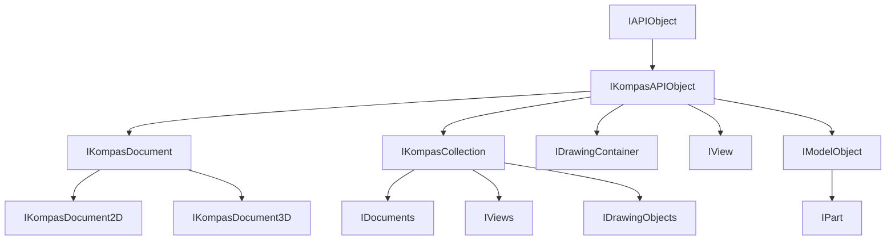

<!-- # **Документация интерфейса IKompasAPIObject** -->

# **Интерфейс IKompasAPIObject**

## Иерархия наследования



## Общее описание

Базовый интерфейс для всех объектов КОМПАС API. Является родительским для всех интерфейсов системы КОМПАС, предоставляя минимальный набор методов для идентификации и навигации по иерархии объектов.

**Основные характеристики:**

- Корневой интерфейс для всей иерархии объектов КОМПАС API (кроме [`IAPIObject`](interface_page_files/IAPIObject.md))
- Наследуется напрямую от [`IAPIObject`](interface_page_files/IAPIObject.md)
- Предоставляет методы для получения родительского объекта и определения типа объекта

## Важные примечания

1. **Большинство интерфейсов КОМПАС API** наследуются от `IKompasAPIObject`.
2. Метод [`GetParent()`](#getparent) возвращает владельца объекта. Для документов возвращает приложение, для объектов документа - соответствующий контейнер.
3. Метод [`GetType()`](#gettype) возвращает значение из перечисления `KompasAPIObjectTypeEnum`, позволяющее определить тип объекта.

## Получение интерфейса

### Основные способы получения:

1. **Через GetParent():**
   - Любой объект можно получить через [`GetParent()`](#getparent) от дочернего объекта

2. **Через QueryInterface:**
   - Приведение от конкретных интерфейсов к базовому `IKompasAPIObject`

### Примеры получения:

```cpp
// Пример 1: Получение документа из приложения
ksapi::IDocumentsPtr documents = kompasApp->GetDocuments();
ksapi::IKompasDocumentPtr doc = documents->GetDocument(0);

// Пример 2: Получение родителя объекта (например, детали)
ksapi::IPartPtr part = ...;
ksapi::IKompasAPIObjectPtr parent = part->GetParent();

// Пример 3: Приведение к базовому интерфейсу
ksapi::IKompasDocument2DPtr doc2D = ...;
ksapi::IKompasAPIObjectPtr baseObj = doc2D;  // Неявное приведение
```

## Дополнительные интерфейсы

Интерфейс `IKompasAPIObject` является базовым. Ниже перечислены примеры интерфейсов, которые **наследуются** от него:

### Интерфейсы приложения и документов:

- **`IKompasDocument`** - базовый интерфейс документа
- **`IDocuments`** - коллекция документов

### Интерфейсы коллекций:

- **`IKompasCollection`** - базовый интерфейс коллекций
- **`IDrawingObjects`** - объекты чертежа
- **`IModelObjects`** - объекты модели

### Интерфейсы графических объектов:

- **`IDrawingContainer`** - контейнер для графических примитивов
- **`IView`** - вид документа

### Интерфейсы моделей (3D):

- **`IModelObject`** - объект 3D модели
- **`IPart`** - деталь

## Методы интерфейса

- [`GetParent()`](#getparent) - получить владельца объекта
- [`GetType()`](#gettype) - получить тип объекта

---

### GetParent()

[К оглавлению](#методы-интерфейса)

**Кратко:** Возвращает указатель на интерфейс владельца (родителя) данного объекта.

**Полное описание:**
Метод возвращает указатель на объект, который является владельцем (родителем) текущего объекта. Это позволяет построить иерархию объектов и перемещаться от дочерних объектов к родительским.

**Синтаксис:**

```cpp
virtual IKompasAPIObjectPtr GetParent() = 0;
```

**Возвращаемое значение:** Указатель `IKompasAPIObjectPtr` на родительский объект или `nullptr`, если родитель отсутствует.

#### **Пример использования**

**Минимальный пример:**

```cpp
// Получение родителя объекта
ksapi::IKompasAPIObjectPtr parent = obj->GetParent();
```

**Расширенный пример:**

```cpp
// Source/Cube/DocumentFrameEvents.cpp (строки 230-240)
// Получение родителя объекта для определения принадлежности детали
ksapi::IPartPtr parent(object->GetParent());
if (parent)
{
    // Работа с родительской деталью
}

// Пропуск самой верхней детали
if (topPart == parentPart)
    parentPart = nullptr;
```

**Примечания:**

- Возвращает `nullptr` для объектов верхнего уровня (приложение, корневые объекты)
- Тип возвращаемого указателя может быть приведен к конкретному типу
- Родитель может измениться при изменении структуры документа

---

### GetType()

[К оглавлению](#методы-интерфейса)

**Кратко:** Возвращает перечисление типа объекта КОМПАС API.

**Полное описание:**
Метод возвращает значение перечисления `KompasAPIObjectTypeEnum`, позволяющее определить конкретный тип объекта без использования динамической идентификации типов (RTTI). Это особенно полезно при работе с универсальными указателями `IKompasAPIObjectPtr`.

**Синтаксис:**

```cpp
virtual KompasAPIObjectTypeEnum GetType() const = 0;
```

**Возвращаемое значение:** Значение перечисления `KompasAPIObjectTypeEnum`, определяющее тип объекта.

#### **Пример использования**

**Минимальный пример:**

```cpp
// Проверка типа объекта
ksapi::KompasAPIObjectTypeEnum type = obj->GetType();
```

**Расширенный пример:**

```cpp
// Source/Steps/Step3_KsAPI_3D/Step3_KsAPI_3D.cpp (строки 127-133)
// Функция фильтрации объектов по типу
bool __stdcall UserFilterProc(ksapi::IModelObjectPtr e)
{
    if (e && (!oType || e->GetType() == oType))
        return true;
    else
        return false;
}

// Source/OneWindow/LibObj.cpp (строки 524-536)
// Определение типа объекта для выбора обработки
if (obj->GetType() == ksObjectFace)
{
    // Обработка грани
}
else if (obj->GetType() == o3d_edge)
{
    // Обработка ребра
}
```

---

## Частые ошибки

### 1. **Использование GetParent() без проверки на nullptr**

```cpp
// НЕПРАВИЛЬНО
ksapi::IPartPtr part = ...;
ksapi::IDocumentPtr doc = part->GetParent();  // GetParent() может вернуть nullptr
doc->Close();  // Краш!

// ПРАВИЛЬНО
ksapi::IKompasAPIObjectPtr parent = part->GetParent();
if (!parent)
    return;
ksapi::IDocumentPtr doc = parent;
if (doc)
    doc->Close();
```

### 2. **Кэширование указателя GetParent() на длительное время**

```cpp
// НЕПРАВИЛЬНО
ksapi::IKompasAPIObjectPtr cachedParent = obj->GetParent();
// ... много кода ...
// obj может быть удален или перемещен
cachedParent->DoSomething();  // Невалидный указатель!

// ПРАВИЛЬНО
// Получать parent заново при необходимости
void ProcessObject(ksapi::IModelObjectPtr obj)
{
    ksapi::IKompasAPIObjectPtr parent = obj->GetParent();
    if (parent)
        parent->DoSomething();
}
```

### 4. **Сравнение типов вместо приведения типов**

```cpp
// НЕПРАВИЛЬНО
ksapi::IKompasAPIObjectPtr obj = ...;
if (obj->GetType() == ksObjectPartDocument)
{
    // Нельзя безопасно использовать как документ без приведения
    obj->Save();  // Ошибка компиляции
}

// ПРАВИЛЬНО
ksapi::IKompasAPIObjectPtr obj = ...;
ksapi::IKompasDocumentPtr doc = obj; // SmartPtr автоматически приведет к IKompasDocumentPtr
if (doc)
{
    doc->Save();  // Безопасное использование после приведения
}
```

---

## Практические примеры из исходников

### Пример 1: Фильтрация объектов по типу

```cpp
// Source/Steps/Step3_KsAPI_3D/Step3_KsAPI_3D.cpp
bool __stdcall UserFilterProc(ksapi::IModelObjectPtr e)
{
    // Возвращаем true только если объект соответствует нужному типу
    if (e && (!oType || e->GetType() == oType))
        return true;
    else
        return false;
}
```

### Пример 2: Определение родителя объекта для обработки

```cpp
// Source/OneWindow/LibObj.cpp (строки 550-560)
ksapi::IPartPtr topPart = ...;
ksapi::IKompasAPIObjectPtr parentPart = obj->GetParent();

// Исключаем верхнюю деталь из обработки
if (topPart == parentPart)
    parentPart = nullptr;

if (parentPart)
{
    // Обработка родительской детали
}
```

### Пример 3: Обработка объектов разных типов

```cpp
// Source/OneWindow/LibObj.cpp (строки 524-536)
ksapi::IKompasAPIObjectPtr obj = ...;

// Определяем тип объекта и выбираем обработку
if (obj->GetType() == ksObjectFace)
{
    // Обработка грани
}
else if (obj->GetType() == o3d_edge)
{
    // Обработка ребра
}
```

---

## Шаблоны использования

### Шаблон 1: Безопасная навигация по иерархии

```cpp
// Описание: Безопасное получение родителя с проверкой типа
ksapi::IKompasAPIObjectPtr child = ...;
ksapi::IKompasAPIObjectPtr parent = child->GetParent();
if (!parent)
    return;

// Приведение к конкретному типу
ksapi::IKompasDocumentPtr doc = parent;
if (doc)
{
    doc->Save();
}
```

### Шаблон 2: Фильтрация объектов по типу

```cpp
// Описание: Фильтрация коллекции объектов по нужному типу
std::vector<ksapi::IModelObjectPtr> objects = ...;
std::vector<ksapi::IModelObjectPtr> filtered;

for (const auto& obj : objects)
{
    if (obj && obj->GetType() == targetType)
        filtered.push_back(obj);
}
```

### Шаблон 3: Определение типа и выбор действия

```cpp
// Описание: Выбор действия на основе типа объекта
ksapi::IKompasAPIObjectPtr obj = ...;
switch (obj->GetType())
{
    case ksObjectPartDocument:
        // Обработка детали
        break;
    case ksObjectAssemblyDocument:
        // Обработка сборки
        break;
    case ksObjectView:
        // Обработка вида
        break;
    default:
        // Обработка по умолчанию
        break;
}
```
